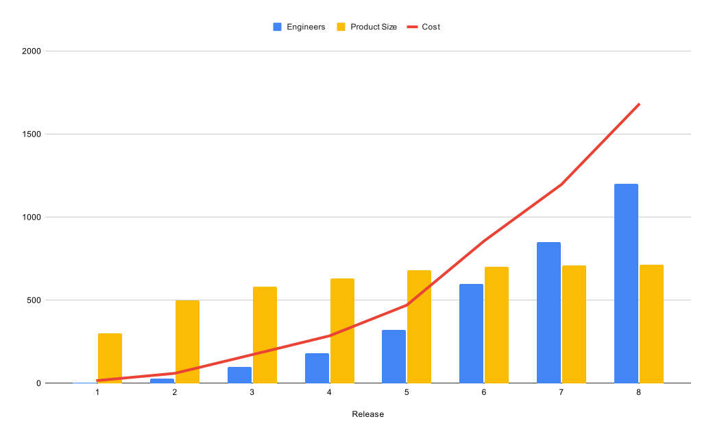

## 架構與設計

* 「架構」Architecture：常指高層次的設計
    * 房子的樣貌，格局
* 「設計」Design：往往隱含較低層次的細節
    * 房子的燈，插座位置

> 低層次的設計跟高層次的架構其實都是房子的一部份

:::tip
軟體設計：從高層次到低層次的一系列決策，架構與設計都是整體的一部份
:::

## 軟體架構的目的

> 軟體架構的目的是最小化建置和維護「系統需求」所需要的人力資源

* 目的是減少成本
    * 成本：人力，時間
    * 如果新增功能進軟體系統，所需耗費的精力會隨著時間增加的話，就是不好的設計

## 案例

* 工程師人數增加迅速，但產品功能成長漸緩
    * 人數增加，也意味著成本增加
* 單位功能的生產成本快速上揚

:::warning Why?
為什麼版本8與版本1相比，程式碼的成本高出40倍呢？
:::

## 爛攤子

* 系統匆匆被丟在一起時，當engineer的數量成為輸出的唯一驅動者，對程式碼的整潔程度與設計結構沒有想法，就會走到這種悲慘結局
* 最終，不論你在努力進行開發，只是將爛攤子從一個地方搬到另一個地方。產出新功能變得非常困難
    * 熵entropy - 不做工的能量總數，能量退化的指標
    * 事情總會往最大的亂度進行，直到所有的作工都是無效的

:::tip
架構設計，是一種面對複雜度的技能
:::

## 什麼地方出了錯？

* 踏實和穩定持續是贏得比賽的關鍵
* 比賽不是比快，也不是比誰強壯
* 越快的，反而速度越慢

### 真實與謊言

**「編寫絮亂的程式碼可以在短期內走得更快，只有長期下來才會變慢」**

* 製造絮亂的開發速度總是比保持整潔的開發來得慢

**「先workaround解決過去，晚點回來修正他」**

* 破窗效應 ([Broken windows theory](https://zh.wikipedia.org/zh-tw/%E7%A0%B4%E7%AA%97%E6%95%88%E5%BA%94))
    * 一排房子中如果有扇破掉的窗戶沒有修復，很快整排房子的窗戶都會破掉
    * 混亂會導致更多的混亂

**「時間不夠」「人力不夠」**

* 帕金森定理 ([Parkinson's law](https://zh.wikipedia.org/zh-tw/%E5%B8%95%E9%87%91%E6%A3%AE%E5%AE%9A%E7%90%86))
    * 工作總是會填滿分配給他的時間
    * 預留越長的時間給一個任務，只會導致更多不必要的子任務被加進來

**「我們不要過度設計，現在在趕所以先簡單做就好，到時候規模大了有那種需求再來想辦法把它改好」**

* 簡單是指間單整潔的架構去寫它，還是亂寫它？
* 寫code要快要怎麼快？亂寫最快

**「哎呦，這些爛code是我自己寫的，為了表現的負責，即使是加班on-call我也得設法維運好他」**

* 然後就離職了...
* 所以問題解決了沒有？

**「這樣下去不行，我們最好還是重寫它」**

* 小規模你都搞不定了，你怎麼會覺得未來規模大了你會有本事改好他？
* 把code寫乾淨這種技能很好掌握是不是？
* 相對的，如果你想掌握這種技能，你要從小規模做起還是直接碰大規模系統？

:::info
“They did it by making the single worst strategic mistake that any software company can make: They decided to rewrite the code from scratch.”

Joel Spolsky, CEO and Co-founder of Stack Overflow
:::

## 總結

要認真對待軟體架構，你需要知道什麼是好的架構。為了建置一個「滿足付出精力最小化及生產力最大化」的系統設計與架構，你需要知道系統架構中的哪些屬性會影引領出這個結果
* 想走得快，唯一的方法是走得好
    * 掌握住面對複雜性的技能 - 架構的能力
* 最好的選擇是讓開發人員任是正確的觀念，並避免過度自信
    * 觀念先通了，具體要怎麼做通常就變容易了
