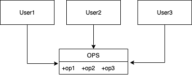
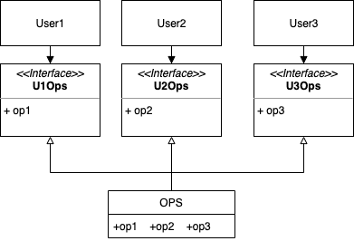
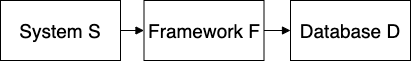

# Interface Segregation Principle







## Example

```ts
interface Bird {
  fly(): void;
  walk(): void;
}

class Nightingale implements Bird {
  public fly() {
    /// ...
  }
  public walk() {
    /// ...
  }
}
```


奇異鳥不會飛！！！

```ts
class Kiwi implements Bird {
  public fly() {
    throw new Error("Unfortunately, Kiwi can not fly!");
  }
  public walk() {
    /// ...
  }
}
```

```ts
interface CanWalk {
  walk(): void;
}

interface CanFly {
  fly(): void;
}

class Nightingale implements CanFly, CanWalk {
  public fly() {
    /// ...
  }
  public walk() {
    /// ...
  }
}

class Kiwi implements CanWalk {
  public walk() {
    /// ...
  }
}
```
