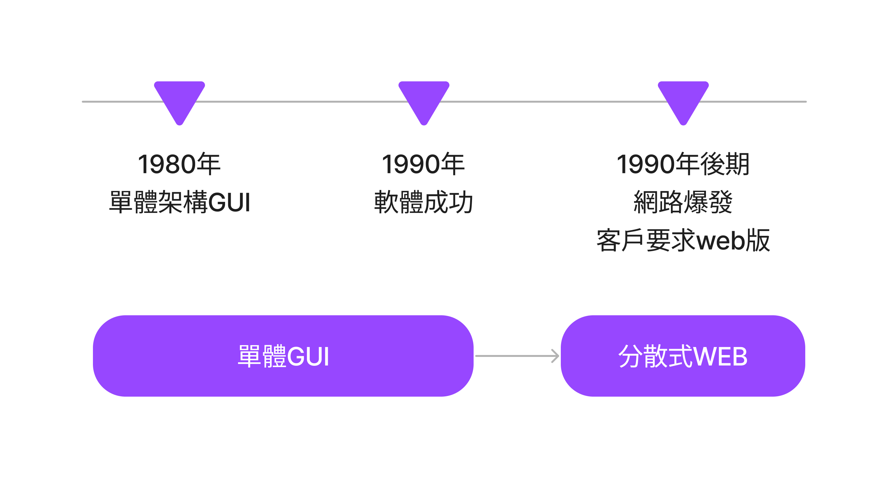
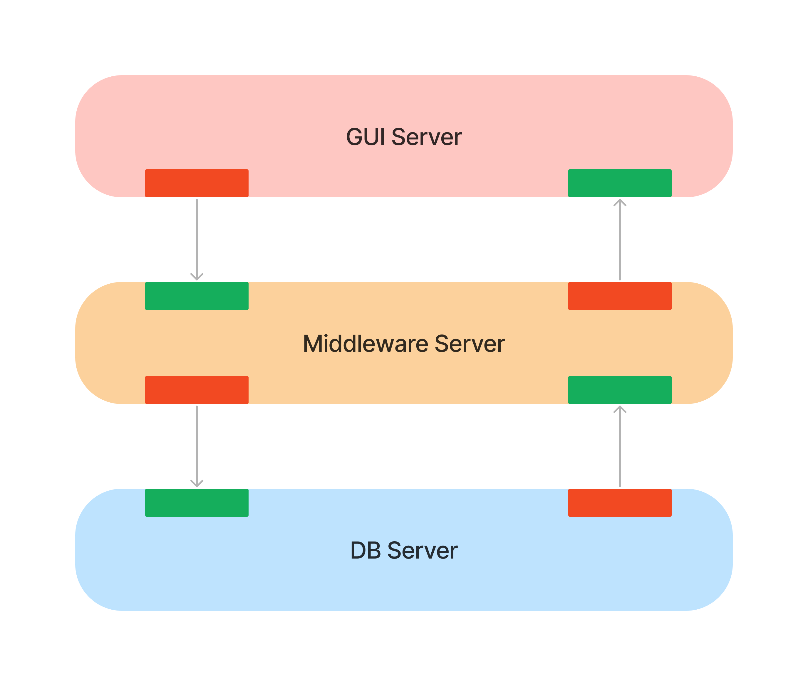
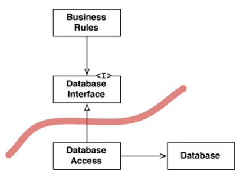
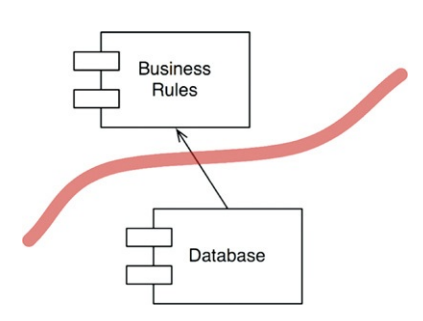
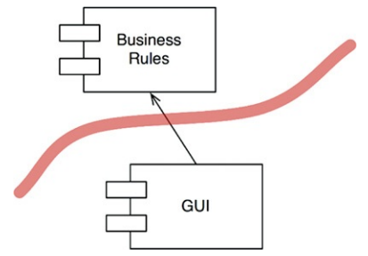
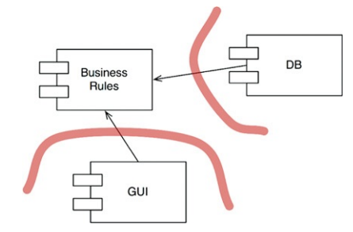
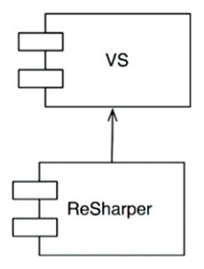

## 邊界
軟體架構就是畫線的藝術——作者稱之為邊界。

將軟體元素彼此分開來，並限制一方對其他方的了解。

畫線是為了**盡可能延後決定**，並**使決定不會污染核心邏輯**。

架構師的目標： 減少**建置**和**維護**需求系統所需的**人力資源**。

耗盡人力資源：代表耦合（耦合導致過早做了不成熟的決定）

哪些決定是不成熟的？
* 與系統業務需求（使用案例）無關的決定。
  * 框架、資料庫、Web伺服器、工具程式庫、依賴注入等決定。
  
一個好的系統架構：
* 能讓這類型的決定出現出來的特性是輔助性、可延緩的、不依賴這些決定
* 允許盡可能在晚的時刻才做出決定，且不會有顯著性的影響。

## 兩個悲慘的故事
### P公司
* 1980年創始人寫的一個簡單的單片(simple monolithic，單體式架構應用程式)形式的桌面應用程式
* 1990年發展成流行和成功的程式
* 1990年代後期，P的客戶要求要有web版本，聘請很多Java工程師

Java 工程師夢想著有一個伺服器農場，採用龐大的三層「架構」：
1. GUI伺服器
2. Middleware伺服器
3. 資料庫伺服器

* 新增1個欄位，必須被加到每1層的類別中 
* 有2個傳送方向，需設計4種訊息協定 
* 每個協定有發送跟接收端，8個協定處理程序(handler)

剛開始沒有伺服器農場，只是在1台機器上運行3個執行檔，執行3個不同的行程
但最後還是一樣只在同1台機器上

P公司也從來沒有賣需要伺服器農場的版本，也只部署在單一伺服器
悲劇在於：**架構師提前做了決定**，所以大大增加了開發工作。

### W公司
管理公司車隊的企業，請了一名架構師

架構師認為：小小運行所需要一個全面的、企業規模的、服務導向的「架構」(SoA)。

所有不同的「object」建立一個巨大的domain model，設計一套service來管理這些domain object，把開發人員送往地獄

假設把聯絡人的姓名、地址、電話，加入到銷售紀錄中。
1. ServiceRegistry要求ContactService的ID，送一個CreateContact到ContactService
2. CreateContact十幾項必填
3. 程式設計師無法存取資料：設計師只有名字電話地址。
4. 偽造資料後，程式設計師須將新的聯絡人ID塞到銷售紀錄中 (UpdateContact訊息給SaleRecordService)

測試：逐一啟動必要服務，啟動訊息匯流排......傳來傳去造成傳播延遲，然後又有一個接一個的佇列中等待處理

本質上沒有錯
W公司錯在：**過早採用SoA**，採用大量的領域物件服務。

:::danger
架構師過早替系統運行方式下決定
:::

## FitNesse
正面例子：

:::info
案例：建立一個簡單的wiki來包裝ward cunningham FIT（自動化測試工具），編寫驗收測試。
:::

* 編寫自己的Web伺服器，推遲Web框架選擇
* 推遲資料庫選擇，在資料存取和儲存體之間建立介面

處理方式：
* 不涉及獲取和保存資料
  * 樁stub -> **mock data** -> MockWikiPage
* 需要真正資料存取
  * 實作雜湊表 -> **記在memory (ram)** -> InMemoryPage
* 實作資料持久化
  * 存取一般檔案 -> FileSystemPage

客戶想要把資料庫換成MySQL -> 改寫新增MySqlWikiPage

開發的18個月內，沒有任何資料庫，測試執行都很快，不會造成開發延遲。

劃定邊界線助於推遲和延緩做決定。

## 你該畫什麼線及什麼時候畫它們？
在重要事務和不重要的事物之間畫線

* GUI與業務邏輯沒關係。
* 資料庫與GUI沒關係。
* 資料庫與業務規則無關。

* 但資料庫是業務規則可**間接**使用的工具
  * 業務規則不需了解資料庫細節。
  * 業務規則需透過一組函式可獲取get或保存set資料
    * 把資料庫隱藏在一個介面之後。

* Business Rule可以使用任何類型的資料庫
* 但沒有Business Rule，資料庫無法存在
* Database元件可以被不同實作替換
  * 選擇資料庫的決定可以被推遲

## 那麼關於輸入和輸出呢？

客戶(使用者)看到GUI，就認為GUI就是系統。
:::info Example
遊戲
* 介面：螢幕、滑鼠、鍵盤。
* 介面後面隱藏：一套複雜的資料結構和函式。
* 他們模擬遊戲中的事件，但不會在螢幕上顯示出遊戲。
:::

* IO是無關緊要的
* Business Rule可以使用任何類型的GUI

## Plugin架構
:::tip 軟體開發技術的歷史
如何方便地建立plugin奠定可擴展和可維護的系統架構
:::

GUI、DB就類似Plugin
* GUI: web、client/server、SoA、主控台
* DB: SQL or NoSQL

## Plugin參數

系統架構成Plugin架構
可以建立起防火牆，如果GUI插入到業務規則，則GUI的變動不會影響到業務規則
開放某些部分，保護不相關的部分不被破壞。

**變化為軸**畫邊界：兩側的元件以不同的速率、不同的原因改變

* 以業務規則相比：
  * GUI在不同時間以不同速率改變 -> 一個邊界
* 以依賴注入框架相比：
  * 業務規則在不同時間以不同速率改變 -> 一個邊界

單一職責原則SRP告訴我們該如何畫邊界

## 總結
* 將系統劃分為**核心業務 - Business Rule**、**與核心業務沒有直接關係的必要功能 - Plugin**
* 元件的箭頭指向同一方向 - **Business Rule**
* 依賴性由**低層級的細節**到**高層級的抽象** (DIP依賴反轉原則, SAP穩定抽象原則)

