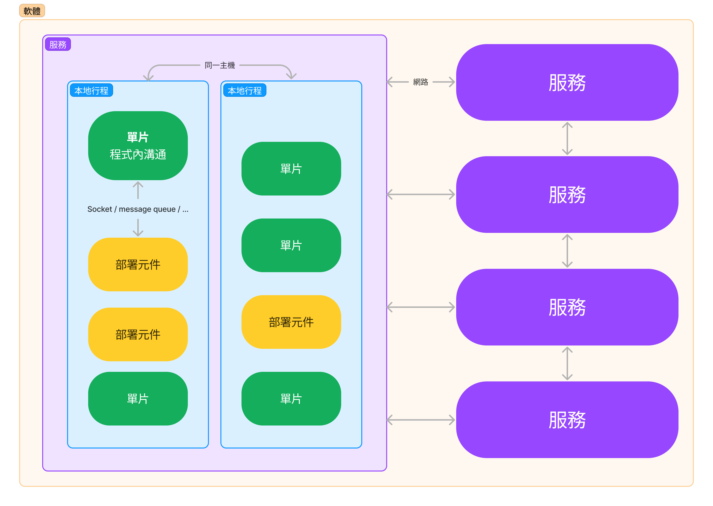

## 跨越邊界
在邊界一邊呼叫另一邊的函式並傳遞資料。

跨越邊界的技巧 -> 管理原始碼的依賴關係。

原始碼模組更動改版，其他原始碼就可能需要更改或重新編譯。

管理和建置防火牆抵擋這種變化就是邊界要做的事。

## 可怕的單片
原始碼層級的解耦模式(source-level decoupling mode): **按照規範進行函式和資料分離**。
這樣的架構幾乎總是依賴某種動態多型 (dynamic polymorphism) 來管理內部的依賴關係。

但從部署角度來看：這還是一個執行檔－－單片巨石「monolith」

如果沒有 OO 或是 多型，架構師就必須使用 指標函式 來實現適當的 解耦，是種危險的作法。

最簡單的跨越邊界：低層級「Client」->高層級「Service」的函式呼叫

Client呼叫Service上的f()，傳遞一個Data Instance
Data是邊界的被呼叫方

當高層級的Client需要呼叫一個低層級的Service，Client透過Service的介面來呼叫低層級ServiceImpl的f()。
所有的依賴關係由右到左朝向更高層級的元件。
這樣的劃分原則，大大地幫助專案的開發、測試、部署。高層級的元件保持獨立於低層級的細節之外。

在單片系統中，元件間的通訊非常快代價不高，通常是函式呼叫。

## 部署元件
架構邊界最簡單的其實是**動態連結函式庫** (dynamically linked library)，例如 .Net 的 DLL、Java 的 jar 檔或是 UNIX shared library。
部署不涉及編譯。

就跟單片一樣，元件之間的溝通通常指是函式的呼叫，所以是非常快且代價不高的，只需要一次動態載入連結或是運行時期載入就可以達到目的。
執行緒。

執行緒是一種組織排程和執行順序的方式。

可以包含在一個元件或跨越遍佈於許多元件中。

## 本地行程Local Processes
* 本地行程在同一處理器、單獨的位置空間中運行。
* 使用socket 或其他協定message queues來互相溝通。
* 每個本地行程可能是一個靜態連結的單片，或是動態連結的部屬元件。

本地行程看作是一個超級元件：行程由較低層級的元件組成，透過動態多行來管理相互依賴關係。

對於本地行程而言，隔離政策跟單片是相同的，較高層級的程式碼不能包含較低行程的名稱、實際位址 (physical addresses) 或是 registry lookup keys，架構的目標是要讓較低的行程成為更高層級的 plugin。

跨越本地行程之間的通訊涉及到作業系統的系統呼叫、資料封裝處理和解碼、interprocess context switches，這些代價非常昂貴，所以要避免無謂的通訊。

## 服務
* 最強的邊界。
* 服務不依賴實體位置。兩個通訊服務或許不在同一個處理器運行。

假設所有服務都透過網路運行。

與函式呼叫相比，跨服務邊界的通訊非常緩慢。

必須小心避免某些情況下出現無謂的通訊。必須處理高層級的延遲。

服務的依賴關係和其他一樣，較低的服務成為更高層級的 plugin。

## 總結

* 使用服務作為邊界的系統，也可能具有一些本地行程。
* 本地行程由元件原始碼組成的單片或是一組動態鏈結的部署元件。
* 系統邊界往往混合了「**本地經常通訊的邊界**」、「**更關注於延遲的邊界**」
