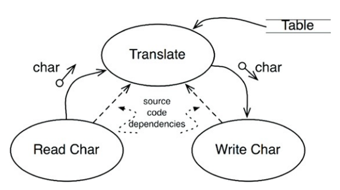
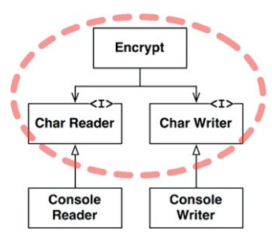

策略 -> 軟體系統（策略陳述） -> 電腦程式（詳細描述）

策略 分解成 小陳述：
* 如何計算業務規則
* 如何格式化報告
* 如何驗證輸入資料

:::info
發展軟體架構的藝術：
1. 將策略彼此分開，依變化重組。
2. 將元件重組成有相無環圈。
3. 資料流和原始碼的依賴關係不一定相同
:::

1.將策略彼此分開，依變化重組。

因相同原因在相同時間變化的策略，在同一層級，同一個元件。
基於不同原因或不同時間的變化，處在不同層級、不同元件。

2.將元件重組成有向無環圈
即代表原始碼編譯時期的依賴關係，如：
* Java 的 import
* C# 的 using
* Ruby 的 require

好的架構下：
* 依賴的關係方向，是基於連接的元件層級決定的。
* 低層級的元件都被設計為**依賴**高層級的元件。

:::info Example?
Name欄位: InputComponent
Email欄位: InputComponent
Description欄位: TextAreaComponent
:::

## 層級
嚴格定義是「輸入及輸出的距離」。
離系統輸入輸出越遠，策略層級越高。



Translate是最高層級的元件，距離輸入輸出最遠。 -> 或稱作「中央轉換(Central Transform)」元件

3.資料流和原始碼的依賴關係不一定相同。從資料流解耦出來。並在耦合到層級上

```javascript
function encrypt() {
while (true)
writeChar(translate(readChar()))
}
````
此程式碼中，高級的 encrypt 函式依賴較低級的 readChar 和 writeChar，是不正確的架構



虛線框式系統中最高級的元素，其他靠近 IO 的低級元素 (Console Reader、Console Writer) 會指向它

當輸入輸出的策略變更時，不會影響到加密策略。

透過SRP和CCP，把較高層級的策略跟較低層級的策略分開：
* 較高的策略
  * 更重大原因而變化
  * 變化頻率低
* 較低的策略
  * 變化原因不重大
  * 經常變化且急於變化

可以把低層級的元件看成是高層級的Plugin。


## 總結
此章混合：
單一職責原則SRP 、開放——封閉原則CCP
共同封閉原則OCP
依賴反轉原則DIP、穩定依賴原則SDP+穩定抽象原則SAP 