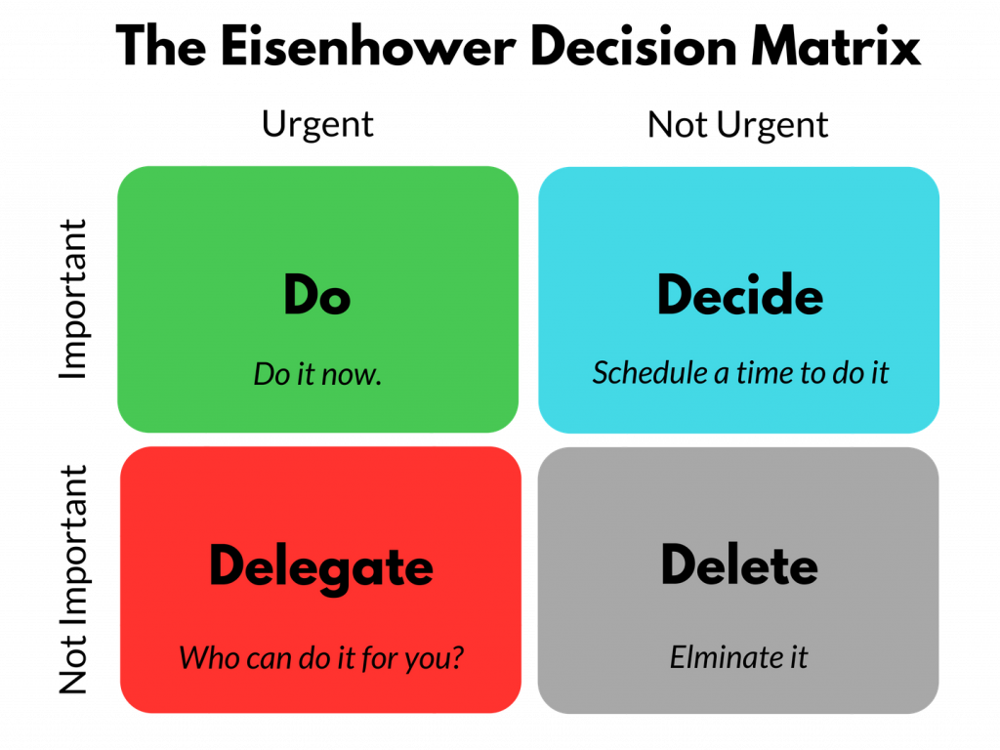

## 行為與架構

軟體系統對利害關係者提供了兩種不同的價值：行為與架構

軟體開發人員需要講兩者維持在高價值，但往往都會著重其中一個而忽略另一個

* 行為(Behavior)：
> 機器透過軟體能產生對使用者有價值的動作
* 架構(Structure)：
> 軟體Soft-ware，軟(Soft)的產品(ware)，必須是一種可以被`輕易改變`的產品。能夠容易地被改變也是軟體系統的價值之一

## 更高的價值

哪一個比較好？

* 一個完美達成需求的應用程式但無法被修改
* 一個無法使用的程式但可以容易的被依照需要修改

## 艾森豪矩陣(Eisenhower Matrix)

考慮以下幾個軟體開發過程的情境，分屬哪個矩陣維度？

1. 準時完成功能開發
2. 提升程式執行效能
3. 寫測試
4. 以良好的架構進行開發工作
5. 客戶的要求今天要完成修改
6. 維持團隊皇城之內的和氣
7. 改掉別人留下來的爛攤子

:::danger Important
緊急的事很少重要，重要的事很少緊急
:::

[圖片出處：topcareer.id](https://topcareer.id/read/2021/02/14/47023/cobalah-matriks-eisenhower-rahasia-kerja-produktif/)

## 為架構而戰

開發者必須為了他們覺得對公司最好的事情奮鬥。就跟管理團隊、業務團隊一樣，這永遠都是一場**鬥爭**。如果架構是最後才出現的，開發系統將變得昂貴，或變得幾乎無法被修改。如果演變到這個程度，也意味著開發團隊的失職。

* 身為工程師，有能力設計好的架構寫出良好的程式，是你的專業
* 放棄專業，跟放棄職涯發展是等義詞

:::danger Important
這是你被雇用的原因
:::

:::tip 英文小教室 AGGRESSIVE

Aggressive原意是有侵略性的、好鬥的。積極、有進取心的

但在職場的衍伸則褒過於貶，說一位應徵者aggressive，通常是在說他積極進取、很有幹勁，當然，貶義也可能指一個人咄咄逼人。

[[外商愛用的77個字，每個字都是你的腦](https://www.core-corner.com/Web/Main.php?stat=a_BgSvJIK)]
:::

在此勉勵大家：**Stay homble, and be aggressive**

Mech於2022 Aug
