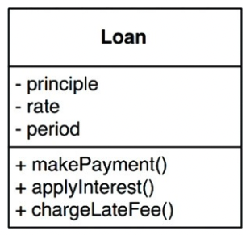
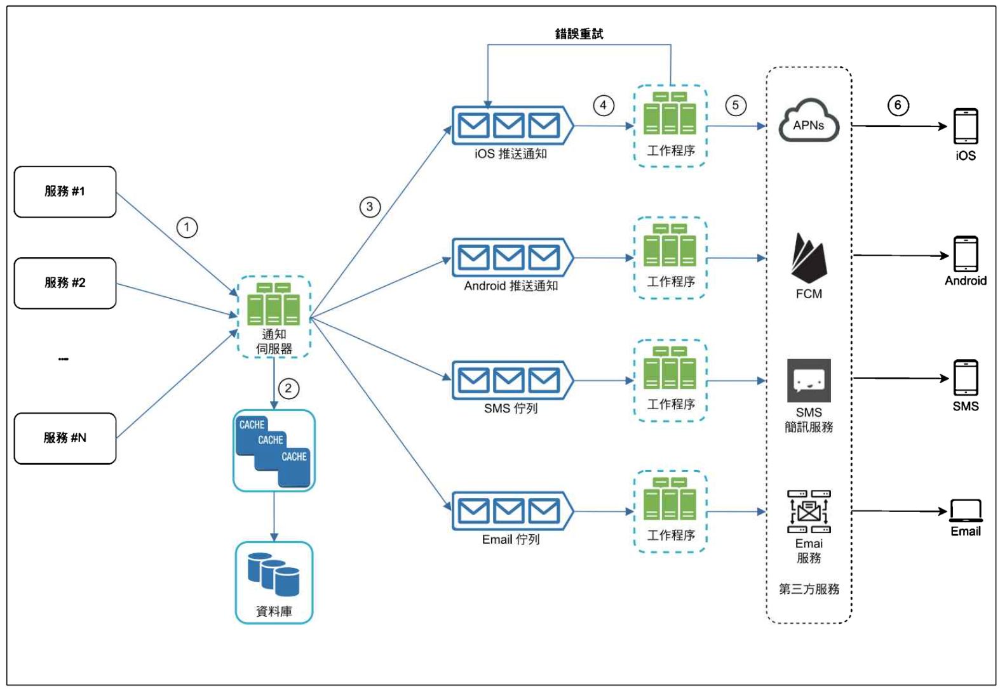

* 業務規則：用來賺錢或省錢的規則或程序，軟體系統存在的原因（= 軟體實現的目標）。
* 關鍵業務規則(Critical Business Rule) & 關鍵業務資料(Critical Business Data)
* 關鍵業務規則：操作關鍵業務資料

## Entities
> = 用來實際體現（embodies）關鍵業務規則與關鍵業務資料 and (or) 關鍵業務規則如何操作關鍵業務資料。

* not OOP
* 這樣的業務規則應該不相依於各種其他的系統部件，
* 他應該是獨立的模組

ER model DB

## Use Case
> = 描述使用業務規則的方法。ex. 順序、情境、前置條件。

* Entity 不應該知道自己是被哪個 use case 所使用。而是 Use Case 依賴 Entity。
    * Q: 案例設計到支付方式... ex. 使用 iphone 的人購物用 Apple Pay 有優惠
    

## Request and response model

* Use case will describe(accept) request struct and (return) response struct.
* 如果 request and response model 不獨立， use case 將被綁定到 model 依賴的依賴的任何關係上。
    * httpRequest & httpResponse => use http protocal
    * graphQL

* Entity 結構看起來很好用是陷阱
    * DTO v.s DAO

## Conclusions
* Business rules are the reason a software system exists.

bgm: Let You Down by Dawid Podsiadło