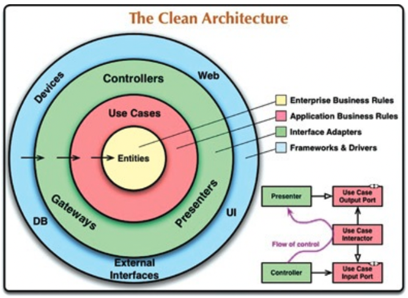
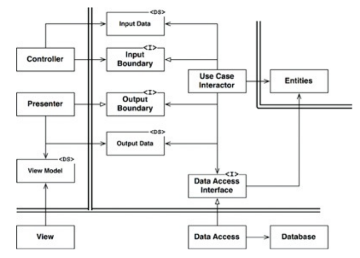
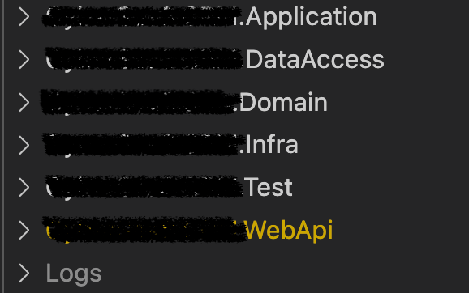
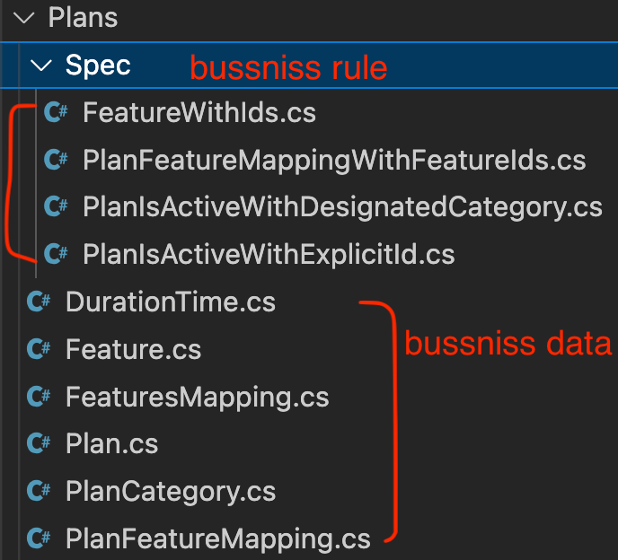
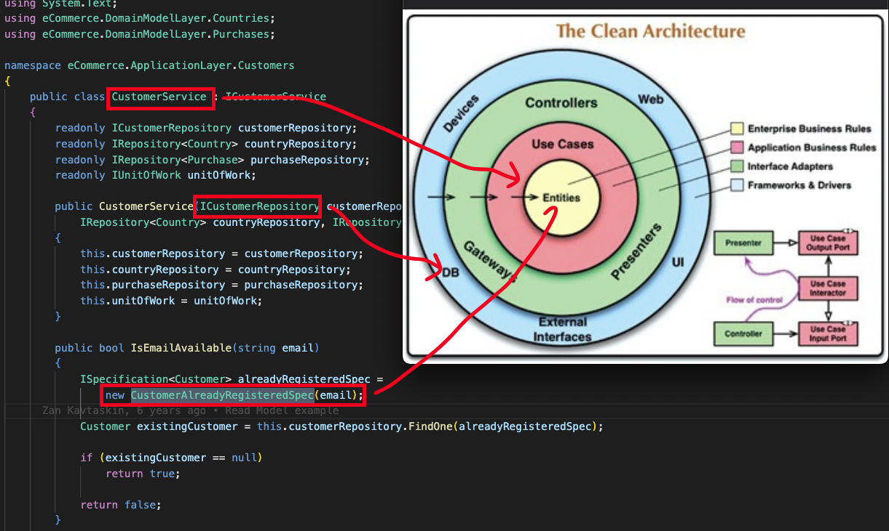

## 整潔的架構

* 獨立於框架: 架構不依賴框架
* 可測性: 你的架構可以在沒有框架的情況下對所有使用者案例做到``單元測試``。
* 獨立於 UI: webUI -> console UI (前後端分離)
* 獨立於資料庫: sql -> nosql
* 獨立於任何外部代理(external agency): 業務規則不應該知道 external interface。

## 依賴規則
outer circle are mechanisms, inner circle are policies. 
Source code dependencies must point only inward, toward higher-level policies.

### 實體層 & 使用案例層
* 封裝業務規則所在
* 這裡的修正應該只和業務邏輯有關
    * ex, payment 系統中修改 auth 為 OAuth 就不該改動到這裡

### 介面轉接層
* Controller(Param and ViewModel)
* Repository

### 框架和驅動層
* 由框架和工具組成，不應該有太多邏輯 -> 如果就是會有的話 micro service， ex AAA architecture
* 細節所在 => 外部的技術 ex.GRPC, AI 的 AlexNet

## 跨越邊界
* 依賴關係和控制流程是相反的
* 資料如何跨越邊界：以內圈內圈最方便的形式來作為資料傳遞的格式

## Example
* Controller 將資料打包(new)成一個簡單的物件 InputData，透過(implement) InputBoundary 將資料給 UseCaseInteractor
* UseCaseInteractor 依照 use case 設計操作 Entities，操作的方式是使用 DataAccessInterface 
* UseCaseInteractor 處理完後將需要 return 的資料建成(new) OutputData，再透過(implement) OutputBoundary return 給 Presenter
* ~~然後我就看不太懂了~~ 
* Presenter 將 OutputData 重新打包(new)成 ViewModel
* View 將 View model 描述的資料載入到螢幕

* Data struct is basic 各層不需要擔心依賴他。
* 對內依賴實體，對外依賴 interface，Data struct 屬於內層。

## My Example
* 我自己寫過的程式，雖然只是個 webapi 專案，非什麼大架構，但希望可以讓大家理解這些依賴
    * 邊界切分
    
    

    每一層都有 mapper 負責將 return mapping 成外層懂的樣子

    * 實體層 & 使用案例層

    

    * 依賴關係

    

## 總結
* 這章雖然很抽象，但這規則實際上並不困難
* 遵守這些依賴的規則，應該要可以介紹一個可以測試 “本質” 的系統 ch22``單元測試``

ref: https://github.com/zkavtaskin/Domain-Driven-Design-Example

bgm: Neptune By FOALS

