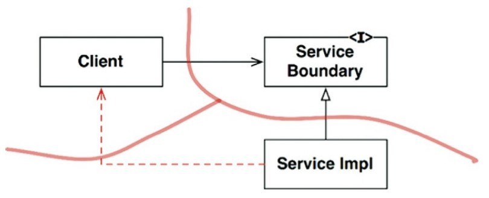
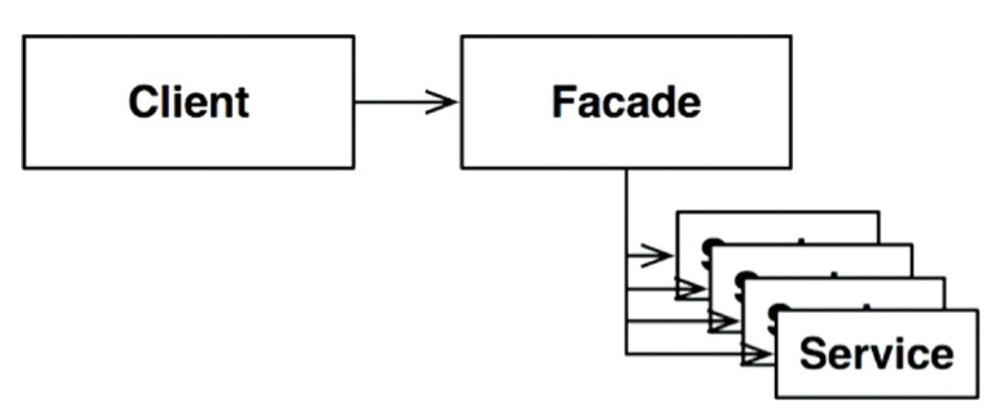
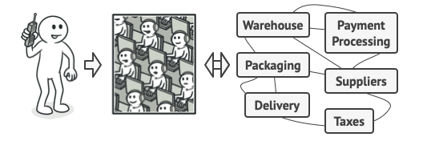

搭建全面性的架構邊界是昂貴的，包含 Input & Output 資料結構、元件部署、依賴管理，維護起來也要花費不少心力 ⇒ **搭建的邊界需要雙方都能夠受惠**。

即使達到上述的成果過於昂貴，但考量到日後需要，還是得替邊界保留一個位置，透過實作 **部分邊界(Partial Boundary)** 的方式達成 ⇒ 預想的設計

[軟體設計原則 YAGNI (You aren't gonna need it!)](https://en.wikipedia.org/wiki/You_aren%27t_gonna_need_it)


## 一維的邊界
要能維持完整的架構邊界，需要採用雙方都能互惠的**「邊界介面」**來維護雙向隔離 ⇒ 在兩個方向(初始設定、進行中的維護)上保持分離是昂貴的

範例：策略模式 (Strategy Pattern)

Service Boundary 介面提供給 Client 使用，由 ServiceImpl 進行實作，透過依賴反轉原則(DIP)的方式達到 Client 與 ServiceImpl 的隔離 ⇒ 替未來的架構邊界奠定基礎


## Facade (外觀)模式
> 為多個子系統提供一個統一的高層級接口，使得子系統更容易使用。

圖示 Facade 模式


生活案例



Source: https://refactoring.guru/design-patterns/facade

> 邊界由「Facade」的類別來定義。

```python
""" An example of Facade pattern"""

class Subsystem1:

	def start(self):
		print("Subsystem1 is operating...")

class Subsystem2:

	def start(self):
		print("Subsystem2 is operating...")

class Subsystem3:

	def start(self):
		print("Subsystem3 is operating...")

class CommissionerFacade:
    
    '''Facade'''
    def __init__(self) -> None:
        self._subsystem1 = Subsystem1()
        self._subsystem2 = Subsystem2()
        self._subsystem3 = Subsystem3()
    
    def operate(self):
        self._subsystem1.start()
        self._subsystem2.start()
        self._subsystem3.start()

def client(facade: CommissionerFacade) -> None:

    print("Calling from client")
    facade.operate()
    print("Done.")

if __name__ == "__main__":
    commissionerFacade = CommissionerFacade()
    client(commissionerFacade)

# Output
"""
Calling from client
Subsystem1 is operating...
Subsystem2 is operating...
Subsystem3 is operating...
Done.
"""
```

## 結論
每種方式都有屬於它自己的成本 & 效益，某些情況下，每個都適合先行佔用這個位置，能讓這個位置最終成為完整的邊界。

架構師的職責：在何處界定架構邊界以及完全 or 只部分實作邊界