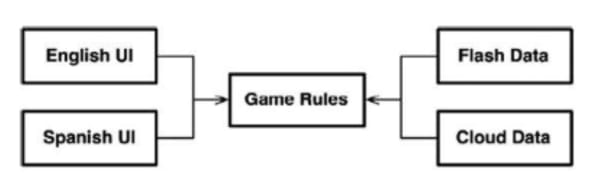
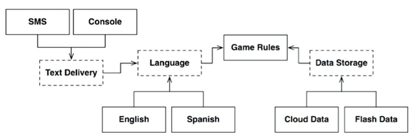
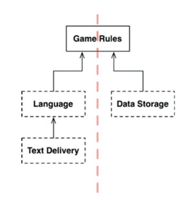
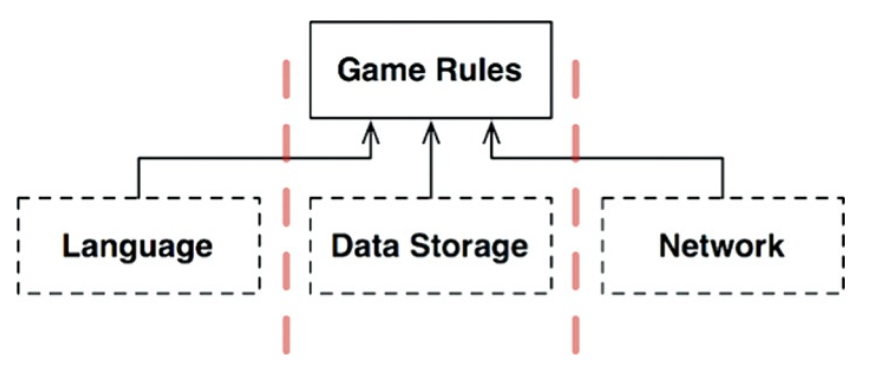
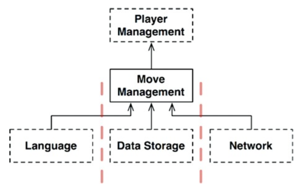
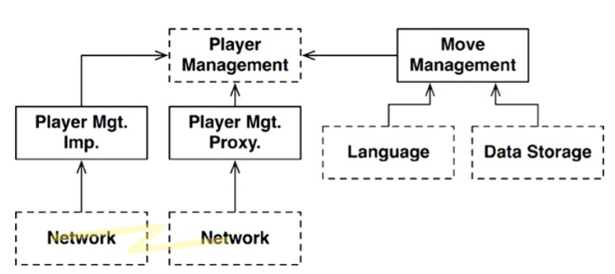

將系統簡單看作由三個元件所組成：UI、業務、資料庫 → 實際上元件數量比想像中還多。
## Hunt the Wumpus
一款年代久遠的[冒險遊戲](https://en.wikipedia.org/wiki/Hunt_the_Wumpus)。

保留基於文字的 UI，並且要和遊戲規則進行解耦，讓遊戲版本能在不同的市場切換至不同的語言，同時希望這些遊戲狀態被保存在某種儲存體上。

## 整潔的架構 (演進後的架構)
實際上考量的狀況更加複雜，例如 UI 的區塊不只有語系上的變化，語系傳遞的方式也有可能改變

虛線：抽象的 API; 虛線上下方的實線：具體的實作

通訊機制存在不同的可能性，這表示架構中一個可能的潛在邊界，既然有無數的變化可能性，這表明這些變化軸定義了一個架構限制。因此，有必要創建一個 API 來跨越這個限制，並將語言與通訊機制隔離開來。

### 抽離具體實作，關注 API 元件

上圖的箭頭方向指向皆為上方，最終指向 Game Rule，因為 Game Rule 隱含最高層級的元件。

## 跨越流
加入網路(Network)這項元件

## 分割流
近一步頗析 Game Rule：考量玩家的狀態

考量微服務後的架構：

## 結論
上述的例子說明架構邊界無處不在，架構師識別何時需要它們，也需意識到充分實作這些邊界是昂貴的，但同時要明白忽視某些邊界，在未來才加入可能會產生巨大的成本。

架構決策需權衡成本：確認何處為架構的邊界，哪些應完全實作，哪些應部分實作，哪些可被忽略。

決定邊界不是一次到位的，有必要觀察系統的演變，分析哪些地方可能需要邊界，以及如果它們沒有明確定義的邊界會產生何種影響，將實作邊界的成本與忽略它們的成本進行比較。

> 尋求的目標：實作邊界的成本低於忽略它們的成本