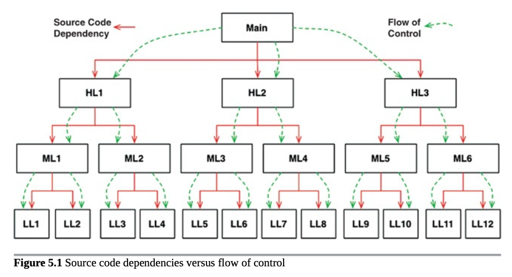

Main 元件為最終的細節，也是最低層級的策略，作為系統初始的進入點。

套用 CH22 的 [Clean Architecture](/docs/sg/clean-architecture/ch22#%E6%95%B4%E6%BD%94%E7%9A%84%E6%9E%B6%E6%A7%8B) 模型，Main 是最外層，是應用程式最低層級的策略，將所有內容載入到高層級系統中，接著將控制權轉交給高層級系統。

## 總結
我們可以將 Main 當作是一種 **Plugin**，一種用來設定初始條件 (initial condition) 與設置 (configurations)，並蒐集外部資源 (outside resources)，然後將控制權轉移到程式的高層級策略。由於它是一個 plugin，所以可能有許多的 Main元件，每個應用程式的設置都有一個，e.g.: Dev、Test、Production 等。