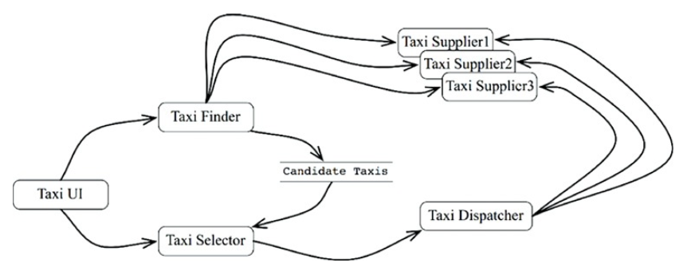
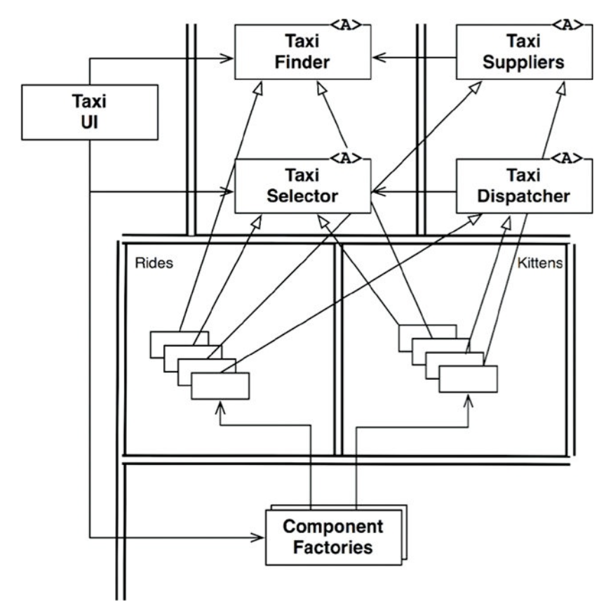
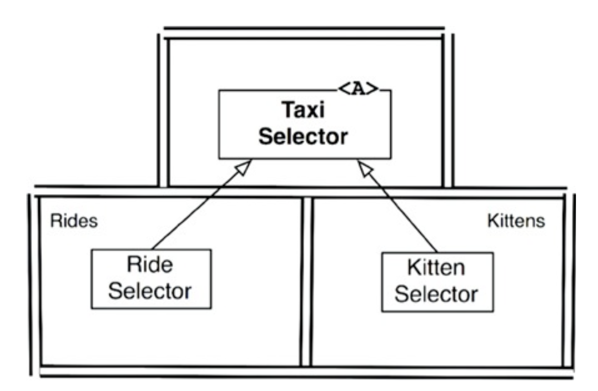
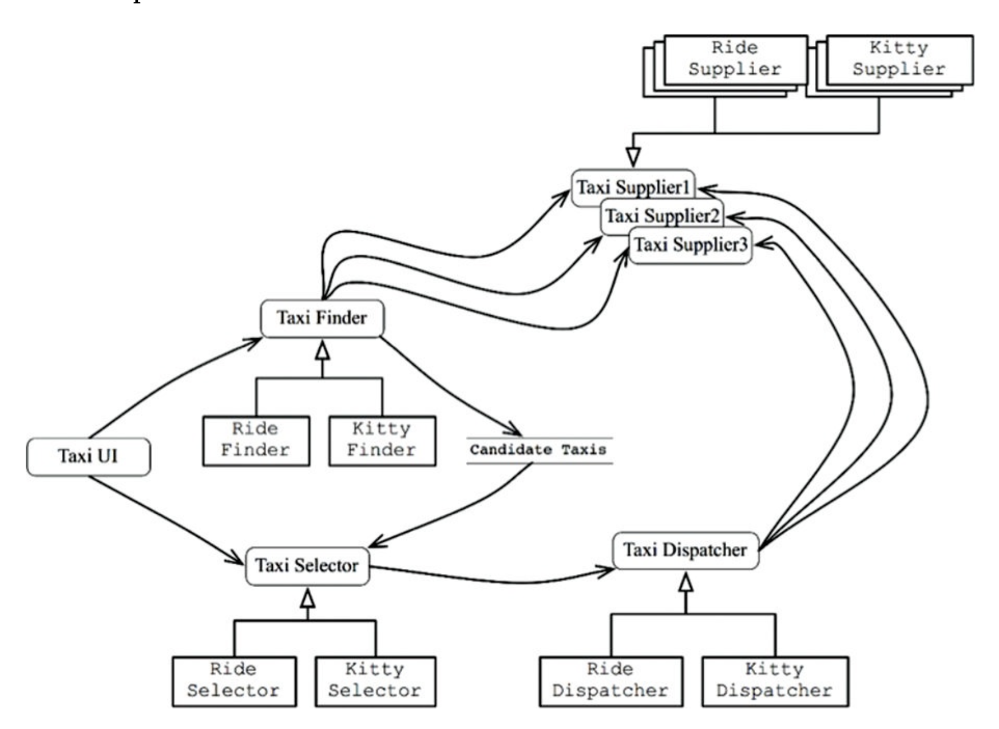

服務導向和微服務的「架構」流行的原因：
- 服務彼此似乎強烈「解耦」
- 服務似乎支援開發和部署的「獨立性」

這些只是部分正確。

## 服務是架構？
主張：使用服務本質上是一種架構。

前面幾個章節的討論：系統的架構是由將高層策略與低層細節分離的邊界來定義，並遵循「依賴規則」。

服務本身僅將系統的行為劃分為不同的部分，並非所有的服務都應具有架構上的重大意義。

## 服務有好處？
### 解耦的謬誤
主張：把系統分解成服務的一大好處是服務彼此強烈解耦。

意見：
- 服務共享的資料仍然是強烈耦合的
- 服務介面並沒有更正式、沒有更嚴格，也沒有定義的更好

複習 [Ch16 解耦模式](/docs/sg/clean-architecture/ch16#解耦模式)。

### 獨立開發和獨立部署的謬誤
主張：服務可以被一個專門的團隊來擁有和運行，開發和部署的這種獨立性被假定是可擴展的(scalable)

意見：
只要資料或行為相互耦合，就須協同開發、部署和運行。

Scenario: 如果服務 A 和 B 共享資料庫或傳遞的資料格式，當服務 A 更改資料庫架構時，服務 B 也要跟著修改，需要協調部署。

## Kitty 貓的問題
案例：計程車聚合系統

給定城市的計程車供應商並允許客戶預訂搭乘。假設客戶根據一些標準來選擇計程車，如收件時間、價格、豪華程度和駕駛經驗。

使用案例:
該公司將在全市設立幾個小貓收集點。當小貓被下訂時，將選擇附近的計程車從這些收集點之一，收集一隻小貓並將其送到適當的地址。

可能碰上的限制條件:
- 有些司機可能對貓過敏，所以這些司機不應該被這項服務選中。
- 有些客戶可能對貓過敏，所以在過去3天內已經用來遞送小貓的車輛，不應該被選擇用來載這些客戶。

### 垂直劃分
基於使用案例進行垂直劃分，建一組可透過「多型」擴展來處理新 feature 的類別

### 橫切關注面

架構的邊界「貫穿」服務，而非在服務之間，服務被拆解成多個元件，將服務設計為「遵循依賴規則」的內部元件架構

## 基於元件的服務
服務可以是基於元件的，不必是一個單片。

每個服務都有自己的內部元件設計，允許將加入新特性變成是增加新的衍生類別。這些衍生類別活在他們自己的元件之中

## 總結
儘管服務對於系統的可擴展性與可開發性是有用的，但他們本身並不是架構上的重大元素。

系統的架構是由該系統內部繪製的邊界，以及跨越這些邊界的依賴來定義。而不是由元素通訊和執行的物理機制所定義。

服務可能是單一元件，完全被架構邊界包圍起來。或者服務也可能由幾個被架構邊界分隔的元件組成。在極少數情況下，clients 和 services 耦合的程度可能導致沒有架構上的任何重要意義。