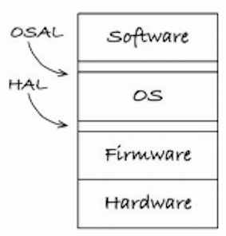
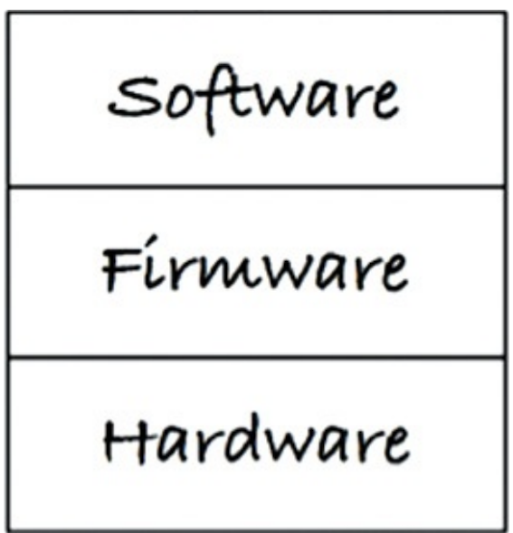
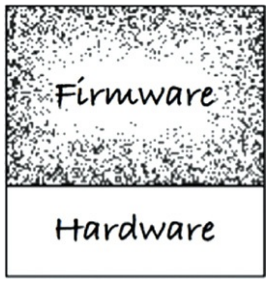
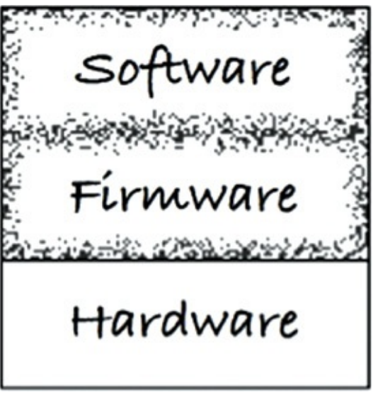

“Although software does not wear out, firmware and hardware become obsolete, thereby requiring software modifications.”(Doug Schmidt)
- 軟體不似硬體會耗損或過時，但是也需要與時俱進

“Although software does not wear out, it can be destroyed from within by unmanaged dependencies on firmware and hardware.”(Robert Cecil Martin)
- 軟體雖然不似硬體會耗損或過時，但要注意軟體可能會被沒有妥善管利的硬體或韌體搞爆

## 什麼是firmware(韌體)?
Doug Schmidt
- 被儲存在不可變的記憶體設備，例如ROM, EPROM, flash memory
- 直接在硬體上的一個指令或者一段程式
- 在硬體中的軟體程式
- 被寫在ROM的程式或資料
來[看看](https://ppfocus.com/0/dia795597.html)這些是啥><

Robert Cecil Martin
- 應該不是看存在哪裡，是有沒有對硬體有依賴
- 手機的app算不算呢？目前應該不算，但早期Android工程師沒有將App邏輯跟Andrioid API分離之前就算。

## No more firmware code
- 軟體工程師不要再寫firmare code了
- 翻譯蒟蒻
    - 不要再寫一堆跟硬體耦合嚴重的code了
    - 如果這樣硬體的改動就會影響過來，那軟體的生命週期就會依賴於硬體，變得比較短
- 舉個🌰
    - 通常我們需要處理器把硬體的命令消息轉化成軟體的輸入，但通常操作消息轉化的code跟操作硬體的code常常放在同個文件，而且消息轉化的邏輯中常常存在硬體操作的細節，這樣對作者來說就是firmware code。

## APP-TITUDE TEST
- 可以依據需求跑起來的程式測試
- 為何嵌入式軟體(embedded software)都變成韌體(firmware)，因為在嵌入式軟體我們更聚焦在動不動得了，而不關注軟體的生命週期。

### 軟體建構三階段(Kent Beck)
- “First make it work.” You are out of business if it doesn’t work.
    - 翻譯蒟蒻：先能動，不能動就不要玩了
- “Then make it right.” Refactor the code so that you and others can understand it and evolve it as needs change or are better understood.
    - 翻譯蒟蒻：改善他，讓他可以被自己或其他人看懂(可讀性高)，以便依照需求不斷改善與演進(可擴展)
- “Then make it fast.” Refactor the code for “needed” performance.
    - 翻譯蒟蒻：讓他變快，為何更好的性能需求重構code
- 小故事大道理
    - Learn what works, then make a better solution.
    - Progress instead of perfect.
    - 有些人的問題是只有第一步，沒有帶著要做第二步的思維去設計，就會很難擴展 -> only fulfill the app-titude test
    - 有些人的問題是剛開始就想要實現第二步，那就會在第一步花費許多時間

## THE TARGET-HARDWARE BOTTLENECK
- 嵌入式工程師的特殊之處，因為要處理跟硬體關聯的一些問題，會導致沒有拿到硬體就沒有辦法測試程式哪裡有問題。
- THE TARGET-HARDWARE BOTTLENECK 就是這樣的瓶頸，如果沒有依照清晰的架構來設計，很多時候沒有指定的硬體，就無法測試，造成開發延誤。
- 但是也必須承認，嵌入式開發本身就有特殊性，但也不能說就不適用Clean Architecture的所有內容。

## A CLEAN EMBEDDED ARCHITECTURE IS A TESTABLE EMBEDDED ARCHITECTURE
### Layers

### Three Layers
- 分成硬體、韌體、軟體

- 硬體跟其他部分要分離開來
- 韌體跟軟體也要分開，否則code調整都需要有相應的整合測試，不然就容易有漏網之魚。

#### The Hardware Is a Detail

- 硬體跟韌體分界是清楚的，但韌體跟軟體分界很模糊

#### 硬體抽象層(HAL, hardware abstraction layer)
區分韌體跟軟體的中間層，把HAL層次提高到軟體跟韌體之間，而不是硬體跟韌體之間
- 不要向HAL的使用者（軟體）顯示硬體細節
    - 處理器是細節
        - （BAD）處理器廠商好心提供新的關鍵字，以便提取處理器特性
            - 這種好心要小心，或許當下很方便，但是要migrate到不同環境就會付出代價
        - （BAD）把code綁在編譯器上
        - 處理器抽象層（processor abstraction layer,PAL）
    - 作業系統是細節
        - 作業系統抽象層（operating system abstraction layer, OSAL）

#### PROGRAMMING TO INTERFACES AND SUBSTITUTABILITY
- 以介面和替換性來設計程式
- 只要我們的printf函數跟標準庫的printf函數介面一致就可替換
- 每個分層中應該都是可以測試的

#### DRY CONDITIONAL COMPILATION DIRECTIVES DRY
- 可能有無限重複的程式出現在嵌入式程式
- 如果HAL中提供介面，而不是各種if... do something

## 總結
- 簡潔的嵌入式架構有利於保持產品長期的健康狀態。
