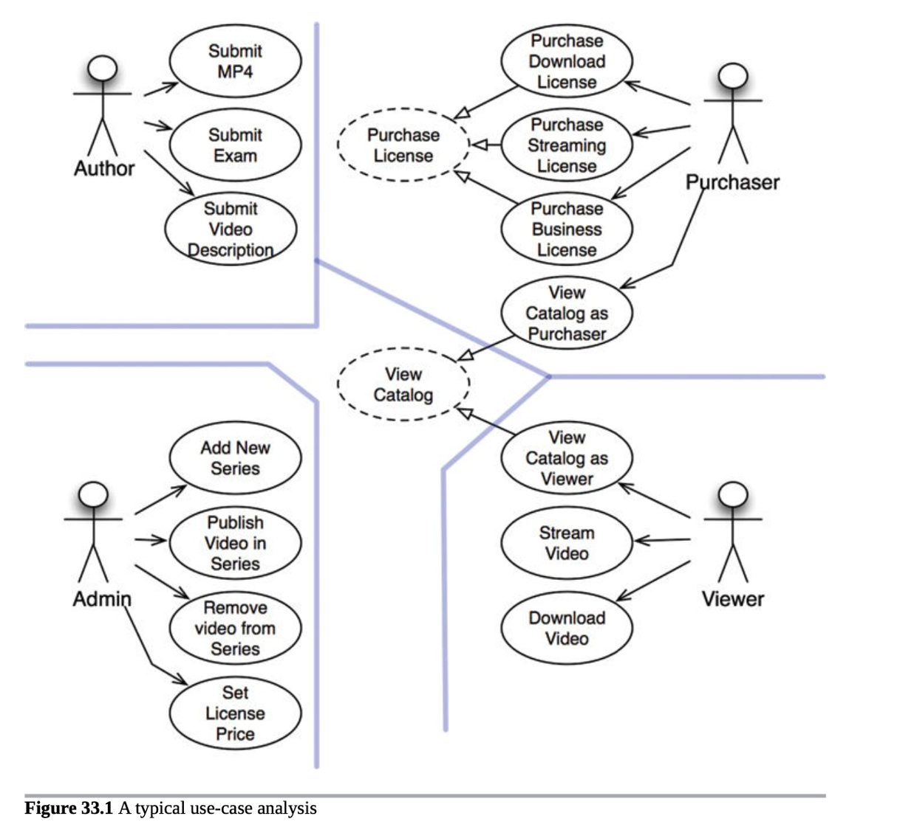
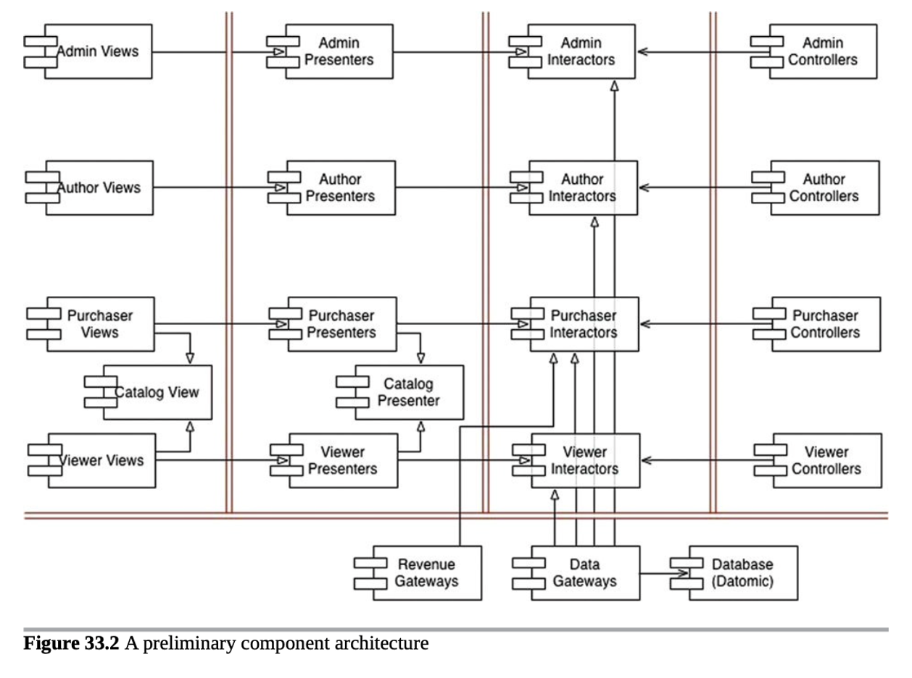

## 產品介紹

銷售影片的網站

### 第一步：確定角色(actors)

以 TA 身份劃分：
- 消費者：購買影片的人
- 觀看者：觀看影片的人
- 影片作者：提供影片與相關素材的角色
- 管理者：擁有管理所有內容的權限並且可以制定價格

### 第二步：確定使用案例(use cases)

先以上述四種角色做切分，並基於單一職責原則，讓增加一種角色的權限不會影響到其他角色

- 在 purchase 的行為中抽象出 purchase license
- 在 viewer 與 purchaser 都可以有 view 的行為，因此抽象一層 view catalog

### 第三步：切分元件

依照圖上的架構切分，可進一步思考如何將編譯與建置環境分離，例如：
- 五種 funtion 分別部署：views、presenters、interactors、controllers、utilities
- 基於上述，將 views 與 presenters 合併
- 基於上述，將 views 與 presenters 以外的組件合併

## 依賴管理
- 流程控管由右向左呼叫
- 開放封閉：using 箭頭與 inheritance 箭頭的剛好呈現相反的方向
- 避免修改 low-level details 不會影響到 high-level policy

## 總結
以上架構主要以兩個面向切入劃分架構
- 以不同原因與特性，區分 actors 
- 以不同變動頻率區分策略層級

以這樣的架構設計，後續在部署上可以有良好的變動性，可以輕易將各個組件 group 與 ungroup 來滿足不同的部署需求。