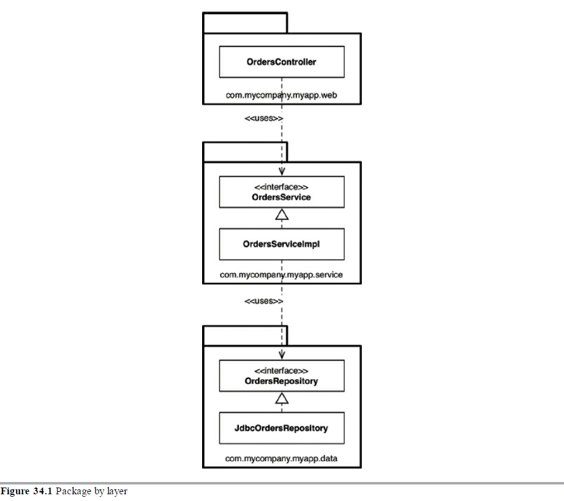
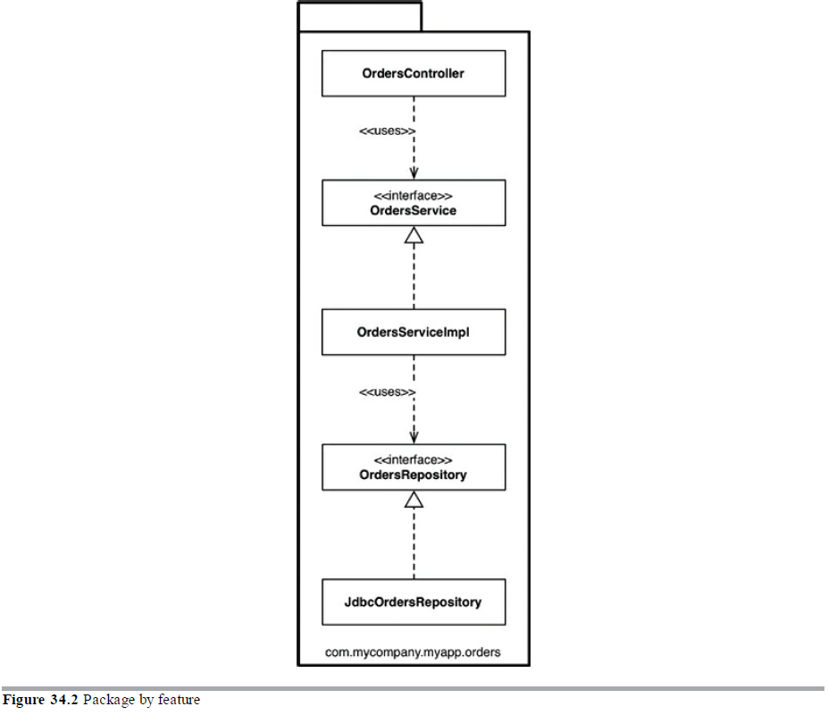
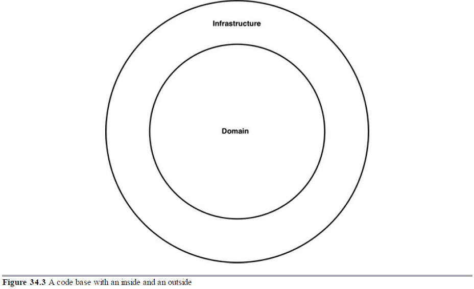
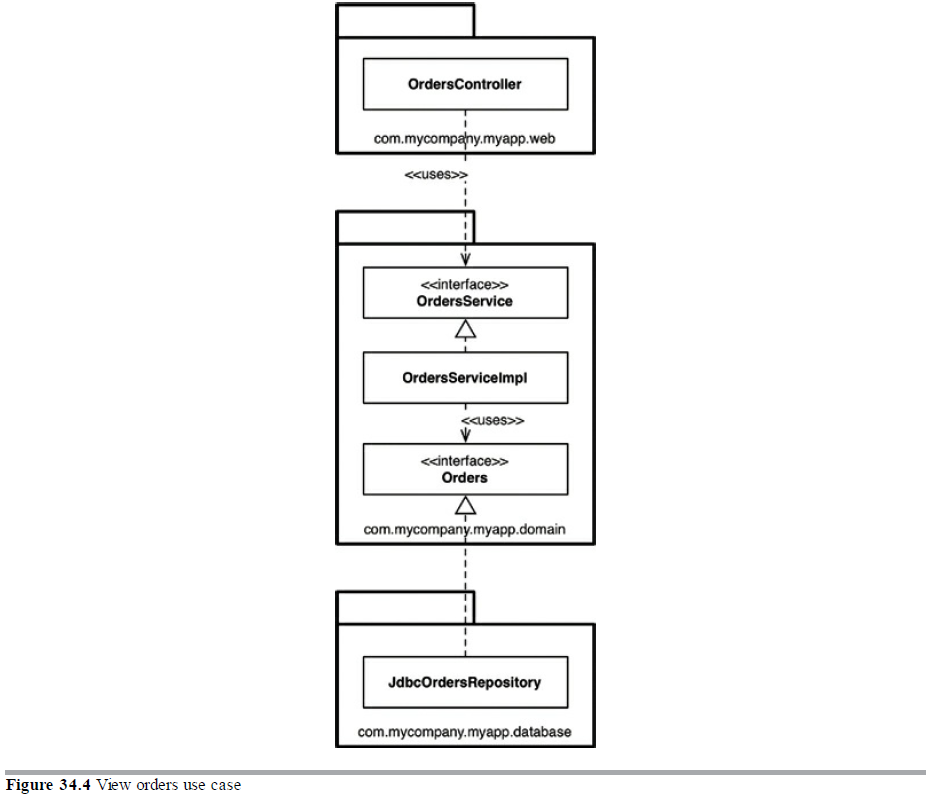
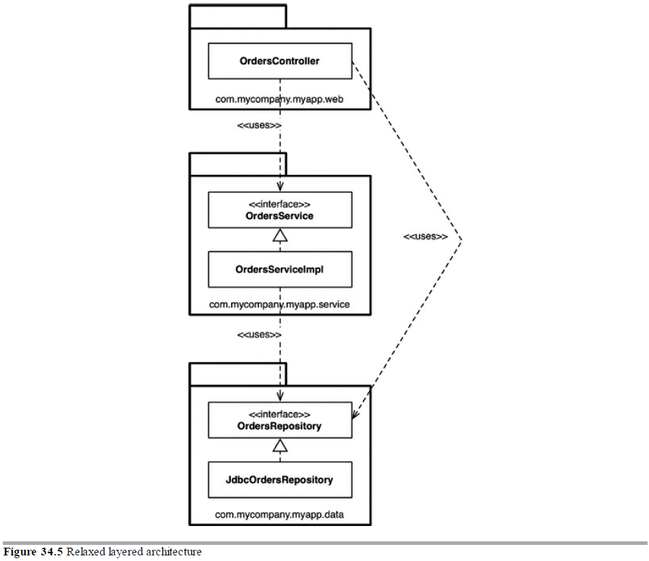
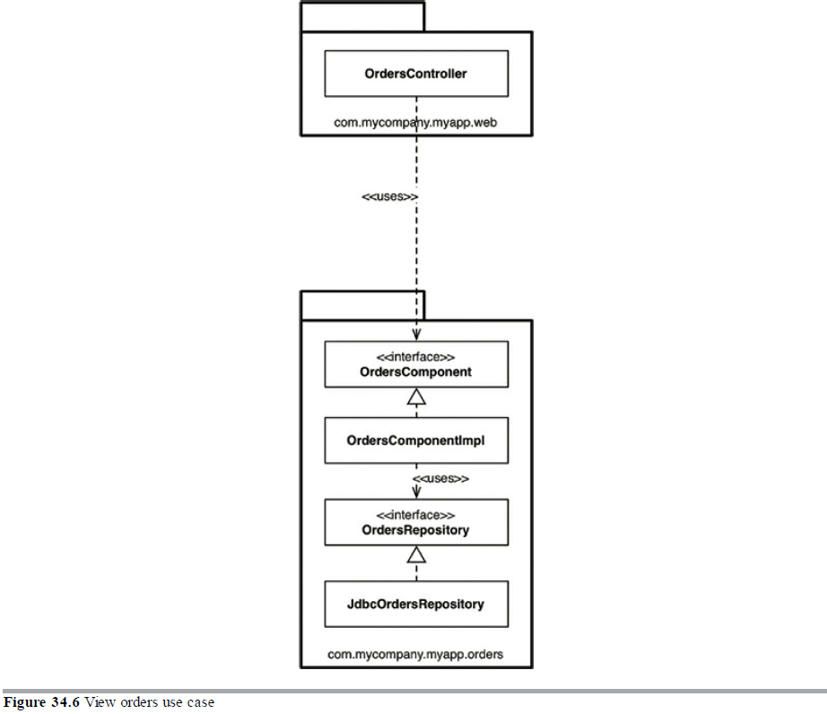
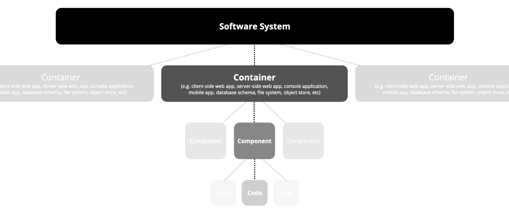
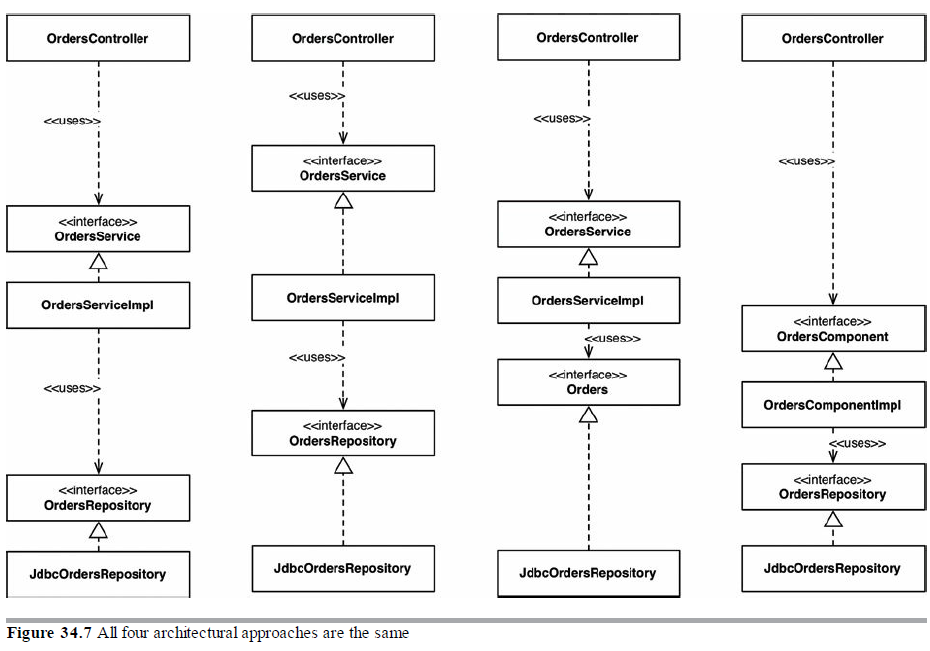
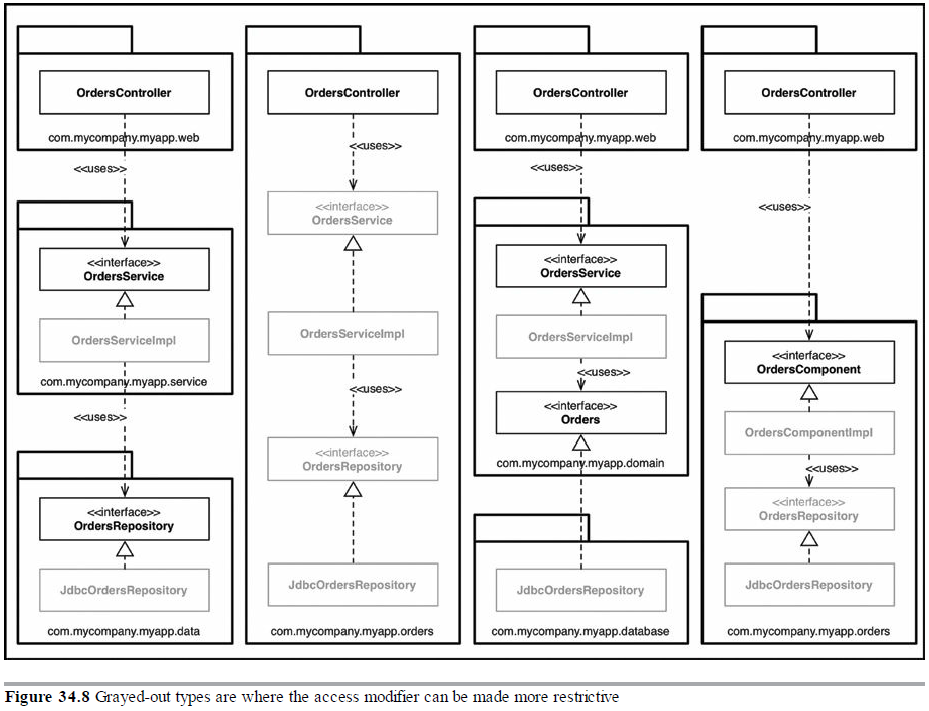
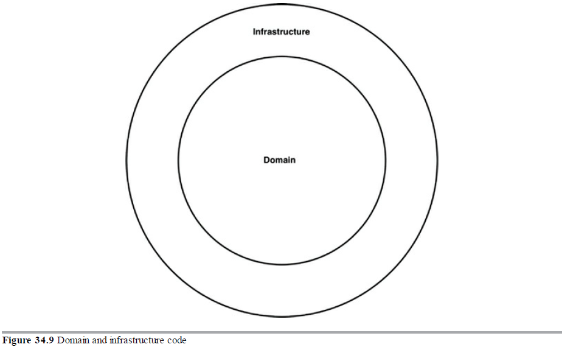

## 方法一：依套件逐層打包 （Package by layer）

### 水平橫向分層架構 (horizontal layered architecture)

- 最簡單的傳統設計方法，根據技術角度將程式碼分開，相同類型的在同一層，每一層只對相鄰的下層有依賴關係



<p style={{textAlign:'center'}}>圖片34.1 逐層打包</p>

** 說明 **

- ** OrdersController **: 一個 Web 控制器，類似 Spring MVC 控制器，用來處理來自 Web 的請求
- ** OrdersService ** : 定義與訂單有關的 「業務邏輯」的介面
- ** OrdersServiceImpl ** : OdersService 的實作
- ** JdbcOrdersRepository ** : 儲存庫介面的實作

### Example

```
├── com.app
    └── controller
        ├── CompanyController
        ├── ProductController
        └── UserController
    └── model
        ├── Company
        ├── Product
        └── User
    └── repository
        ├── CompanyRepository
        ├── ProductRepository
        └── UserRepository
    └── service
        ├── CompanyService
        ├── ProductService
        └── UserService
    └── util
```

(出處： [Package by Layer vs Package by Feature](https://medium.com/sahibinden-technology/package-by-layer-vs-package-by-feature-7e89cde2ae3a))

- 採用這種分層架構做為開始是個好方式
- 適合用於需要快速建立及沒有大量複雜性的情況下使用
- 軟體規模擴大及複雜度增加後，需要進一步的模組化

---

## 方法二：依功能特性打包（Package by feature）

### 垂直切片 (vertical slicing)

- 基於相關特性 (feature)、領域概念或聚合根 (aggregate roots: 取自領域驅動設計 DDD 的術語) 而作劃分
- 所有型態 (types) 都放在單一個 Java 包 (package: 套件) 中，其命名即反應出分組的概念



<p style={{textAlign:'center'}}>圖片34.2 依功能特性打包</p>

** 說明 **

- 有上一個方法 (Package by layers) 相同的介面和類別，但全部放在單一個 Java package 中
- 程式碼最高層級組織現在 「尖叫」出一些關於業務領域的內容
- 當 Use case 變更時，較易找出所有需要修改的程式碼

### Example

```
├── com.app
    └── company
        ├── Company
        ├── CompanyController
        ├── CompanyRepository
        └── CompanyService
    └── product
        ├── Product
        ├── ProductController
        ├── ProductRepository
        └── ProductService
    └── util
    └── user
        ├── User
        ├── UserController
        ├── UserRepository
        └── UserService
```

(出處： [Package by Layer vs Package by Feature](https://medium.com/sahibinden-technology/package-by-layer-vs-package-by-feature-7e89cde2ae3a))

### 小結

不論 Package by layer 或 Package by feature，兩者都不是最理想的選擇

---

## 方法三：端口和轉接器（Port and Adapter）

### 以業務/領域為中心的程式碼

- 架構又稱為 Hexagonal Architecture（六角形架構），Clean Architecture 的核心 （<a href="http://teddy-chen-tw.blogspot.com/2018/03/clean-architecture2port-and-adapter.html">參考：Clean Architecture（2）：Port and Adapter Architecture</a>）
- 獨立且與技術實作細節（如框架和資料庫）分離
- 代碼庫（codebase）由「內部」（領域 Domain）和「外部」（基礎設施 infrastructure）所組成



<p style={{textAlign:'center'}}>圖片34.3 具有內部和外部的程式碼庫</p>

** 說明 **

- 外部依賴內部

  - 內部區域包含 domian 概念
  - 外部則包含與外部世界 (UI、DB、3rd-party library) 的互動



<p style={{textAlign:'center'}}>圖片34.4 view orders 使用案例</p>

** 說明 **

- 「內部」所有的內容命名該使用「普及的領域語言」（DDD 中的建議）
  - OrdersRepository 重新命名為 orders

---

## 方法四：依元件打包（Package by component）

### 基於元件的架構 (CBA - Component Based Architecture)

- 一種混合式方法，目標將『與單個粗粒度 (Coarse-grained) 有關的所有責任』綁定（Bunddle） 到單一的 Package 中
- 以服務 (Service) 為中心的軟體系統觀點
- 元件：「業務邏輯」和持久性程式碼 bunddle 成單一的東西

> ** Uncle Bob: **  
> 元件（Component)是部署（Development）的單位，它們是系統在部署時最小的部分實體。

（像是 Java 中的 jar 檔；使用 React 作為前端開發）



<p style={{textAlign:'center'}}>圖片34.5 寬鬆的分層架構</p>

** 說明 **

- 為了讓依賴箭頭指向下，OrderService 介面要標為 public，同樣 OrdersRepository 介面也須要標為 public
- 這時有位新人加入團隊，要實作一個新的 Order 相關的使用案例，他可能會寫出如上的架構



<p style={{textAlign:'center'}}>圖片34.6 view orders 使用案例</p>

** 說明 **

- 將業務邏輯以及資料存取打包在一起，視為一個 元件 (component)
  - 兩者持久性是分離的，例: 一個單獨的 OrderService 封裝「與處理訂單有關的所有內容」
- 元件是部署 (deploymen) 的單位
  - Web 相關的 controller 依賴 OrdersComponent
  - 在元件內部，關注點的分離依然不變

### 補充：C4 Model

- Context (System Context Diagram)
  - 將各種使用者/角色需要使用的功能畫出來，不會有技術名詞或實作的相關做法
- Containers
  - applications and data stores
- Components
  - 將應用程式內容更深入地畫出每個元件
- Code
  - 提供架構元素的設計細節，可以對應到程式碼


<p style={{textAlign:'center'}}>圖片 C4 Model <a href="https://blog.myctw.cc/post/d11.html" target="_blank">（延伸閱讀：軟體架構之Ｃ4模型）</a></p>



<p style={{textAlign:'center'}}>圖片 C4 Model</p>

---

### 討論

#### 這屬於哪一種架構？

```
└── foresight-ats.app
    └── constants
        └── src
            ├── assets
            |   └── img
            └── lib
                └── api
    └── constainers
    └── machines
    └── mock
    └── ui
        └── src
            ├── components
            └── lib
```

---

## 魔鬼就在實作細節中

## 組織與封裝

** 勿濫用 "Public" **

- 若將所有型態都宣告為 public，那麼 package 只是一種組織機制（用來分組，就像資料夾那樣），而不是用於封裝
- 若都使用 public 型態，最終這些 package 容易被忽略，前面所提的四種架構方法都相同了



<p style={{textAlign:'center'}}>圖片34.7 四種架構方法都是相同的</p>

** 說明 **

- 不論使用哪種架構方法都是相同的
- 當所有型態都宣告 public 時，等於只是用四種方式來描述傳統的水平分層架構



<p style={{textAlign:'center'}}>圖片34.8 變成灰色的型態是可以使存取修飾符更具限制的地方</p>

** 說明 **

- 適當使用存取修飾符，可影響這些型態的可存取性（或不可存取性）
- 逐層打包
  - OrdersService 和 OrdersRepository 因為定義了被使用的介面 (依賴關係)，被宣告為 public
  - OrdersServiceImpl 和 JdbcOrdersRepository 因為是實作細節，不具有對外性
- 依功能特性打包
  - 只有 OrdersController 提供唯一的入口，其餘都不具有對外性
  - 除非透過這個 package 的 controller，否則其他程式碼沒有存取跟 orders 有關的資訊
- 依端口與轉接器打包
  - OrdersService 和 Orders 因為屬於內部，需要被外部依賴，因此要為 public
  - 其餘 OrdersServiceImpl 和 JdbcOrdersRepository 屬於實作細節，在 runtime 時進行 dependency injection
- 依元件打包
  - OrdersComponent 為 Controller 要互動的介面，須為 public，其餘皆視為實作細節

---

## 其他的解耦模式

### 通常還有其他方式可以將原始碼的依賴關係解耦

- 使用 OSGi 和新的 Java 9 模組系統（module system）
- 使用模組系統時，可區分 public 型態和 published (發布的) 型態
  - 建立一個 Orders 模組，所有型態都標記為 public，但僅將其中一個子集 publish 給外部使用

### 透過在不同的原始碼樹（different source code trees）支間分割程式碼

- 以「端口和轉接器」為例，可有三棵原始碼樹

  - 業務和領域的原始碼（即獨立於技術和框架選擇的所有內容）: OrdersService，OrdersServiceImpl 和 Orders
  - Web 的原始程式碼：OrdersController
  - 資料持久性的原始程式碼：JdbcOrdersRepository



<p style={{textAlign:'center'}}>圖片34.9 領域和基礎設施的程式碼</p>

** 說明 **

- 有些會採用更簡單的方式，只區分兩個 source code tree，如上圖

  - Domain (內部)
  - Infrastructure (外部)

- 將所有的 infra 實作都放在同一個 source code tree 當中，可能會出現一種 anti-pattern，程式中某個 infra (ex: Web controller) 可能會直接呼叫其他的 infra (ex: DB)，而無須透過中間的 domain

---

## 總結

- 考慮團隊的規模、技術水平及解決方案的複雜性和時間及預算的限制
- 如何利用編譯器來幫助強制執行所選擇的架構風格
- 注意其他區域（如資料模型）中的耦合
