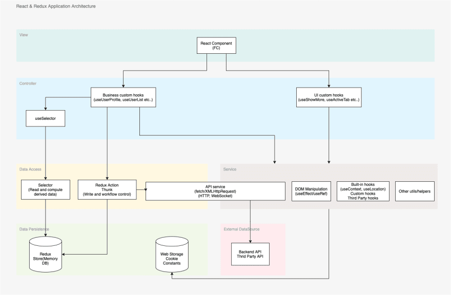
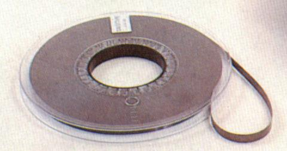
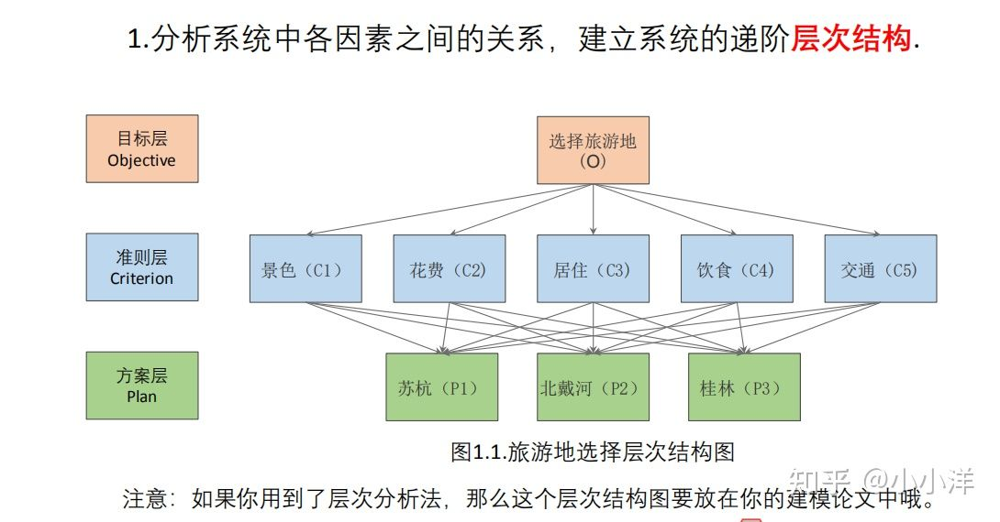
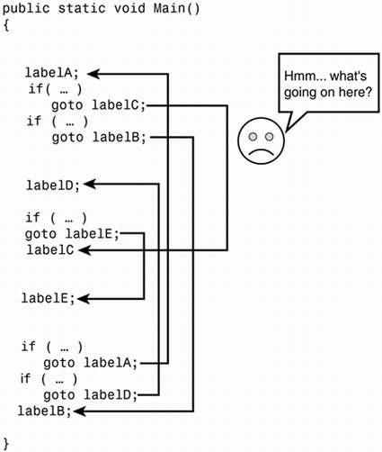
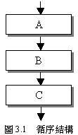
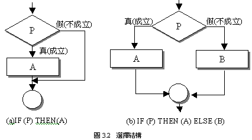
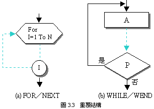

## 前言

> -   這本書是在講架構，為什麼講到範式？
>
> -   與架構的關聯？

回到 Ch1.

-   **架構**：從較宏觀的角度去看

    -   房子的樣貌，格局

-   **設計**： 從較微觀的角度看
    -   房子的燈，插座位置

舉個前端的例子：  
當收到一個 requirement....

React App Architecture:  


我們實際上在寫的：

```tsx
// React Functional Components
// What we really write.

export const App = () => {
	return <Component message="world!" />
}

export const Component = ({ message }) => {
	return <h1>Hello ${message}</h1>
}
```

```tsx
// Another Class components example

export default class App extends React.Component {
	constructor(props) {
		super(props)
		this.state = {
			// ...
		}
	}

	render() {
		return <Component message="world!" />
	}
}

export default class Component extends React.Component {
	constructor(props) {
		super(props)
		this.state = {
			// ...
		}
	}

	render() {
		return <h1>Hello ${this.props.message}</h1>
	}
}
```

-   範式所談論的是**_程式設計_**的方式，與語言無關。  
    例如 javascript 可以用 OOP，或是 FP 的方式來寫

-   架構與設計都是整個軟體(房子)的一部份

三種範式：

-   結構化程式設計(structured programming)
-   物件導向程式設計(object-orient programming)
-   函數式程式設計(functional programming)

> _架構的三大關注點： **函式**、**元件分離**、**資料管理**_  
> (原文為 function，應可解釋為**_功能_**)

---

## 結構化程式設計

> 將一組程式拆解成一組一組小的可證明的功能，然後我們使用*測試*來試圖證明這些功能是不正確的。  
> 如果測試不能證明他們是不正確的，那我們就可以認為這些功能對我們的目的來說是正確的。

### 歷史緣由

在早期真空管時代，電腦程式是用二進制或粗糙的組合語言編寫。使用的是紙帶或打孔卡。任何複雜的程式都包含太多細節。在看似可行的程式裡，工程師只能俯瞰一個小細節的成果，但結果常常是失敗。

Dijkstra 希望透過數學原理上的**_證明_**來解決這個問題。




### 證明

Dijkstra 認為可以用數學裡的**_層次結構_**來證明程式是正確的。  
也就是說，程式設計師將已經證明過的結構，並將他們與程式碼綁在一起，然後自行證明他們是正確的。


### goto 語句

Dijkstra 發現`goto` 語句的某些用法會阻止模組被分解成越來越小的單元，這樣會無法使用 [divide-and-conquer][divide-and-conquer-link]的方法來合理證明。

但是有些使用方始沒有這個問題，而這些使用方式會對應到簡單的控制結構，包含：if/then/else 和 do/while。

模組如果**只使用**這類型的控制結構，就可以被遞迴細分為可證明的單元。




_Ref: [What is wrong with using goto?][what-is-wrong-with-using-goto]_

### 與循序執行結合

Dijkstra 發現這些控制結構與循序執行結合時，是非常特殊。而

Bohm 與 Jacopini 證明了所有程式都可以使用三種結構建構出來(可以被證明)，分別是：

-   循序(sequence)
-   選擇(selection)
-   [迭代(iteration)][iteration]
    (網路查是遞迴，迴圈)

> 原文：建構可證模組的控制結構就是*可建構所有城市的控制結構*的最小集合，因此結構化程式設計誕生了。  
> 換句話說： 所有程式的可以由很多個小的可以被證明的程式所組成。

|                 循序結構                  |                  選擇結構                   |                迭代結構構                 |
| :---------------------------------------: | :-----------------------------------------: | :---------------------------------------: |
|  |  |  |

### 結構化程式設計的證明

-   循序(sequence)
    -   透過簡單來列舉： 由循序輸入追蹤到循序輸出。
-   選擇(selection)
    -   使用列舉來證明： 將選擇的每條路徑都列舉出來，如果兩條路徑最終都產生了恰當的數學結果，則證明就是可靠的。
-   [迭代(iteration)][iteration]
    -   使用數學歸納法： 先透過列舉證明 1 的情況，然後再次透過列舉，證明如果 N 假定是正確的，那麼 N+1 就是正確的。

### 大型程式功能分解

因為結構化程式設計允許將模組分解成一個個的可證明的單元，所以只要程式設計師遵循這些限制規則(參考 [goto](#goto-語句))，  
就可以將大型的系統，分解成一個個微小的、可證明功能的模組和元件。

> _現在，我們都是結構化的程式設計師，雖然這不一定是你選擇的。_  
> _只是因為我們的語言無法讓我們選擇使用無條件直接轉移控制。_ ([really?][goto-in-javascript] 😏😏😏)

### 科學的證明與測試

_數學是要證明陳述是 true，科學是要證明陳述是 false_

#### 科學的證明

科學的定理和定律都無法用證明來表達其正確性。  
例如：證明牛頓第二運動定律 F=ma，無倫多少次實驗，總有一些實驗證明他是不正確的。

> -   科學並非要證明陳述是正確的，而是要**證明陳述是錯誤的**。
> -   如果我們經過努力還是無法證明他是 false，那麽我們就認為他足夠正確。

#### 測試

現在我們的測試都是用科學的方式證明

> -   測試顯示了錯誤的存在，而不是沒有錯誤。
> -   這種證明不正確的方式只能用於可證的程式，一個不可正的程式(*無限制的*使用 goto)不能被認為是正確的。

#### 測試的問題

-   ```tsx
    // javascript
    function Add(a, b) {
    	return a + b
    }

    // safe？
    test('Is sum of two number', () => {
    	expect(Add(2, 2).toBe(4)
    })

    ```

-   [工程師：你再跟我說一次你是怎麼弄的][qa-joke]

<details>
  <summary>你永遠不知道User會怎麼使用我們的產品</summary>
  
</details>

-   [傳教：Write fewer tests!][xstate-testing]

### 總結

-   無限制使用`goto`會使程式無法被分解成可被證明的單元(無法被測試)
-   使用結構化程式迫使我們將程式分解成一組組可被證明的單元
-   大型程式由小的可被測試的單元組成
-   [回到開頭](#結構化程式設計)

[divide-and-conquer-link]: https://yalanin.medium.com/%e6%bc%94%e7%ae%97%e6%b3%95-%e5%88%86%e6%b2%bb%e6%b3%95-divide-and-conquer-592145d72699
[what-is-wrong-with-using-goto]: https://stackoverflow.com/questions/3517726/what-is-wrong-with-using-goto
[goto-in-javascript]: https://stackoverflow.com/questions/9751207/how-can-i-use-goto-in-javascript
[qa-joke]: https://forum.gamer.com.tw/Co.php?bsn=60076&sn=57532520
[xstate-testing]: https://youtu.be/tpNmPKjPSFQ?t=196
[iteration]: https://zh.wikipedia.org/zh-tw/%E8%BF%AD%E4%BB%A3
