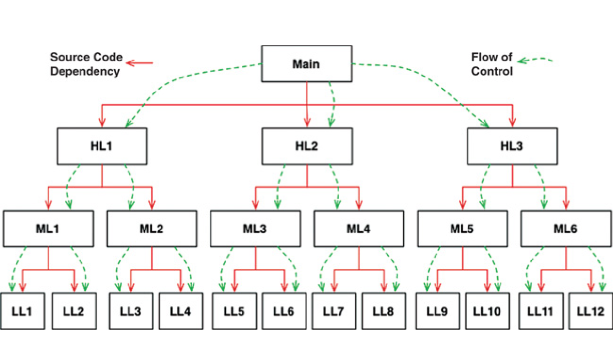
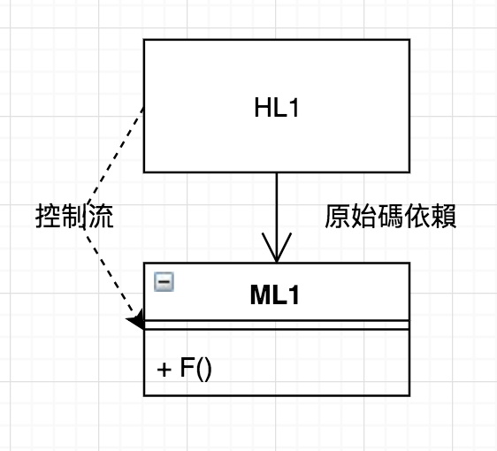
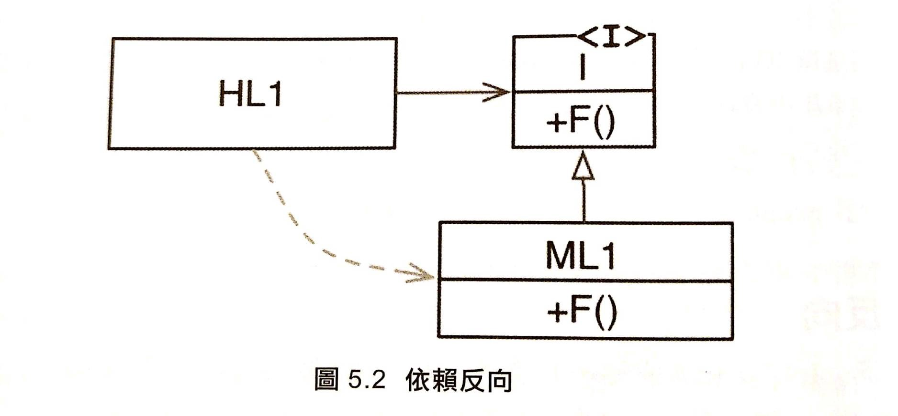
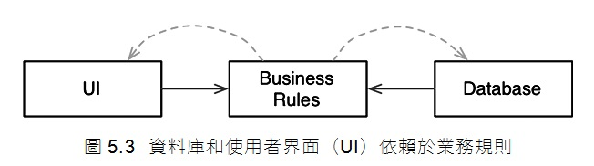

## 定義

> _物件導向程式設計是透過**多型**，來獲得每個系統中的程式碼**依賴方向**有絕對控制力_

## 常見的物件導向的定義誤區

> _我認為他想說的：  
> 這些定義在 OO 裡面的確有出現(也很常見)，但是並不是讓他定義成為 OO 最主要的原因，在其他非ＯＯ的地方也能實作出來。_

-   資料和函式的結合？

    -   這意味著 object.function() 和 function(object) 有不一樣
    -   Dahl 與 Nygaard 將 function 呼叫堆疊框架一到了 heap，並發明了 OO

    ```ts
    // object.function()
    class Greeting {
    	private message: string
    	constructor(message: string) {
    		this.message = message
    	}

    	hello() {
    		console.log(this.message)
    	}
    }

    const greeting = new Greeting('hello')
    greeting.hello()
    ```

    ```ts
    //  function(object)
    const messages = {
    	hello: 'hello',
    }

    function greeting(messages: { hello: string }) {
    	const message = messages.hello
    	console.log(message)
    }

    greeting(messages)
    ```

-   一種模擬真實世界的方式？
    -   定義太過鬆散，還是沒有說明什麼是 OO
-   三種本質定義？：
    > _原文在這裡都是用 C 語言做舉例_
    -   封裝 (encapsulation)
    -   繼承 (inheritance)
    -   多型 (polymorphism)

## 封裝

> _在 C 語言中使用`structure` 反而可以將資料完美封裝，  
> 而到了 C++反而某種程度被破壞_

### C 語言:

> _point.h 的使用者可以呼叫`makePoint()`和`distance()`，
> **但是他們完全不知道 Point 的資料結構和 function 的實作**_

```c
// point.h
    struct Point;
    struct Point* makePoint(double x, double y);
```

```c
// point.c
// define the details

    #include "point.h"
    #include <stdlib.h>
    #include <math.h>

    struct Point {
        double x, y;
    }

    struct Point* makePoint(double x, double y) {
        //......
    }

    double distance(struct Point* p1, struct Point* p2) {
        // ...
    }
```

### C++ 語言：

> 因為編譯器在技術上需要查看這些在標頭檔裡的變數，  
> 所以 point.h 的使用者知道成員變數 x, y 的相關資訊，  
> 雖然在後續的`public`, `private`, `protected`等關鍵字修復  
> 但是這只是一種 hack 手法，在後續其他語言更弱化了封裝。

```cpp
// point.h
    class Point {
        public:
            Point(double x, double y);
            double distance(const Point & p) const;

        private:
            double x;
            double y;
    };

```

```cpp
// point.cc
    #include "point.h"
    #include <math.h>

    Point::Point(double x, double y): x(x), y(y) {}

    doublePoint::distance(const Point& p) const {
        //....
    }

```

## 繼承

> -   在 OO 語言之前就有了一種繼承(宣告一模一樣的資料結構，並延伸)，  
>     但是是使用一種欺騙的方式實作，不如真正的繼承使用方便。
> -   這種使用方式要實現多重繼承是非常困難的。
> -   OO 語言在繼承方面雖然沒有帶來新東西，但是使用上更方便。

### C 語言：

```c
// point.h
    struct Point;
    struct Point* makePoint(double x, double y);
```

```c
// namedPoint.h
    struct NamedPoint;

    struct NamedPoint* makeNamedPoint(double x, double y, char* name);

    void setName(struct NamedPoint* np, char* name);
    char* getName(struct NamedPoint* np);
```

-   在範例中，第二個程式的資料結構前兩個欄位的順序與上一個 Point 相同，  
    所以可以偽裝成 Point，因為 NamedPoint 是 Point 的一個純超集合，並維護對應成員順序。
-   在多重繼承的時候，就得不斷把成員往上加.....

### 以 JS 說明使用 OO 繼承更為方便：

```js
// point.ts
class Point {
    private x: number;
    private y: number;
	constructor(x: number, y: number) {
		this.x = x
		this.y = y
	}
}
```

```ts
// namedPoint.ts
import Point from 'path/to/point.ts'

class NamedPoint extends Point {
	private name: string
	constructor(name: string) {
		super()
		this.name = name
	}

	setName() {
		//...
	}
	getName() {
		//...
	}
}
```

## 多型

> [_多型指為不同資料類型的實體提供統一的介面。_][polymorphism-wiki]

-   在早期 C 語言必須用**函式指標**來實現多型的行為，這依賴一系列約定，
    工程師必須透過指標呼叫函示，如果有人沒遵守，產生的 bug 會很難追查和消除。
    所以指向函式的指標很是危險的。
-   雖然 OO 沒有帶來多型，但是使得多型更安全和方便。
-   作者認為最有威力和代表性。
-   可以使用**_interface_** 或是 **_abstract class_**來實現，目的是解耦兩個物件。

### [介面(Interface) vs 抽象類別(Abstract Class)][interface-vs-abstract]

-   介面：

    -   interface 規範了外部使用的規則，不管詳細的實現方式，而是交由類別來實作。
    -   不同的類別可以有完全不同的實作細節。
    -   interface 描述了外部能夠使用的變數或方法，所以在後續寫類別時，  
        可以避免暴露了不該暴露的變數或函式。
    -   介面不一定是要能被重複使用。
    -   當介面改變時，相對應的類別要需要做相對應修正，以確保符合一致的規範。

```ts
// interface
// 兩個類別實作相同介面

interface USB {
	execute(): void
	stop(): void
}

class Mouse implements USB {
	private state: string
	private countClick: number

	constructor(state: string, countClick: number) {
		this.state = state
		this.countClick = countClick
	}

	public execute() {
		this.state = 'mouse start'
	}
	public stop() {
		this.state = 'mouse stop'
	}
	private countClicking() {
		this.countClick += 1
	}
}

class Keyboard implements USB {
	private state: string

	constructor(state: string) {
		this.state = state
	}
	public execute() {
		this.state = 'keyboard start'
	}
	public stop() {
		this.state = 'keyboard stop'
	}

	//....
}
```

-   抽象類別：

    -   抽象類別不能實例化，每一個實例都是具體子類別的實例。
    -   抽象類別不止可以實現抽象方法，更可以包含商業邏輯與**私人屬性**。

```ts
// abstract class
abstract class Animal {
	private weight: number
	constructor(weight: number) {
		this.weight = weight
	}

	abstract walk(): void
	abstract sleep(): void
}

class People extends Animal {
	constructor(weight: number) {
		super(weight)
	}

	walk() {
		console.log('people walking...')
	}

	sleep() {
		console.log('people sleeping...')
	}
}

class Dog extends Animal {
	constructor(weight: number) {
		super(weight)
	}

	walk() {
		console.log('Dog walking...')
	}

	sleep() {
		console.log('Dog sleeping...')
	}
}
```

> -   _interface 比較著在重描述互相沒有關聯的類別，所共通的方法和類別。_
> -   _abstract class 描述共同得物件屬性，比較多件層關係 (如：動物(比較抽象) => 人(比較具體))_

-   兩個結合在一起使用

```ts
// more example of compose abstract and interface...

abstract class Machine {
	public battery: number
	constructor(battery: number) {
		this.battery = battery
	}

	abstract boost(): void
	abstract shutDown(): void
}

abstract class Vehicle {
	public abstract start(): void
	public abstract turn(): void
}

// 有共用的USB功能，但是不能被繼承。
interface USB {
	execute(): void
	stop(): void
}

class Computer extends Machine implements USB {
	boost() {
		console.log('computer Boosting...')
	}

	shutDown() {
		console.log('computer shutdown....')
	}

	execute() {
		console.log('computer USB executing....')
	}

	stop() {
		console.log('computer USB stopping....')
	}
}

class Car extends Vehicle implements USB {
	start() {
		console.log('Car starting....')
	}

	turn() {
		console.log('Car turning.....')
	}

	execute() {
		console.log('Car USB executing....')
	}

	stop() {
		console.log('Car USB stopping....')
	}
}
```

### 多型的威力 - 依賴反向

> _原本程的依賴性只能依照控制流來決定，而多型能夠讓依賴反轉。_



### 如果沒有多型



```ts
// 如果沒有多型
class Computer {
	execute() {
		console.log('computer USB executing....')
	}

	stop() {
		console.log('computer USB stopping....')
	}
}

class Car {
	execute() {
		console.log('Car USB executing....')
	}

	stop() {
		console.log('Car USB stopping....')
	}
}

const computer = new Computer()
const car = new Car()

computer.execute()
car.execute()

// [LOG]: "computer USB executing...."
// [LOG]: "car USB executing...."
```

### 如果有多型實現依賴反向



-   加入 interface 實現反向依賴

```ts
interface USB {
	execute(): void
	stop(): void
}

class Computer implements USB {
	execute() {
		console.log('computer USB executing....')
	}

	stop() {
		console.log('computer USB stopping....')
	}
}

class Car implements USB {
	execute() {
		console.log('Car USB executing....')
	}

	stop() {
		console.log('Car USB stopping....')
	}
}

function executeTheUSB(usb: USB) {
	usb.execute()
}

executeTheUSB(new Computer())
executeTheUSB(new Car())

// [LOG]: "computer USB executing...."
// [LOG]: "car USB executing...."
```

-   加入 abstract class 實現反向依賴

```ts
// more example using abstract class...
abstract class Animal {
	public name: string
	constructor(name: string) {
		this.name = name
	}
}

class Dog extends Animal {
	constructor(name: string) {
		super(name)
	}

	sleep() {
		//...
	}
}

class People extends Animal {
	constructor(name: string) {
		super(name)
	}

	walk() {
		//...
	}
}

function speakMyName(animal: Animal) {
	console.log('my name is: ' + animal.name)
}

speakMyName(new Dog('小白'))
speakMyName(new Dog('彼得'))

// [LOG]: "my name is: 小白"
// [LOG]: "my name is: 彼得"
```

## 依賴反轉的優勢

_business rules 將不會有任何 UI 或資料庫程式_


> 因為模組之間不是只有單向的依賴關係，可以使模組之間更加獨立已達到：

-   可獨立性部署
-   可獨立性開發

## 總結：

[_**多型**與**依賴反向**才是物件導向設計的厲害之處_](#定義)

[polymorphism-wiki]: https://zh.wikipedia.org/zh-tw/%E5%A4%9A%E6%80%81_(%E8%AE%A1%E7%AE%97%E6%9C%BA%E7%A7%91%E5%AD%A6)
[interface-vs-abstract]: https://medium.com/%E7%A8%8B%E5%BC%8F%E6%84%9B%E5%A5%BD%E8%80%85/%E7%89%A9%E4%BB%B6%E5%B0%8E%E5%90%91%E4%B8%AD%E7%9A%84%E4%BB%8B%E9%9D%A2%E8%88%87%E6%8A%BD%E8%B1%A1%E9%A1%9E%E5%88%A5%E6%98%AF%E4%BB%80%E9%BA%BC-1199804ccc5f
