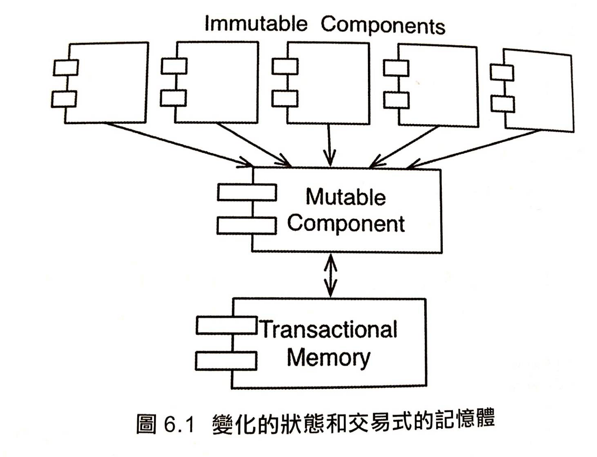

## [什麼是函數式程式設計？][fp-wiki]

> -   functional programming 的 function 比較像是數學裡的 function: f(x)
> -   大方向： 在程式變數的賦值上加入規範

## 定義：

參考至：[less-lee-medium][fp-less-lee-medium]

-   Function 必須作為一級公民。意即，
    -   可以像一般變數一般被當作參數傳入
    -   被當作結果輸出
    -   被任意 assign 給其他變數、被任意進行運算。

```ts
// 被當作參數傳入
function sayHi() {
	console.log('hello')
}

setTimeout(sayHi, 1000)

// after 1 second...
// [LOG]: "hello"
```

```ts
// 被當作結果輸出
function sum(x: number, y: number) {
	return x + y
}

function main() {
	const tea = 45
	const milk = 100

	const bill = sum(tea, milk)
	// 不會改變原本變數值
	console.log('$' + tea)
	console.log('$' + milk)
	console.log('$' + bill)
}

main()

// [LOG]: "tea: $45"
// [LOG]: "milk: $100"
// [LOG]: "sum: $145"
```

```ts
// 被任意 assign 給其他變數、被任意進行運算。

const sum = function (x: number, y: number) {
	return x + y
}

function main() {
	const tea = 45
	const milk = 100

	const getSum = sum

	const bill = getSum(tea, milk) + sum(tea, milk)

	console.log('tea: $' + tea)
	console.log('milk: $' + milk)
	console.log('bill: $' + bill)
}

main()

// [LOG]: "tea: $45"
// [LOG]: "milk: $100"
// [LOG]: "bill: $290"
```

-   Function 中只能有 Expression 而非指令( instructions )。
    > [詳細看參考][expression-vs-instruction]
    -   Expression 表達式、表示式、運算式，**會回傳結果**
    -   instructions 陳述式，執行一些程式，不會回傳結果

```ts
// 回傳 number
function sum(x: number, y: number) {
	return x + y
}

// 回傳 void
function hello() {
	console.log('hello')
	// return void 被忽略
}
```

-   Function 必須是 「Pure」、沒有 Side Effect。
    -   pure function: y = f(x)，無論執行多少次、外部如何改變，
        永遠對應，只要 input 是 x，output 一定是 y。
    -   side effect: 對外部造成影響

```ts
// pure function
// 無論何時何地，Output 都只與 Input 有關係

function addOne(x: number) {
	return x + 1
}

const y = addOne(2)
console.log(y)

// [LOG]: 3
```

```ts
// side effect function
let count: number = 10

function sideEffectFunc() {
	// do something...

	count++
}

sideEffectFunc()
console.log('count = ' + count)

// [LOG]: "count = 11"
```

-   Function 「不可改變 Input 的資料」、「不可 改變狀態」

```ts
// 不符合functional programming的原則：
// 可以看到 numbers 這個原始的array被改變了

const numbers = [1, 2, 3, 4, 5]
numbers.splice(0, 1)

console.log('numbers: ' + numbers)

// [LOG]: "numbers: 2,3,4,5"
```

```ts
// 原本的numbers不會被更改，而是產生新的array
const numbers = [1, 2, 3, 4, 5]
const newNumbers = numbers.slice(1, numbers.length)

console.log('numbers: ' + numbers)
console.log('newNumbers: ' + newNumbers)

// [LOG]: "numbers: 1,2,3,4,5"
// [LOG]: "newNumbers: 2,3,4,5"
```

> _還有一個例子在前端的 react + redux 中，舊有的狀態永遠不會被改變，而是產生新的狀態_ > 

-   Function 可以任意組合得到新的 Function，且依然滿足以上這些守則
-   Functional Programming 設計哲學之一便是：「以 Function 為最小單位解決問題，任何 Function 都可以任意組合成為新的 Function」。

```ts
function add(x: number, y: number) {
	return x + y
}

function square(x: number) {
	return x * x
}

function compose(f: any, g: any) {
	return function (x: number, y: number) {
		return f(g(x, y))
	}
}

// 先相加，後平方
const addAndSquare = compose(square, add)

const result = addAndSquare(2, 2)

console.log(result)

// [LOG]: 16
```

## 函數式程式設計

> _最主要就是要掌握程式中的**變數不可變性**_

## 不可變與架構的關係？

> _為什麼變數可不可變這件事，對架構來說會覺得重要？_

-   以下架構問題都來自於變數可變性：

    -   [競爭條件(race condition)][race-condition-wiki]
        -   [example][race-condition-example]
    -   [deadlock 條件(死結)][deadlock-wiki]
        -   [example][deadlock-example]
    -   平行更新問題(concurrent update problem)
        -   銀行更新問題

-   _書：如果沒有變數會被更新，就這些問題就不會發生_
-   如果變數全都不可變，會需要很多儲存空間跟處理速度！在現實世界比較不可行。這時候就要做一些折衷。

## 折衷辦法：將可變性分離

> 盡量讓更多處理放到不可變的元件中，與可變的變數分離開來變
> 

-   Transactional Memory：

    -   保護可變的變數避免平行更新與競爭條件的影響。
    -   基於交易或重試的方案來保護這些變數(看不懂)

## 折衷辦法：事件來源

> -   是一種策略，儲存的只有交易，而不是狀態。當需要取得狀態的時候，
>     只需要簡單地從源頭開始應用所有交易
> -   此機制不必尋求永久有效，而是在足夠的儲存空間與效能足以讓應用程式在生命週期內工作

-   銀行餘額的應用程式例子：
    -   原本： 當交易或提款時，會改變原本的餘額變數
    -   改變：
        -   不是儲存餘額，而是儲存每一筆交易(類似 log)，而在需要顯示餘額的時候，將所有交易加總。
        -   量太大時，可以在午夜時進行計算並且保存狀態，當需要資訊時，只需要計算來自午夜以來的交易
    -   沒有資料會被更新或刪除 (CRUD => CR)，所以不會有平行化問題。

## 總結

> 函數式程式設計就是在控制變數不可變性，但是實務上很難完全做到，所以有一些折衷辦法。

-   三種範式：
    -   結構化程式設計： 在直接控制轉移上加上規範
    -   物件導向程式設計： 在間接控制轉移上加上規範
    -   函數式程式設計： 在變數賦值上加上規範
-   三種範式都是在限制我們寫程式的方式，哪些是**不該做的**。
-   軟體就是：_**循序**_、_**選擇**_、_**迭代 (iteration)**_ 和 _**間接(indirection)**_ 所組成的內容。沒有更多也沒有更少。

[fp-wiki]: https://zh.wikipedia.org/zh-tw/%E5%87%BD%E6%95%B0%E5%BC%8F%E7%BC%96%E7%A8%8B
[fp-less-lee-medium]: https://medium.com/%E4%B8%80%E5%80%8B%E5%B0%8F%E5%B0%8F%E5%B7%A5%E7%A8%8B%E5%B8%AB%E7%9A%84%E9%9A%A8%E6%89%8B%E7%AD%86%E8%A8%98/javascript-functional-programming-%E4%B8%80%E6%96%87%E5%88%B0%E5%BA%95%E5%85%A8%E7%B4%80%E9%8C%84-95ff19d9892
[expression-vs-instruction]: https://www.casper.tw/development/2020/09/17/js-expression/
[race-condition-wiki]: https://zh.wikipedia.org/zh-tw/%E7%AB%B6%E7%88%AD%E5%8D%B1%E5%AE%B3
[deadlock-wiki]: https://zh.wikipedia.org/wiki/%E6%AD%BB%E9%94%81
[race-condition-example]: https://www.nodejsdesignpatterns.com/blog/node-js-race-conditions/
[deadlock-example]: http://webreflection.blogspot.com/2007/06/simplest-javascript-deadlock.html
