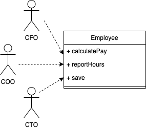
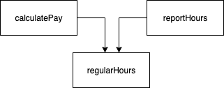
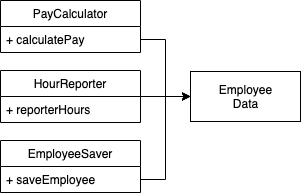
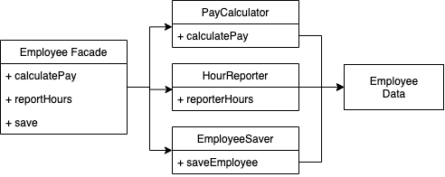
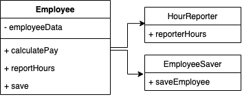

# SOLID

> 好的軟體架構始於 clean code。

- 能容忍變化，
- 容易理解，而且
- 是許多軟體系統中能夠使用的元件的基礎。

> 中層級：定義模組和元件內使用的軟體結構類型

- SRE: 單一職責原則
- OCP: 開放-封閉原則
- LSP: 里氏替換原則
- ISP: 介面隔離原則
- DIP: 依賴反轉原則

---

# Single Responsibility Principle

- 一個模組應該只對唯一的一個角色負責

- 模組(Module)：
  > 一個原始檔(source file)

## 症狀 1 : 意外重複



- calculatePay() 方法由會計部指定，並向 CFO 報告。
- reportHours() 方法由人力資源部指定和使用，並向 COO 報告。
- save() 方法由 DBA 指定，並向 CTO 報告。

#### 共用演算法



> 分開不同角色所依賴的程式碼(separate the code that different actors depend on)

## 症狀 2 : 合併


> 分離支援不同角色的程式碼(separate code that supports different actors)

## 解決方案

> 避免意外重複(accidental duplication)



三個類別不相互了解



FACADE [fəˈsäd] 模式



## Example

```ts
class Book {
  public title: string;
  public author: string;
  public description: string;
  public pages: number;

  // constructor and other methods

  public saveToFile(): void {
    // some fs.write method to save book to file
  }
}
```

```ts
class Book {
  public title: string;
  public author: string;
  public description: string;
  public pages: number;

  // constructor and other methods
}

class Persistence {
  public saveToFile(book: Book): void {
    // some fs.write method to save book to file
  }
}
```

## Example 2

* 這個例子，Book Model符合SRP嗎？為什麼？

```js
// MVC Model
class Book extends Model {
  constructor() {
    this.conn = mysql.createConnection({...});
  }

  public get() {
    const conn = this.conn
    return new Promise((resolve, reject) => {
      conn.query('SELCT * FROM book', (result, error) => {
        if (error) { reject(error) }
        resolve(result)
      })
    })
  }

  public write(books) {
    // ...
  }

  destructor() {
    this.conn.close()
  }
}

// MVC Controller
async function controller() {
  const bookModel = new Book()
  return await bookModel.get()
}

// Background Cronjob
async function updateAuthorJob() {
  const bookModel = new Book()
  const books = await bookModel.get()
  books.map(book => ({...book, author: 'bob'}))
  await bookModel.write(books)
}
```
