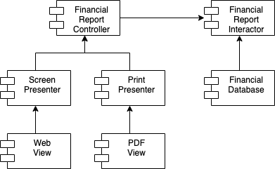

# Open-Closed Principle

- 一個軟體製品應該對於擴展是開放的，但對於修改是封閉的。
  > "Software modules should be open for extension, but closed for modification."

## 一個構想實驗

> 一個好的軟件架構可以將修改的程式碼減少到最低程度，甚至為 0。



## Example

```ts
function Button({ text }: ButtonProps) {
  return <button>{text}</button>;
}

function App() {
  return <Button text='Click me!' />;
}
```

```ts
function Button({ text, isLoading }: ButtonProps) {
  if (isLoading) {
    return <svg>...</svg>;
  }

  return <button>{text}</button>;
}

function App() {
  return <Button text='Click me!' isLoading={true} />;
}
```

```ts
function Loading({ isLoading, children }: LoadingProps) {
  return isLoading ? <svg>...</svg> : children;
}

function Button({ text }: ButtonProps) {
  return <button>{text}</button>;
}

function App() {
  return (
    <Loading isLoading={true}>
      <Button text='Click me!' />
    </Loading>
  );
}
```
