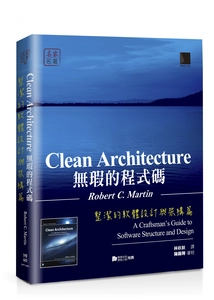

The study notes of [Clean Architecture: A Craftsman's Guide to Software Structure and Design](https://www.amazon.com/Clean-Architecture-Craftsmans-Software-Structure/dp/0134494164)

ISBN [978-986-434-294-5](https://isbnsearch.org/isbn/9789864342945)

原著版權屬於Robert C. Martin

姓名標示─非商業性─相同方式分享

