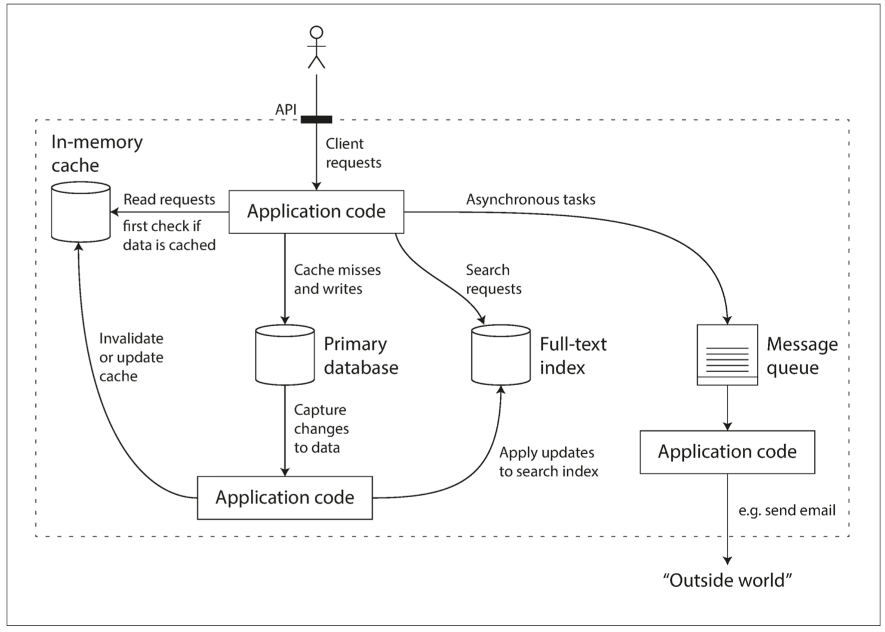

import Tabs from '@theme/Tabs';
import TabItem from '@theme/TabItem';


|              | 資料密集型                             | 計算密集型       |
| ------------ | -------------------------------------- | ---------------- |
| 主要限制因素 | 資料量級、資料複雜度、資料速變性       | CPU、GPU、Memory |
| 常見的模組   | 資料庫、快取、搜尋索引、串流、批次處理 |                  |
| 主要指標     | 吞吐量、延遲時                         | 計算時間         |
| Example      | 高流量、推薦系統                       | 科學計算         |

:::info Discussion
Machine Learning的使用屬於哪一型的系統？
:::


## 資料系統思維

* 資料庫、Queue、Cache，是不同類型的工具
    * 因應使用情境不同而發展出來的工具
    * 彼此透過應用層程式碼來縫合

    

* 進行資料系統設計時會出現很多棘手的問題
    * 出錯時內部如何確保資料正確與完整？
    * 服務降級時，如何提供客戶良好如一的性能？
    * 如何被擴展，以因應增加的負載？
    * 友善API的服務該如何設計？
* 本書關注在設計軟體系統時極為重要的三個方面：
    * 可靠性、可擴展性、可維護性
    * 本章只做簡單介紹，各面向的技術細節會在書中其他章節詳述

## 可靠性 Reliability

> 面對逆境，系統也應該要能繼續正常工作

* 可靠或不可靠是很主觀的，對軟體系統典型的期望：
    * 應用程式要能執行使用者所期望的功能
    * 要能容忍使用者犯錯或以不正確的方式操作系統
    * 在預期的負載下，性能要能滿足需求
    * 能防止未經授權的訪問和濫用
* 「Murphy's Law墨菲定律」
    * 如果事情可能出錯，它就**一定**會發生

### 故障Fault & 失效Failure

* 可能出錯的事稱為「故障」，能應對故障的系統稱為「容錯fault-tolerant」或「彈性resilient」
    * 「故障」不能無限上綱
    * 我們不可能做出可以容忍所有錯誤的系統
    * 討論容錯時，要在**特定的錯誤**下再探討，才有實質意義

|         | 故障 Fault                                                              | 失效 Failure                                                    |
| ------- | ----------------------------------------------------------------------- | --------------------------------------------------------------- |
| 含義    | 可能出錯的事情發生了                                                    | 系統整體停止向使用者提供所需的服務                              |
| 應對    | 無法完全避免，容忍大於預防。<br/>有時會故意引發故障 (Chaos Engineering) | 透過「容錯設計」避免<br/>避免失效為架構設計關於可靠性的主要目標 |
| Example | 硬碟故障、網路失效                                                      | 透過DB Replica，設計適當的Cache Strategy                        |

### 硬體故障

* 硬碟壞軌、記憶體故障、停電、拔錯網路線
* 硬碟平均故障時間(MTTF)大約10~50 year
    * 50 x 365 = 18,250，以MTTF為50年來說，硬碟在今天出問題的機率約是0.005%
    * 10,000個硬碟的資料中心，平均每天都會有一台硬碟故障

#### 硬體故障的對策 - 添加冗余

* RAID 1 做兩顆 MTTF 50 year的硬碟，可以使整體的故障率降為 0.00000025%
* 雙PSU伺服器、熱插拔CPU、UPS、發電機...etc.
* 雖然不能完全防止故障所引發的失效，但實際上能夠讓系統不間斷運行個好幾年
    * 添加冗余對大多數應用來說仍然是足夠的

#### 硬體故障的對策 - 軟體容錯技術

* 優先使用軟體容錯技術，或加在硬體冗余之外，可以達到更好的容忍度
    * 軟體容錯技術，能帶來更好的營運優勢
        * 滾動升級
        * 不需計畫停機
    * 「以前是將硬體當作孩子呵護，現在是當作牲畜圈養」

### 軟體錯誤

* 硬體錯誤通常是相互獨立的 - 一台機器的硬碟故障並不意味著另一台機器的硬碟也會同時故障
    * 除非有其他關聯
    * 例如，機架的溫度
* 軟體錯誤相較於硬體故障，更難事先預料或估計，節點間若有關聯可能會引發更多的故障
    * Y2K
    * 共享資源(CPU, Memory...etc.)被耗盡
    * 連鎖故障 (Cascading Failures)

#### 軟體錯誤的對策

* 沒有快速的解決方法
* 良好的設計，工程師的知識與經驗，自動復原的設計 (例如，自動重啟)，Runtime的監控或檢查

### 人為失誤

* 不可避免，人為的操作達不到萬無一失
* [研究](https://www.usenix.org/legacy/events/usits03/tech/full_papers/oppenheimer/oppenheimer_html/index.html)發現，營運商的組態設定錯誤是導致系統失效的主因，硬體故障只佔所有故障的 10%~25%

#### 人為失誤的對策

* 結合多種方法達到
    * 良好的設計。例如精心設計的抽象層、API與管理介面
    * 將容易出錯的地方在架構上獨立開來。例如Sandbox的使用
    * 在所有的級別進行測試：單元測試、整合測試、手動測試
    * 能夠快速的從錯誤中回滾。例如滾動發布、提供資料校驗工具來防止計算出錯
    * 建立詳細的監控系統
        * 包括性能指標和錯誤率
        * 遙測Telemetry一詞的來源：火箭升空後要跟蹤其運作和瞭解故障需要仰賴遙測技術
    * 實施良好的管理實踐及培訓

## 可擴展性 Scalability

> 隨著系統規模增長，應該要有合理的方式來處理這種增長

* 「我們該如何增加計算資源，來處理額外的負載」
* 「負載」需要是可以被描述的
    * 每秒請求數
    * 資料庫的讀寫比例
    * 同時活躍的使用者數
    * 快取命中率

### Twitter 2012

1. 發布推特訊息 post tweet：平均 4.6k req/s；峰值 12k req/s
2. 瀏覽時間軸主線 home timeline：300k req/s

#### Twitter的挑戰：**巨大的fan-out**

* 一個進入的請求，需要再對其他服務發出請求的總數
* 每個使用者會follow很多人；同時也可能被很多人follow
* 沒有簡單的方式，能設計一種架構同時滿足這兩種workloading

#### Approach1：tweets存放在單一資料表


* 發布推文：O(1)
* 存取timeline：O(N*M)
    * N = followers count
    * M = followers avg message count

```sql title="On post tweet"
INSERT INTO tweets (sender_id, text, timestamp)
VALUES (current_user_id, 'tweet message...', NOW())
```

```sql title="On access home timeline"
SELECT tweets.*, users.*
  FROM tweets
  JOIN users   ON tweets.sender_id = users.id // M
  JOIN follows ON follows.followee_id = users.id // N
  WHERE follows.follower_id = current_user
```

#### Approach2：為每個使用者的home timeline做cache


* 發布推文：O(N)
* 存取timeline：O(M)
    * M = message count

```sql title="On post tweet"
SELECT follower_id FROM followers
WHERE followee_id = current_user_id;

// foreach follower ids
INSERT INTO tweets (sender_id, receiver_id, text, timestamp)
VALUES (current_user_id, follower_id, 'tweet message...', NOW())
// end foreach
```

```sql title="On access home timeline"
SELECT *
FROM tweets
WHERE receiver_id = current_user_id
```

### fan-out的難題

* 平均數掩蓋了事實：每個使用者的follower差距很大
    * 「狂讚士與超級網紅之爭」
        * 一條tweet可能會導致3,000w的寫入


### 避免被平均數誤導 - 性能的描述

> 平均歲數300歲的女子聚會


* 所有的性能指標幾乎都是一種統計分佈
    * 例如：回應時間、延遲、吞吐量
    * 差異可能很大
    * 不應視為帳面上單純的一個數字
    * 在Prometheus中你該使用Gauge type的指標

* P50, P95, P99
    * P50中位數：了解提供的服務水平，一半的使用者請求的服務時間小於P50
    * P95, P99：
        * 搞清楚異常值有多糟糕
        * 高百分位數的回應時間，稱為「尾延遲」
        * 是使用者服務體驗很重要的指標

:::info Discussion
延遲Latency跟回應時間Response time的差異是什麼？
:::

<Tabs>
<TabItem value=" " default>

:::info Discussion
為什麼異常值是看P95, P99？看P97不行嗎？
:::

</TabItem>
<TabItem value="  ">

「[68-95-99.7法則](https://zh.wikipedia.org/zh-tw/68%E2%80%9395%E2%80%9399.7%E6%B3%95%E5%89%87)」

</TabItem>
</Tabs>

### 尾延遲放大效應Tail Latency Amplification

* 使用者的請求背後需要越多的後端呼叫，隨著前端請求量的增加，對後端整體造成的壓力會被放大
* 若設計系統不詳加考慮，這個放大會是指數級的
* 監控系統如果要監看尾端延遲是很難的
    * 通常比你做的服務本身還**難很多** - 不要自己搞
        * 以較低的計算成本，算出百分位數的「近似值」：Forward decay、t-digest、HdrHistogram
    * 在每個time window內都要持續計算P50, P99等指標
    * Prometheus中的Summary跟Histogram metric
        * Histogram使用HdrHistogram算近似值

:::info Discussion
一個請求會對上游系統形成2個請求，經過3層會造成幾個內部請求？平均時間複雜度是？
:::

### 應對負載壓力的方法

* 「垂直擴展」或「水平擴展」
    * 「無狀態服務」較容易進行水平擴展
    * 有時垂直擴展更加簡單經濟
    * 使用少數強大的機器，比起大量的小型機器來的經濟實惠
* 救救北極熊，省錢的考量也很常見
    * 只在有需要時「自動」擴展
* 「有狀態服務」，例如資料庫，要進行水平擴展是**很複雜的工作**
    * 但現在有很多現成的分散式資料系統，未來會成為某種程度上的標配是可以想像的
    * HBase、Cassendra、Kafka、Pulsur
* 大規模運作的系統，往往是**針對**特定應用做的高度訂製
    * 不存在magic scaling sauce，通用的可擴展架構
    * 搶票系統跟直播串流系統，架構不會一樣


## 可維護性 Maintainability

> 隨著時間推移，會有不同的人進來參與系統的開法與維運。系統要能保持現有行為並能適應新的需求變更。且所有人都能保持生產力完成他們的工作

* 可維運性：營運團隊能更容易地保持系統運作
* 簡單性：接手的工程師可以更容易理解系統
* 可演化性：工程師在未來可以輕鬆地改進系統

### 可維運性

* 「好的維運方式可以繞過爛軟體的限制；好軟體無法在差勁的維運方式下可靠的運作」
* 舉例來說：
    * 存在Memory leak bug的軟體，可以在具備監看的重啟機制下穩定運作
    * 實作了完善的graceful shutdown的軟體，被常態的kill -9，無法妥善清理其所使用的資源


#### <span style={{"color": "gray"}}>(以下Copy Paste，看看參考參考)</span>

* 優秀的維運團隊至少要負責以下工作
    * 監控系統的運行狀況，並在服務狀態不佳時快速恢復服務。
    * 跟蹤問題的原因，例如系統故障或性能下降。
    * 及時更新軟件和平台，比如安全補丁。
    * 瞭解系統間的相互作用，以便在異常變更造成損失前進行規避。
    * 預測未來的問題，並在問題出現之前加以解決（例如，容量規劃）。
    * 建立部署、配置、管理方面的良好實踐，編寫相應工具。
    * 執行複雜的維護任務，例如將應用程序從一個平台遷移到另一個平台。
    * 當配置變更時，維持系統的安全性。
    * 定義工作流程，使運維操作可預測，並保持生產環境穩定。
    * 鐵打的營盤流水的兵，維持組織對系統的瞭解。
* 良好的可操作性意味著更輕鬆的日常工作，進而運維團隊能專注於高價值的事情。數據系統可以通過各種方式使日常任務更輕鬆：
    * 通過良好的監控，提供對系統內部狀態和運行時行為的 可見性（visibility）。
    * 為自動化提供良好支持，將系統與標準化工具相集成。
    * 避免依賴單台機器（在整個系統繼續不間斷運行的情況下允許機器停機維護）。
    * 提供良好的文檔和易於理解的操作模型（“如果做 X，會發生 Y”）。
    * 提供良好的默認行為，但需要時也允許管理員自由覆蓋默認值。
    * 有條件時進行自我修復，但需要時也允許管理員手動控制系統狀態。
    * 行為可預測，最大限度減少意外。

### 簡單性 - 掌握複雜度

* 複雜性的各種症頭
    * 狀態空間爆炸
        * 有限狀態機變成無限狀態機
    * 緊密的耦合
    * 混亂的依賴關係
    * 不一致的命名
* 複雜性是一種意外
    * **如果複雜性不是由軟體所要解決的問題所衍伸而來，那麼就是意外，純然源自於實作本身**
* 當開發人員難以理解，系統背後的假設、意味的結果和非預期的行為很容易被忽略掉
* 「維持簡單」應該是我們構建系統的關鍵目標之一
* 消除意外的複雜性的最佳工具：**正確的抽象化**

### 可演化性 - 易於求變

* 敏捷開發，在頻繁變化的環境中，能夠適應變化的工作框架
* 可演化性：指的是系統層次面的敏捷性
    * 利用正確的抽象化達成
