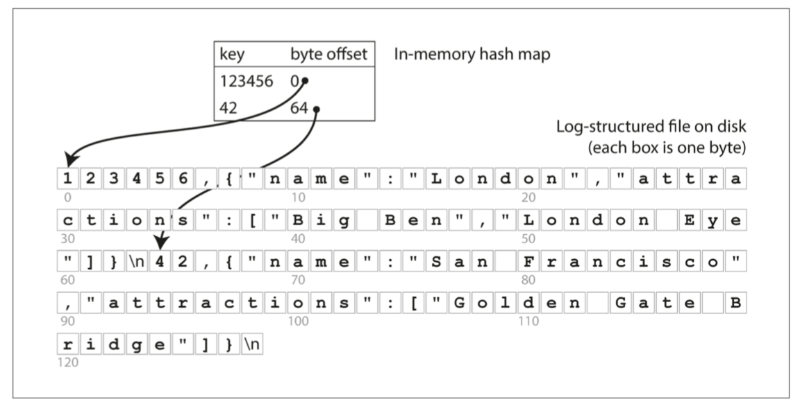
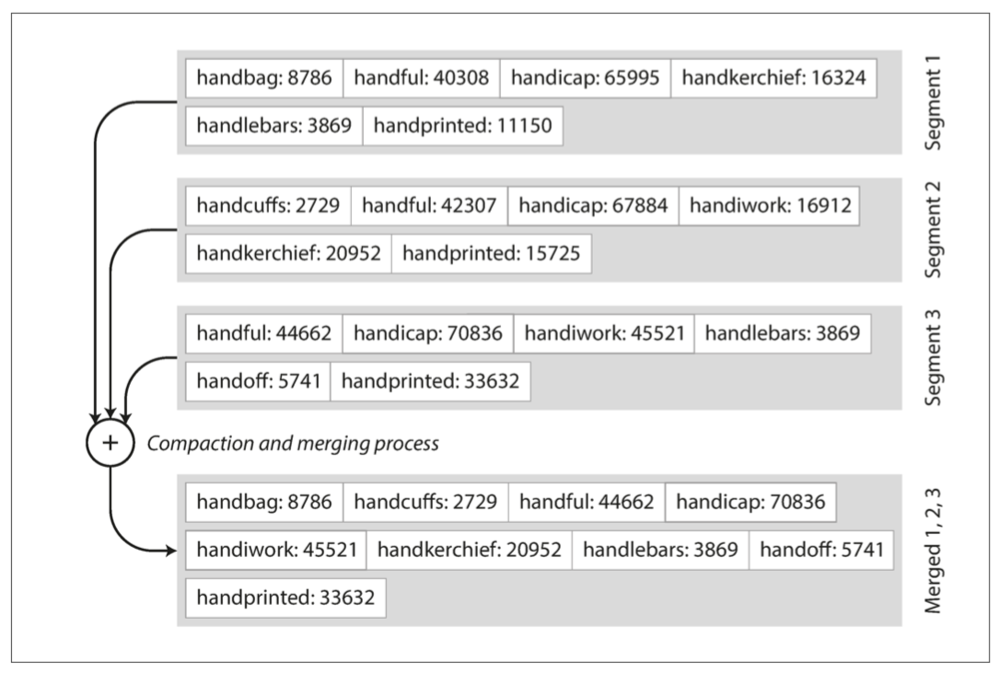
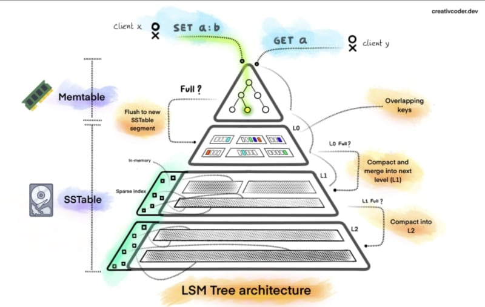
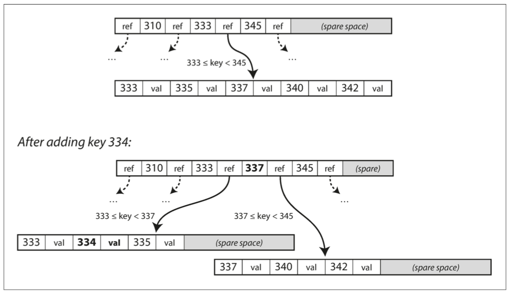
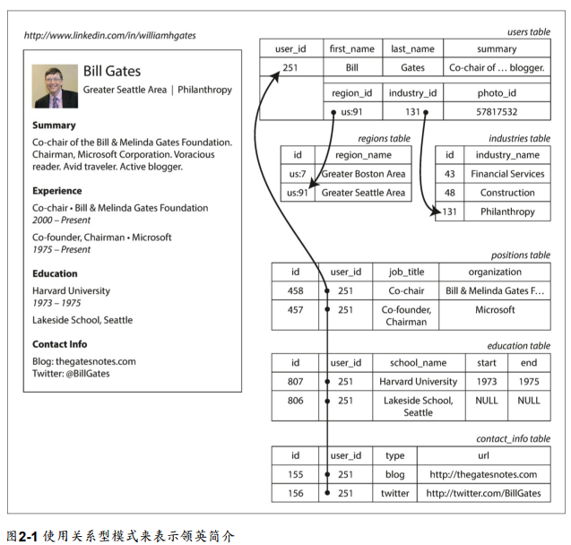
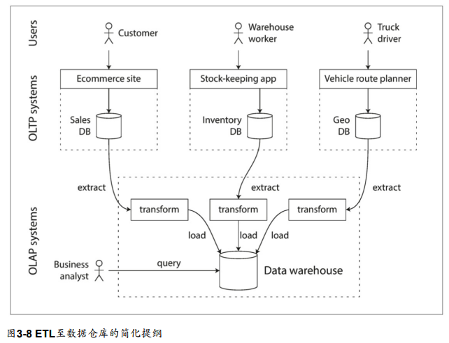
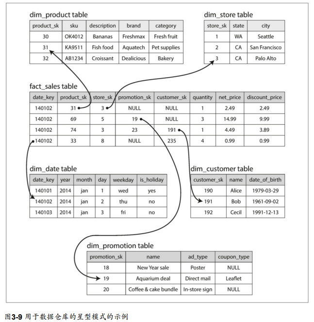
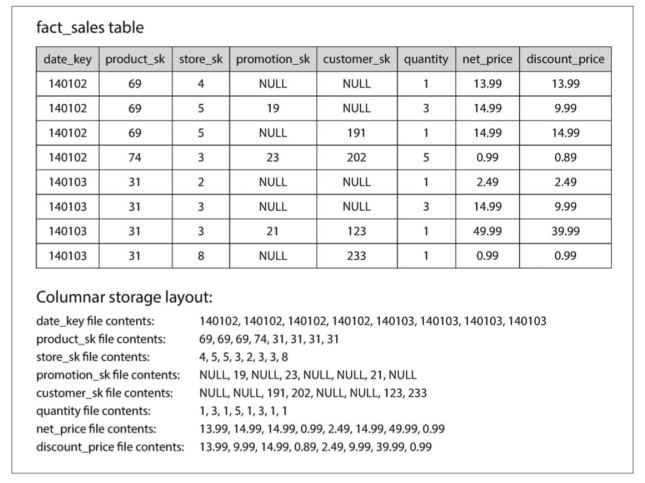
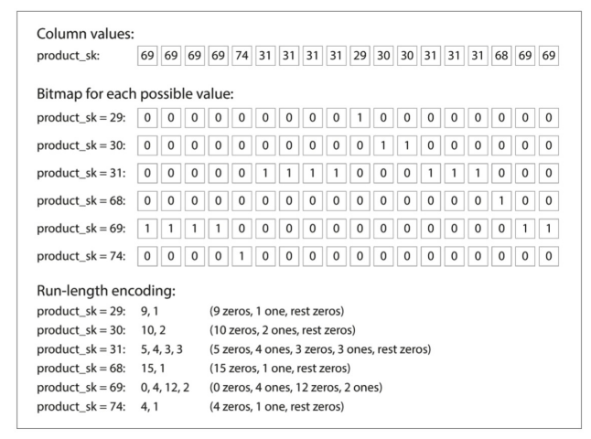
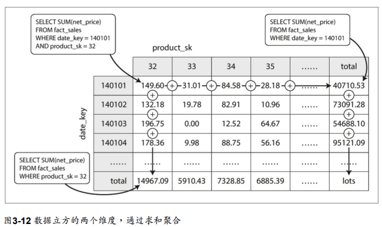

import Tabs from '@theme/Tabs';
import TabItem from '@theme/TabItem';


## OLTP & OLAP

* 負載的兩種類型
  * OLTP (Online Transactional Processing)
  * OLAP (Online Analytical Processing)

|                | OLTP                                         | OLAP                   |
| -------------- | -------------------------------------------- | ---------------------- |
| 主要的讀取模式 | 每次查詢少量紀錄，根據key來取得資料          | 聚合大量的紀錄         |
| 主要的寫入模式 | 隨機存取，從使用者輸入到寫入資料庫的延遲要低 | 大量匯入(ETL)或事件流  |
| 主要的使用者   | 終端使用者、客戶                             | 內部分析人員，支援決策 |
| 資料集大小     | GP ~ TB                                      | TP ~ PB                |


:::info Discussion
OLTP的負載需要具備ACID(原子性、一致性、隔離性和持久性)嗎？為什麼？
:::

## 簡易的OLTP資料庫

### 內容的存放

* Write: O(1)
* Read: O(N)
    * If key unique grantee: O(logN)

```shell
#!/bin/bash
db_set () {
  echo "$1,$2" >> simple.db # append only
}

db_get () {
  grep "^$1," simple.db | sed -e "s/^$1,//" | tail -n 1
}
```


### 分區 (Segment)

<Row>

<Col col={2}>

```shell title="Origin Segment"
123,AAA # deprecated
456,BBB # deprecated
789,CCC
456,DDD
123,EEE

# 123: EEE, 456: DDD, 789: CCC
```

</Col>

<Col col={2}>

```shell title="Compacted Segment"
789,CCC
456,DDD
123,EEE
```

</Col>
</Row>

:::info Discussion
所有的內容都放在同一個檔案會有什麼問題？
:::


:::info Discussion

<details>
  <summary>為什麼不在寫入資料時，直接更新該筆資料所在的列就好？而要採取append的做法？</summary>

  * 循序寫入操作能有較好的效能
    * 對SSD來說更顯著
  * 從崩潰回復變簡單
    * 因為append寫入的資料基本上是imuntable的
  * 避免資料碎片化

</details>

:::

### 索引 (Index)

* 以Hash索引為例
  * Write: O(1)
  * Read: O(1)



* 將每個key對應value的offset建立成in-memory的hash table作為索引
  * 每次寫入新資料時都更新記憶體內的索引
  * 範例DB：[Bitcask](https://github.com/basho/bitcask)
    * 所有的key需要能完整地放入memory
    * 連續寫入；隨機讀取
    * Value的大小比Key大很多的情境

### 真實世界的問題

* 存放檔案格式
  * Binary的格式存放資料會比CSV更快
* 刪除紀錄的處理
  * 在資料中追加特殊紀錄，用來標示該筆資料已經刪除
    * 又稱為tombstone
* 從崩潰回復
  * 如果索引只存在記憶體中，資料庫重啟會失去索引
    * 可以在啟動DB engine時讀取所有的segment在記憶體中重建index
    * Bitcask的做法，會在硬碟中存放每個segment的hash index的snapshot
* 不完整的寫入
  * 如果在寫入segment時發生崩潰，該如何處理？
  * Bitcask在寫入資料時會同時寫入checksum，可以用於檢出/復原資料損壞部分
    * [Hamming Code](https://zh.wikipedia.org/zh-tw/%E6%B1%89%E6%98%8E%E7%A0%81)
* 並行控制
  * 因為Segment是append-only的，因而是不可變的(immutable)
  * 是thread-safe的，允許被多個執行緒同時存取
* 索引的局限性
  * 雜湊索引需要全部放入記憶體中
    * 很大量的key無法使用
  * 如果把Hash map放進硬碟，要展現性能會變得更困難
    * 需要大量的Random Read I/O
  * 雜湊碰撞問題
  * 範圍查詢效率不高
    * 無法查詢key001~key999的所有keys
    * 只能一個一個key查找


## Log Structured 日誌結構引擎

* `Log` 指的是「被循序寫入的」紀錄
* 上一個小節的例子即是一個Log Structured engine的簡單範例

### SSTable (Sorted String Table)

* 進階的 Log Structured 儲存用資料結構
* 相較於上一節的例子，加了兩條規則
  * 寫入到檔案中的 `key` 要經過<span style={{color: 'red'}}>排序</span>
  * 每個 `key` 在同一個 Segment <span style={{color: 'red'}}>中只能出現一次</span>
    * 已經在 Segment compacting 過程中保證

#### SSTable的優勢 1 - 合併Segement的效率

* 只要在單個 Segment 的內容小於 Memory size
* 能維持高效的 Segment Merge
  * 相似於 [Merge Sort](https://en.wikipedia.org/wiki/Merge_sort)



#### SSTable的優勢 2 - 自帶索引能力

* 不需要在 Memory 中存放所有的 `key` 就能進行有效率的搜尋
  * 因 `key` 經過排序，理想情況下，可以達到 O(logN) 的搜尋效率
  * 類似 [Binary Search](https://en.wikipedia.org/wiki/Binary_search_algorithm)
* 因為每個 `key` 所存放的 `value` 大小並不是固定的，所以避不掉需要在特定的 key 範圍內 scan 的情境
  * 將這個索引放在 Memory 內以維持效率
  * 索引內保存部分的 `key` 的 offset
* 資料寫入硬碟前可以經過壓縮，再透過上述的 in-memory index 進行索引以減少I/O操作


:::info Discussion
SSTable看起來很不錯，但key需要保持順序的話，寫入時怎麼維持寫入的效率？

<details>
<summary>SSTable key的排序</summary>

* 利用「自我平衡樹」類型的資料結構
  * [紅黑樹](https://zh.wikipedia.org/zh-tw/%E7%BA%A2%E9%BB%91%E6%A0%91)。
  * [AVL Tree](https://zh.wikipedia.org/zh-tw/AVL%E6%A0%91)。

* 能以任意順序插入keys，並且以經過排序的順序讀取資料
  * Write: O(logN)
  * Read: O(logN)

</details>

:::

### LSM Tree (Log Structured Merge Tree)

* 為了提高寫入效能而設計的資料結構
* 資料寫入時會先放在 in-memory 的資料結構內，稱為memtable
  * 到達某個閥值才往硬碟寫入，以減少IO操作
* 定期對硬碟上的資料做壓縮和合併的操作
* 通常包含多層的資料結構，每一層都會比上一層大很多

Reference: [LSM Tree](https://dev.to/creativcoder/what-is-a-lsm-tree-3d75)



### 崩潰與回復

* 如果資料庫崩潰，資料還存在於 memtable 的資料會遺失
* 在硬碟上額外保存單獨的 `Log` ，每次進行寫入操作時對其進行Append寫入
  * 因為僅用在崩潰復原，只要在將memtable的資料寫入SSTable時，就可以刪除

### Log Strcutred 引擎的建構和維護

> 結合SSTable的儲存；LSM Tree的分層

* 寫入時，先寫入記憶體中的平衡樹資料結構
  * 作為I/O Buffer，直到大小超過某個閥值才對硬碟進行寫入 (通常為幾MB)
  * 即，memtable
* 寫入到硬碟時作為SSTable寫入
  * 因為在 memtable 中讀取出來是有順序的資料，寫入到硬碟時不需額外的排序操作


* 讀取時，先嘗試在 memtable 中尋找資料
  * 找得到就返回結果 (Memory O(logN))
  * 找不到再依序從硬碟中的 SSTable segment中尋找 (Disk O(logN))

* 背景不定時的進行 Segments 的合併與壓縮動作

### LSM Tree的性能問題

* 在「存取不存在的資料」時，效率會很慢
  * 要先查memtable
  * 再查第一層的Segments
  * 再查下一層的Segments
  * ...
* 需要 O(N)的操作

* 利用 [Bloom Filter 布隆過濾器](https://zh.wikipedia.org/zh-tw/%E5%B8%83%E9%9A%86%E8%BF%87%E6%BB%A4%E5%99%A8) 進行協助
  * Bloom filter 是一種 memory-efficient 的資料結構
  * 如果查詢結果表示資料不存在，那就一定不存在
  * 如果查詢結果說資料存在，並不能保證資料「真的」存在
  * 可以補足 LSM Tree 的缺點

### 小結

* Log structured 的引擎，有 Segment ，需要合併與壓縮
* 使用 in-memory 的自平衡樹作為 Buffer
* 額外在記憶體內維護 Hash based 的索引，用來保存「部分的」key 的offset以提升讀取效率
* 崩潰復原需要額外的，循序寫入的 `Log` 來維持
* 近代很多新興的資料庫，都是基於SSTable & LSMT 的結構
  * Google Bigtable
  * LevelDB
  * RocksDB
  * Cassendra
  * HBase
  * Lucene (Elasticsearch的底層)
* LSM Tree 型資料庫，讀寫操作的平均時間複雜度
  * Write:
    * Memtable: O(logN)
    * Disk: O(1)
  * Read:
    * O(logN)

## Page Oriented 分頁導向引擎

### B-Tree

* 在資料庫的領域，BTree是較成熟的索引實作
  * 1970年代就出現
  * 「傳統」DBMS使用的資料結構
    * MySQL, PostgreSQL, Oracle, SQL Server, MongoDB...etc.
* 將資料分成「固定大小」的 Page（或稱為Block）
  * Page 一般來說為4KB或更大
  * Page 連 Page，所形成的樹狀結構
  * 每次讀取或寫入都是以Page為單位
  * 對底層硬體設計更接近
    * 這也是傳統RDBMS在架設時，作業系統的Disk format要經過設計的主因
    * ext4為例， block可以介於 1~64KB


* BTree在寫入資料時，需要從 root 往下查詢找到該key所屬的Page，將value修改後整個page寫回硬碟
* 如果目標 Page 剩餘空間不足，需要進行「分支Branching」
  * 「分支」成兩個半滿的 Page，因此保證了BTree的平衡
    * 存放 `N` 筆紀錄的BTree，深度總是為 O(logN)
  * BTree型的資料庫在對「大量寫入請求」效率較低的主因



* 一個 Page 能夠擁有的 Child Page 數量稱為 Branching Factor
* 以 Page size 4KB，Branching Factor 500 的BTree來說，可以存放 256TB 的資料
* 因為會直接「更改Page」複寫原有的資料，對於並行控制要小心處理

### 崩潰與回復

* 在 BTree 的 Page 之間操作資料，若發生崩潰，會得到損壞的 BTree
* 跟LSM Tree 一樣，為了從崩潰中復原，需要在硬碟中寫入額外的資料結構
  * 預寫日誌 WAL (Write-ahead Log)
  * 又稱為re-do Log
  * 類似 Event sourcing 的做法，對寫入操作做紀錄


### BTree的最佳化

* B+ Tree
  * 為了節省空間，不儲存完整的key
  * 而只有存放key的縮短版本
  * 大部分 BTree 型的資料庫，所實際使用的資料結構
* 對於 range search 的效率不好
  * 因為需要查每個對應的leaf pages
  * 實作上，嘗試將leaf pages放在硬碟上相鄰的位置，可以減緩影響
  * 除了child page的ref之外，額外添加指標到樹中
    * 兄弟的Page之間查找的效率會變好，提升循序查詢的效能


## B-Tree 和 LSM Tree 的比較

|              | BTree                            | LSM Tree                                                 |
| ------------ | -------------------------------- | -------------------------------------------------------- |
| Read         | O(logN)                          | O(logN)                                                  |
| Write        | O(logN)                          | O(logN)                                                  |
| 寫入額外開銷 | WAL + Tree + 可能需要分支操作    | 壓縮與合併造成的寫入放大                                 |
| 優勢         | Transation實作較簡單、有更好的讀取效能 | 循序寫入能維持更高的寫入吞吐量、空間利用率高，壓縮得更好 |

## 其他索引結構

** 次索引 ** 也很常見



如圖，可能在user_id行上有一個次索引，這樣就可以在每個表中找到所有屬於同一使用者的資料列。

### 在索引中儲存值

- 索引中的key是查詢所有搜尋的東西，但是value可以是:
  - 實際的列
  - 其他地方的列參照
    - 儲存列的位置稱為堆積檔(heap file)

### 多行索引

- 組合索引(concatenated index)
  - (lastname, firstname)
  - 二維位置轉為單一數字當做索引
  - (red, green, blue)
  - (date, temperature)

### 全文檢索和模糊索引

- 目前索引都是假設已有明確資料，可以查詢一個key對應的明確值。無法搜尋相似的key，這種**模糊(fuzzy)**查詢需要不同的技術。

- 例如，[Lucene](https://lucene.apache.org/)
  - Lucene是支持全文檢索和搜尋的開放原始碼程式庫。
  - 能在一定的編輯距離內搜尋文本中的單字
    - 編輯距離為1表示已經添加、刪除或替換了一個字母

### 將所有的東西存放在記憶體

- SSD成本較RAM低許多，且資料是持久化的
- 當RAM便宜，datasets小，是有可能將資料庫保留在記憶體中
  - 記憶體資料庫(in-memory database)
    - ex: key-value store的[Memcached](https://zh.wikipedia.org/zh-tw/Memcached)，主要用做快取
  - 部份in-memory database有特殊硬體，可以實現資料持久性
  - 當in-memory database重啟時，需要透過一個資料副本，重新載入它的狀態

## 交易處理還是分析處理？

- 線上交易處理(Online Transaction Processing)
- 線上分析處理(Online Analytic Processing)

:::info
交易不一定要具有ACID(原子性、一致性、隔離性和持久性)屬性。交易處理(transaction processing)僅僅意味著可以讓客戶端進行低延遲的讀寫，而分批次處理(batch processing)作業，後者只會定期運行(例如每天一次)。我們將在第7章討論ACID的性質，在第10章討論批次處理。

---

原子性(Atomicity):一個事務（transaction）中的所有操作，或者全部完成，或者全部不完成，不會結束在中間某個環節。事務在執行過程中發生錯誤，會被回滾（Rollback）到事務開始前的狀態，就像這個事務從來沒有執行過一樣。即，事務不可分割

一致性(Consistency):在事務開始之前和事務結束以後，資料庫的完整性沒有被破壞。這表示寫入的資料必須完全符合所有的預設約束、觸發器、級聯回滾等

事務隔離(Isolation):資料庫允許多個並發事務同時對其數據進行讀寫和修改的能力，隔離性可以防止多個事務並發執行時由於交叉執行而導致數據的不一致。事務隔離分為不同級別，包括未提交讀（Read uncommitted）、提交讀（read committed）、可重複讀（repeatable read）和串行化（Serializable）

持久性(Durability):事務處理結束後，對數據的修改就是永久的，即便系統故障也不會丟失
:::

| 屬性 | 交易處理系統(OLTP) | 分析系統(OLAP) |
| --- | ---------------- | ------------- |
| 主要的讀取模式 | 每次查詢少量記錄，根據key來取得資料 | 聚合大量的記錄 |
| 主要的寫入模式 | 隨機存取，從使用者輸入到寫入資料庫的延遲低 | 大量匯入(ETL)或事件流 |
| 主要使用者 | 終端使用者/客戶，透過web應用 | 內部份析人員，支援決策 |
| 資料意含 | 資料的最新狀態(當前時刻) | 過往發生的事件歷史 |
| 資料集大小 | GB ~ TB | TB ~ PB |

### 資料倉儲

- ETL (extract, transform, load)
- 

### OLTP資料庫和資料倉儲之間的差異

- 因SQL適合分析查詢，資料倉儲常提供SQL的介面。
  - OLTP也常具有SQL查詢介面，此特性相似
- 但兩者系統內部針對迥然不同的查詢模式進行最佳化。

## 星狀與雪花:用於分析的基模

- 
- 以一個**事實表(fact table)**為中心

## 行式儲存(column-oriented storage)



- fact table的欄位數量通常超過100個，但通常每一次只會存取4、5個欄位

:::info
行式儲存在relational data model中是最容易理解的，不過它也同樣適用於非關聯資料。例如，Parquet是一種支援document data model的行儲存格式，它是基於Google的Dremel。
:::

### 行壓縮



:::info 行式儲存及欄族
Cassandra和HBase有一個稱為欄族(column families)的概念，源於Google Bigtable。但是，將它們稱作是column-oriented的話恐怕就有誤會了:在每個欄族中，它們將一列中的所有行連同一個row key一起儲存起來，而且它們也不使用行壓縮。因此，Bigtable模型主要仍是row-oriented的。
:::

#### 記憶體頻寬與向量化處理

- 行式儲存
  - 減少了需要從磁碟載入的資料量
  - 可將壓縮過的行資料放到CPU L1快取，進行單純回圈的迭代運算。
  - 可以用AND / OR直接操作這些資料塊。稱為**向量化處理(vectorized processing)**

### 行儲存中的排序

- 在行式儲存中
  - 列的存放順序並不重要
  - 單獨對某一列做排序是沒有意義的
  - 依據經常存取的欄位進行排序，可提升效能
  - 排序後有助於壓縮

#### 幾種不同的排序順序

不同的查詢受益於不同的排序順序。

### 行式儲存的寫操作

- 行式儲存，提高了、壓縮和排序都有助於提高查詢的讀取速度。但也增加寫入難度。
- 行式儲存中，每插入一筆資料，就要更新所有的行檔案
- 可參考LSM-tree進行寫的操作。
  - 所有寫操作進入in-memory store，添加到排序的結構中
  - 累積足夠的寫入時，與磁碟的行檔進行合伴，批次寫入新檔

## 聚合:資料方體與實體化視圖



行式儲存對於分析查詢，效率更佳。
但針對相同的SQL查詢組合，如SUM, COUNT, AVG...
每次都要處理原始資料會造成浪費。
故創建一種快取稱做**實體化視圖(Materialized View)**

圖例為一個**資料方體(data cube)**，挑選date及product兩個維度，針對總和進行一種快取。

## 小結

- 儲存引擎分兩大類
  - OLTP (Online Transaction Processing)
  - 資料倉儲及類似的分析系統

- OLTP的兩種流派
  - 日誌結構派
    - SSTables (Sorted String Tables)
    - LSM-Tree (Log-Structured Merge-Tree)
  - 原地更新派
    - B-Tree

- 更複雜的索引結構
  - 多行索引
  - 全文檢索和模糊索引

- 使用行式儲存來降低磁碟讀取的資料量