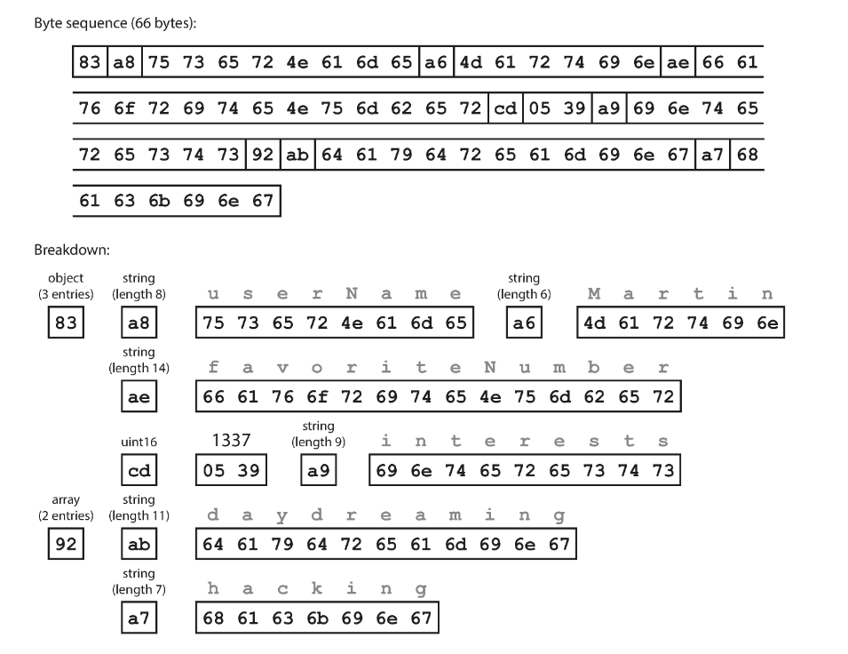

import Tabs from '@theme/Tabs';
import TabItem from '@theme/TabItem';

## 如何更新軟體

* 伺服器端: 滾動升級
* 客戶端: 使用者自己決定時機
* 資料庫
  * 在 NoSQL 中，可以同時接受新舊資料格式
  * 在關聯式資料庫中，任何時間點只有一個 schema 有效

### 相容性

**回朔相容 (Backward compatibility)**
  較新的程式碼可以讀取由舊程式碼所寫入的資料 <-- 比較簡單

**向前相容 (Forward compatibility)**
  較舊的程式碼可以讀取由新程式碼所寫入的資料 <-- 預測未來

## 資料編碼格式

程式至少使用兩種表示資料的格式:
1. 在記憶體中
  * object
  * struct
  * list
  * array
  * hash table
  * tree
2. 不在記憶體中，例如檔案、網路傳輸，必須是某種 self-contained 的位元組序列
  * JSON
  * XML
  * CSV

在這兩種之間轉換的動作稱之為編碼 (encoding, serialization, marshalling) 和解碼 (decoding, deserialization, unmarshalling) 。

### JSON, XML, CSV 的缺陷

* XML 和 CSV 無法區分字串和數字
* JSON 無法區分整數和浮點數，也無法指定精度，固定使用 IEEE 754
* JSON 和 XML 不支援二進位字串 (CSV 可以？)
* XML 和 JSON 可以定義 schema，而 CSV 不行

:::info Base64 編碼
Base64 編碼將二進位資料轉為字串，但是會增加約 33% 的大小
:::

:::info JSON 使用 IEEE 754 的限制
在某個應用場景，需要儲存精準到奈秒的時間戳，但 IEEE 754 的最大整數範圍到 2^53 -1，完全存不下，只好使用字串表示
* 2^53 - 1
  * 9,007,199,254,740,991
* current epoch time in nano second
  * 1,713,578,589,000,000,000
:::

### 二進位編碼

犧牲了可讀性，換取更短的編碼長度及更快的解碼速度。

以此 JSON 文件用於後續的二進位編碼對照範例
```JSON
{
    "userName": "Martin",
    "favoriteNumber": 1337,
    "interests": ["daydreaming", "hacking"]
}
```

| Format                 | Developer                 | Size in bytes | Extra schema |
| ---------------------- | ------------------------- | ------------- | ------------ |
| JSON (without spaces)  | JavaScript (2001)         | 81            | No           |
| MessagePack            | Sadayuki Furuhashi (2008) | 66 (81%)      | No           |
| Thrift BinaryProtocol  | Facebook (2007)           | 59 (72%)      | Yes          |
| Thrift CompactProtocol | Facebook (2007)           | 34 (41%)      | Yes          |
| Protocol Buffers       | Google (2008)             | 33 (40%)      | Yes          |
| Avro                   | Apache Hadoop (2009)      | 32 (39%)      | Yes          |

<Tabs>

<TabItem value="MessagePack" default>

省略了特殊符號 `{` `}` `[` `]` `"` `,`，取而代之的在每個欄位前面用 1 個 byte 表示型態和長度。

另外，把數字轉成 16 進位也稍微縮短了長度 (1337 在 10 進位用 4 bytes，在 16 進位只用 2 bytes) 。



</TabItem>

<TabItem value="Thrift BinaryProtocol">

用額外的程式碼定義欄位型態跟名稱，編碼之後只留下欄位編號和內容。

```
struct Person {
  1: required string userName,
  2: optional i64 favoriteNumber,
  3: optional list<string> interests
}
```


:::info Discussion
既然有欄位編號了，為什麼還需要型態呢？
:::

</TabItem>

<TabItem value="Thrift CompactProtocol">

把欄位編號跟型態塞進 1 個 byte，再使用「可變長度整數」的方式，縮短整數佔用的的空間。

:::info 可變長度整數
每個 byte 的最高位元用來指示是否還有更多的 byte 接續在後面
:::


</TabItem>

<TabItem value="Protocol Buffers">

簡稱為 Protobuf，也需要定義自己的 schema。

概念上跟 Thrift 的 CompactProtocol 差不多，差別在於一些位元打包上的順序。

```
message Person {
  required string user_name = 1;
  optional int64 favorite_number = 2;
  repeated string interests = 3;
}
```


</TabItem>

<TabItem value="Avro">

專門為 Hadoop 開發的資料格式，因為當時 Thrift 和 Protobuf 被認為不符使用情境。

Avro 定義了兩種 schema，分別是適合人工編輯的 Avro IDL (Interface Description Language) 和適合機器讀取的 JSON 格式。

Avro IDL:

```
record Person {
  string userName;
  union { null, long } favoriteNumber = null;
  array<string> interests;
}
```

等價的 JSON 格式寫法:

```
{
  "type": "record",
  "name": "Person",
  "fields": [
    {"name": "userName", "type": "string"},
    {"name": "favoriteNumber", "type": ["null", "long"], "default": null},
    {"name": "interests", "type": {"type": "array", "items": "string"}}
  ]
}
```

由於沒有定義欄位編號，讀取的時候只能按照定義的順序讀取。

在傳送一個大檔案的時候，會在檔案開頭附上所使用的 schema，讓讀取方知道所包含的欄位及順序。


:::info Discussion
對於 Avro 格式，如果傳送方跟接收方手上的 schema 不一樣怎麼辦？

<details>
  <summary>Answer</summary>
  <p>當兩者所使用的 schema 不完全相同，將無法完整解碼該二進位資料。</p>
  <p>使用欄位名稱來做對應，即使順序不同，相同的欄位名稱就視為同樣的欄位，對於沒出現的欄位，則以預設值填補。</p>
</details>

:::

:::info Discussion
為什麼 Avro 不使用欄位編號？

<details>
  <summary>Answer</summary>
  <p>更利於動態產生 schema，不需要擔心相同的欄位編號對應到不同欄位造成錯誤</p>
</details>

:::

</TabItem>

</Tabs>

### Schema 演化時的相容性

* 新增和刪除的欄位必須是**選填**的，否則舊版 schema 會無法讀取 (無法回朔相容)
* 不可以刪除必填欄位，而且該**欄位編號**不能再被其他欄位使用

## ~~Dataflow 模式~~ 資料傳輸模式

### 透過資料庫

#### 常見的情況

* 只有一個存取資料庫的程式，而讀取方式同一隻程式的較新版，可以看作「向未來的自己發送訊息」
* 多個不同的程式同時存取資料庫，有些程式版本較新，有些則較舊。例如，系統正在進行滾動升級
  * 舊版程式可能會不小心丟失新版程式寫入的資料

#### 歸檔儲存

對資料庫做快照 (snapshot) 時，或許會將其存入存儲服務 (AWS S3) 或資料倉儲 (data warehouse)
* 使用 Avro 將檔案格式放在此快照的開頭處是個好選擇，使其自我描述 (self contained)
* 將資料編碼成行式儲存 (column based) 的好機會，如 Parquet 格式，更容易用在資料分析上

### 透過網路服務: REST 和 RPC

* REST: 基於 HTTP 的一種設計哲學
* SOAP: 使用一種基於 XML 的語言 WSDL (Web Services Description Language) 來描述其 API
  * WSDL 產生的 SOAP 訊息通常複雜到難以靠手動產生，也很難閱讀，因此漸漸的不受大眾喜愛
* RPC (Remote Call Procedure): 試圖使向遠端網路服務發出請求，就像在同一程式中呼叫函數一樣 (稱為位置透明性，localtion transparency)
  * 網路請求是不可預測的，當請求逾時的時候，沒辦法確認到底執行了沒
    * 若函數具有冪等性 (idempotence) ，那就可以發出多次請求，而不用擔心引發額外的問題
  * 呼叫本地函數時，可以直接傳遞參數的參照 (指標) ，而如果是透過網路傳輸，問題就複雜的多

### 透過非同步訊息

雙方透過一種稱為訊息代理 (message broker) 的中介軟體來溝通，也稱為訊息佇列 (message queue) 或是訊息導向的中介軟體 (message-oriented middleware) 。

* 當接收方離線或是超載時，可以當作緩衝區，提高系統的可靠性
* 自動將訊息重發到之前發生崩潰的程式，防止訊息遺失
* 發送方不需要知道接收方的資訊 (IP, 實作等等) ，降低耦合
* 一條訊息可以發送給多個接收方
* 訊息內容可以使用任何的編碼格式，只是要記得思考回朔與向前相容

## 小結

* 在滾動升級期間，必須假設不同節點上正執行著不同版本的程式，因此必須保證在系統內傳輸的資料以回朔相容和向前相容的方式進行編碼
  * 回朔相容: 新程式可以讀舊資料
  * 向前相容: 舊程式可以讀新資料

* 資料編碼格式
  * JSON, XML, CSV 很常見也好使用，但是有其限制
  * Thrift, Protobuf, Avro 能以定義的 schema 完成緊湊、高效率的編碼，但在解碼前毫無可讀性

* 資料傳輸模式
  * 資料庫: 寫入資料庫的程式負責編碼，讀取資料庫的程式複雜解碼
  * REST API 和 RPC: 客戶端將請求編碼，伺服器端將請求解碼後處理，再將回應編碼，客戶端收到後再解碼
  * 非同步訊息: 發送方編碼訊息，由接收方解碼

:::info
只要用心，系統一定可以實現回朔/向前相容！
:::


