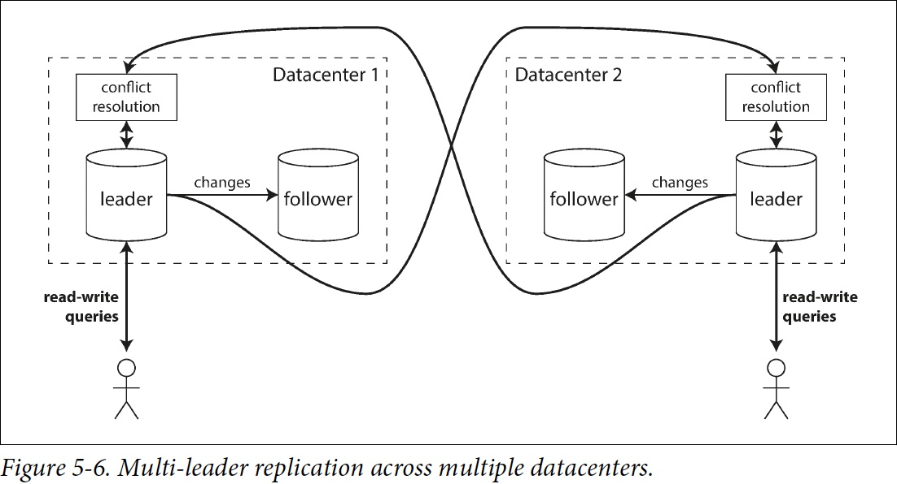
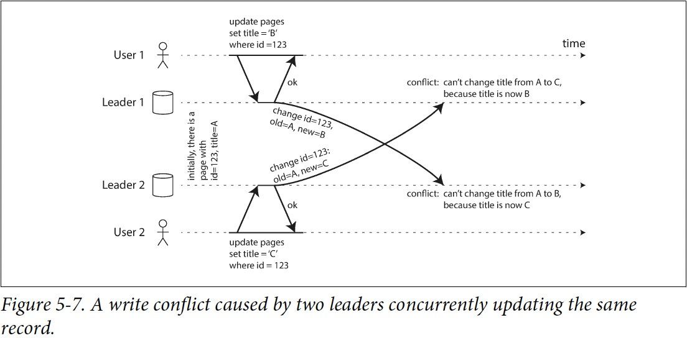
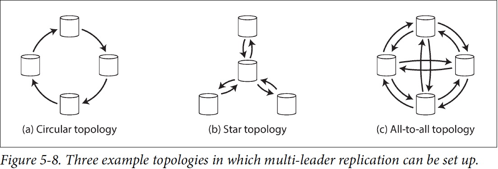
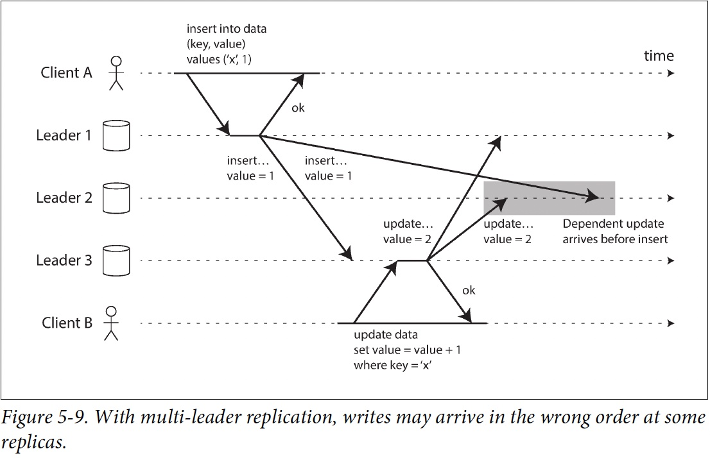

# 第二部分: 分散式資料系統

第一部分是儲存資料的時所應該考慮的各種面向，第二部分討論：如果資料儲存和檢索涉及到多台機器，會怎麼樣？

考慮使用多台機器的時機:
- Scalability
- Fault tolerance/High availability
- Latency

### Scaling to Higher Load

#### Scaling up vs. Scaling out
- Scaling up 又被稱為 vertical scaling
    - Share memory 限制: 很貴，容錯不好，就算提供熱插拔的 disk, memory，地理上也一定會有限制
    - Share disk 限制: race condition 時會有 lock 開銷

- shared-nothing architecture，又被稱為 horizontal scaling 或稱為 scaling out
    - 執行資料庫軟體的每臺機器 / 虛擬機器都稱為 節點（node）。每個節點只使用各自的處理器，記憶體和磁碟。節點之間的任何協調，都是在軟體層面使用傳統網路實現的。
    - 第二部分主要都在討論無共享架構所會產生的問題以及權衡

### Replication vs. Partition
資料分佈在多個節點上有兩種常見的方式：

- Replication

在幾個不同的節點上儲存資料的相同副本，可能放在不同的位置。Replication 提供了冗餘：如果一些節點不可用，剩餘的節點仍然可以提供資料服務。Replication 也有助於改善效能。第五章將討論 Replication。

- Partitioning

將一個大型資料庫拆分成較小的子集（稱為 分割槽，即 partitions），從而不同的分割槽可以指派給不同的 節點（nodes，亦稱 分片，即 sharding）。第六章將討論Partitioning。

複製和分割槽是不同的機制，但它們經常同時使用。如下圖所示。

一個 Database 切分為兩個 Partition，每個 Partition 都有兩個 Replication

理解了這些概念，就可以開始討論在分散式系統中需要做出的困難抉擇。第七章 將討論 事務（Transaction），這對於瞭解資料系統中可能出現的各種問題，以及我們可以做些什麼很有幫助。第八章 和 第九章 將討論分散式系統的根本侷限性。

# Chapter 5 Replication

The major difference between a thing that might go wrong and a thing that cannot possibly
go wrong is that when a thing that cannot possibly go wrong goes wrong it usually turns out
to be impossible to get at or repair. —Douglas Adams, Mostly Harmless (1992)

Replication 意味著在透過網路連線的多臺機器上保留相同資料的副本
- To keep data geographically close to your users (and thus reduce latency)
- To allow the system to continue working even if some of its parts have failed (and thus increase availability)
- To scale out the number of machines that can serve read queries (and thus increase read throughput)

## Overview
- Single Leader replication
    - Sync vs. Async Replication
    - Leader / Follower failure handling
        - Follower failure: catch-up recovery
        - Lead failure: Failover
    - Replication log and its implementation
        - Statement-based replication
        - Write-ahead log(WAL) shipping
        - Logical (row-based) log replication
        - Trigger-based replication
    - Solution of Replication Lags
        - Reading Your Own Writes
        - Monotonic Reads
        - Consistent Prefix Reads
        - Solutions for Replication Lag

- Multi Leader replication
    - Client offline edit / collaborative editing
    - Conflict detection / avoidance / resolve
    - Conflict definition
    - Multi-leader topology

## Leader and Follower

這種複製模式是許多關係資料庫的內建功能，如 PostgreSQL（從 9.0 版本開始）、MySQL、Oracle Data Guard 和 SQL Server 的 AlwaysOn Availability Groups。它也被用於一些 Nonrelational DB，包括 MongoDB。最後，基於領導者的複製並不僅限於資料庫：像 Kafka和 RabbitMQ high available queues 這樣的分散式message brokers 也使用它。某些網路檔案系統，例如 DRBD 這樣的replicated block devices也與之類似。
## Sync vs. Async Replication

**Special case:**
[Chain Replication](https://www.cs.cornell.edu/home/rvr/papers/OSDI04.pdf)
(used in Azure Storage and Amazon EBS)

## Setting Up New Followers
簡單地將資料檔案從一個節點複製到另一個節點通常是不夠的：因為客戶端會不斷向資料庫寫入資料

可以透過 Lock 資料庫來使磁碟上的檔案保持一致(像銀行系統) ，但是這會違背高可用的目標。

好險設定新 Follower 通常並不需要停機：

1. Take a consistent snapshot of the leader's database
2. Copy snapshot to follower
3. 從 follower 連線到 leader，並拉取快照之後發生的所有資料變更。這要求快照與leader replication log 中的位置精確關聯。PostgreSQL 將其稱為 log sequence number，MySQL 將其稱為 binlog coordinates。

當 follower 處理完快照之後積累的資料變更，我們就說它 caught up 了

建立follower的實際步驟因資料庫而異。有可能手動或自動或者一些神秘的工作流程

## Follower failure: Catch-up recovery
每個 Follower 在 disk 上記錄從 Leader 收到的資料變更。如果 Follower 壞掉重新啟動或斷網，則 Follower 可以從日誌中知道在發生故障之前處理的最後一個Transaction。之後 Follower 可以連線到 Leader，並請求在壞掉期間發生的所有資料變更。

## Leader failure: Failover
其中一個 Follower 要被 promote 為新的 Leader，需要重新配置客戶端，以將它們的寫操作傳送給新的 Leader，其他 Follower 需要開始拉取來自新 Leader 的資料變更。這個過程被稱為 failover

failover可以手動或自動。自動的failover步驟：

1. 確認 Leader 失效。有很多事情可能會出錯：崩潰、停電、網路問題等等。沒有萬無一失的方法，所以大多數系統只是簡單使用Timeout：節點頻繁地相互來回傳遞訊息，如果一個節點在一段時間內（例如 30 秒）沒有響應，就認為它掛了
2. 選擇一個新的 Leader 。這可以透過選舉過程（ Leader 由剩餘副本以多數選舉產生）來完成(需要共識演算法)。
3. 重新配置系統以啟用新的 Leader。客戶端現在需要將它們的寫請求傳送給新 Leader。如果舊 Leader 恢復，可能仍然認為自己是 Leader ，而沒有意識到其他副本已經讓它失去領導權了。系統需要確保舊 Leader 意識到新 Leader 的存在，併成為一個 Follower 。

故障切換的過程中有很多地方可能出錯：

- 如果使用非同步複製，則新 Leader 可能沒有收到老 Leader 宕機前最後的寫入操作。在選出新 Leader 後，如果老 Leader 重新加入叢集，又該如何處理這些老 Leader 尚未複製的寫入？在此期間，新 Leader 可能已經收到了與老 Leader 尚未複製的寫入相沖突的寫入。最常見的解決方案是簡單丟棄老 Leader 未複製的寫入，這很可能打破客戶對於資料永續性的期望。

- 如果資料庫需要和其他外部儲存相協調，那麼丟棄寫入內容是極其危險的操作。例如在 GitHub 【13】的一場事故中，一個過時的 MySQL  Follower 被提升為 Leader 。資料庫使用自增 ID 作為主鍵，因為新 Leader 的計數器落後於老 Leader 的計數器，所以新 Leader 重新分配了一些已經被老 Leader 分配掉的 ID 作為主鍵。這些主鍵也在 Redis 中使用，主鍵重用使得 MySQL 和 Redis 中的資料產生不一致，最後導致一些私有資料洩漏到錯誤的使用者手中。

- 發生某些故障時（見 第八章）可能會出現兩個節點都以為自己是 Leader 的情況。這種情況稱為 腦裂（split brain），非常危險：如果兩個 Leader 都可以接受寫操作，卻沒有衝突解決機制（請參閱 “多主複製”），那麼資料就可能丟失或損壞。一些系統採取了安全防範措施：當檢測到兩個 Leader 節點同時存在時會關閉其中一個節點 2，但設計粗糙的機制可能最後會導致兩個節點都被關閉【14】。

 Leader 被宣告死亡之前的正確超時應該怎麼配置？在 Leader 失效的情況下，超時時間越長意味著恢復時間也越長。但是如果超時設定太短，又可能會出現不必要的故障切換。例如，臨時的負載峰值可能導致節點的響應時間增加到超出超時時間，或者網路故障也可能導致資料包延遲。如果系統已經處於高負載或網路問題的困擾之中，那麼不必要的故障切換可能會讓情況變得更糟糕。

