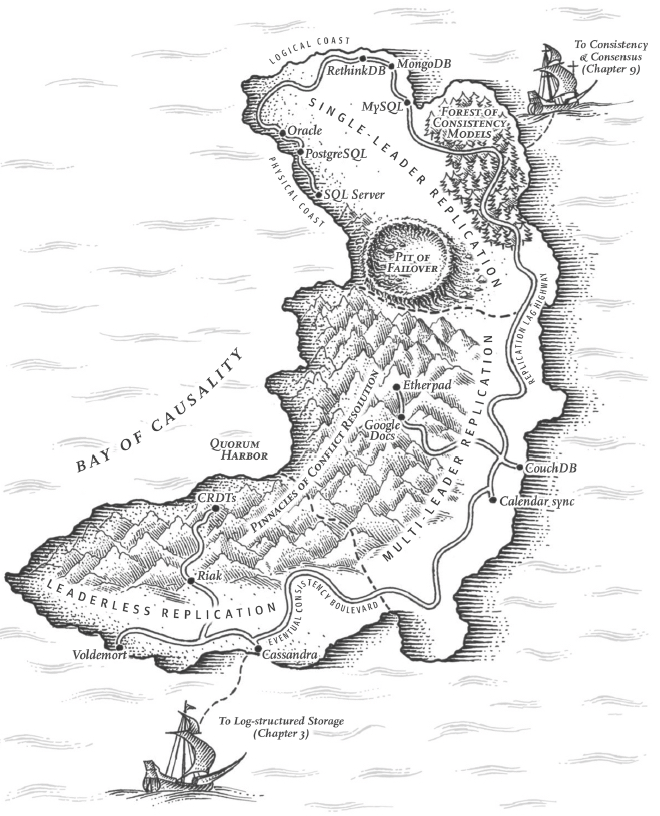
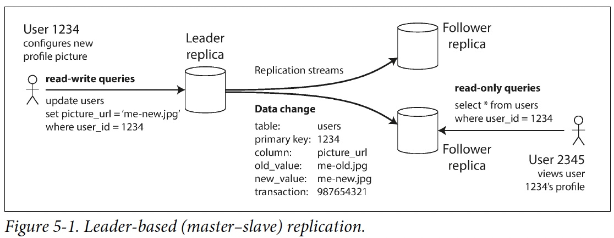
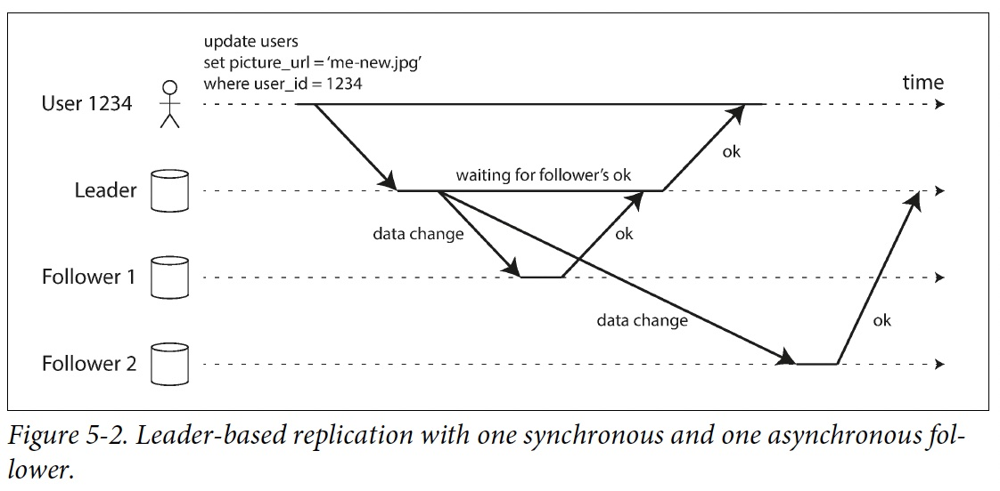
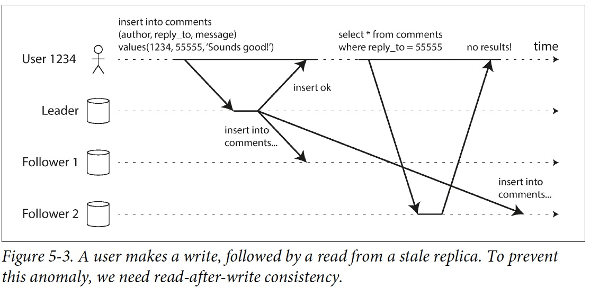
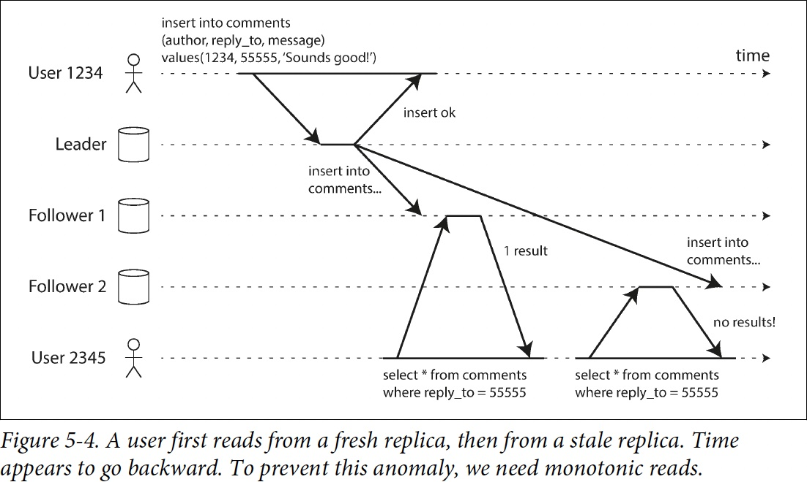
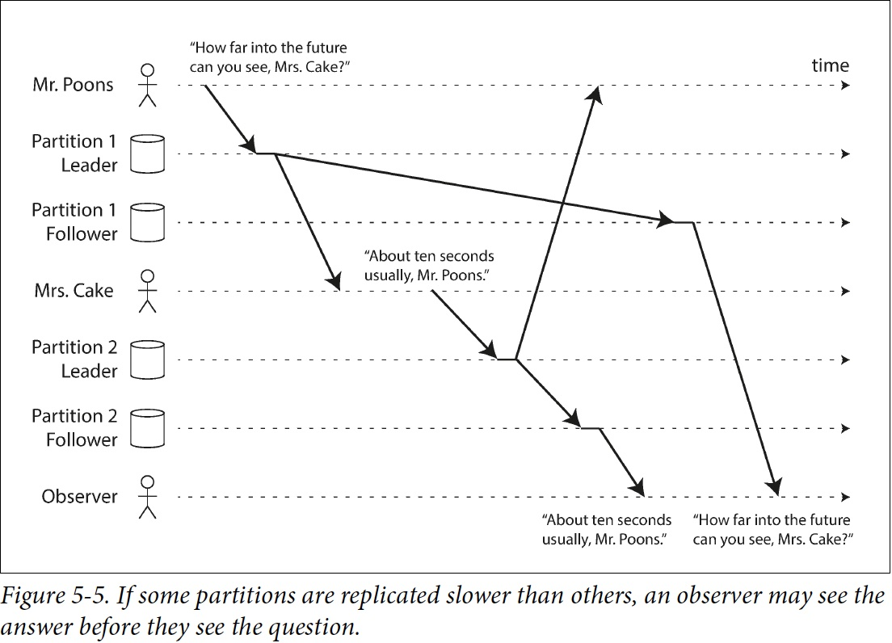
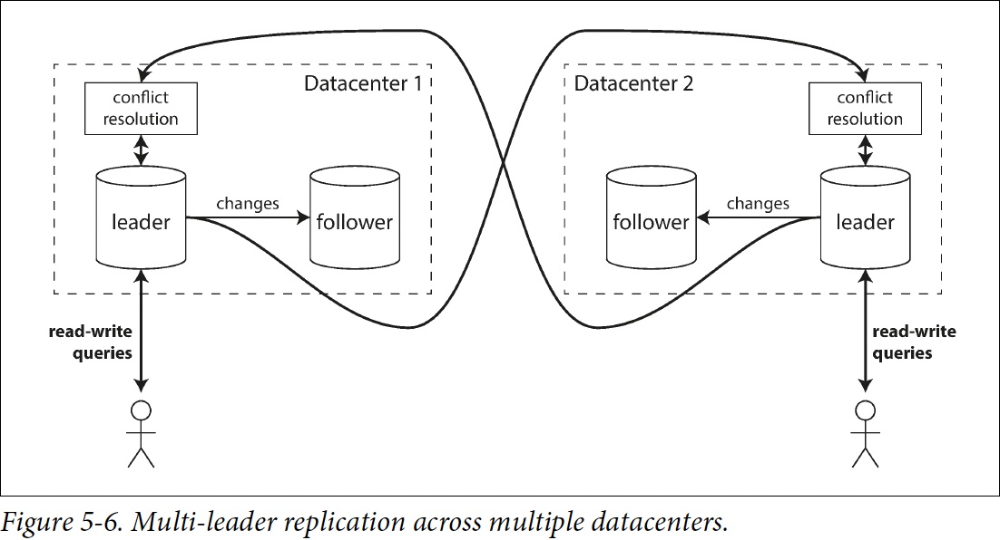
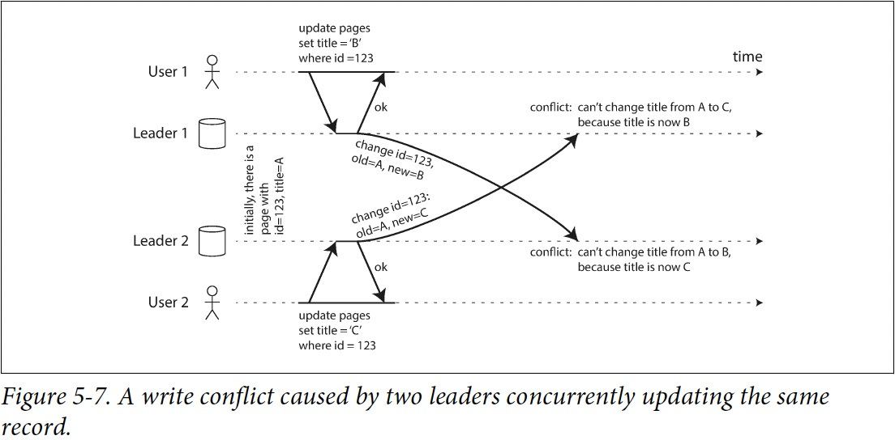
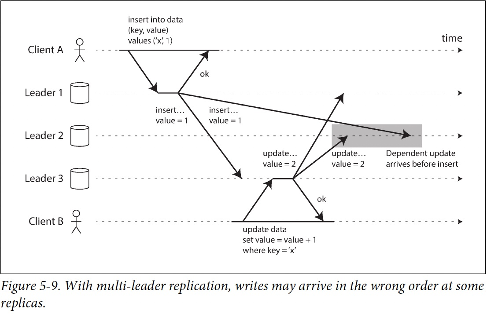

# 第二部分: 分散式資料系統

第一部分是儲存資料的時所應該考慮的各種面向，第二部分討論：如果資料儲存和檢索涉及到多台機器，會怎麼樣？

考慮使用多台機器的時機:
- Scalability
- Fault tolerance/High availability
- Latency

### Scaling to Higher Load

#### Scaling up vs. Scaling out
- Scaling up 又被稱為 vertical scaling
    - Share memory 限制: 很貴，容錯不好，就算提供熱插拔的 disk, memory，地理上也一定會有限制
    - Share disk 限制: race condition 時會有 lock 開銷

- shared-nothing architecture，又被稱為 horizontal scaling 或稱為 scaling out
    - 執行資料庫軟體的每臺機器 / 虛擬機器都稱為 節點（node）。每個節點只使用各自的處理器，記憶體和磁碟。節點之間的任何協調，都是在軟體層面使用傳統網路實現的。
    - 第二部分主要都在討論無共享架構所會產生的問題以及權衡

### Replication vs. Partition
資料分佈在多個節點上有兩種常見的方式：

- Replication

在幾個不同的節點上儲存資料的相同副本，可能放在不同的位置。Replication 提供了冗餘：如果一些節點不可用，剩餘的節點仍然可以提供資料服務。Replication 也有助於改善效能。第五章將討論 Replication。

- Partitioning

將一個大型資料庫拆分成較小的子集（稱為 分割槽，即 partitions），從而不同的分割槽可以指派給不同的 節點（nodes，亦稱 分片，即 sharding）。第六章將討論Partitioning。

複製和分割槽是不同的機制，但它們經常同時使用。如下圖所示。

一個 Database 切分為兩個 Partition，每個 Partition 都有兩個 Replication

理解了這些概念，就可以開始討論在分散式系統中需要做出的困難抉擇。第七章 將討論 事務（Transaction），這對於瞭解資料系統中可能出現的各種問題，以及我們可以做些什麼很有幫助。第八章 和 第九章 將討論分散式系統的根本侷限性。

# Chapter 5 Replication

The major difference between a thing that might go wrong and a thing that cannot possibly
go wrong is that when a thing that cannot possibly go wrong goes wrong it usually turns out
to be impossible to get at or repair. —Douglas Adams, Mostly Harmless (1992)

Replication 意味著在透過網路連線的多臺機器上保留相同資料的副本
- To keep data geographically close to your users (and thus reduce latency)
- To allow the system to continue working even if some of its parts have failed (and thus increase availability)
- To scale out the number of machines that can serve read queries (and thus increase read throughput)

## Overview
- Single Leader replication
    - Sync vs. Async Replication
    - Leader / Follower failure handling
        - Follower failure: catch-up recovery
        - Lead failure: Failover
    - Replication log and its implementation
        - Statement-based replication
        - Write-ahead log(WAL) shipping
        - Logical (row-based) log replication
        - Trigger-based replication
    - Replication Lag Problems and Solution
        - Reading Your Own Writes
        - Monotonic Reads
        - Consistent Prefix Reads
        - Solutions for Replication Lag

- Multi Leader replication
    - Client offline edit / collaborative editing
    - Conflict detection / avoidance / resolve
    - Conflict definition
    - Multi-leader topology

## Leader and Follower

這種複製模式是許多關係資料庫的內建功能，如 PostgreSQL（從 9.0 版本開始）、MySQL、Oracle Data Guard 和 SQL Server 的 AlwaysOn Availability Groups。它也被用於一些 Nonrelational DB，包括 MongoDB。最後，基於領導者的複製並不僅限於資料庫：像 Kafka和 RabbitMQ high available queues 這樣的分散式message brokers 也使用它。某些網路檔案系統，例如 DRBD 這樣的replicated block devices也與之類似。
### Sync vs. Async Replication

**Special case:**
[Chain Replication](https://www.cs.cornell.edu/home/rvr/papers/OSDI04.pdf)
(used in Azure Storage and Amazon EBS)

### Setting Up New Followers
簡單地將資料檔案從一個節點複製到另一個節點通常是不夠的：因為客戶端會不斷向資料庫寫入資料

可以透過 Lock 資料庫來使磁碟上的檔案保持一致(像銀行系統) ，但是這會違背高可用的目標。

好險設定新 Follower 通常並不需要停機：

1. Take a consistent snapshot of the leader's database
2. Copy snapshot to follower
3. 從 follower 連線到 leader，並拉取快照之後發生的所有資料變更。這要求快照與leader replication log 中的位置精確關聯。PostgreSQL 將其稱為 log sequence number，MySQL 將其稱為 binlog coordinates。

當 follower 處理完快照之後積累的資料變更，我們就說它 caught up 了

建立follower的實際步驟因資料庫而異。有可能手動或自動或者一些神秘的工作流程

### Follower failure: Catch-up recovery
每個 Follower 在 disk 上記錄從 Leader 收到的資料變更。如果 Follower 壞掉重新啟動或斷網，則 Follower 可以從日誌中知道在發生故障之前處理的最後一個Transaction。之後 Follower 可以連線到 Leader，並請求在壞掉期間發生的所有資料變更。

### Leader failure: Failover
其中一個 Follower 要被 promote 為新的 Leader，需要重新配置客戶端，以將它們的寫操作傳送給新的 Leader，其他 Follower 需要開始拉取來自新 Leader 的資料變更。這個過程被稱為 failover

failover可以手動或自動。自動的failover步驟：

1. 確認 Leader 失效。有很多事情可能會出錯：崩潰、停電、網路問題等等。沒有萬無一失的方法，所以大多數系統只是簡單使用Timeout
2. 選擇一個新的 Leader 。這可以透過選舉過程（ Leader 由剩餘 Follower 以多數選舉產生）來完成(需要共識演算法)。
3. 重新配置系統以啟用新的 Leader。客戶端現在需要將它們的寫請求傳送給新 Leader。如果舊 Leader 恢復，可能仍然認為自己是 Leader ，而沒有意識到其他副本已經讓它失去領導權了。系統需要確保舊 Leader 意識到新 Leader 的存在，併成為一個 Follower 。

故障切換的過程中有很多地方可能出錯：

- 新 Leader 沒有收到老 Leader 掛掉前最後的寫入操作。
- 如果資料庫需要和其他外部儲存相協調，那麼丟棄寫入內容是極其危險的操作。 Example: 例如在 GitHub 的一場事故中，一個過時的 MySQL Follower 被提升為Leader。資料庫使用自增 ID 作為Primary，因為新Leader的計數器落後於老Leader的計數器，所以新Leader重新分配了一些已經被老Leader分配掉的 ID 作為主鍵。這些主鍵也在 Redis 中使用，主鍵重用使得 MySQL 和 Redis 中的資料產生不一致，最後導致一些私有資料洩漏到錯誤的使用者手中。
- Split brain
- 如何知道 Leader 是真的掛掉了，如果只是Spike，反而會加重負擔

### Implementation of Replication Logs
#### :thumbsdown: Statement-based replication
複製每個 statement 到 follower 執行，像 SQL statement，但是很多情況會導致 replication 壞掉
1. nondeterministic function, such as NOW() or RAND() is likely to generate a different value on each replica.
2. If statements depend on the existing data in the database (e.g., UPDATE ... WHERE ...),  must be executed in exactly the same order on each replica
3. side effects (e.g., triggers, stored procedures, user-defined functions)

#### :thumbsdown: Write-ahead log (WAL) shipping
usually every write to a database is appended to a log
- In SSTables and LSM-Trees, WAL is the main place for storage. Log segments are compacted in the background.
- In B-tree, every modification is first written to a WAL so that the index can be restored to a consistent state after a crash.

好處：WAL 包含了所有資料庫寫入的append-only sequence of bytes。可以使用完全相同的日誌在另一個節點上構建一模一樣的 replica

缺點：非常底層，無法看懂，跟storage engine耦合，換版本或換storage engine可能會有downtime

#### :thumbsup: Logical (row-based) log replication
不綁定storage engine，可以只儲存作replication所需要的必要資訊，也適合發給外部系統作客製化索引或data warehouse
logical log  is usually at the granularity of a row:
- For an inserted row, the log contains the new values of all columns.
- For a deleted row, the log contains enough information to uniquely identify the
row that was deleted. Typically this would be the primary key, but if there is no
primary key on the table, the old values of all columns need to be logged.
- For an updated row, the log contains enough information to uniquely identify
the updated row, and the new values of all columns (or at least the new values of
all columns that changed).

Ref:
- https://www.postgresql.org/docs/current/logical-replication.html
- https://dev.mysql.com/doc/refman/8.0/en/replication.html

### :neutral_face: Trigger-based replication

客製化工具，只需複製自己指定範圍的資料，或者在自己想要的時間trigger

For Example:
- [Oracle GoldenGate](https://www.oracle.com/integration/goldengate/)
- Store procedure
- triggers

## Problems with Replication Lag
Leader-based replication 適合用在多讀少寫的情況，可以分散讀取的工作負載，但就會遇到必須使用Async Replication所產生的Lag問題

Term: Eventual consistency

### Read Your Own Writes

Read-your-writes (Read-after-write) consistency: 當使用者重新載入頁面，重新整理時，確保一定看到自己剛剛提交的更新，但不保證看到其他使用者的最新更新
#### Solutions:
- 如果是讀自己寫的東西，從 leader 讀，否則從 follower 讀. e.g., twitter, teams
- 可以根據物件的last updated time，然後再參考 follower latency，來決定幾分鐘以內更新的資料去 leader 讀取，
- 紀錄使用者最後一次執行寫入的時間，如果follower不夠新，就去找其他可能比較新的follower，但這很依靠時間同步
- 如果Replica在不同的data center 會增加複雜性

如果是跨裝置，像電腦跟手機要確保能即時看到另一邊的update，這種的 read-your-writes consistency就有更多要考慮的地方
- 紀錄使用者timestamp不可行，因為裝置不同
- 網路不同，要確保這些device使用到同一個leader

**Monotonic Read**

monotonic reads 可以保證這種異常不會發生。這是一個比 強一致性（strong consistency） 更弱，但比 最終一致性（eventual consistency） 更強的保證。當讀取資料時，你可能會看到一箇舊值；單調讀僅意味著如果一個使用者順序地進行多次讀取，則他們不會看到時間回退，也就是說，如果已經讀取到較新的資料，後續的讀取不會得到更舊的資料。

實現方法：每次同一個follower讀，可以用hash uid來指定follower

### Consistent Prefix Reads

consistent prefix reads: This guarantee says that if a sequence of writes happens in a certain order,
then anyone reading those writes will see them appear in the same order.

一種解決方案是保證資料都寫到相同的partition，但可能沒有效率，後續有一些演算法論討論關於這種因果關係(causality)的問題

### Solutions for Replication Lag
在使用最終一致的系統時，如果複製延遲增加到幾分鐘甚至幾小時，則應該考慮應用程式的行為。如果答案是 “沒問題”，那很好。但如果結果對於使用者來說是不好的體驗，那麼設計系統來提供更強的保證是很重要的。明明是非同步複製卻假設複製是同步的，這是很多麻煩的根源。

但在應用程式程式碼中處理這些問題是複雜的，容易出錯。

如果應用程式開發人員不必擔心微妙的複製問題，並可以信賴他們的資料庫 “做了正確的事情”，那該多好呀。這就是 transaction 存在的原因：資料庫透過事務提供強大的保證，所以應用程式可以更加簡單。

## Multi-Leader Replication
Leader-based replication has one major downside: there is only one leader, and all
writes must go through it.

Multi-leader allow more than one node to accept writes.

multi-leader (also known as master–master or active/active replication).
### Use Cases for Multi-Leader Replication
在單個數據中心內部使用多個Leader的配置沒有太大意義，因為其導致的複雜性已經超過了能帶來的好處。但在一些情況下，這種配置也是合理的。

#### Multi-datacenter operation

接下來比較多資料中心情況下，single-leader跟multi-leader的適應情況

|   |  Single-leader | Multi-leader |
|---|---|---|
| Performance | 每個寫入都要跨region寫入到Leader所在的datacenter，違反了使用多datacenter的目的| 直接寫入到最近的datacenter，再replicate到其他datacenter|
| Tolerance of datacenter outages | Failover 把其他datacenter的follower提升成 Leader | 其他datacenter leader正常執行，壞掉的datacenter後來再catch-up|
| Tolerance of network problems | 跨Datacenter的網路通常要經過public internet會很不穩定| 通常會比跨datacenter傳輸穩定|

各資料庫多使用外部工具來支援
- Tungsten Replicator for MySQL
- BDR for PostgreSQL
- GoldenGate for Oracle

雖然multi-leader有很多好處，但有一個大缺點：相同資料可能在不同datacenters同時被修改，必須要解conflict
由於多主複製在許多資料庫中都屬於改裝的功能，所以常常存在微妙的配置缺陷，且經常與其他資料庫功能之間出現意外的反應。
比如
- autoincrementing keys
- triggers
- integrity constraint

等都可能會有麻煩。因此，多主複製往往被認為是危險的領域，應儘可能避免

#### Clients with offline operation
Example: Calendar, notion
每個device就像一個datacenter

#### Collaborative editing
Example: Google doc, Wiki

### Handling Write Conflicts

#### Synchronous versus asynchronous conflict detection
基本上不可能用sync conflict detection，那你乾脆用single-leader

#### Conflict avoidance
如果能保證某些特定寫入只會到同個Leader，這樣就沒有conflict了
舉例像某些客戶永遠只寫入特定的Leader，對單一個客戶來說，他只有single-leader
但客戶有可能會出國，這時候就有可能要換datacenter

#### Converging toward a consistent state
讓conflict 收斂到一個值
- 給每個write一個unique ID (e.g., timestamp, UUID, hash value)，值比較高的獲勝，如果使用timestamp，這種方法叫做 last write win (LWW)，雖然LWW很流行，但有可能會造成data loss
- 給每個replica一個ID, 高的贏，一樣有可能有data loss
- 把值merge或concat起來 (e.g., B/C)
- 通通寫進去，讀出來的時候讓user做選擇

#### Custom conflict resolution logic
- On Write: 偵測到conflict，trigger conflict handler，讓用戶自己寫邏輯去解 (e.g., [Bucardo](https://bucardo.org/Bucardo/operations/conflict_handling))
- On Read: all the conflicting writes are stored. When the data is read, app resolve the conflict, and write the result back to the database. CouchDB works this way.

#### Automatic Conflict Resolution
- Conflict-free replicated datatypes (CRDTs)
    - https://zh.wikipedia.org/zh-tw/%E6%97%A0%E5%86%B2%E7%AA%81%E5%A4%8D%E5%88%B6%E6%95%B0%E6%8D%AE%E7%B1%BB%E5%9E%8B
    - https://redis.io/active-active/
- Mergeable persistent data structures
- Operational transformation
    - https://en.wikipedia.org/wiki/Operational_transformation

什麼是conflict這件事會在Transaction那張深刻討論

### Multi-Leader Replication Topologies

The most general topology is all-to-all.
MySQL by default supports only a circular topology

problem of causality

conflict detection techniques are poorly implemented in many multi-leader
replication systems. For example, PostgreSQL BDR does not
provide causal ordering of writes, and Tungsten Replicator for MySQL doesn’t
even try to detect conflicts [34].

If you are using a system with multi-leader replication, it is worth being aware of
these issues, carefully reading the documentation, and thoroughly testing your database
to ensure that it really does provide the guarantees you believe it to have.

