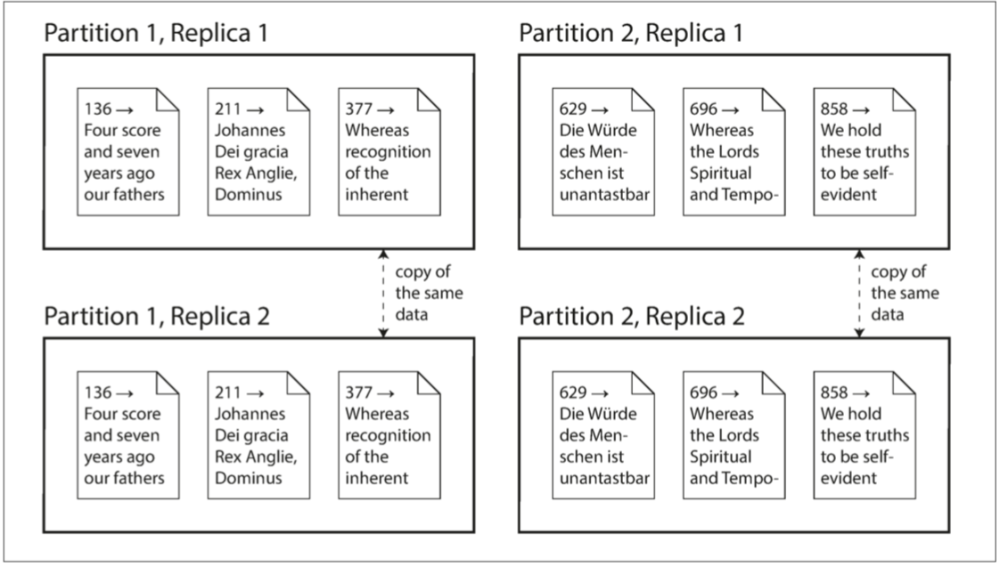

# 第二部分: 分散式資料系統

第一部分是儲存資料的時所應該考慮的各種面向，第二部分討論：如果資料儲存和檢索涉及到多台機器，會怎麼樣？

考慮使用多台機器的時機:
* Scalability
* Fault tolerance/High availability
* Latency

### Scaling to Higher Load

#### Scaling up vs. Scaling out
* Scaling up 又被稱為 vertical scaling
    * Share memory限制: 很貴，容錯不好，就算提供熱插拔的disk, memory，地理上也一定會有限制
    * Share disk限制: race condition時會有lock開銷

* shared-nothing architecture，又被稱為horizontal scaling 或稱為 scaling out
    * 執行資料庫軟體的每臺機器 / 虛擬機器都稱為 節點（node）。每個節點只使用各自的處理器，記憶體和磁碟。節點之間的任何協調，都是在軟體層面使用傳統網路實現的。
    * 第二部分主要都在討論無共享架構所會產生的問題以及權衡

### Replication vs. Partition
資料分佈在多個節點上有兩種常見的方式：

* Replication

在幾個不同的節點上儲存資料的相同副本，可能放在不同的位置。Replication提供了冗餘：如果一些節點不可用，剩餘的節點仍然可以提供資料服務。複製也有助於改善效能。第五章 將討論Replication。

* Partitioning

將一個大型資料庫拆分成較小的子集（稱為 分割槽，即 partitions），從而不同的分割槽可以指派給不同的 節點（nodes，亦稱 分片，即 sharding）。第六章 將討論Partitioning。

複製和分割槽是不同的機制，但它們經常同時使用。如下圖所示。

一個Database切分為兩個Partition，每個Partition都有兩個Replication

理解了這些概念，就可以開始討論在分散式系統中需要做出的困難抉擇。第七章 將討論 事務（Transaction），這對於瞭解資料系統中可能出現的各種問題，以及我們可以做些什麼很有幫助。第八章 和 第九章 將討論分散式系統的根本侷限性。

# Chapter 5 Replication

大綱
- Single Leader replication
    - Sync vs. Async Replication
    - Leader / Follower failure handling
        - Follower failure: catch-up recovery
        - Lead failure: Failover
    - Replication log and its implementation
        - Statement-based replication
        - Write-ahead log(WAL) shipping
        - Logical (row-based) log replication
        - Trigger-based replication
    - Solution of Replication Lags
        - Reading Your Own Writes
        - Monotonic Reads
        - Consistent Prefix Reads
        - Solutions for Replication Lag