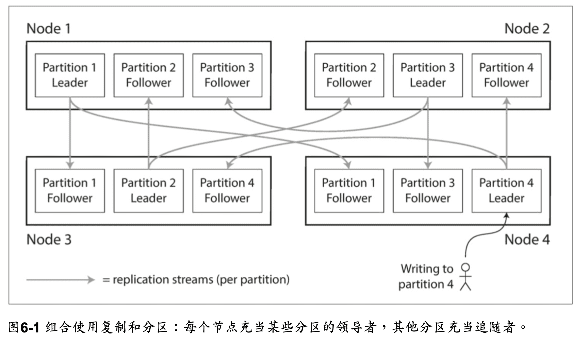
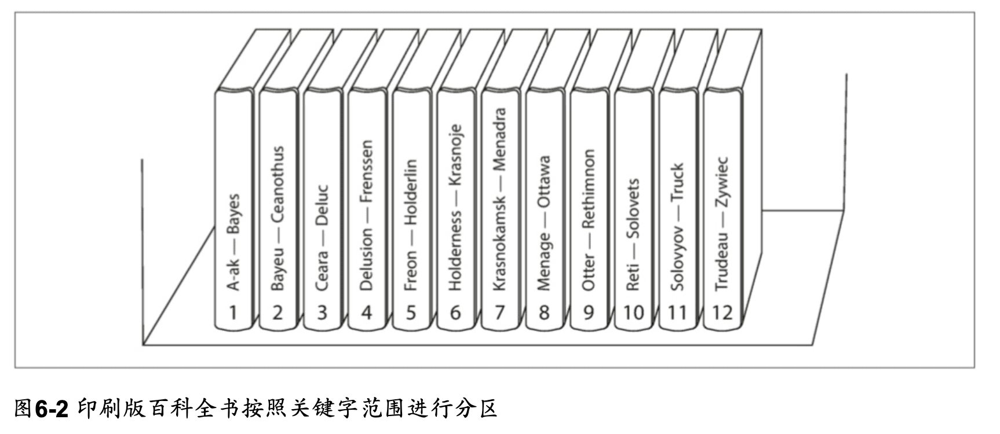
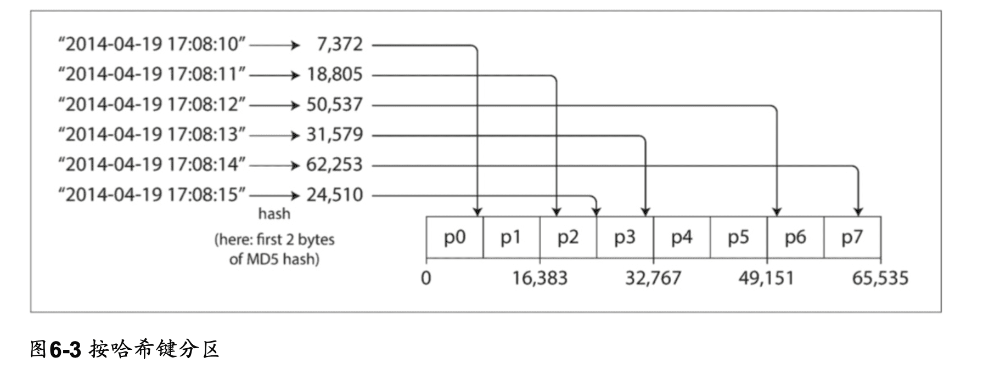
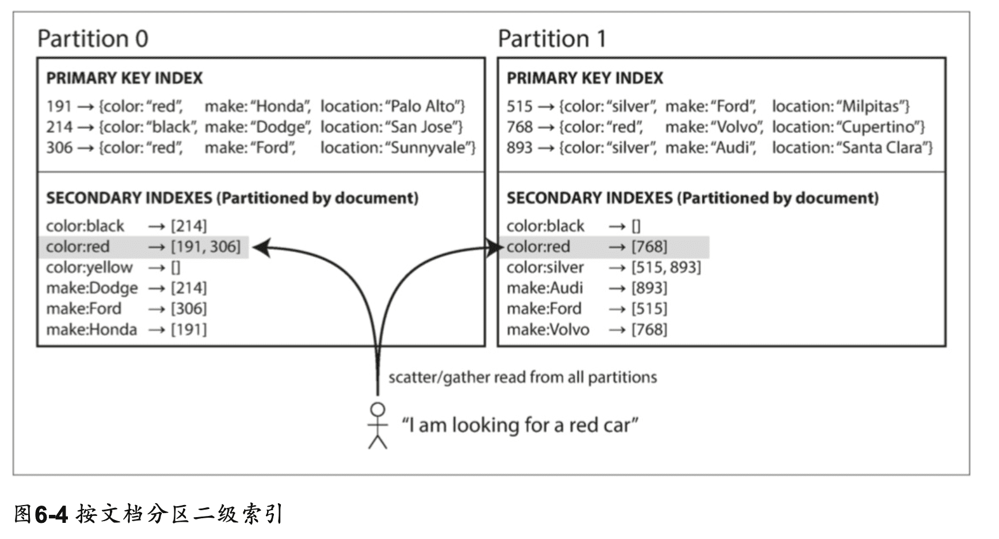
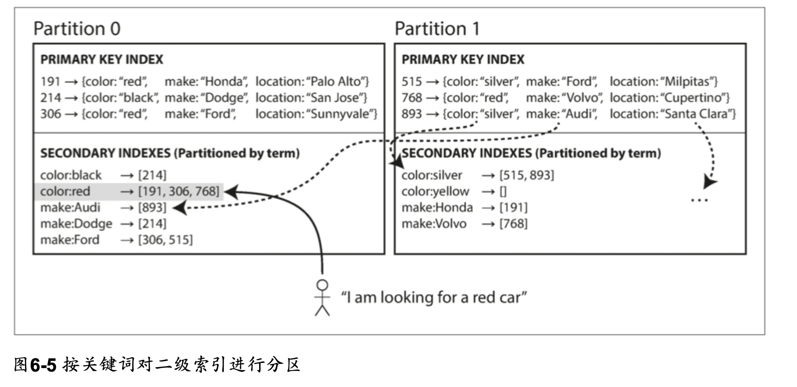
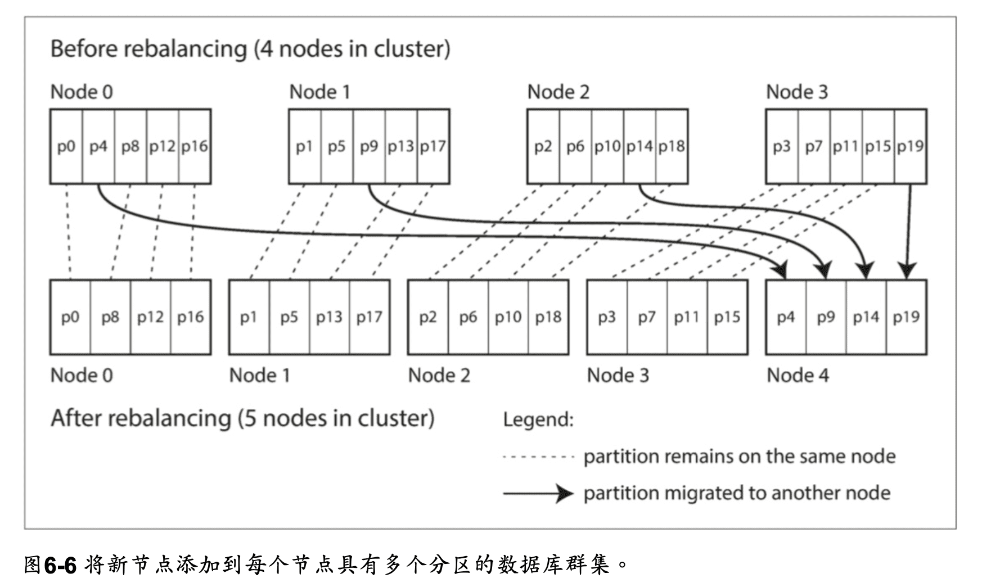
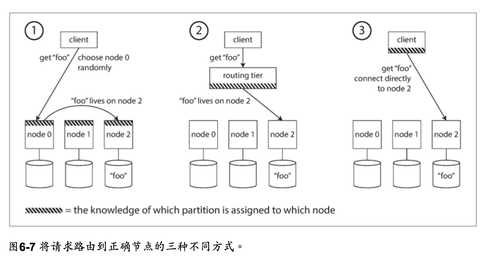
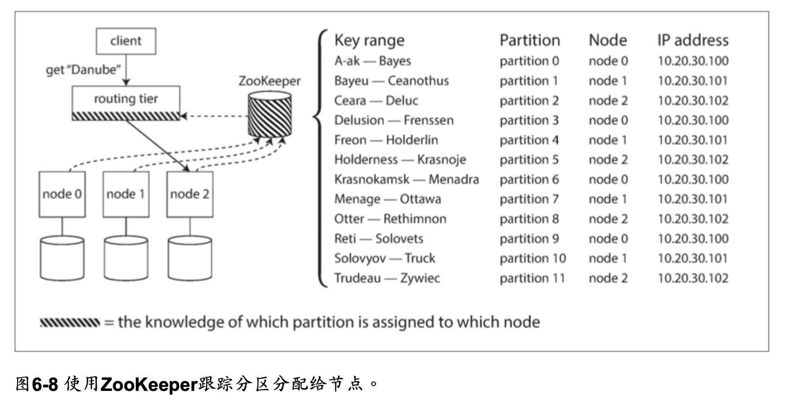

分區又稱 partition or sharding，將大型數據庫分解成小型數據庫的方式。

- MongoDB, Elasticsearch, Solr Cloud - shard
- HBase - Region
- Bigtable - tablet
- Cassandra, Riak - vnode
- Couchbase - vBucket

分區的特性:

- 可擴展性
- 資料可以分佈在不共享集群的不同節點上
- 查詢負載可以分佈在不同節點上

本章分塊:

- 索引與分區
- 重新平衡分區
- 數據庫如何將請求路由到正確的分區並執行查詢

## 分區與複製

分區被複製到多個節點，並採取主從複製模型，每個節點可能是某些 分區的領導者，同時是其他分區的追隨者，
以提供容錯性。

### 鍵值數據的分區

分區的理想下，查詢負載會平均分佈在所有節點上，而不是集中在少數節點上。
但現實情況是，數據集中或是常被使用在某個分區(hot spot)，對整體而言是偏斜的(skew)。
假如讓數據平均分配到不同的節點，解決偏斜的問題，但要讀取數據時，需要並行查詢所有節點，增加了查詢的成本。
為了可以快速找到資料，儲存資料時可以使用鍵值的方式建立建立數據庫，通過主鍵查詢，可以直接定位到正確的節點。
ex: 百科全書目錄

#### 根據鍵得範圍分區

- 每個分區有鍵範圍，鍵是有序的，範圍內的鍵值都屬於這個分區，可以輕易知道資料在哪個分區內進而搜尋。
- 為了均勻分配數據，分區邊界需要依據數據調整，分區邊界可以由管理員手動選擇，也可以由數據庫自動選擇。
- 容易進行範圍掃描，會去範圍內多個相關紀錄。
- 主鍵太單一的話容易造成熱點。 ex: 如果都搜尋今天的數據，會造成熱點，需要改用其他資料作為主鍵。

#### 根據鍵的散列分區

- 使用散列函數來給鍵值分配分區，這樣可以均勻分配數據到不同的節點。ex: Fowler-Noll-Vo
- 失去範圍查詢的能力。

> 許多語言內建的 hash function 並不適合作為函數，因為同個輸入可能不會有相同的 hash 值。

相關的服務:

- Riak
- Couchbase
- Voldemort
- Cassandra 可以使用複合主鍵健行範圍掃描。

##### 負載傾斜與消除熱點

雖然散列分區可以均勻分配數據，但是有可能會有熱點問題。ex: 名人的 user Id。
因為 hash 之後的值是相同的，書中的方法是在主鍵加上兩位數的隨機數，這樣可以讓數據分散到不同的節點，但還需要但還需要額外工作合併結果。

## 分片與次級索引

次級索引通常並不能唯 一地標識記錄，而是一種搜索記錄中出現特定值的方式。
尋找用戶 123 的所有操作，查找包含 hogwash 的所有文章，尋找所有顏色為紅色的車輛等等。
次級索引的問題是它們不能整齊地映射到分區(?)。有兩種用次級索引對數據庫進行分區的方法:

- 基於文檔的分區(document-based)
- 基於關鍵詞(term-based)的分區

相關的服務:

- Riak
- Solr
- Elasticsearch

### 按文檔的次級索引

範例中，一個二手車網站使用 ID 作文檔的分區，但是次級索引是根據車輛的顏色。
想要查找紅色的車輛，需要先查詢次級索引，找到所有紅色車輛的 ID，再去主索引查詢詳細資料。
因為只需要處理 ID 的分區，文檔分區又稱本地索引(local index)。

由於資料分散在各個分區，所以需要查詢各個分區並合併結果(scatter/gather)，所以次級索引的成本是昂貴的，而且尾部延遲也會增加。

相關的服務:

- MongoDB
- Riak
- Cassandra
- Elasticsearch
- SolrCloud
- VoltDB

### 根據關鍵值的次級索引

相較於文檔索引(本地索引)在每個分區建立屬於自己的次級索引，關鍵值索引 term-partitioned(全局索引)橫跨所有分區建立全局的次級索引。
範例中，所有紅色車子的 ID 都在 Partition 0，製造商的名字也依照自首，分類在不同分區。

- 範圍掃描
- 因為對關鍵詞進行 hash 分區，所以提供附載均衡。
- 讀取比起文檔索引更快。
- 寫入速度較慢，因為需要更新全局索引。

#### 分區再平衡

隨著時間的推移，數據庫會有各種變化。

- 查詢吞吐量增加，所以您想要添加更多的 CPU 來處理負載。
- 數據集大小增加，所以您想添加更多的磁盤和 RAM 來存儲它。
- 機器出現故障，其他機器需要接管故障機器的責任。

所有這些更改都需要數據和請求從一個節點移動到另一個節點。
將負載從集群中的一個節點 向另一個節點移動的過程稱為再平衡(reblancing)。
無論使用哪種分區方案，再平衡通常都要滿足一些最低要求:

- 再平衡之後，負載(數據存儲，讀取和寫入請求)應該在集群中的節點之間公平地共享。
- 再平衡發生時，數據庫應該繼續接受讀取和寫入。
- 節點之間只移動必須的數據，以便快速再平衡，並減少網路和磁碟 I/O 負載。

### 平衡策略

#### 反面教材: hash mode N

幾如果們有 10 個節點 N，將資料的 ID 用 mod 取餘數，分配到第 N 個節點上，這樣會造成當節點數量改變時，所有的資料都需要重新分配。

#### 固定數量的分區

分區的數量是固定的，而且被平均分配到節點上，如果增加節點，會把各個節點的一些分區分配到新的節點上，
相反的，如果減少節點，會把被減少的節點上的分區分配到其他節點上。
這種變更並不是即時的 — 在網絡上傳輸大量的數據需要一些時間 — 所以在傳輸過程中，原有分區仍然會接受讀寫操作。

- 可以透過增加性能更好的節點汰換舊的節點，或是分配更多的分區到性能較好的節點上。
- 分區數量一開始就要決定好，但不好預估。
- 分區太大，再平衡跟節點故障恢復的成本變高，分區太小，會造成分區數量過多，增加管理成本。

#### 動態分區

鍵範圍分區的數據庫，因為分區有固定範圍和固定數量，如果出現邊界錯誤，可能會導致一個分區中的所有數據或者其他分區中的所有數據為空，需要再手動調整邊界。
一些按鍵的範圍進行分區的數據庫(HBase, RethinkDB)，會動態創建分區:

- 當分區超過配置的大小時，會自動分割分區並分配到其他節點上。
- 當分區太小時，會合併分區到其他節點上。
- 分區的數量依照數據的總量來動態增加減少。

#### 按節點比例分區

固定數量的分區: 分區的大小與數據成正比。
動態分區: 分區的大小是固定的，但是數量是動態的。  
上面兩種都跟節點無關。

按節點比例分區:

- 每個節點具有固定數量的分區。
- 每個分區的大小與數據的多寡成比例地增長，而節點數量保持不變，新節點加入時，會隨機選擇固定數量的現有分區進行拆分，並佔有分區的一半，分區變小。
- 數據量多的時候就會需要多的節點儲存，每個分區大小較為穩定。

#### 運維:手動還是自動平衡

- 全自動重新平衡(系統自動決定何時將分區從一個節點移動到另一個節點，無須人工干預)
   - 操作工作較少
   - 不可預測

> 這種自動化與自動故障檢測相結合可能十分危險。例如，假設一個節點過載，並且對請求的響應暫時很慢。其他節點得出結論:過載的節點已經死亡，並自動重新平衡集群，使負載離開它。這會對已經超負荷的節點，其他節點和網絡造成額外的負載，從而使情況變得更糟， 並可能導致級聯失敗。

- 完全手動(分區指派給節點由管理員明確配置，僅在管理員明確重新配置時才會更改)
    - 過程慢，但可以幫助 防止運維意外。

> Couchbase，Riak和Voldemort會自動生成建議的分區分配，但 需要管理員提交才能生效。

### 請求路由

發出請求時，如何知道要連接哪個節點?  
有幾種方案:
- 允許客戶跟任何節點聯繫（舉例來說，透過循環策略的負載平衡器）。如果這個節點剛好有這個要求的資料區域，就可以直接處理這個請求；但如果沒有，它就會把這個請求轉送到適合的節點，然後接收回應再轉遞給客戶端。
- 首先將所有來自客戶端的請求發送到路由層，它決定了應該處理請求的節點，並相應地 轉發。此路由層本身不處理任何請求;它僅負責分區的負載均衡。
- 要求客戶端知道分區和節點的分配。在這種情況下，客戶端可以直接連接到適當的節 點，而不需要任何中介。

許多分布式數據系統都依賴於一個獨立的協調服務，比如ZooKeeper來跟蹤集群元數據，如 圖6-8所示。 每個節點在ZooKeeper中註冊自己，ZooKeeper維護分區到節點的可靠映射。 其 他參與者(如路由層或分區感知客戶端)可以在ZooKeeper中訂閱此信息。 只要分區分配發 生的改變，或者集群中添加或刪除了一個節點，ZooKeeper就會通知路由層使路由信息保持 最新狀態。

#### 執行並行查詢

大多數NoSQL分布式資料儲存所支援的查詢操作通常較為簡單，主要涉及讀取或寫入單個鍵。
相較之下，用於分析的大規模並行處理（MPP  Massively parallel processing）關聯式資料庫產品所支援的查詢類型則複雜得多。
在資料倉儲查詢中，通常涉及多個連接、過濾、分組和聚合操作。
MPP查詢優化器會將這種複雜的查詢拆分成多個執行階段和分區，讓資料庫集群中的不同節點可以並行執行這些操作。
特別是對於需要掃描大規模資料集的查詢，這種並行執行帶來了顯著的性能優勢。

### Summary
這個章節簡單來說是介紹將大數據劃分成多同個小數據的方法。
分區的目標是在多台機器上均勻分布數 據和查詢負載，避免出現熱點(負載不成比例的節點)。

討論了兩種主要的分區方法:

##### 鍵範圍分區
其中鍵是有序的，並且分區擁有從某個最小值到某個最大值的所有鍵。排序的優勢在於可以 進行有效的範圍查詢，但是如果應用程序經常訪問相鄰的主鍵，則存在熱點的風險。 在這種方法中，當分區變得太大時，通常將分區分成兩個子分區，動態地再平衡分區。

##### 散列分區
散列函數在分區中的應用。每個鍵都會應用一個散列函數，將其分配到一定範圍的分區中。這種方法破壞了鍵的排序，降低了範圍查詢的效率，但能夠更均勻地分配負載。
在使用散列進行分區時，通常會預先創建固定數量的分區，為每個節點分配多個分區，並在增加或刪除節點時將整個分區從一個節點移動到另一個節點。也可以使用動態分區的方法。
兩種方法可以結合使用，例如使用複合主鍵：將鍵的一部分用於標識分區，而將另一部分用於排序。    

還討論了分區和次級索引之間的相互作用。次級索引也需要分區，有兩種方法:

- 按文檔分區(本地索引)，其中次級索引存儲在與主鍵和值相同的分區中。這意味著只有一個分區需要在寫入時更新，但是讀取次級索引需要在所有分區之間進行分散/收集。
- 按關鍵詞分區(全局索引)，其中次級索引存在不同的分區中。輔助索引中的條目可以包括來自主鍵的所有分區的記錄。當文檔寫入時，需要更新多個分區中的次級索引，但是可以從單個分區中進行讀取。

最後，我們談到了一些技術，透過這些技術我們可以把查詢導向到正確的分區，從最簡單的分區負載平衡到複雜的並行查詢執行引擎。
根據設計，通常每個分區都是獨立運作的 ─ 這就是為什麼分區式數據庫可以擴展到多台機器的原因。但是，需要將寫入操作分發到多個分區的情況可能會變得複雜:例如，如果寫入一個分區成功，但是另一個分區失敗，會發生什麼情況呢？這個問題我們將在後面的章節中討論。