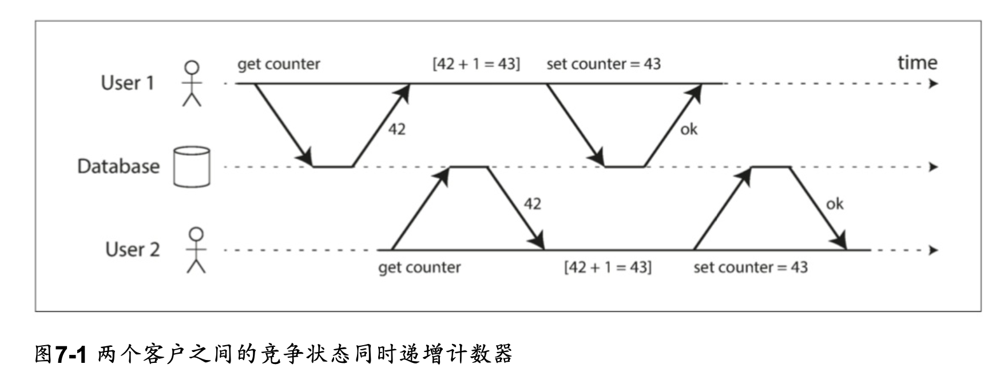
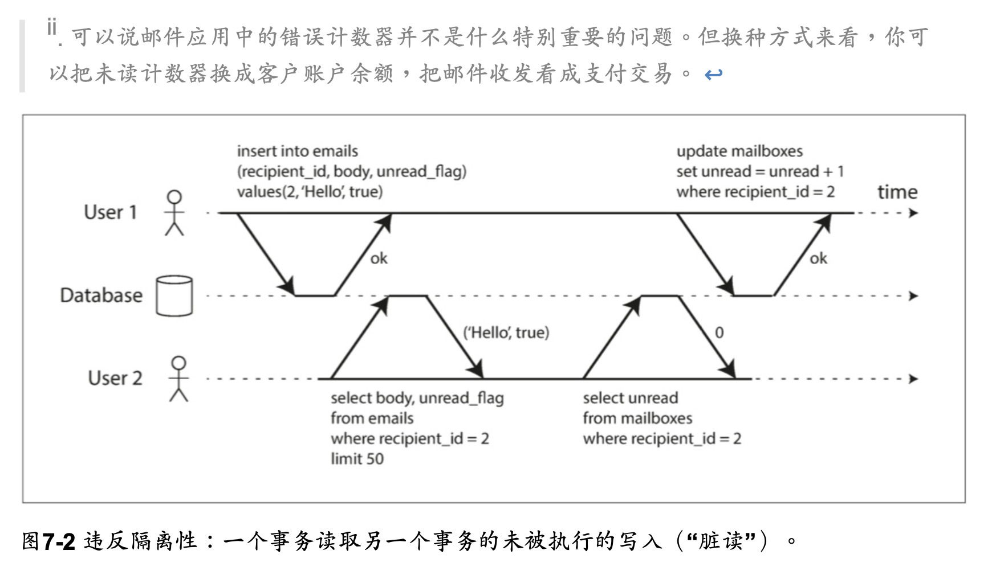
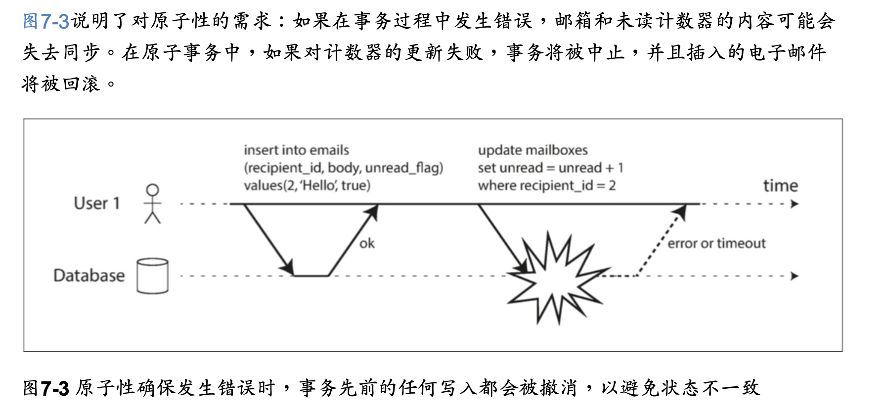
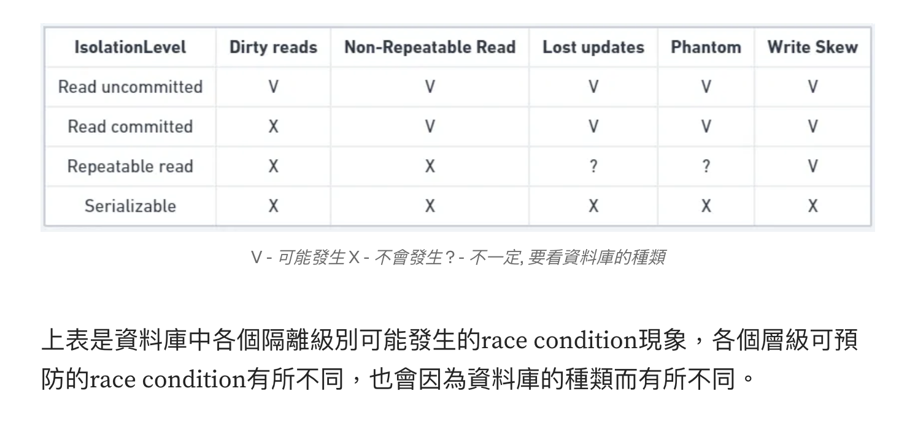
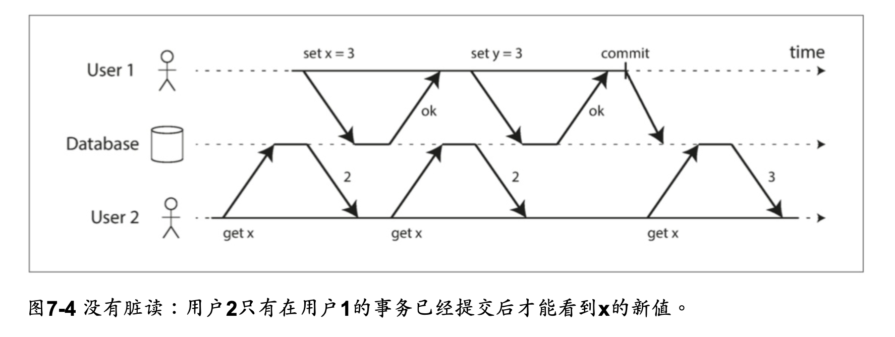
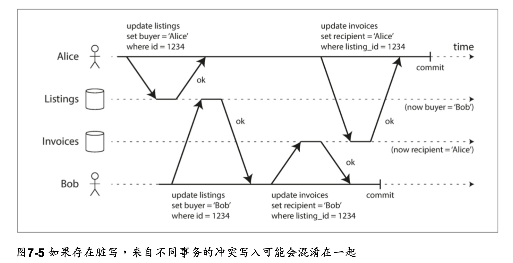
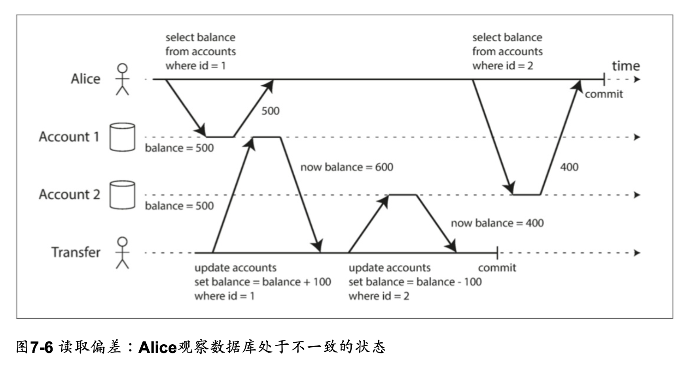
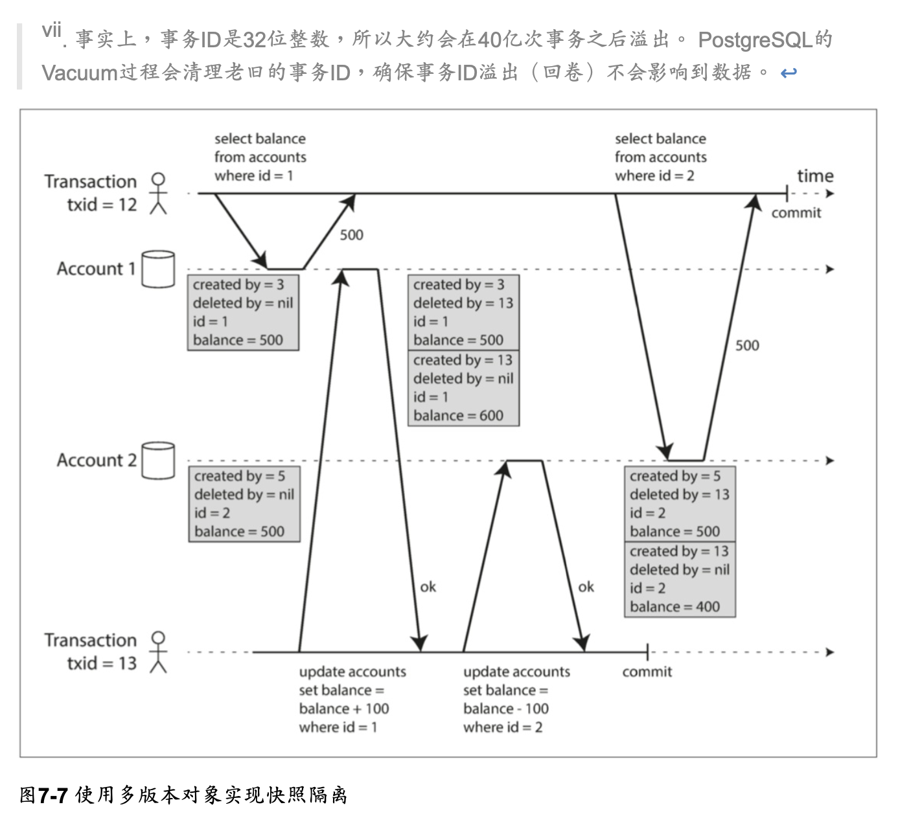
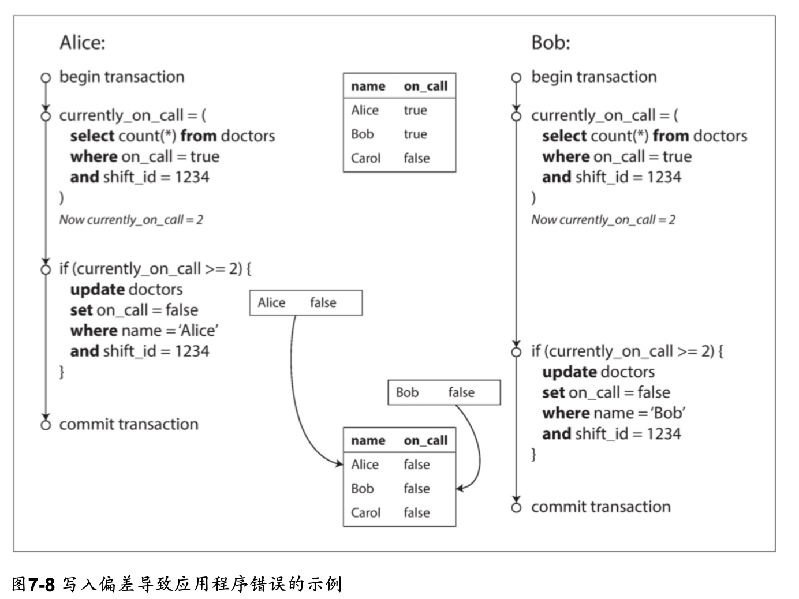

## ACID

交易所提供的安全保證  
一組能夠精確描述資料庫容錯機制的術語  

Atomicity: 原子性  
Consistency: 一致性  
Isolation: 隔離性  
Durability: 持久性  

實際上不同資料庫的ACID實作並不完全相同，隔離性的含義有很多含糊之處，  
當一個系統宣稱他是 "ACID相容" 的時候，  
你實際上無法確切知道他到提供了什麼樣的保證，  
ACID基本上已經變成一種行銷術語了  

不符合ACID標準的系統有時稱為BASE  

Basically Available: 基本可用  
Soft State: 軟狀態  
Eventual consistency: 最終一致性  

這些比ACID的定義更模糊，幾乎可以代表任何你想要的東西    

### Atomicity 原子性

ACID的原子性描述了，當客戶想進行多次寫入，但在一些寫操作處理完之後出現故障的情況。  
例如進程崩潰，網絡連接中斷，磁盤變滿或者某種完整性約束被違反。  
如果這些寫操作被分組到一個原子交易中，並且該交易由於錯誤而不能完成(提交)，  
則該交易將被中止，並且資料庫必須丟棄或撤消該交易中迄今為止所做的任何寫入。  

定義特徵是：能夠在錯誤時中止交易，丟棄該交易進行的所有寫入變更的能力。  
或許中止性(abortability)是更好的術語，但本書將繼續使用原子性，因為這是慣用詞。  

all-or-nothing  

### Consistency 一致性

ACID一致性的概念是，對數據的一組特定陳述必須始終成立。即不變量(invariants)。  
例如，在會計系統中，所有賬戶整體上必須借貸相抵。  

一些特定類型的不變量可以由資料庫檢查，例如外鍵約束或唯一約束，  
但是一般來說，是應用程式來定義什麼樣的數據是有效的，什麼樣是無效的。資料庫只管存儲。  
應用可能依賴資料庫的原子性和隔離性屬性來實現一致性，但這並不僅取決於資料庫。  
因此，字母C不屬於ACID。  

### Isolation 隔離性

大多數資料庫都會同時被多個客戶端訪問。  
如果它們各自讀寫資料庫的不同部分，這是沒有問題的，  
但是如果它們訪問相同的資料庫記錄，則可能會遇到並發問題(競爭條件(race conditions))。  
ACID意義上的隔離性意味著，同時執行的交易是相互隔離的：它們不能相互冒犯。  



### Durability 持久性

資料庫系統的目的是，提供一個安全的地方存儲數據，而不用擔心丟失。  
持久性是一個承諾，即一旦交易成功完成，即使發生硬體故障或資料庫崩潰，寫入的任何數據也不會丟失。  
在單節點資料庫中，持久性通常意味著數據已被寫入非易失性存儲設備，如硬盤或SSD。  
它通常還包括預寫日誌或類似的文件(參閱“讓B樹更可靠”)，以便在磁盤上的數據結構損壞時 進行恢復  
在帶複製的資料庫中，持久性可能意味著數據已成功複製到一些節點。為了提供持久性保證，資料庫必須等到這些寫入或複製完成後，才能報告交易成功提交。  

完美的持久性是不存在的：如果所有硬盤和所有備份同時被銷毀，那顯然沒有任何資料庫能救得了你。  

在歷史上，持久性意味著寫入歸檔磁帶。後來它被理解為寫入硬盤或SSD。  
最近它已經適應了“複製(replication)”的新內涵。哪種實現更好一些？  

真相是，沒有什麼是完美的：  

在實踐中，沒有一種技術可以提供絕對保證。  
只有各種降低風險的技術，包括寫入磁盤，複製到遠程機器和備份——它們可以且應該一起使用。  
與往常一樣，最好抱著懷疑的態度接受任何理論上的“保證”。  

## 單物件和多物件操作

假設你想同時修改多個對象(行，文檔，記錄)。  
通常需要多對象交易(multi-object transaction) 來保持多塊數據同步。  

圖7-2展示了一個來自電子郵件應用的例子。  
每當一個新消息寫入時，必須也增長未讀計數器，每當一個消息被標記為已讀時，也必須減少未讀計數器。




在關聯式資料庫中，通常基於客戶端與資料庫伺服器的TCP連接：在任何特定連接上，BEGIN TRANSACTION 和 COMMIT 語句之間的所有內容，被認為是同一交易的一部分  
另一方面，許多非關聯資料庫並沒有將這些操作組合在一起的方法。  
即使存在多對象API（例如，鍵值存儲可能具有在一個操作中更新幾個鍵的多重放置操作），  
但這並不一定意味著它具有交易語義：該命令可能在一些鍵上成功，在其他的鍵上失敗，使資料庫處於部分更新的狀態。  

### 單物件寫入

當單個對象發生改變時，原子性和隔離也是適用的。  

例如，假設您正在向資料庫寫入一個 20KB的 JSON文檔：  
* 如果在发送第一个10 KB之后网络连接中断，数据库是否存储了不可解析的10KB JSON 片段?
* 如果在数据库正在覆盖磁盘上的前一个值的过程中电源发生故障，是否最终将新旧值拼接在一起?
* 如果另一个客户端在写入过程中读取该文档，是否会看到部分更新的值?

原子性可以通過使用日誌來實現崩潰恢復（參閱“使B樹可靠”），  
並且可以使用每個對象上的鎖來實現隔離（每次只允許一個線程訪問對象）。  
一些資料庫也提供更複雜的原子操作，例如自增操作，這樣就不再需要像圖7-1那樣的讀取-修改-寫入序列了。  
```
UPDATE counters SET value = value + 1 WHERE key = 'foo';
```
同樣流行的是比較和設置（CAS, compare-and-set）操作，當值沒有並發被其他人修改過時，才允許執行寫操作。
```
-- 根据数据库的实现情况，这可能也可能不安全
UPDATE wiki_pages SET content = '新内容'
 WHERE id = 1234 AND content = '旧内容';
```
這些單對象操作很有用，因為它們可以防止在多個客戶端嘗試同時寫入同一個對象時丟失更新（參閱“防止丟失更新”）。  
但它們不是通常意義上的交易。CAS以及其他單一對象操作被稱為“輕量級交易”。  
交易通常被理解為，將多個對象上的多個操作合併為一個執行單元的機制。  

### 多物件交易的必要性

許多分布式數據存儲已經放棄了多對象交易，因為多對象交易很難跨分區實現，  
而且在需要高可用性或高性能的情況下，它們可能會礙事。  
但說到底，在分布式資料庫中實現交易，並沒有什麼根本性的障礙。  
第9章將討論分布式交易的實現。  

我們是否需要多對象交易？是否有可能只用鍵值數據模型和單對象操作來實現任何應用程序？  

有一些場景中，單對象插入，更新和刪除是足夠的。但是許多其他場景需要協調寫入幾個不同的對象：  

* 在關聯數據模型中，一個表中的行通常具有對另一個表中的行的外鍵引用。（類似的是，在一個圖數據模型中，一個頂點有著到其他頂點的邊）。多對象交易使你确信這些引用始終有效：當插入幾個相互引用的記錄時，外鍵必須是正確的，最新的，不然數據就沒有意義。
* 在文檔數據模型中，需要一起更新的字段通常在同一個文檔中，這被視為單個對象——更新單個文檔時不需要多對象交易。但是，缺乏連接功能的文檔資料庫會鼓勵非規範化（參閱“關聯式資料庫與文檔資料庫在今日的對比”）。當需要更新非規範化的信息時，如圖7-2 所示，需要一次更新多個文檔。交易在這種情況下非常有用，可以防止非規範化的數據不同步。
* 在具有二級索引的資料庫中（除了純粹的鍵值存儲以外幾乎都有），每次更改值時都需要更新索引。從交易角度來看，這些索引是不同的資料庫對象：例如，如果沒有交易隔離性，記錄可能出現在一個索引中，但沒有出現在另一個索引中，因為第二個索引的更新還沒有發生。

這些應用仍然可以在沒有交易的情況下實現。  
然而，沒有原子性，錯誤處理就要複雜得多，缺乏隔離性，就會導致並發問題。  
我們將在“弱隔離級別”中討論這些問題，並在第12章中探討其他方法。  

### 處理錯誤和中止

交易的一個關鍵特性是，如果發生錯誤，它可以中止並安全地重試，  
中止的重點就是允許安全的重試。  

ACID資料庫基於這樣的 哲學：如果資料庫有違反其原子性，隔離性或持久性的危險，則寧願完全放棄交易，而不是留下半成品。  
然而並不是所有的系統都遵循這個哲學。特別是具有無主複製的數據存儲，主要是在“盡力而 為”的基礎上進行工作。  

儘管重試一個中止的交易是一個簡單而有效的錯誤處理機制，但它並不完美：  

* 如果交易實際上成功了，但是在伺服器試圖向客戶端確認提交成功時網絡發生故障（所以客戶端認為提交失敗了），那麼重試交易會導致交易被執行兩次——除非你有一個額外的應用級除重機制。
* 如果錯誤是由於負載過大造成的，則重試交易將使問題變得更糟，而不是更好。為了避免這種正反饋循環，可以限制重試次數，使用指數退避算法，並單獨處理與過載相關的錯誤（如果允許）。
* 僅在臨時性錯誤（例如，由於死鎖，異常情況，臨時性網絡中斷和故障切換）後才值得重試。在發生永久性錯誤（例如，違反約束）之後重試是毫無意義的。
* 如果交易在資料庫之外也有副作用，即使交易被中止，也可能發生這些副作用。例如，如果你正在發送電子郵件，那你肯定不希望每次重試交易時都重新發送電子郵件。
* 如果你想確保幾個不同的系統一起提交或放棄，二階段提交（2PC, two-phase commit）可以提供幫助（“原子提交和兩階段提交（2PC）”中將討論這個問題）。
* 如果客戶端進程在重試中失效，任何試圖寫入資料庫的數據都將丟失。

## 弱隔離級別

当一个事务读取由另一个事务同时修改的数据时，或者当两个事务试图同时修改相同的数据时，并发问题(竞争条件)才会出现。  
并发BUG很难通过测试找到，因为这样的错误只有在特殊时机下才会触发。这样的时机可能很少，通常很难重现。  

并发性也很难推理，特别是在大型应用中，你不一定知道哪些其他代码正在访问数据库。  
在一次只有一个用户时，应用开发已经很麻烦了，有许多并发用户使得它更加困难，因为任何一个数据都可能随时改变。  

出于这个原因，数据库一直试图通过提供事务隔离(transaction isolation)来隐藏应用程序开发者的并发问题。  
从理论上讲，隔离可以通过假装没有并发发生，让你的生活更加轻松: 可序列化(serializable)的隔离等级意味着数据库保证事务的效果与连续运行(即一次一个，没有任何并发)是一样的。  

实际上不幸的是:隔离并没有那么简单。可序列化会有性能损失，许多数据库不愿意支付这个代价。  
因此，系统通常使用较弱的隔离级别来防止一部分，而不是全部的并发问题。  
这些隔离级别难以理解，并且会导致微妙的错误，但是它们仍然在实践中被使用  

比起盲目地依赖工具，我们应该对存在的并发问题的种类，以及如何防止这些问题有深入的理解。  
然后就可以使用我们所掌握的工具来构建可靠和正确的应用程序。  

在本节中，我们将看几个在实践中使用的弱(不可串行化(nonserializable))隔离级别，
并详细讨论哪种竞争条件可能发生也可能不发生，以便您可以决定什么级别适合您的应用程序。
一旦我们完成了这个工作，我们将详细讨论可串行性(请参阅“可序列化”)



### Read Committed 讀已提交

1. 从数据库读时，只能看到已提交的数据(没有脏读(dirty reads))。
2. 写入数据库时，只会覆盖已经写入的数据(没有脏写(dirty writes))。

某些数据库支持甚至更弱的隔离级别，称为读未提交(Read uncommitted)。它可以防止脏写，但不防止脏读。  

#### 無髒讀 No dirty reads

dirty reads: 一個交易可以讀取另外一個交易尚未 commit 的資料  
防止脏读。这意味着事务的任何写入操作只有在该事务提交时才能被其他人看到(然后所有的写入操作都会立即变得可见)  



为什么要防止脏读，有几个原因:

* 看到处于部分更新状态的数据库会让用户感到困惑
* 可能会看到稍后需要回滚的数据

#### 無髒寫 No dirty writes

后面的写入覆盖一个尚未提交的值  
在读已提交的隔离级别上运行的事务必须防止脏写，通常是延迟第二次写入，直到第一次写入事务提交或中止为止。  



通过防止脏写，这个隔离级别避免了一些并发问题:

* 如果事务更新多个对象，脏写会导致不好的结果。例如，考虑 图7-5，图7-5 以一个二手车销售网站为例，Alice和Bob两个人同时试图购买同一辆车。购买汽车需要两次数据库 写入:网站上的商品列表需要更新，以反映买家的购买，销售发票需要发送给买家。在 图7-5的情况下，销售是属于Bob的(因为他成功更新了商品列表)，但发票却寄送给了爱丽丝(因为她成功更新了发票表)。读已提交会阻止这样这样的事故。
* 但是，提交读取并不能防止图7-1中两个计数器增量之间的竞争状态。在这种情况下，第二次写入发生在第一个事务提交后，所以它不是一个脏写。这仍然是不正确的，但是出于不同的原因，在“防止更新丢失”中将讨论如何使这种计数器增量安全。

#### 讀已提交的實作 

读已提交是一个非常流行的隔离级别。这是Oracle 11g，PostgreSQL，SQL Server 2012， MemSQL和其他许多数据库的默认设置  
最常见的情况是，数据库通过使用行锁(row-level lock) 来防止脏写  

如何防止脏读?一种选择是使用相同的锁，并要求任何想要读取对象的事务来简单地获取该锁  

但是要求读锁的办法在实践中效果并不好。因为一个长时间运行的写入事务会迫使许多只读  
事务等到这个慢写入事务完成。这会损失只读事务的响应时间，并且不利于可操作性  

大多数数据库使用图7-4的方式防止脏读:对于写入的每个对象，数据库都会记住旧的已提交值，和由当前持有写入锁的事务设置的新值。  
当事务正在进行时，任何其他读取对象的事务都会拿到旧值。只有当新值提交后，事务才会切换到读取新值。  

### 快照隔離和可重複讀取 snapshot isolation and repeatable read

Read Committed 的隔離級別雖然可以防止 dirty read, dirty write，但仍有會產生併發錯誤的狀況



这种异常被称为不可重复读(nonrepeatable read)或读取偏差(read skew)

* non-repeatable read是指在同一事務中，多次讀取同一筆數據時，結果可能會因為其他事務的修改而不一致
* 术语偏差(skew) 这个词是过载的:以前使用它是因为热点的不平衡工作量 (参阅“偏斜的负载倾斜与消除热点”)，而这里偏差意味着异常的时机。

对于Alice的情况，这不是一个长期持续的问题。因为如果她几秒钟后刷新银行网站的页面，  
她很可能会看到一致的帐户余额。但是有些情况下，不能容忍这种暂时的不一致:

* 備份: 进行备份需要复制整个数据库，对大型数据库而言可能需要花费数小时才能完成。备份进程运行时，数据库仍然会接受写入操作。因此备份可能会包含一些旧的部分和一些新的部分。 如果从这样的备份中恢复，那么不一致(如消失的钱)就会变成永久的。
* 分析查询和完整性检查: 有时，您可能需要运行一个查询，扫描大部分的数据库。这样的查询在分析中很常见(参阅“事务处理或分析?”)，也可能是定期完整性检查(即监视数据损坏)的一部分。如果这些查询在不同时间点观察数据库的不同部分，则可能会返回毫无意义的结果。

快照隔离(snapshot isolation)是这个问题最常见的解决方案  

快照隔离对长时间运行的只读查询(如备份和分析)非常有用。  
如果查询的数据在查询执行的同时发生变化，则很难理解查询的含义。  
当一个事务可以看到数据库在某个特定时间点冻结时的一致快照，理解起来就很容易了。  

快照隔离是一个流行的功能:PostgreSQL，使用InnoDB引擎的MySQL，Oracle，SQL Server等都支持。  

#### 快照隔離的實作

快照隔离的实现通常使用写锁来防止脏写  
但是读取不需要任何锁定  

从性能的角度来看，快照隔离的一个关键原则是:读不阻塞写，写不阻塞读。  
这允许数据库在处理一致性快照上的长时间查询时，可以正常地同时处理写入操作。且两者间没有任何锁定争用。

为了实现快照隔离，数据库必须可能保留一个对象的几个不同的提交版本，  
因为各种正在进行的事务可能需要看到数据库在不同的时间点的状态。  

因为它并排维护着多个版本的对象，所以这种技术被称为多版 本并发控制(MVCC, multi-version concurrentcy control)。  

如果一个数据库只需要提供读已提交的隔离级别，而不提供快照隔离，那么保留一个对象的两个版本就足够了:提交的版本和被覆盖但尚未提交的版本。  
支持快照隔离的存储引擎通常也使用MVCC来实现读已提交隔离级别。  

一种典型的方法是读已提交为每个查询使用单独的快照，而快照隔离对整个事务使用相同的快照。  

确定没有事务可以再访问已删除的数据时，数据库中的垃圾收集过程会将所有带有删除标记的行移除，并释放其空间  

在PostgreSQL中， created_by 的实际名称为 xmin ， deleted_by 的实际名称 为xmax  



這是 PostgreSQL 中实现基于MVCC的快照隔离(其他实现类似)  
当一个事务开始时，它被赋予一个唯一的，永远增长vii的事务ID( txid )  
每当事务向数据库写入任何内容时，它所写入的数据都会被标记上写入者的事务ID  

#### 觀察一致性快照 (consistent snapshot) 的可見性規則

当一个事务从数据库中读取时，事务ID用于决定它可以看见哪些对象，
看不见哪些对象。通过仔细定义可见性规则，数据库可以向应用程序呈现一致的数据库快照。工作如下:

1. 在每次事务开始时，数据库列出当时所有其他(尚未提交或中止)的事务清单，即使之后提交了，这些事务的写入也都会被忽略。
2. 被中止事务所执行的任何写入都将被忽略。
3. 由具有较晚事务ID(即，在当前事务开始之后开始的)的事务所做的任何写入都被忽略，而不管这些事务是否已经提交。
4. 所有其他写入，对应用都是可见的。

这些规则适用于创建和删除对象。  

在图7-7中，当事务12从账户2读取时，它会看到 $500 的余额，  
因为 $500 余额的删除是由事务13完成的(根据规则3，事务12 看不到事务13 执行的 删除)，  
且400美元记录的创建也是不可见的(按照相同的规则)。  

换句话说，如果以下两个条件都成立，则可见一个对象:
* 读事务开始时，创建该对象的事务已经提交。
* 对象未被标记为删除，或如果被标记为删除，请求删除的事务在读事务开始时尚未提交。

长时间运行的事务可能会长时间使用快照，并继续读取(从其他事务的角度来看)早已被覆盖或删除的值。  
由于从来不更新值，而是每次值改变时创建一个新的版本，数据库可以在提供一致快照的同时只产生很小的额外开销。  

#### 索引和快照隔離

索引如何在多版本数据库中工作?  

一种选择是使索引简单地指向对象的所有版本，并且需要索引查询来过滤掉当前事务不可见的任何对象版本。  
当垃圾收集删除任何事务不再可见的旧对象版本时，相应的索引条目也可以被删除。  

在实践中，许多实现细节决定了多版本并发控制的性能。

例如，如果同一对象的不同版本可以放入同一个页面中，PostgreSQL的优化可以避免更新索引  

在CouchDB，Datomic和LMDB中使用另一种方法。  
虽然它们也使用B树，但它们使用的是一种仅追加/写时拷贝(append-only/copy-on-write)的变体，  
它们在更新时不覆盖树的页面，而为每个修改页面创建一份副本。  

从父页面直到树根都会级联更新，以指向它们子页面的新版本。  
任何不受写入影响的页面都不需要被复制，并且保持不变。  

使用仅追加的B树，每个写入事务(或一批事务)都会创建一颗新的B树，当创建时，从该特定树根生长的树就是数据库的一个一致性快照。
没必要根据事务ID过滤掉对象，因为后续写入不能修改现有的B树;它们只能创建新的树根。

但这种方法也需要一个负责压缩和垃圾收集的后台进程。

#### 可重複讀取的命名混淆

快照隔离是一个有用的隔离级别，特别对于只读事务而言。  

但是，许多数据库实现了它，却用不同的名字来称呼。  
在Oracle中称为可序列化(Serializable)的，在PostgreSQL和 MySQL中称为可重复读(repeatable read)。  

这种命名混淆的原因是SQL标准没有快照隔离的概念，因为标准是基于System R 1975年定义 的隔离级别，那时候快照隔离尚未发明。  
相反，它定义了可重复读，表面上看起来与快照隔离很相似。

PostgreSQL和MySQL称其快照隔离级别为可重复读(repeatable read)，因为这样符合标准要求，所以它们可以声称自己“标准兼容”。  

不幸的是，SQL标准对隔离级别的定义是有缺陷的——模糊，不精确，并不像标准应有的样子独立于实现。  
有几个数据库实现了可重复读，但它们实际提供的保证存在很大的差异，尽管表面上是标准化的。

在研究文献【29,30】中已经有了可重复读的正式定义，但大多数的实现并不能满足这个正式定义。

最后，IBM DB2使用“可重复读”来引用可串行化。

结果，没有人真正知道可重复读的意思。

### 防止更新丟失 lost update

write-write conflict  

如图7-1所示，以两个并发计数器增量，  
因為第二個寫入並不會包含第一個修改(後寫者勝)，第一個寫入的更新就"被消失"了  

* 增加计数器或更新账户余额(需要读取当前值，计算新值并写回更新后的值)在复杂值中进行本地修改
* 例如，将元素添加到JSON文档中的一个列表(需要解析文档，进行更改并写回修改的文档)
* 两个用户同时编辑wiki页面，每个用户通过将整个页面内容发送到服务器来保存其更改，覆写数据库中当前的任何内容。

这是一个普遍的问题，所以已经开发了各种解决方案。  

#### 原子寫入操作

```
UPDATE counters SET value = value + 1 WHERE key = 'foo';
```

如果你的代码可以用这些操作来表达，那这通常是最好的解决方案。這個指令在大多数关系数据库中是并发安全的  
不需要再應用程式碼中自己實作 read-modify-write cycles  

类似地，像MongoDB这样的文档数据库提供了对JSON文档的一部分进行本地修改的原子操作，  
Redis提供了修改数据结构(如优先级队列)的原子操作。  
并不是所有的写操作都可以用原子操作的方式来表达，例如wiki页面的更新涉及到任意文本编辑，  
但是在可以使用原子操作的情况下，它们通常是最好的选择。  

原子操作通常通过在读取对象时，获取其上的排它锁来实现。  
以便更新完成之前没有其他事务可以读取它。这种技术有时被称为游标稳定性(cursor stability)。  

另一个选择是简单地强制所有的原子操作在单一线程上执行。  

不幸的是，ORM框架很容易意外地执行不安全的读取-修改-写入序列，  
而不是使用数据库提供的原子操作。  
如果你知道自己在做什么那当然不是问题，但它经常产生那种很难测出来的微妙Bug。  

#### 顯示加鎖

如果数据库的内置原子操作没有提供必要的功能，防止丢失更新的另一个选择是让应用程序 显式地锁定将要更新的对象  

```
BEGIN TRANSACTION;
SELECT *
  FROM figures
 WHERE name = 'robot'
   AND game_id = 222
   FOR UPDATE;

-- 检查玩家的操作是否有效，然后更新先前SELECT返回棋子的位置。
UPDATE figures
   SET position = 'c4'
 WHERE id = 1234;

COMMIT;
```

FOR UPDATE 子句告诉数据库应该对该查询返回的所有行加锁。  
这是有效的，但要做对，你需要仔细考虑应用逻辑。忘记在代码某处加锁很容易引入竞争条件。  

#### 自動檢測

原子操作和锁是通过强制读取-修改-写入序列按顺序发生，来防止丢失更新的方法。  
另一种方法是允许它们并行执行，如果事务管理器检测到丢失更新，则中止事务并强制它们重试其读取-修改-写入序列。  

(應該是類似樂觀鎖)

丢失更新检测是一个很好的功能，因为它不需要应用代码使用任何特殊的数据库功能，  
你可能会忘记使用锁或原子操作，从而引入错误;  

但丢失更新的检测是自动发生的，因此不太容易出错。

#### 比較和設置 CAS

```
- 根据数据库的实现情况，这可能也可能不安全
UPDATE wiki_pages
   SET content = '新内容'
 WHERE id = 1234 AND content = '旧内容';
```

在不提供交易的資料庫中，會發現這一種原子操作  
但是，如果数据库允许 WHERE 子句从旧快照中读取，则此语句可能无法防止丢失更新，
因为即使发生了另一个并发写入，WHERE 条件也可能为真。  

在依赖数据库的CAS操作前要检查其是否安全。

#### 衝突解決和複製

在复制数据库中(参见第5章)，防止丢失的更新需要考虑另一个维度:
由于在多个节点上存在数据副本，并且在不同节点上的数据可能被并发地修改，因此需要采取一些额外的步骤来防止丢失更新。

锁和CAS操作假定有一个最新的数据副本。  
但是多主或无主复制的数据库通常允许多个写入并发执行，并异步复制到副本上，因此无法保证有一份数据的最新副本。  
所以基于锁或CAS 操作的技术不适用于这种情况。(我们将在“线性化”中更详细地讨论这个问题。)  

相反，如“检测并发写入”一节所述，这种复制数据库中的一种常见方法是允许并发写入创建多个冲突版本的值(也称为兄弟)，  
并使用应用代码或特殊数据结构在事实发生之后解决和合并这些版本。  

原子操作可以在复制的上下文中很好地工作，尤其当它们具有可交换性时(即，可以在不同的副本上以不同的顺序应用它们，且仍然可以得到相同的结果)。  
例如，递增计数器或向集合添加元素是可交换的操作。  

这是Riak 2.0数据类型背后的思想，它可以防止复制副本丢失更新。  
当不同的客户端同时更新一个值时，Riak自动将更新合并在一起，以免丢失更新。  

另一方面，最后写入为准(LWW)的冲突解决方法很容易丢失更新，如“最后写入为准(丢弃并发写入)”中所述。  
不幸的是，LWW是许多复制数据库中的默认值。

### 寫入偏斜(偏差)和幻讀

并发写入间可能发生的竞争条件还没有完。在本节中，我们将看到一些更微妙的冲突例子。  



#### 寫入偏斜(偏差)的特徵

这种异常称为写偏差。它既不是脏写，也不是丢失更新，因为这两个事务正在更新两个不同的对象(Alice和Bob各自的待命记录)。  

在这里发生的冲突并不是那么明显，但是这显然是一个竞争条件:  
如果两个事务一个接一个地运行，那么第二个医生就不能歇班了。异常行为只有在事务并发进行时才有可能。  

可以将写入偏差视为丢失更新问题的一般化  

我们看到，有各种不同的方法来防止丢失的更新。随着写偏差，我们的选择更受限制:

* 由于涉及多个对象，单对象的原子操作不起作用。
* 不幸的是，在一些快照隔离的实现中，自动检测丢失更新对此并没有帮助。在 PostgreSQL的可重复读，MySQL/InnoDB的可重复读，Oracle可序列化或SQL Server的
* 快照隔离级别中，都不会自动检测写入偏差【23】。
* 自动防止写入偏差需要真正的可序 列化隔离(请参见“可序列化”)。
* 某些数据库允许配置约束，然后由数据库强制执行(例如，唯一性，外键约束或特定值 限制)。但是为了指定至少有一名医生必须在线，需要一个涉及多个对象的约束。大多数数据库没有内置对这种约束的支持，但是你可以使用触发器，或者物化视图来实现它们，这取决于不同的数据库【42】。 
* 如果无法使用可序列化的隔离级别，则此情况下的次优选项可能是显式锁定事务所依赖 的行。在例子中，你可以写下如下的代码:
```
BEGIN TRANSACTION;

SELECT * FROM doctors
 WHERE on_call = TRUE
   AND shift_id = 1234 FOR UPDATE;

UPDATE doctors
   SET on_call = FALSE
 WHERE name = 'Alice'
   AND shift_id = 1234;

COMMIT;
```

#### 更多寫入偏斜(差)的例子

##### 會議室預約系統

```
BEGIN TRANSACTION;

-- 检查所有现存的与12:00~13:00重叠的预定
SELECT COUNT(*)
  FROM bookings
 WHERE room_id = 123
   AND end_time > '2015-01-01 12:00'
   AND start_time < '2015-01-01 13:00';

-- 如果之前的查询返回0
INSERT INTO bookings (room_id, start_time, end_time, user_id)
              VALUES (123, '2015-01-01 12:00', '2015-01-01 13:00', 666);

COMMIT;
```

快照隔离并不能防止另一个用户同时插入冲突的会议。为了确保不会遇到调度冲突，你又需要可序列化的隔离级别了。  

##### 多人線上遊戲

在例7-1中，我们使用一个锁来防止丢失更新(也就是确保两个玩家不能同时移动同一个棋 子)。  
但是锁定并不妨碍玩家将两个不同的棋子移动到棋盘上的相同位置，或者采取其他违反游戏规则的行为。  

按照您正在执行的规则类型，也许可以使用唯一约束，否则您很容易发生写入偏差。  

##### 申請新帳號

在每个用户拥有唯一用户名的网站上，两个用户可能会尝试同时创建具有相同用户名的帐户。  
可以在事务检查名称是否被抢占，如果没有则使用该名称创建账户。  
但是像在前面的例子中那样，在快照隔离下这是不安全的。  
幸运的是，唯一约束是一个简单的解决办法(第二个事务在提交时会因为违反用户名唯一约束而被中止)。

##### 防止過度消費

允许用户花钱或积分的服务，需要检查用户的支付数额不超过其余额。  
可以通过在用户的帐户中插入一个试探性的消费项目来实现这一点，列出帐户中的所有项目，并检查总和是否为正值。  
有了写入偏差，可能会发生两个支出项目同时插入，一起导致余额变为负值，但这两个事务都不会注意到另一个。  

#### 造成寫入偏斜(差)的幻讀

上述寫入偏斜(差)的例子，都遵循类似的模式  
一个事务中的写入改变另一个事务的搜索查询的结果，被称为幻读。  

快照隔离避免了只读查询中幻读，但是在像我们讨论的例子那样的读写事务中，幻影会导致特别棘手的写歪斜情况。

#### 實體化衝突 materializing conflicts

如果幻读的问题是没有对象可以加锁，也许可以人为地在数据库中引入一个锁对象?  

这种方法被称为物化冲突(materializing conflicts)，因为它将幻读变为数据库中一组具体行上的锁冲突  
不幸的是，弄清楚如何物化冲突可能很难，也很容易出错，而让并发控制机制泄漏到应用数据模型是很丑陋的做法。  

出于这些原因，如果没有其他办法可以实 现，物化冲突应被视为最后的手段。  
在大多数情况下。可序列化(Serializable) 的隔离级别是更可取的。  