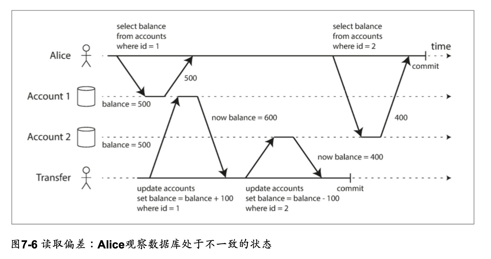

import Tabs from '@theme/Tabs';
import TabItem from '@theme/TabItem';

* 「任何可能出錯的事都必然將出錯」- 墨菲定律
* 系統維運人員必須要做最悲觀的假設
    * SRE: Hope is not a strategy
* 為了打造具有韌性的系統，了解「面臨的挑戰是什麼」是重要的
* 本章會以「最悲觀的方式」描述分散式系統可能出現的問題

## HPC & Cloud Computing

|                  | HPC                                                                                                   | Cloud Computing                                  |
| ---------------- | ----------------------------------------------------------------------------------------------------- | ------------------------------------------------ |
| Example          | 天氣預報、科學計算、ML                                                                                | 商用系統、多租戶資料中心、Web Service            |
| 任務特性         | 批次處理、可停止和重新啟動                                                                            | 低延遲服務                                       |
| 硬體特性         | 專用硬體。遠端直接記憶體存取 (RDMA)                                                                   | 商用機器，依靠規模經濟，以更低的成本提供同等性能 |
| 網路             | IP & Ethernet，[Clos Network](https://en.wikipedia.org/wiki/Clos_network)，專用的拓樸，提供更好的性能 | 通用的網路架構，IP, TCP, UDP                     |
| 單點失敗處理策略 | 將錯誤上報，視為整體失效                                                                              | 容忍失敗節點，保持整體能繼續工作                 |
| 地理部署         | 假設是緊密連結的                                                                                      | 不一定在相同地理位置，可能透過Internet連接       |

* 部署規模越大，單點故障的機會就越高。隨著時間推移，HPC最終可能會因為要從錯誤中回復而花費大量時間，而無法執行預期的工作。
* 想要讓分散式系統好好工作，需要考慮局部失敗的可能性，做出容錯的系統
    * 必須要用「不可靠的元件」搭建出「可靠的系統」

## 不可靠的網路

### 同步網路與非同步網路

|              | 同步網路                     | 非同步網路                                                             |
| ------------ | ---------------------------- | ---------------------------------------------------------------------- |
| Example      | 傳統有線電話ISDN             | 大部分資料中心的網路                                                   |
| 延遲         | 有限的                       | 有可能是無限的                                                         |
| 訊息遞送保證 | 保證，若未遞送成功會立刻知道 | 不保證訊息何時會到達目標節點，唯一的保證方法是讓接收方回覆一條回應訊息 |


### 非同步網路的不可靠性


<p style={{textAlign: "center", width: "100%", marginTop: "-1.8em"}}>當沒有收到接收方的回應，無法區分是因為a, b, c哪種原因導致資料丟失</p>

### 現實中的網路故障

* 自營運的資料中心，每個月大約會有12起網路相關的故障發生
    * 單機斷網和整個機架斷網各半
* 人為失誤是網路中斷的主要原因 - 無法透過增加冗餘避免
* ECU因為經常出現短暫的網路故障而臭名昭彰
    * [The Network is Reliable - An informal survey of real-world communications failures](https://queue.acm.org/detail.cfm?id=2655736)
        * `The outages occurred "2 to 4 times a day."`
* 交換機的軟體升級期間，可能會觸發網路拓樸的重構
* 海底電纜會斷掉
* NIC可能因故障，而只有單向工作正常；網路鏈路可以單向工作，並不保證它在另一個方向工作正常

### 檢測故障

* (書中本小節例子是以TCP/IP為例)

<Tabs>
<TabItem value="Origin Discussion" default>

1. 若能觸及目標機器，但機器上沒有process在監聽目標通訊埠，作業系統會發送RST或FIN封包做為回應並關閉或拒絕TCP連線。
2. 如果一個節點的process崩潰，但該節點的作業系統還在運作中，可以主動通知其他節點以提升接管的速度。這是HBase採用的做法。
3. 如果能存取目標機器所在的機房網路交換機，可以用來檢測硬體故障，例如發現機器關閉
4. 路由器若認為目標IP位址是不可達的，可能會回覆一個ICMP Destination Unreachable

</TabItem>
<TabItem value="Discuss with OSI Layers" default>

1. Layer 3有通，但Layer 4找不到dest port。TCP server送RST給client復位
2. Application崩潰，藉由另一個監看的Application對叢集內的其他節點送出接管命令
3. 如果能存取目標機器所在的機房網路交換機，可以用Layer 2 fram檢測目標機器是否通電
4. Layer 3 router若認為目標IP位址是不可達的，透過同在Layer 3的ICMP通知發送端Destination Unreachable

</TabItem>
</Tabs>

### 合理的Timeout

:::info Discussion
如果逾時是檢測故障唯一可靠的方法，那麼逾時時間要多久才對？
:::

:::info Discussion
* Timeout發生了，對方真的出錯了嗎？
* 依靠Timeout確認目標節點是否存活，會有什麼問題？
:::

* d = 傳送接收端之間的「最大延遲」
* r = 接收端處理請求，直到開始發送回應的時間
* **timout = 2d + r**

:::info Discussion
Web application的重要效能指標TTFB (Time to first byte)，在上述代號中應該如何表示？
:::

### 網路擁塞和Queue

* 如果不同的節點嘗試向同一個目標發送封包(Package)，網路交換器(Switch)必須將資料封包放在佇列中等待
    * 如果輸入資料太多，Queue被填滿，資料就會被丟棄，因此需要重新傳送。
* 封包到達目標機器後，若所有CPU都處於忙碌狀態，也可能導致其被處理的時間延後，而導致不確定性。
* 在虛擬環境中，當其他VM要存取CPU資源時，可能會導致數十ms的延遲。
    * 在此期間Child OS會無法存取任何CPU資源而導致延遲。
    * 虛擬機器監視器會需要把傳入VM的資料先放進Queue緩衝，進一步加劇了網路延遲的變化性
* TCP flow control，為了避免擁塞或背壓，會限制自己的發送速率，避免讓網路連結或接收節點發生超載。
    * 不只是接收端有Queue，發送端也有Queue


<p style={{textAlign: "center", width: "100%", marginTop: "-1.8em"}}>
Port3若來不及消化queue中的訊息，可能會導致觸發重傳
</p>

:::warning L2 & L3 Switch
傳統中，Switch是工作在Layer 2的網路設備。會看得懂訊框(Frame)，但不會理會封包(Package) header。

因運算能力的進步，今天大部分的Switch都是Layer 3 switch，會依照Layer 3的IP Header編制in-switch的destiation table，因此才會有Switch將Package放在Queue中等待的說法
:::

### 不能簡單地讓網路延遲可預測就好嗎？

* 因物理頻寬有限，而通信需求無限。在通訊底層設計的策略不同而有不同的通訊協定類型
* 網路中的「可變延遲」並不是自然規律，而是成本與獲利之間**權衡**下來的結果

|                | 迴路切換式網路                             | 封包切換式網路                                           |
| -------------- | ------------------------------------------ | -------------------------------------------------------- |
|                | Circuit-switched networks                  | Packet-switched protocols                                |
| 頻寬利用策略   | 固定數量的預留頻帶，當迴路建立時會是專用的 | 沒有迴路能獨佔所有頻寬，封包會盡可能利用任何可利用的頻寬 |
| 頻道劃分       | 迴路                                       | 虛擬的，由協定額外實現                                   |
| 頻寬保證       | 可提供                                     | 無法提供                                                 |
| 突發流量的支援 | 無法支援，每個頻道所擁有的頻寬是固定的     | 支援                                                     |
| Example        | PSTN                                       | Internet Protocol; IP                                    |

## 不可靠的時鐘

### 生活時鐘 Time-of-day clock

* 直觀上的時間，表示一台機器上的時間戳記
* 通常與NTP同步 - 從另一台機器上將時間同步過來
    * 不一定向前走，**有可能退後**
* Example:&nbsp;
<span>{(new Date()).toISOString()}</span>

### 單調時鐘 Monotonic clock

* 用來測量時間間隔
    * 透過檢查時間戳記的「差值」來得知經過多少時間
* **總是保證向前移動**
    * 但是在多CPU的系統中，作業系統可能會對不同的CPU維護單獨的單調時鐘
    * 讓這個向前移動的「保證」只在單一執行緒中發生
    * 明智的做法仍須保持謹慎
* NTP也有能力調整單調時鐘
    * 如果檢測到本地的石英時鐘筆NTP Server更快或慢，可以做時鐘調速 (Slewing the clock)
    * 可以加速、減慢，但無法對單調時鐘往前跳躍
    * 一般來說，單調時鐘維護在本地機器，不需要同步
* Example: 開機到目前的秒數

### 同步與精準度，不可靠的時鐘

* 電腦的石英鐘不是很準確，可能受到溫度而變化
    * Google的Server假設石英鐘的飄移為 200ppm (百萬分之一秒)
    * 每30秒與伺服器同步一次，時鐘飄移可能會達到6ms
    * 每天與伺服器同步一次，時鐘飄移可以達到17s
* 如果電腦的時間與NTP server差異過大，可能會拒絕同步
    * 導致程式看到的時間向前或向後跳躍
* 如果與NTP Server之間的網路被意外隔離開來
    * 時間同步會失效
    * 當下不會有問題而不容易被注意到，但最終會導致不可預期的嚴重問題
* NTP也受限於網路延遲
    * NTP的設計，假設了網路延遲的差異不會有太過劇烈的變化
    * 從Internet進行NTP同步，最小誤差可以達到35ms；偶爾的延遲放大會導致超過1s的誤差
* NTP Server的配置錯誤
    * NTP client都聽信server的時間
    * 你怎麼知道你「聽信的」NTP Server是可信的？
* 閏秒
    * 一分鐘有可能是59秒或61秒
        * 地球自轉速度不是固定的
        * 天文時鐘與原子時鐘的誤差
    * 打亂程式的計時假設
    * 閏秒的調整最好的方式，是讓NTP Server說謊
        * 將這個秒差，分散在一段長時間(例如，一天)逐步地調整
        * 稱為彌平 Smearing
* 虛擬的時鐘
    * 在虛擬機器中，其硬體時鐘也是被「虛擬化」出來的
    * CPU核心在VM之間共享時，有可能導致數十毫秒的暫停
* 不可控的終端設備
    * 設備的硬體時鐘可能根本就不能被信任
    * Candy Crush遊戲，30分鐘補一顆愛心
        * [愛心要等四萬多分鐘！](https://forum.gamer.com.tw/C.php?bsn=23846&snA=47)

### 提升時鐘的精度，與其困難之處

要精確地同步時鐘，可以非常複雜跟困難，但發揮鈔能力，投資大量的資源來關心你的時鐘就有可能

* 針對金融機構的MiFID II，針對歐洲監管草案要求高頻交易基金，必須將其時鐘同步到UTC 100微秒內
* 高精度的GPS接收器，透過PTP進行時間同步
    * PTP可以達到ns等級的精度
* [How PTP is being deployed at Meta](https://engineering.fb.com/2022/11/21/production-engineering/precision-time-protocol-at-meta/)
* 航海家一號
    * 配備兩個石英時鐘，一個作為備用使用
    * 定期與地球的深空網路(DSN)同步時間
        * Latency仍是可控的：2d+r
    * 但因為時間是相對的...
        * 假設航海家一號速度一直維持在3.595 AU/Year
        * 狹義相對論：時間膨脹，相對於一個慣性系統移動的時鐘都會走得比較慢
            * 2024年時，會比地球上的時鐘慢[2.398秒](https://www.wolframalpha.com/input?i=%2847+years%29%281-1%2Fsqrt%281-%283.595+AU+per+year%29%5E2%2Fc%5E2%29%29)
        * 廣義相對論：重力時間膨脹，重力導致時空的扭曲率越大，時間就過得越慢
            * 2024年時，會比地球上的時鐘快[14.5秒](https://www.wolframalpha.com/input?i=%2847+years%29*%28%281+-+2*G*%28mass+of+sun%29%2F%28%281+AU%29*c%5E2%29%29%5E0.5-%281+-+2*G*%28mass+of+sun%29%2F%28%28125+AU%29*c%5E2%29%29%5E0.5%29)
        * [(參考出處)](https://www.quora.com/Is-the-time-set-on-the-Voyager-2-still-the-same-as-the-time-on-Earth)

### 依靠時鐘的問題 - 事件排序的時間戳記

* Multiple-leader的衝突解決策略Last write wins; LWW
    * 在時鐘不同步的狀況下，對資料庫的寫入會神秘的消失
* [Ch5, Figure 5.9](/docs/sg/ddia/ch5#multi-leader-replication-topologies) 中，如果Client B的寫入實際上晚於Client A的寫入，但Client B的時間戳記卻比較早，會導致Client B的遞增操作錯誤地丟失
* 需要透過「可線性化的暫存器」來解決這個問題
    * 相信順序，而不是相信時鐘
    * Ch12會進行做法的討論


### 依靠時鐘的問題 - 全域快照的同步時鐘

* [Ch7 快照隔離和可重複讀取](/docs/sg/ddia/ch7#%E5%BF%AB%E7%85%A7%E9%9A%94%E9%9B%A2%E5%92%8C%E5%8F%AF%E9%87%8D%E8%A4%87%E8%AE%80%E5%8F%96-snapshot-isolation-and-repeatable-read)，依靠一個單調遞增的交易ID
    * 當資料庫分散在許多機器上，就很難產生一個全域的，單調遞增的ID
* Google的Spanner
    * 在每個資料中心都部署了GPS接收器或原子鐘
    * 將時鐘同步的誤差減少至7ms以內



### 依靠時鐘的問題 - 程序暫停

* 假設有一個分散式資料庫：
    * 每個分區只有一個Leader
    * 只有Leader可以接收寫入請求，但節點如何知道目前自己仍是Leader，並且可以安全地接受寫入請求？

```c showLineNumbers
while (true) {
  request = getIncomingRequest();
  // 只有一個節點能持有租約：一個帶有timeout的lock
  // 若我目前持有租約，而且有效時間還有低於10sec，要先做renew
  if (lease.expiryTimeMillis - System.currentTimeMillis() < 10000){
    lease = lease.renew();
  }

  // 租約至少還有10秒以上，檢查租約是否合法
  if (lease.isValid()) {
    process(request); // 我目前仍是leader，進行寫入操作
  }
}
```

* Line 5: 到期時間 `lease.expiryTimeMillis` 有可能是由其他台機器所設定的，對節點間的時間同步做了假設
* Line 5 `System.currentTimeMillis()` 到 Line 11 `process(request)` 之間經過的時間不能超過10s
    * 如果剛好直譯器在進行GC
    * 虛擬機器被suspended
    * 筆電的蓋子被蓋起來
    * OS進行content-switch將資源切換至其他的process
    * VM Hypervisor，將資源切換到另一個VM
    * 執行很慢的同步存取，例如I/O操作
    * 發生[分頁錯誤](https://zh.wikipedia.org/zh-tw/%E9%A1%B5%E7%BC%BA%E5%A4%B1)，從虛擬記憶體(硬碟)中載入page到memory中
    * 收到SIGSTOP (Ctrl+Z)而被暫停
* 在同一台機器上，有很多工具可以確保thread safe：互斥鎖、號誌、原子計數器、無鎖資料結構、阻塞佇列。但都這些工具都無法在分散式系統中使用

### 對策：回應時間保證

* 有些使用情境，如果不能在時間內做出回應，會造成嚴重的後果。
    * 稱為「硬即時系統」 (Hard real-time system) 。
    * 例如：安全氣囊。
* 提供即時保證，需要軟體各層級的堆疊。
    * RTOS，允許Process在指定的時間間隔內獲得CPU的時間分配。
    * 需要大量的額外工作，而且會嚴重限制可用的程式語言、函式庫、和工具範圍。
* 在伺服器端的資料處理系統，因為經濟上，或其他考量，必須忍受在非即時環境中運作，帶來的暫停和時鐘不穩定性。

## 時鐘的知識、真相與謊言

### 真相由多數說了算

* 你覺得自己活著不一定算數，得「大部分的人」「覺得你活著」
    * 身為Cluster Leader，發出的訊息沒有被其他節點收到，Timout發生後，其他節點宣告原有的Leader失效
    * 半斷開的原Leader被拖到墓地，尖叫著我沒死，但送葬隊伍以堅忍的決心繼續進行


<p style={{textAlign: "center", width: "100%", marginTop: "-1.8em"}}>
不正確的分散式鎖實作，Client 1認為它仍是有效的租約，但其實已經過期了。因而損壞了Storage的資料
</p>


<p style={{textAlign: "center", width: "100%", marginTop: "-1.8em"}}>
只允許遞增的fencing token循序寫入，藉以保證安全的存取<br/>
在Storage要能發現，並阻止Client 1的token過期；使用遞增鍵可以避免Lock Service與Storage之間額外的資料同步要求
</p>

### 拜占庭故障

* 基本上我們目前設計的系統，都是假設節點「不可靠」但都是「誠實的」
    * 沒有說謊的風險
* 但是有些情況下是有理由這麼考慮的
    * 太空船的電腦系統遭受輻射破壞，導致以不預期的方式做出回應
    * 跨公司組成的系統，一些參與者可能會試圖作弊或欺騙其他系統
        * 區塊鏈，被認為是一種讓互不信任的多方達成一致共識的系統
    * **軟體Bug**

### 共識演算法與假設

* 在現實生活中，有許多演算法被設計來解決分散式系統問題，來解決本章討論到的各種故障
* 常用的三種系統模型，對於共識演算法在設計來解決的問題，做的假設

#### 同步模型

* 假設網路延遲、程序暫停、時鐘偏差都是有限的
* 即使有偏差，仍不會超過某個上限

#### 部分同步模型

* 大多數的時候表現得像是一個同步系統
* 一種妥協，也是目前實際上大部分系統的假設
* 但要是真的偏差大到某個地步，系統不一定能正常運作

#### 非同步模型

* 不對時間做任何假設，甚至沒有時鐘
* 有演算法是真的設計在非同步模型上運作的，但用起來有許多限制

:::info 共識演算法
在本書Ch9有學術上的詳細討論，可以參考之前「鳳凰架構」的[Ch6](/docs/sg/fenix-architecture/ch6)作為開始<br/>
有興趣深入可以把Ch9讀完，在此列上關鍵字供參考：

* 全序廣播
* 分散式交易2PC / 3PC / XA
* ZooKeeper
:::


