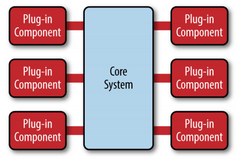
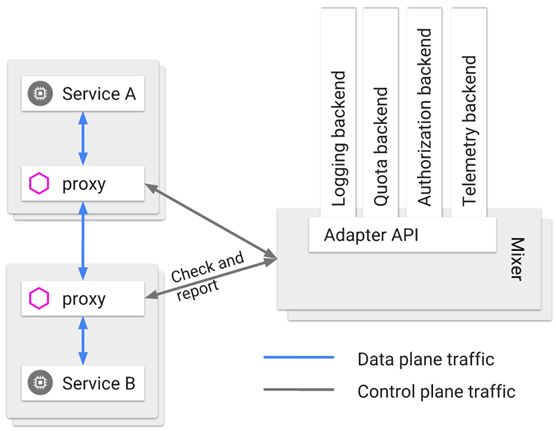

## 服務架構演進史

> _架構不是被發明出來的，而是持續演進的結果。_

探討以下六種不同時代的架構是什麼？出現的原因，以及解決什麼問題？

為什麼有些會失敗？在競爭過程中被淘汰？

### 原始分布式時代

> _某個功能能夠使用分布式，並不意味著它就應該進行分布式，強行追求透明的分布式操作，只會自尋苦果_
>
> _- Kyle Brown_

使用多個獨立的*分布式系統*共同建構一個大型的系統，其實比今天大家所見的*大型單體系統*出現的時間還要更早。

因為早期(20 世紀 70 年代到 80 年代初)，正好處於大型機台(研究機構的設備)轉成小型(商用、個人設備)。這時候的小型計算機能力大約是：

-   CPU: 16bit，不到 5Mhz 時脈頻率
-   RAM: 128k

為了突破硬體有限的運算能力，人們開始探索使用多台計算機共同協作來支撐一套軟體系統，例如：

1. 惠普公司 - 網路運算架構(Network Computing Architecutre, NCA)
    - 未來遠端服務調用的雛形
2. 卡內基。梅隆大學 - AFS (Andrew File System, Andrew 文件系統)
    - 日後分布式文件系統的最早實現
3. 麻省理工 - Kerberos 協議
    - 服務認證和訪問控制的基礎協議，分布式服務安全性的支撐
    - 目前仍被用於 Windows, MacOS 在內的眾多操作系統的登入、認證功能

為了避免[UNIX 系統版本戰爭](https://en.wikipedia.org/wiki/Unix_wars)，OSF(Open Sofware Foundation)邀請各廠商共同制定了**分布式雲算環境(Distributed Computin Environment, DCE)**
其中包括相對完整的組件規範與參考實現，利如：

1. NCA 的遠程服務調用規範 (Remote Procedure Call, RPC)，當時稱 DCE/RPC

    - 與後來的 Sun 公司提的基於 TCP/IP 協議的遠程標種 ONC RPC 被認為是現在 RPC 共同鼻祖

2. AFS 的分布式文件系統(Distributed File System, DFS)規範，當時稱 DCE/DFS

3. Kerberos 的服務認證規範

4. 時間服務、命名與目錄、UUID....等等

> OSF 本身是 UNIX 背景，所以這些技術都有濃厚 UNIX 設計風格 - 分布式環境中的服務調用、資源訪問、數據儲存盡**可能透明化、簡單化**

#### 困境：

調用本地與遠程的方法，若要兼顧簡單透明，複雜度完全是不一樣的等級:

1. 遠程不能依靠本地，依靠傳統編譯優化來提升速度
2. 網路環境問題：
    1. 遠程的服務在哪？
    2. 有多少個(負載平衡)？
    3. 網路出現分區？
    4. timeout？
    5. 服務出錯？
    6. 方法的參數與返回結果如何表示(序列化協議)？
    7. 如何傳輸(傳輸協定)？
    8. 服務全縣如何管理(認證、授權)？
    9. 通訊安全(網路安全層)？
    10. 如何調用不同機器的服務返回相同結果(分布式數據一致性)？

這些問題 DCE 從零開始、從無到有的回答大部分問題，建構出大量的分布式基礎組建與協議，且真的做到相對"透明"。
例如 DFS 上訪問文件，如果不考慮性能，很難感受他與本地文件有什麼不同，但是兩者速度有巨大差距。

開發人員為了必須讓軟體運行效率能夠讓使用者接受，他只能在方法本身運行時間很長、可忽略遠程調用成本時的的情框下考慮分布式系統，
否則要人為用各種 tricks 刻意構造這樣的場景，例如將毫無關係的方法打包再一起，一起遠程調用。

#### 總結原因

1. 將不相關的方法打包在一起，一起遠程調用 (程式變髒)
2. 這種長耗時方法本身就與期望用分布式來突破硬體限制、提升性能的初衷相悖
3. 開發人員必須時刻意識到自己在寫分布式程式，不可越出本地與遠程的界線

開發一個能良好運作的分布式應用，需要極高超程式能力與各方面的專業支撐....

> 這時候分布式系統的代價遠遠超過所取得的效益

#### 後續

在 20 世紀 80 年代，剛好硬體能力迅速提升，單體機器能夠支撐大多數服務，而變得主流。
前面提及的符合 UNIX 設計哲學的分布式系統，是軟體開發者最初的美好遠景，但迫於現實，他會在一定時期被妥協、捨棄。

隨著時間發展，分布式系統架構逐漸成熟與完善，並取代單體成為大型軟體的主流架構風格，這個美好遠景重新被開發者拾起。

### 單體系統時代

> _單體意味著包含。單體應用描述了一種由同一技術平台的不同組建構成的單層軟體_

單體系統是絕大多數開發者都學習過，實現過的一種軟體架構。
在微服務的教學裡面也會稱之為"巨石系統(Monolithic Application)"。

單體系統是出現時間最早，應用最廣的架構，但是這個名稱是在微服務流行之後才追加的概念。

在尋找軟體架構資料的時候會發現，可以輕易找到許多微服務相關的文章，但是單體架構的卻很少。
因為單體架構本身的簡單性，以前這架構已經出現相當長時間，大家已經習慣了軟體就夠就是這樣子。

#### 誤區

在許多微服務的教學裡，單體系統常常是“反派角色”，例如微服務入門書《微服務架構設計模式》第一章“逃離單體的地獄”。
裡面隱含著著一個定義 - **大型的**單體系統。

其實對於小型系統，單體機器就足以之稱其良好的運行系統，不僅更易於開發、測試、部署，功能之間的調用都是在進程內調用，
不會發生進程間的通訊(Inter-Process Communication, IPC)，運行效率是最高的。

**單體系統的不足，必須在軟體的性能需求超過單體，團隊人數超過"2 Pizza Team"的範疇下，才有討論的範疇**

> **疑問：** 一般產品開發常常會是從小規模團隊開始，逐步擴增至大團隊，
> 那麼一開始的架構設計該先從單體設計，然後隨著人員變多，再 refactor 至微服務？
> refactor 可能是從一些較於獨立的功能開始拆分至其他的 services。
> 如此逐步 refactor，相較於一開始就設計維服務的架構，哪種方式比較容易？

#### 單體系統的拆分

單體系統(巨石系統)，雖然聽名字很像是不可切分，其實並非如此。

1. 縱向 - 分層架構(Layered Architecture)。

2. 橫向 - 依照技術、功能、職責等維度，拆分成不同 module。

3. 橫向擴展(Scale Horizontally) - 在負載平衡器之後同時部署若干個相同的單體系統副本，以達到分攤流量壓力的效果

#### 單體的真正缺陷

“拆分”並不是單體系統的真正缺陷，而是：

1. 自治與隔離：每一個程式都是運行在同一個進程內，如果一部分程式有缺險，影響都是全局性的，難以隔離。
    1. 過度消耗進程資源
    2. 內存泄露
    3. 線程爆炸
    4. 阻塞
    5. 死循環
2. 系統單獨停止、更新、升級： 所有程式都是在同一個進程，所以不可能停掉半個進程，重啟 1/4 個程式。
3. 技術異構： 每一個程式都必須使用相同語言 (有些功能可能在不同語言實現比較容易)

> _在系統規模小的時候，單體系統是優勢，但是當系統規模擴大或程式需要修改的時候，他的部屬、技術升級的成本會變昂貴。_

#### 總結原因

以上缺陷並不是微服務取代單體成為潮流的根本原因，而是因為單體系統很難兼容"鳳凰特性"。
**單體系統要求系統內的每一個部件，每一處程式都是可靠的，盡量不出錯或很少出現缺陷。**

依靠高質量的程式來保證高可靠性的思路在小系統上可以運行良好，但是當系統規模越來越大的時候，就會變得越來越有挑戰性。

> _系統規模越來越大，思路應從“追求勁量不出錯”轉變成“出錯是必然”_。
> _為了允許出錯，獲得自治與隔離的能力，才是分布式系統再次起來的理由_

### SOA 時代

為了對大型的單體系統進行拆分，每一個系統都能夠獨立部署、運行、更新。開發者嘗試了幾種方式，以下三種具代表性：

1.  煙囪式架構 (Information Silo Architecture)

    > 又稱訊息孤島(Information Island)，指的是一種與其他相關訊息系統完全沒有互相操作或協調工作的設計模式。
    >
    > 其實並沒有什麼架構設計可言，對於兩個訊息系統來說，哪怕真的毫無業務往來關係，但是對系統的人員、組織、權限等數據是沒有任何重疊的嗎？
    >
    > 這不可能是企業所希望見到的

2.  微內核架構 (Microkernel Architecture)

    > 又稱為插件式架構 (Plug-in Architecture)。
    >
    > 有點像是煙囪式架構的演變，將所有子系統會共用的服務、數據、資源集中到一塊，組成一個業務系統共同依賴的核心(Kernel, 也稱 Core System)
    >
    > 具體的業務邏輯以 Plug-in 的形式存在，這樣可以提供可擴展的、靈活的、天然隔離的功能特性
    >
    > Example: VScode, browser extension....
    >
    > 
    >
    > **局限性：** 必須假設系統中的 plugin 之間互相不認識，且不可預知系統會安裝哪些，因此這些插件可以訪問 core system，
    > 但是不會直接互相訪問。這在許多應用場景上，很不實際

3.  事件驅動架構 (Event-Driven Architecture)

    > 為了讓子系統之間能夠互相通訊，一個可行方式就是用 Event Queue
    >
    > 來自系統外部的消息，以事件的形式發送到管道中，每一個子系統可以從管道獲取自己有註冊的事件，也可以新增或修改其中的附加訊息，
    > 或是自己發送一些新事件到管道中。
    >
    > 如此每一個系統都是獨立，高度解耦的，但是又能夠與其他系統互相溝通。
    >
    > 

#### SOAP 協議的誕生

軟體架構來到 SOA 時代，其中許多概念思想都能在現在的微服務中找到對應的身影，例如：服務之間鬆散耦合、註冊、發現、治理、隔離、編排...
這些在分布式架構提出時遇到的問題，SOA 都進行了更具體、更系統的探索。

SOA 的終極目標是總結一套子上而下的軟體研發方法論，做到企業只需要跟著 SOA 的思路，就能解決掉所有軟體開發的問題。

例如：如何挖掘需求、如何需求分解成業務能力、如何編排已有的服務、如何開發/測試/部署新的功能...等等。

SOA 不只關注技術，還關注研發過程涉及的需求、管理、流程和組織。

#### SOAP 協議逐漸邊緣化的原因

雖然 SOA 在 21 世紀最初十年裡曾盛行一時，但最終還是沈寂了下去，因為：
制定了過於嚴格的規範定義帶來過多的複雜性，需要非常專業的人員來有辦法駕馭。

他可以實現多個異構大型系統之間的複雜集成交戶，卻很難作為一種具有廣泛普遍性的軟體架構來推廣

<!-- Password manager example -->

### 微服務時代

#### 最初概念：

微服務最初是在 2005 年被提出，指的是一種專注於單一職責，與語言無關的戲力度 Web 服務。作為 SOA 的一種變體沒有受到太多追捧

#### 崛起：

在 2014 年，Martin Fowler 與 James Lewis 合寫的文章“Microservices: A definition of This New Architecture Term”中，
首次給了現代微服務的概念：

> 微服務是一種通過多個小型服務組合來建構單個應用的架構風格，
>
> 這些服務圍繞在業務能力，而非技術標準來建構
>
> 各個服務可以採用不同的程式語言、不同的數據儲存技術、運行在不同的進程中
>
> 服務採用輕量化的通訊機制和自動化部屬機制來實現通訊和維運

以上可拆分解讀成以下幾點：

1. 圍繞業務能力構建(Organized around Business Capability)
    > 康威定律：有怎樣的結構、規模、能力的團隊，就會產生出對應的結構、規模、能力的產品。
2. 分散治理(Decentralized Governance)
    > 服務對應的開發團隊有直接對服務運行質量負責的責任，也有不受外界干擾的掌控各個方面的權利。
3. 通過服務來實現獨立自治的組件(Componentization via Service)
    > 通過“Service”而不是"Library"來構建組建，是因為 Library 是在編譯期，靜態連接到程式中，通過本地調用，Service 是遠程調用。
    >
    > 雖然遠程調用會有其代價，但是為了組建自治與隔離的能力。
4. 產品化思維(Product not Project)
    > 避免將軟體開發視作要去完成某種功能，而是視作一種持續改進、提升的過程。
    >
    > 不應將維運當作維運人員的是，開發是開發人員的事情，而是團隊都該為整個軟體產品的生命週期負責。
5. 數據去中心化(Decentralized Data Management)
    > 微服務提倡數據應該按照**領域**分散管理、更新、維護、儲存。
6. 強終端、弱管道(Smart Endpoint and Dump Pipe)
    > 建構在通信管道上面的功能，應該是由 Endpoint 這端上自己解決，而不是在通訊管道上處理。
    >
    > 所以 RESTful 風格的通訊方式在微服務中會是更合適的選擇
7. 容錯性設計(Design for Failure)
    > 不追求服務永遠穩定，而是接受服務總會出錯的現實。
    >
    > 要能夠有自動的機制對其依賴的服務進行快速故障檢測，在持續出錯的時候進行隔離，服務恢復的時候重新聯通。
    >
    > 所以“斷路器”這類設施在微服務來說是一個必需品。
8. 演進式設計(Evolutionary Design)
    > 承認服務會被拋棄淘汰。
    >
    > 一個設計良好的服務，應該是能夠報廢的，而不是期望能長存永生。
9. 基礎設施自動化(Infrastructure Automation)
    > 減少建構、發布、維運的複雜性。
    >
    > 由於微服務架構下運行的機器是單體數量的好幾倍，所以團隊應更加依賴基礎設施的自動化

#### 更加自由

微服務的定義與特性中，可以發現其追求的是更加自由的架構風格，屏棄了幾乎所有 SOA 裡可以拋棄的約束與規定。
提倡“實踐標準”代替“規範標準”

SOA 提出解決的分布式服務問題，將沒有一個統一個的解決方案。

> JAVA 範圍內會用到的微服務，一個服務間遠程調用的問題，可以列入的解決方案的候選名單： RMI, Thrift, Dubbo, gRPC, Motan2, Finagle, brpc, Arvo, JSON-RPC, REST.....

#### 總結

在微服務時代，軟體研發本身的複雜度有所降低。一個簡單的服務，並不見得會相同的面臨分布式中的所有問題，也就不必背上 SOA 那沈重的技術包袱。
需要解決什麼問題，就引入什麼工具。

對於一個普通的開發者，微服務架構是友善的，可是對於架構師而言微服務是充滿滿的“惡意”。

架構能力的要求提升到史無前例的高，如果架構師本身知識不足已覆蓋所需要決策的內容，不清楚其利弊，將陷入選擇困難中。

### 後微服務時代

在微服務時代，人們傾向用**軟體**的程式去解決分布式架構中出現的問題，是因為硬體的基礎設施跟不上軟構成的應用服務的靈活性。

軟體可以使用指令就拆分出不同的服務，但是硬體呢？

#### 虛擬化技術與容器化技術

在微服務時代 Docker 就已經做為容器化的技術出現，但是早期的容器只是被簡單的視作一種可以快速啟動的服務運行環境。目的是方便程式分發部署，並未解決分布式的問題。

#### Kubernetes

2017 年 容器大戰，各家廠商紛紛加入 Kubernetes 行列。針對分布式得問題，Kubernetes 提供了基礎設施層面的解決方案，以下為與 Spring Cloud 做對比：

|          |         Kubernetes |          Spring Cloud          |
| :------- | -----------------: | :----------------------------: |
| 弹性伸缩 |        Autoscaling |              N/A               |
| 服务发现 |            KubeDNS |  CoreDNS Spring Cloud Eureka   |
| 配置中心 |          ConfigMap |   Secret Spring Cloud Config   |
| 服务网关 | Ingress Controller |       Spring Cloud Zuul        |
| 负载均衡 |      Load Balancer |      Spring Cloud Ribbon       |
| 服务安全 |           RBAC API |     Spring Cloud Security      |
| 跟踪监控 |        Metrics API | Dashboard Spring Cloud Turbine |
| 降级熔断 |                N/A |      Spring Cloud Hystrix      |

當虛擬化的基礎設施從單個服務的容器擴展到多個容器構成的服務群體、通訊網路和儲存設施時，軟體與硬體的界線變模糊了。

一個虛擬化的硬體能夠跟上軟體的靈活性，與業務無關的技術問題便可能從軟體層玻璃，由基礎設施內解決，讓軟體專注在業務。

#### Kubernetes 的不完美

有一些問題處於應用系統與基礎設施的邊緣，很難依靠基礎設施層面精細處理，例如以下圖：

#### 服務網格 (Service Mesh)

服務網格在 2018 年才火起來，他由系统自动在服务容器（通常是指 Kubernetes 的 Pod）中注入一个通訊代理服务器，
類似網路安全裡中間人攻擊的方式進行流量劫持，在應用毫无感知的情况下，悄然接管應用所有對外通信。

對數據平面通信的内容進行分析處理，以實現熔断、認證、度量、監控、負載均衡等各種附加功能。

這樣便實現了既不需要在應用层面加入额外的處理程式，也提供了幾乎不亞於程式的精细管理能力。

### 無服務時代
