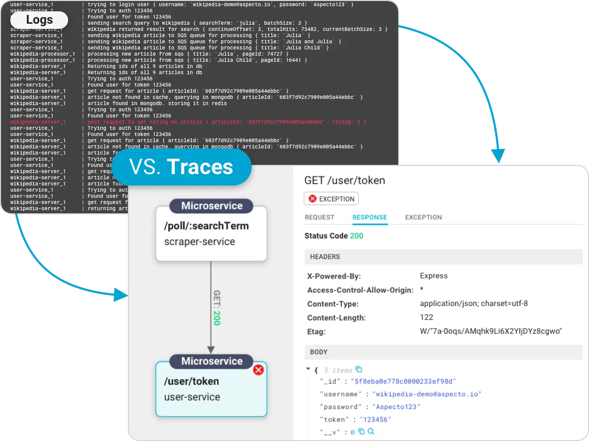

import Tabs from "@theme/Tabs";
import TabItem from "@theme/TabItem";

## 可觀測性(Observability)

> 

> 前言：某專案後端用 AWS Lambda + python , client 端用 iOS , Android。
> 常常 JSON payload 傳錯導致 crash 或 API response 都好幾秒，News List 頁面要等 6 秒，
> 總不可能每天手動滑 APP 做 test，看 GA 分析 user 滯留時間出奇的低!!!
> 前端當作除錯工具，我在想有更好的方式解決?
>
> 就來講到今天主題

:::tip What Is API Observability?
API 可觀察性是指通過 API 發出的信號可以理解 API 內部狀態的程度。
幫助團隊監控其 API 性能、解決問題、了解業務邏輯貼近市場需求和辨識效能優化方向。
:::

<details><summary>What Is API Observability?</summary>
<p>

- 真實用戶數據

#### API 可觀察性收集和分析 API 流量的實時流量數據，以監控真實的客戶數據而不是虛假數據。

通過這樣做，您可以確保您的監控與客戶遇到的情況一致，從而增加您在問題對客戶產生重大影響之前發現問題的可能性。

- 使用系統數據調試

#### 使用 API 可觀察性技術將使您能夠從整個系統中獲取數據，這與黑盒監控不同。

例如，當發生錯誤時，可以提供比簡單的 API 響應快照更多的資訊。這意味著使用 API 可觀察性工具，您的工程師將能夠更快地解決問題。


</p>
</details>

### 可觀測性 (Observability) 三大支柱

- 日誌(Logging)
- 追踪(Tracing)
- 指標(Metrics)

### 日誌 (Logging)

日誌是在任何服務器、操作系統或應用程序中觀察到的活動的記錄。

通常，日誌文件包含與在服務器中觀察到的小活動相關的
所有詳細資訊。它們可以是結構化或非結構化的代碼行，其中包含您要查找的所有詳細資訊。

日誌記錄是記錄您的操作的過程。它不需要任何人工協助，因為該過程是自動且自發的。

首選日誌來觀察系統的原因是，

- 所有系統都有日誌，過程不需要任何手動操作。
- 如果出現錯誤，日誌將包含與問題相關的故障的所有詳細資訊。
- 要對系統進行故障排除或調試，檢查記錄的日誌文件就足夠了。

日誌可觀察性也有一個必須注意的限制，

- 如果不注意日誌文件，可能會導致記錄失敗，並且無法正確保存收集的數據。

<details><summary>Logs-vs-traces</summary>
<p>


[Ref](https://www.aspecto.io/blog/logging-vs-tracing-why-logs-arent-enough-to-debug-your-microservices/)

</p>
</details>

### 追踪 (Tracing)

一種完全不同的數據以軌跡的形式存儲。

Tracing 是一種流動形式，通過它可以很容易地看到和分析活動背後的整個歷史。

由於可以記錄系統的整個框架，因此追踪被廣泛用於確定可觀察性。通過 Tracing 的具體點，您可以識別並糾正錯誤。

優點:

- 可以以語義的形式記錄和收集數據，以便更好地理解。
- 收集的數據為您的問題提供了準確的答案。

缺點:

- Tracing 有時可能會有間隙，這會使調試和故障排除變得更加困難。

### 指標 (Metrics)

數據收集可以通過多種方式完成，其中一種方法是使用指標。

指標是一種數字數據形式，以離散值的形式存儲，有助於快速識別問題。

一般來說，給出規律時間間隔行為資訊的是數學數據。數據可以以圖表的形式標註，便於追踪系統的高點和低點。

指標的使用一般用於業務和統計相關資訊，以追踪頻率。

優點:

- 數據的可視化更容易，並且可以快速分析數據。
- 節省時間，因為為您提供了清晰詳細的價值。
- 與日誌相比，公制系統的複雜性較小。

缺點:

- 指標數據只有在達到閾值時才會通知故障排除。

### 日誌、指標和追踪是相互關聯的

> 

## 事件日志

日誌用來記錄系統運行期間發生過的離散事件。
print log 很簡單，在分散式系統，就很難只依靠 tail、grep、awk 來從日誌中挖掘資訊了，
往往還要有專門的全局查詢和可視化功能。此時，從打印日誌到分析查詢之間，
還隔著收集、緩衝、聚合、加工、索引、存儲等若干個步驟。
Elastic Stack 技術棧來說

> 

### 輸出

#### 不應該有的資訊：

- 避免打印敏感資訊:

不該將密碼，銀行賬號，身份證件這些敏感資訊打到日誌裡。個資外洩！！！

- 避免引用慢操作:

日誌中打印的資訊應該是上下文中可以直接取到的，如果當前上下文中根本沒有這項數據，
需要專門調用遠程服務或者從數據庫獲取，又或者通過大量計算才能取到的話，那應該先考慮這項資訊放到日誌中是不是必要且恰當的。

- 避免打印追踪診斷資訊:

日誌中不要打印方法輸入參數、輸出結果、方法執行時長之類的調試資訊。

- 避免誤導他人:

[JAVA 中不要用 e.printStackTrace()](https://blog.51cto.com/u_15127511/3436116)，e.printStackTrace() 語句要產生的字符串記錄的是堆棧資訊，太長太多，memory 被填滿了！

#### 應該有的資訊：

- 處理請求時的 TraceID。
- 系統運行過程中的關鍵事件。
- 啟動時輸出系統資訊。
  

### 收集與緩衝

Beats 是用 Go 編寫的輕量級數據傳輸器，你可以把它安裝在你的服務器上，以捕獲各種操作數據
（如日誌、指標或網絡包數據）。 Beats 將操作數據直接或通過 Logstash 發送到 Elasticsearch，
因此可以用 Kibana 進行可視化。

| Beat                                                                           | Description                                                                      |
| ------------------------------------------------------------------------------ | -------------------------------------------------------------------------------- |
| [Auditbeat](https://github.com/elastic/beats/tree/main/auditbeat)              | Collect your Linux audit framework data and monitor the integrity of your files. |
| [Filebeat](https://github.com/elastic/beats/tree/main/filebeat)                | Tails and ships log files                                                        |
| [Functionbeat](https://github.com/elastic/beats/tree/main/x-pack/functionbeat) | Read and ships events from serverless infrastructure.                            |
| [Heartbeat](https://github.com/elastic/beats/tree/main/heartbeat)              | Ping remote services for availability                                            |
| [Metricbeat](https://github.com/elastic/beats/tree/main/metricbeat)            | Fetches sets of metrics from the operating system and services                   |
| [Packetbeat](https://github.com/elastic/beats/tree/main/packetbeat)            | Monitors the network and applications by sniffing packets                        |
| [Winlogbeat](https://github.com/elastic/beats/tree/main/winlogbeat)            | Fetches and ships Windows Event logs                                             |
| [Osquerybeat](https://github.com/elastic/beats/tree/main/x-pack/osquerybeat)   | Runs Osquery and manages interraction with it.                                   |

> 在 Logstash 之前架設一個 Kafka 或者 Redis 作為緩衝層，面對高流量。

### 加工與聚合

將日誌集中收集之後，存入 Elasticsearch 之前，一般還要對它們進行加工轉換和聚合處理。
這是因為日誌是非結構化數據，一行日誌中通常會包含多項資訊，如果不做處理，
那在 Elasticsearch 就只能以全文檢索的原始方式去使用日誌，既不利於統計對比，也不利於條件過濾。
舉個具體例子，下面是一行 Nginx 服務器的 Access Log，代表了一次頁面訪問操作：

```shell
14.123.255.234 - - [19/Feb/2020:00:12:11 +0800] "GET /index.html HTTP/1.1" 200 1314 "https://icyfenix.cn" "Mozilla/5.0 (Windows NT 10.0; WOW64) AppleWebKit/537.36 (KHTML, like Gecko) Chrome/80.0.3987.163 Safari/537.36"
```

| 數據項                                                                | 值                                                                                                             |
| --------------------------------------------------------------------- | -------------------------------------------------------------------------------------------------------------- |
| IP 地址                                                               | 14.123.255.234                                                                                                 |
| 用戶名 - -                                                            | 無效的                                                                                                         |
| 請求的時間戳                                                          | 19/二月/2020:00:12:11 +0800                                                                                    |
| 請求的方法                                                            | 得到                                                                                                           |
| 請求的 URL                                                            | /index.html                                                                                                    |
| HTTP 協議的版本號                                                     | HTTP/1.1                                                                                                       |
| HTTP Status Code                                                      | 200                                                                                                            |
| 伺服器回應的內容長度，1314 個位元組                                   | 1314                                                                                                           |
| 請求的來源網址                                                        | https://www.cncf.io/                                                                                           |
| 發送請求的用戶端瀏覽器的 User-Agent，這裡表示使用的是 Chrome 瀏覽器。 | Mozilla/5.0 (Windows NT 10.0; WOW64) AppleWebKit/537.36 (KHTML, like Gecko) Chrome/80.0.3987.163 Safari/537.36 |

通過[Grok 表達式語法](https://doc.yonyoucloud.com/doc/logstash-best-practice-cn/filter/grok.html)轉換為上面表格那樣的結構化數據

### 存儲與查詢

- 從數據特徵的角度看
- 從數據價值的角度看
- 從數據使用的角度看

  [Kibana](https://www.elastic.co/cn/kibana/)
  

## 鏈路追踪(TracingAnalysis)

分佈式追踪系統的起源
[《Dapper：a Large-Scale Distributed Systems Tracing Infrastructure》](https://static.googleusercontent.com/media/research.google.com/zh-CN//archive/papers/dapper-2010-1.pdf)論文。

一個完整的分散式追踪系統由數據收集、數據存儲和數據展示三個相對獨立的子系統組成，
而鏈路追踪僅指數據收集部分。追踪系統常被稱為“APM 系統”（Application Performance Management）。

## 追踪與跨度

> 

#### 追踪(Tracing)

從客戶端發起請求抵達系統的邊界開始，記錄請求流經的每一個服務，直到到向客戶端返迴響應為止，這整個過程。

> 

#### 跨度(Span)

由於每次 Trace 都可能會調用數量不定、坐標不定的多個服務，為了能夠記錄具體調用了哪些服務，以及調用的順序、
開始時點、執行時長等資訊，每次開始調用服務前都要先埋入一個調用記錄，這個記錄稱為一個"跨度"(Span)。

#### 適用場景

- 低性能損耗：分佈式追踪不能對服務本身產生明顯的性能負擔。追踪的主要目的之一就是為了尋找性能缺陷，越慢的服務越是需要追踪，所以工作場景都是性能敏感的地方。
- 對應用透明：追踪系統通常是運維期才事後加入的系統，應該盡量以非侵入或者少侵入的方式來實現追踪，對開發人員做到透明化。
- 隨應用擴縮：現代的分佈式服務集群都有根據流量壓力自動擴縮的能力，這要求當業務系統擴縮時，追踪系統也能自動跟隨，不需要運維人員人工參與。
- 持續的監控：要求追踪系統必須能夠 7x24 小時工作，否則就難以定位到系統偶爾抖動的行為。

[原來 10 張圖就可以搞懂分佈式鏈路追踪系統原理](https://mp.weixin.qq.com/s/cqgGHFdKdDrGj_cpW_uBPQ#at)

### 數據收集

#### 基於日誌的追踪(Log-Based Tracing)

- 基於日誌的追踪的思路是將 Trace、Span 等資訊直接輸出到應用日誌中，然後隨著所有節點的日誌歸集過程匯聚到一起，
  再從全局日誌資訊中反推出完整的調用鏈拓撲關係。

  日誌追踪的代表產品是 Spring Cloud Sleuth，下面是一段由 Sleuth 在調用時自動生成的日誌記錄，
  可以從中觀察到 TraceID、SpanID、父 SpanID 等追踪資訊。

```
# 以下为调用端的日志输出：
Created new Feign span [Trace: cbe97e67ce162943, Span: bb1798f7a7c9c142, Parent: cbe97e67ce162943, exportable:false]
2019-06-30 09:43:24.022 [http-nio-9010-exec-8] DEBUG o.s.c.s.i.web.client.feign.TraceFeignClient - The modified request equals GET http://localhost:9001/product/findAll HTTP/1.1

X-B3-ParentSpanId: cbe97e67ce162943
X-B3-Sampled: 0
X-B3-TraceId: cbe97e67ce162943
X-Span-Name: http:/product/findAll
X-B3-SpanId: bb1798f7a7c9c142

# 以下为服务端的日志输出：
[findAll] to a span [Trace: cbe97e67ce162943, Span: bb1798f7a7c9c142, Parent: cbe97e67ce162943, exportable:false]
Adding a class tag with value [ProductController] to a span [Trace: cbe97e67ce162943, Span: bb1798f7a7c9c142, Parent: cbe97e67ce162943, exportable:false]
```

#### 基於服務的追踪(Service-Based Tracing)

- 服務追踪的實現思路是通過某些手段給目標應用注入追踪探針(Probe)

[jaeger](https://www.jaegertracing.io/)

- 應用程序拓撲圖
- 實時監控您的應用程序
- 獲得對每筆交易的代碼級可見性

#### Jaeger Tracing Architecture

> 

> 

#### 基於邊車代理的追踪(Sidecar-Based Tracing)

- 服務網格
  Envoy 是專為大型現代 SOA（Service-oriented Architecture 服務導向架構）架構設計的 L7 代理和[序列通訊](https://zh.wikipedia.org/zh-tw/%E4%B8%B2%E8%A1%8C%E9%80%9A%E4%BF%A1)，體積小，性能高。它的誕生源於以下理念：
  對於應用程序而言，網絡應該是透明的，當發生網絡和應用程序故障時，能夠很容易定位出問題的根源。

- 非侵入的架構 : Envoy 是一個獨立進程，設計為伴隨每個應用程序服務運行。
  所有的 Envoy 形成一個透明的通信網格，每個應用程序發送消息到本地主機或從本地主機接收消息，
  不需要知道網絡拓撲，對服務的實現語言也完全無感知，這種模式也被稱為 Sidecar。

  > 

> Ref: [envoy-handbook](https://icloudnative.io/envoy-handbook/docs/overview/overview/)

### 追踪規範。什麼是 OpenTelemetry？

~~兩個規範搶話語權，最終握手和解產生 OpenTelemetry~~

OpenTelemetry 是一組 API 和 SDK，允許我們收集和導出跟踪、日誌和指標（也稱為可觀察性的三大支柱）。

它是一個 CNCF 社區驅動的開源項目（Cloud Native Computing Foundation，Kubernetes 的負責人）。

OpenTelemetry 使我們能夠檢測我們的雲原生應用程序。檢測您的代碼意味著從您系統中發生的事件中收集遙測數據，這最終有助於我們了解軟件的性能和行為。

OpenTelemetry 項目之所以獨一無二，主要有以下 3 個原因：

- 它是開源的。
- 收集日誌、指標和跟踪，並充當將它們聚集在一起的粘合劑。
- 所有供應商都尊重的一種規範——標準的可觀察性框架。

OpenTelemetry 用作標準的可觀察性框架，可在單一規範下捕獲所有遙測數據。

它提供了幾個組件，包括：

- 用於生成遙測的每種編程語言的 API 和 SDK
- OpenTelemetry 收集器；接收、處理遙測數據並將其導出到不同的目的地。
- 用於傳輸遙測數據的[OTLP](https://github.com/open-telemetry/opentelemetry-specification/blob/main/specification/protocol/otlp.md)協議

[OpenTelemetry](https://opentelemetry.io/)

[OpenTelemetry Collector](https://github.com/open-telemetry/opentelemetry-collector)

[What is OpenTelemetry? A Straightforward Guide](https://www.aspecto.io/blog/what-is-opentelemetry-the-infinitive-guide/?utm_source=jaeger-medium&utm_medium=post&utm_campaign=jaeger-tracing-the-ultimate-guide)

> 

Ref:[Announcing Alpha OpenTelemetry
access logging support in
Envoy](https://blog.envoyproxy.io/envoy-support-for-opentelemetry-access-logging-e4b08160d32c)

<details>
  <summary>這週 Scrum</summary>

iOS 專案我開始動手做 OpenTelemetry + Jaeger

</details>

## 聚合度量(Metrics)

指標(Metrics)：是在一段固定間隔收集的測量或系統狀態的紀錄。


指標可用來偵測或預測問題，例如突然飆高的 CPU 使用率或將要沒有使用空間的主機，
也可以用做更主動地分析來優化系統，最後還可以用來做衝擊分析(impact analysis)，像是應用服務掛掉的那段時間，
造成使用者不爽不用了或是對營收的影響等等。

本書用[Prometheus](https://prometheus.io/)介紹

### 指標收集

指標收集部分要解決兩個問題："如何定義指標"以及"如何將這些指標告訴服務端"

- 計數度量器(Counter)：這是最好理解也是最常用的指標形式，計數器就是對有相同量綱、可加減數值的合計量，譬如業務指標像銷售額、貨物庫存量、職工人數等等；技術指標像服務調用次數、網站訪問人數等都屬於計數器指標。
- 瞬態度量器(Gauge)：瞬態度量器比計數器更簡單，它就表示某個指標在某個時點的數值，連加減統計都不需要。譬如當前 Java 虛擬機堆內存的使用量，這就是一個瞬態度量器；又譬如，網站訪問人數是計數器，而網站在線人數則是瞬態度量器。
- 吞吐率度量器(Meter)：吞吐率度量器顧名思義是用於統計單位時間的吞吐量，即單位時間內某個事件的發生次數。譬如交易系統中常以 TPS 衡量事務吞吐率，即每秒發生了多少筆事務交易；又譬如港口的貨運吞吐率常以“噸/每天”為單位計算，10 萬噸/天的港口通常要比 1 萬噸/天的港口的貨運規模更大。
- 直方圖度量器(Histogram)：直方圖是常見的二維統計圖，它的兩個坐標分別是統計樣本和該樣本對應的某個屬性的度量，以長條圖的形式表示具體數值。譬如經濟報告中要衡量某個地區歷年的 GDP 變化情況，常會以 GDP 為縱坐標，時間為橫坐標構成直方圖來呈現。
- 採樣點分位圖度量器(Quantile Summary)：分位圖是統計學中通過比較各分位數的分佈情況的工具，用於驗證實際值與理論值的差距，評估理論值與實際值之間的擬合度。譬如，我們說“高考成績一般符合正態分佈”，這句話的意思是：高考成績高低分的人數都較少，中等成績的較多，將人數按不同分數段統計，得出的統計結果一般能夠與正態分佈的曲線較好地擬合。
  除了以上常見的度量器之外，還有 Timer、Set、Fast Compass、Cluster Histogram 等其他各種度量器，採用不同的度量系統，支持度量器類型的範圍肯定會有差別，譬如 Prometheus 支持了上面提到五種度量器中的 Counter、Gauge、Histogram 和 Summary 四種。

#### 如何將這些指標告訴服務端

- 推送式採集(Push-Based Metrics Collection)
  Push 就是由目標系統主動向度量系統推送指標。
- 拉取式採集(Pull-Based Metrics Collection)
  Pull 是指度量系統主動從目標系統中拉取指標
  [why do you pull rather than push?](https://prometheus.io/docs/introduction/faq/#why-do-you-pull-rather-than-push?)

> 

#### 存儲查詢

```
{
	// 时间戳
	"timestamp": 1599117392,
	// 指标名称
	"metric": "total_website_visitors",
	// 标签组
	"tags": {
		"host": "icyfenix.cn",
		"job": "prometheus"
	},
	// 指标值
	"value": 10086
}
```

#### 監控預警

Prometheus 配合[Grafana](https://grafana.com/)

指標是數據的數字表示。它包括名稱、標籤、值、發生時間等值，並傳達有關應用程序組件的資訊。

它們代表被監視的系統或應用程序的特定方面。它們提供了一種衡量系統性能、健康狀況和行為的方法，可用於識別問題、觸發警報和衡量變更的影響。

通常監控的一些常見指標類型包括：

- 資源利用率指標：這些指標衡量各種系統資源的利用率，如 CPU、內存、磁盤空間、網絡帶寬等。
- 性能指標：這些指標衡量系統的性能，例如響應時間、延遲、吞吐量等。
- 錯誤率指標：這些指標衡量系統中發生的錯誤、異常或故障的數量。
- 飽和度指標：這些指標衡量資源被利用的程度，例如活動連接數、打開文件等。
- 可用性指標：這些指標衡量系統的可用性，例如係統正常運行的時間百分比、不可用的次數等。
- 可以使用多種方法收集指標，包括手動監控、系統日誌和專門的監控工具。指標的選擇將取決於被監控的系統和監控工作的目標。

度量標準的目的是通知系統管理員他們的應用程序健康狀況。它在各個領域的表現如何，需要緊急關注什麼。

它帶有警報功能；每當某個指標超過閾值時，用[Webhook](https://zh.wikipedia.org/zh-tw/%E7%BD%91%E7%BB%9C%E9%92%A9%E5%AD%90)通知，
管理員就會收到消息。這使他能夠在有針對性的問題上迅速採取行動。

<details>
  <summary>未來週 Scrum</summary>

某後端專案我開始動手做 [Prometheus + Grafana](https://blog.techbridge.cc/2019/08/26/how-to-use-prometheus-grafana-in-flask-app/)

</details>
