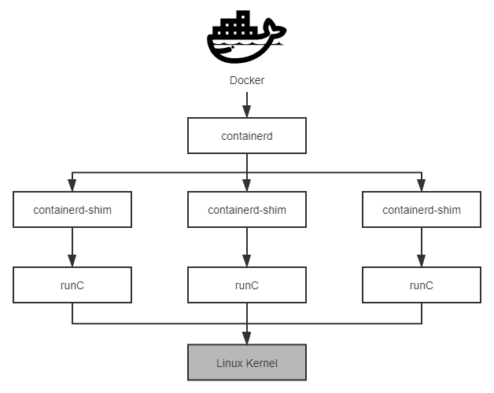
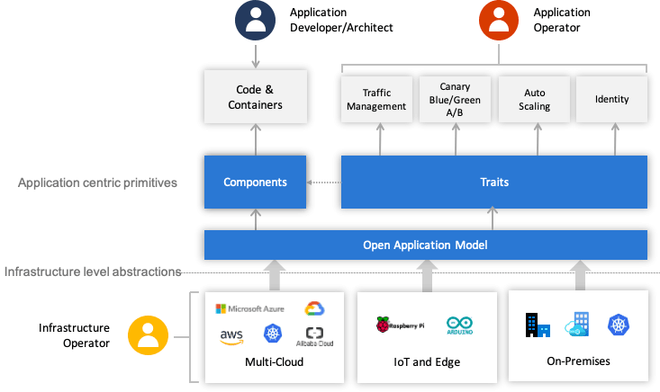

# 虛擬化容器

:::tip

- 讓軟件能夠在任何環境、任何物理機器上達到“一次編譯，到處運行”，這並不是一個簡單的目標
- 一個計算機軟件要能夠正確運行，需要有以下三方面的兼容性來共同保障

:::

- **ISA 兼容**: 機器指令集兼容性
- **ABI 兼容**: 系統或者依賴庫的二進制兼容性
- **環境兼容**: 環境的兼容性

### 虛擬化技術

- 指令集虛擬化（ISA Level Virtualization）
- 硬件抽象層虛擬化（Hardware Abstraction Level Virtualization）
- 操作系統層虛擬化（OS Level Virtualization）
- 運行庫虛擬化（Library Level Virtualization）
- 語言層虛擬化（Programming Language Level Virtualization）

## 容器的崛起

### 隔離文件：chroot

:::note

- Version 7 UNIX 系統中提供的 `chroot` 命令
- Linux Kernel 2.3.41 版內核引入了 `pivot_root`

:::

- 當某個進程經過 `chroot` 操作之後，它的根目錄就會被鎖定在命令參數所指定的位置，以後它或者它的子進程將不能再訪問和操作該目錄之外的其他文件。
- `pivot_root` 技術來實現文件隔離，`pivot_root` 直接切換了根文件系統（rootfs），有效地避免了 `chroot` 命令可能出現的安全性漏洞

### 隔離訪問：namespaces

:::note

- Linux Kernel 2.4.19 版內核引入了一種全新的隔離機制：Linux 名稱空間（Linux Namespaces）

:::

- 一種由內核直接提供的全局資源封裝，是內核針對進程設計的訪問隔離機制。

#### Linux 名稱空間支持以下八種資源的隔離

| 名稱空間 | 隔離內容                                                                                                                                             | 內核版本 |
| -------- | ---------------------------------------------------------------------------------------------------------------------------------------------------- | -------- |
| Mount    | 隔離文件系統，功能上大致可以類比 chroot                                                                                                              | 2.4.19   |
| UTS      | 隔離主機的 Hostname、Domain names                                                                                                                    | 2.6.19   |
| IPC      | 隔離進程間通信的渠道（詳見“遠程服務調用”中對 IPC 的介紹）                                                                                            | 2.6.19   |
| PID      | 隔離進程編號，無法看到其他名稱空間中的 PID，意味著無法對其他進程產生影響                                                                             | 2.6.24   |
| Network  | 隔離網絡資源，如網卡、網絡棧、IP 地址、端口，等等                                                                                                    | 2.6.29   |
| User     | 隔離用戶和用戶組                                                                                                                                     | 3.8      |
| Cgroup   | 隔離 cgroups 信息，進程有自己的 cgroups 的根目錄視圖（在/proc/self/cgroup 不會看到整個系統的信息）。cgroups 的話題很重要，稍後筆者會安排一整節來介紹 | 4.6      |
| Time     | 隔離系統時間，2020 年 3 月最新的 5.6 內核開始支持進程獨立設置系統時間                                                                                | 5.6      |

:::tip
syslog 時至今日還沒被隔離，容器內可以看到容器外其他進程產生的內核 syslog
:::

### 隔離資源：cgroups

> Control Groups，目前常用的簡寫為 `cgroups`

- 與名稱空間(namespaces)一樣都是直接由內核提供的功能
- 隔離或者說分配並限制某個進程組能夠使用的資源配額

#### Linux 控制群組子系統

| 控制組子系統 | 功能                                                                                       |
| ------------ | ------------------------------------------------------------------------------------------ |
| blkio        | 為塊設備（如磁盤，固態硬盤，USB 等等）設定 I/O 限額。                                      |
| cpu          | 控制 cgroups 中進程的處理器佔用比率。                                                      |
| cpuacct      | 自動生成 cgroups 中進程所使用的處理器時間的報告。                                          |
| cpuset       | 為 cgroups 中的進程分配獨立的處理器（包括多路系統的處理器，多核系統的處理器核心）。        |
| devices      | 設置 cgroups 中的進程訪問某個設備的權限（讀、寫、創建三種權限）。                          |
| freezer      | 掛起或者恢復 cgroups 中的進程。                                                            |
| memory       | 設定 cgroups 中進程使用內存的限制，並自動生成內存資源使用報告。                            |
| net_cls      | 使用等級識別符標記網絡數據包，可允許 Linux 流量控製程序識別從具體 cgroups 中生成的數據包。 |
| net_prio     | 用來設置網絡流量的優先級。                                                                 |
| hugetlb      | 主要針對於 HugeTLB 系統進行限制。                                                          |
| perf_event   | 允許 Perf 工具基於 cgroups 分組做性能監測。                                                |

- 2008 年合併到 2.6.24 版的內核後正式對外發布，這一階段的 cgroups 被稱為“第一代 `cgroups`”
- 2016 年 3 月發布的 Linux Kernel 4.5 中，搭載了由 Facebook 工程師（主要是 Tejun Heo）重新編寫的“第二代 `cgroups`”

:::tip
目前這兩個版本的 cgroups 在 Linux 內核代碼中是並存的，稍後介紹的 Docker 暫時僅支持第一代的 cgroups。
:::

### 封裝系統：LXC

:::note
為降低普通用戶綜合使用 `namespaces`、`cgroups` 這些低級特性的門檻，2008 年 Linux Kernel 2.6.24 內核剛剛開始提供 `cgroups` 的同一時間，就馬上發布了名為 Linux 容器（LinuX Containers，LXC）的系統級虛擬化功能。
:::

### 封裝應用：Docker

:::note

> Solomon Hykes，[Stackoverflow](https://stackoverflow.com/questions/17989306/what-does-docker-add-to-lxc-tools-the-userspace-lxc-tools/)，2013

**為什麼要用 Docker 而不是 LXC？（Why would I use Docker over plain LXC？）**

Docker 除了包裝來自 Linux 內核的特性之外，它的價值還在於：

- **跨機器的綠色部署**: Docker 定義了一種將應用及其所有的環境依賴都打包到一起的格式，彷彿它原本就是綠色軟件一樣。LXC 並沒有提供這樣的能力，使用 LXC 部署的新機器很多細節都依賴人的介入，虛擬機的環境幾乎肯定會跟你原本部署程序的機器有所差別。
- **以應用為中心的封裝**: Docker 封裝應用而非封裝機器的理念貫穿了它的設計、API、界面、文檔等多個方面。相比之下，LXC 將容器視為對系統的封裝，這局限了容器的發展。
- **自動構建**: Docker 提供了開發人員從在容器中構建產品的全部支持，開發人員無需關注目標機器的具體配置，即可使用任意的構建工具鏈，在容器中自動構建出最終產品。
- **多版本支持**: Docker 支持像 Git 一樣管理容器的連續版本，進行檢查版本間差異、提交或者回滾等操作。從歷史記錄中你可以查看到該容器是如何一步一步構建成的，並且只增量上傳或下載新版本中變更的部分。
- **組件重用**: Docker 允許將任何現有容器作為基礎鏡像來使用，以此構建出更加專業的鏡像。
- **共享**: Docker 擁有公共的鏡像倉庫，成千上萬的 Docker 用戶在上面上傳了自己的鏡像，同時也使用他人上傳的鏡像。
- **工俱生態**: Docker 開放了一套可自動化和自行擴展的接口，在此之上，還有很多工具來擴展其功能，譬如容器編排、管理界面、持續集成等等。

:::

#### 開放容器交互標準

- 運行時標準（runtime-spec）: 運行時標准定義了應該如何運行一個容器、如何管理容器的狀態和生命週期、如何使用操作系統的底層特性（namespaces、cgroup、pivot_root 等）
- 容器鏡像標準（image-spec）: 容器鏡像標準規定了容器鏡像的格式、配置、元數據的格式，可以理解為對鏡像的靜態描述
- 鏡像分發標準（distribution-spec，分發標準還未正式發布）: 鏡像分發標準則規定了鏡像推送和拉取的網絡交互過程。

#### Docker、containerd 和 runC 的交互關係



### 封裝集群：Kubernetes

#### Kubernetes 與容器引擎的調用關係


將這個階段 Kubernetes 與容器引擎的調用關係捋直，並結合上一節提到的 Docker 捐獻 containerd 與 runC 後重構的調用，完整的調用鏈條如下所示：

> **Kubernetes Master → kubelet → DockerManager → Docker Engine → containerd → runC**

Docker 對 Kubernetes 來說只是一項默認依賴，而非之前的無可或缺了，它們的調用鍊為：

> **Kubernetes Master → kubelet → KubeGenericRuntimeManager → DockerShim → Docker Engine → containerd → runC**

開源版 Kubernetes 是使用 CRI-O、cri-containerd 抑或是 DockerShim 作為 CRI 實現，完全可以由用戶自由選擇（根據用戶宿主機的環境選擇），但在 RedHat 自己擴展定制的 Kubernetes 企業版，即 OpenShift 4 中，調用鏈已經沒有了 Docker Engine 的身影：

> **Kubernetes Master → kubelet → KubeGenericRuntimeManager → CRI-O→ runC**

Kubernetes 從 1.10 版本宣布開始支持 containerd 1.1，在調用鏈中已經能夠完全抹去 Docker Engine 的存在：

> **Kubernetes Master → kubelet → KubeGenericRuntimeManager → containerd → runC**

## 以容器構建系統

> 容器之間順暢地交互通信是協作的核心需求，但容器協作並不僅僅是將容器以高速網絡互相連接而已。如何調度容器，如何分配資源，如何擴縮規模，如何最大限度地接管系統中的非功能特性，讓業務系統盡可能免受分佈式複雜性的困擾都是容器編排框架必須考慮的問題，只有恰當解決了這一系列問題，雲原生應用才有可能獲得比傳統應用更高的生產力。

### 隔離與協作

對親密協作的容器，是指它們被調度到同一個集群節點上，可以通過共享本地磁盤等方式協作；而超親密的協作是特指多個容器位於同一個 Pod 這種特殊關係，它們將默認共享：

- **UTS 名稱空間**：所有容器都有相同的主機名和域名
- **網絡名稱空間**：所有容器都共享一樣的網卡、網絡棧、IP 地址，等等。因此，同一個 Pod 中不同容器佔用的端口不能衝突
- **IPC 名稱空間**：所有容器都可以通過信號量或者 POSIX 共享內存等方式通信
- **時間名稱空間**：所有容器都共享相同的系統時間

#### Pod

> 同一個 Pod 的容器，只有 PID 名稱空間和文件名稱空間默認是隔離的。但通過 Pod 元數據定義中的 spec.shareProcessNamespace 來改變這點。共享 PID 名稱空間，容器封裝的應用進程就不再具有 PID 為 1 的特徵了。

Pod 是隔離與調度的基本單位，也是我們接觸的第一種 Kubernetes 資源。Kubernetes 將一切皆視為資源，不同資源之間依靠層級關係相互組合協作，這個思想是貫穿 Kubernetes 整個系統的兩大核心設計理念之一，不僅在容器、Pod、主機、集群等計算資源上是這樣，在工作負載、持久存儲、網絡策略、身份權限等其他領域中也都有著一致的體現。


#### Kubernetes 的計算資源

- **容器（Container）**: 延續了自 Docker 以來一個容器封裝一個應用進程的理念，是鏡像管理的最小單位。
- **生產任務（Pod）**: 補充了容器化後缺失的與進程組對應的“容器組”的概念，Pod 中容器共享 UTS、IPC、網絡等名稱空間，是資源調度的最小單位。
- **節點（Node）**: 對應於集群中的單台機器，這裡的機器即可以是生產環境中的物理機，也可以是雲計算環境中的虛擬節點，節點是處理器和內存等資源的資源池，是硬件單元的最小單位。
- **集群（Cluster）**: 對應於整個集群，Kubernetes 提倡理念是面向集群來管理應用。當你要部署應用的時候，只需要通過聲明式 API 將你的意圖寫成一份元數據（Manifests），將它提交給集群即可，而無需關心它具體分配到哪個節點（儘管通過標籤選擇器完全可以控制它分配到哪個節點，但一般不需要這樣做）、如何實現 Pod 間通信、如何保證韌性與彈性，等等，所以集群是處理元數據的最小單位。
- **集群聯邦（Federation）**: 對應於多個集群，通過聯邦可以統一管理多個 Kubernetes 集群，聯邦的一種常見應用是支持跨可用區域多活、跨地域容災的需求。

### 韌性與彈性

- 架構師專門設計了[服務容錯](./ch8#服務容錯)的策略和模式，Kubernetes 作為雲原生時代的基礎設施，也盡力幫助程序員以最小的代價來實現容錯，為系統健壯運行提供底層支持。

以房間中空調自動調節溫度為例子介紹了控制迴路的一般工作過程的：當你設置好了溫度，就是告訴空調你對溫度的“期望狀態”（Desired State），而傳感器測量出的房間實際溫度是“當前狀態”（Current State）。根據當前狀態與期望狀態的差距，控制器對空調製冷的開關進行調節控制，就能讓其當前狀態逐漸接近期望狀態。


- 通過描述清楚這些資源的期望狀態，由 Kubernetes 中對應監視這些資源的控制器來驅動資源的實際狀態逐漸向期望狀態靠攏
- 在 Kubernetes 元數據文件中的 `spec` 字段所描述的便是資源的期望狀態

#### ReplicaSet

ReplicaSet 本身可以保證 Pod 出現故障時自動恢復，但是在升級程序版本時，ReplicaSet 不得不主動中斷舊 Pod 的運行，重新創建新版的 Pod，這會造成服務中斷。

#### Deployment

由 Deployment 來創建 ReplicaSet，再由 ReplicaSet 來創建 Pod，當你更新 Deployment 中的信息（譬如更新了鏡像的版本）以後，部署控制器就會跟踪到你新的期望狀態，自動地創建新 ReplicaSet，並逐漸縮減舊的 ReplicaSet 的副本數，直至升級完成後徹底刪除掉舊 ReplicaSet


#### Autoscaling

Kubernetes 提供了 Autoscaling 資源和自動擴縮控制器，能夠自動根據度量指標，如處理器、內存佔用率、用戶自定義的度量值等，來設置 Deployment（或者 ReplicaSet）的期望狀態，實現當度量指標出現變化時，系統自動按照“Autoscaling → Deployment → ReplicaSet → Pod”這樣的順序層層變更，最終實現根據度量指標自動擴容縮容。

:::info
故障恢復、滾動更新、自動擴縮這些特性，在雲原生中時代裡常被概括成服務的彈性（Elasticity）與韌性（Resilience），ReplicaSet、Deployment、Autoscaling 的用法，也屬於是所有 Kubernetes 教材資料都會講到的“基礎必修課”
:::

## 以應用為中心的封裝

> Kubernetes 被譽為雲原生時代的操作系統，自誕生之日起就因其出色的管理能力、擴展性與以聲明代替命令的交互理念收穫了無數喝彩聲；但是，從易用角度講，坦白說差距還非常大，雲原生基礎設施的其中一個重要目標是接管掉業務系統複雜的非功能特性，讓業務研發與運維工作變得足夠簡單，不受分佈式的牽絆，然而 Kubernetes 被詬病得最多的就是複雜，自誕生之日起就以陡峭的學習曲線而聞名。

### Kustomize

- Kubernetes 官方給出“如何封裝應用”的解決方案是“用配置文件來配置配置文件”
- Kubernetes 官方認為應用就是一組具有相同目標的 Kubernetes 資源的集合，把應用中不變的信息與易變的信息分離開來解決管理問題，把應用所有涉及的資源自動生成一個多合一（All-in-One）的整合包來解決部署問題。

**Kustomize 的主要價值是根據環境來生成不同的部署配置**

:::note
只要建立多個 Kustomization 文件，開發人員就能以基於基准進行派生（Base and Overlay）的方式，對不同的模式（譬如生產模式、調試模式）、不同的項目（同一個產品對不同客戶的客制化）定制出不同的資源整合包。
:::

```
k8s
 ├── base
 │     ├── deployment.yaml
 │     ├── kustomization.yaml
 │     └── service.yaml
 └── overlays
       ├── prod
       │     ├── load-loadbalancer-service.yaml
       │     └── kustomization.yaml
       └── debug
             └── kustomization.yaml
```

Kustomize 使用 Base、Overlay 和 Patch 生成最終配置文件的思路與 Docker 中分層鏡像的思路有些相似，既規避了以“字符替換”對資源元數據文件的入侵

### Helm 與 Chart

> Helm 一開始的目標就很明確：如果說 Kubernetes 是雲原生操作系統的話，那 Helm 就要成為這個操作系統上面的應用商店與包管理工具。

:::tip
有了包管理工具，你只要知道應用的名稱，就可以很方便地從應用倉庫中下載、安裝、升級、部署、卸載、回滾程序，而且包管理工具自己掌握著應用的依賴信息和版本變更情況，具備完整的自管理能力，每個應用需要依賴哪些前置的第三方庫，在安裝的時候都會一併處理好。
:::

#### Helm

> Helm 模擬的就是上面這種做法，它提出了與 Linux 包管理直接對應的 Chart 格式和 Repository 應用倉庫，針對 Kubernetes 中特有的一個應用經常要部署多個版本的特點，也提出了 Release 的專有概念。

#### Chart

> Chart 用於封裝 Kubernetes 應用涉及到的所有資源，通常以目錄內的文件集合的形式存在。目錄名稱就是 Chart 的名稱（沒有版本信息）

**WordPress Chart 的目錄結構**

```
WordPress
 ├── templates
 │     ├── NOTES.txt
 │     ├── deployment.yaml
 │     ├── externaldb-secrets.yaml
 │     ├── 版面原因省略其他资源文件
 │     └── ingress.yaml
 ├── Chart.yaml
 ├── requirements.yaml
 └── values.yaml
```

- `Chart.yaml` 給出了應用自身的詳細信息（名稱、版本、許可證、自述、說明、圖標，等等）
- `requirements.yaml` 給出了應用的依賴關係，依賴項指向的是另一個應用的坐標（名稱、版本、Repository 地址）
- `values.yaml` 給出了所有可配置項目的預定義值
- 可配置項是指需要部署期間由運維人員調整的那些參數，它們以花括號包裹在 `templates` 目錄下的資源文件中，部署應用時，Helm 會先將管理員設置的值覆蓋到 `values.yaml` 的默認值上，然後以字符串替換的形式傳遞給 `templates` 目錄的資源模版，最後生成要部署到 Kubernetes 的資源文件

### Operator 與 CRD

> Operator 不應當被稱作是一種工具或者係統，它應該算是一種封裝、部署和管理 Kubernetes 應用的方法，尤其是針對最複雜的有狀態應用去封裝運維能力的解決方案

:::info Operator 設計理念
Operator 是使用自定義資源（CR，筆者註：CR 即 Custom Resource，是 CRD 的實例）管理應用及其組件的自定義 Kubernetes 控制器。高級配置和設置由用戶在 CR 中提供。Kubernetes Operator 基於嵌入在 Operator 邏輯中的最佳實踐將高級指令轉換為低級操作。Kubernetes Operator 監視 CR 類型並採取特定於應用的操作，確保當前狀態與該資源的理想狀態相符。
:::

#### 有狀態應用（Stateful Application）

> 程序每次運行都跟首次運行一樣，不會依賴之前任何操作所遺留下來的痕跡

#### 無狀態應用（Stateless Application）

> 程序推倒重來之後，用戶能察覺到該應用已經發生變化

站在 Kubernetes 的角度看，是否有狀態的本質差異在於有狀態應用會對某些外部資源有綁定性的直接依賴，譬如 Elasticsearch 建立實例時必須依賴特定的存儲位置，重啟後仍然指向同一個數據文件的實例才能被認為是相同的實例

#### StatefulSet 管理的 Pod 具備特性：

- **Pod 會按順序創建和按順序銷毀**：StatefulSet 中的各個 Pod 會按順序地創建出來，創建後續的 Pod 前，必須要保證前面的 Pod 已經轉入就緒狀態。刪除 StatefulSet 中的 Pod 時會按照與創建順序的逆序來執行。
- **Pod 具有穩定的網絡名稱**：Kubernetes 中的 Pod 都具有唯一的名稱，在普通的副本集中這是靠隨機字符產生的，而在 StatefulSet 中管理的 Pod，會以帶有順序的編號作為名稱，且能夠在重啟後依然保持不變。。
- **Pod 具有穩定的持久存儲**：StatefulSet 中的每個 Pod 都可以擁有自己獨立的 PersistentVolumeClaim 資源。即使 Pod 被重新調度到其它節點上，它所擁有的持久磁盤也依然會被掛載到該 Pod，這點會在“容器持久化”中進一步介紹。

:::tip
如果把 ReplicaSet 中的 Pod 比喻為養殖場中的“肉豬”，那 StatefulSet 就是被家庭當寵物圈養的“荷蘭豬”，不同的肉豬在食用功能上並沒有什麼區別，但每隻寵物豬都是獨一無二的，有專屬於自己的名字、習性與記憶，事實上，早期的 StatefulSet 就曾經有一段時間用過 PetSet 這個名字
:::

- Helm 和 Kustomize 最終仍然是依靠 Kubernetes 的內置資源來跟 Kubernetes 打交道的
- Operator 則是要求開發者自己實現一個專門針對該自定義資源的控制器，在控制器中維護自定義資源的期望狀態

### 開放應用模型

> 開放應用模型思想的核心是如何將開發人員、運維人員與平台人員關注點分離，開發人員關注業務邏輯的實現，運維人員關注程序平穩運行，平台人員關注基礎設施的能力與穩定性

:::info OAM 定義的應用

一個 **Application** 由一組 **Components** 構成，每個 **Component** 的運行狀態由 **Workload** 描述，每個 **Component** 可以施加 **Traits** 來獲取額外的運維能力，同時我們可以使用 **Application Scopes** 將 **Components** 劃分到一或者多個應用邊界中，便於統一做配置、限制、管理。把 **Components**、**Traits** 和 **Scopes** 組合在一起實例化部署，形成具體的 **Application Configuration**，以便解決應用的多實例部署與升級。
:::

- **服務組件（Components）**：由 Component 構成應用的思想自 SOA 以來就屢見不鮮，然而 OAM 的 Component 不僅僅是特指構成應用“整體”的一個“部分”，它還有一個重要職責是抽像那些應該由開發人員去關注的元素

- **工作負荷（Workload）**：Workload 決定了應用的運行模式，每個 Component 都要設定自己的 Workload 類型，OAM 按照“是否可訪問、是否可複制、是否長期運行”預定義了六種 Workload 類型

| 工作負荷         | 可訪問 | 可複制 | 長期運行 |
| ---------------- | ------ | ------ | -------- |
| Server           | √      | √      | √        |
| Singleton Server | √      | x      | √        |
| Worker           | x      | √      | √        |
| Singleton Worker | x      | x      | √        |
| Task             | x      | √      | x        |
| Singleton Task   | x      | x      | x        |

- **運維特徵（Traits）**：OAM 的 Traits 就用於封裝模塊化後的運維能力，可以針對運維中的可重複操作預先設定好一些具體的 Traits，譬如日誌收集 Trait、負載均衡 Trait、水平擴縮容 Trait，等等。這些預定義的 Traits 定義裡，會註明它們可以作用於哪種類型的工作負荷、包含能填哪些參數、哪些必填選填項、參數的作用描述是什麼，等等。

- **應用邊界（Application Scopes）**：多個 Component 共同組成一個 Scope，根據 Component 的特性或者作用域來劃分 Scope，譬如具有相同網絡策略的 Component 放在同一個 Scope 中，具有相同健康度量策略的 Component 放到另一個 Scope 中。同時，一個 Component 也可能屬於多個 Scope，譬如一個 Component 完全可能既需要配置網絡策略，也需要配置健康度量策略。

- **應用配置（Application Configuration）**：將 Component（必須）、Trait（必須）、Scope（非必須）組合到一起進行實例化，就形成了一個完整的應用配置。

OAM 使用上述介紹的這些自定義資源將原先 All-in-One 的複雜配置做了一定層次的解耦，開發人員負責管理 Component；運維人員將 Component 組合併綁定 Trait 變成 Application Configuration；平台人員或基礎設施提供方負責提供 OAM 的解釋能力，將這些自定義資源映射到實際的基礎設施。不同角色分工協作，整體簡化了單個角色關注的內容，使得不同角色可以更聚焦更專業的做好本角色的工作


