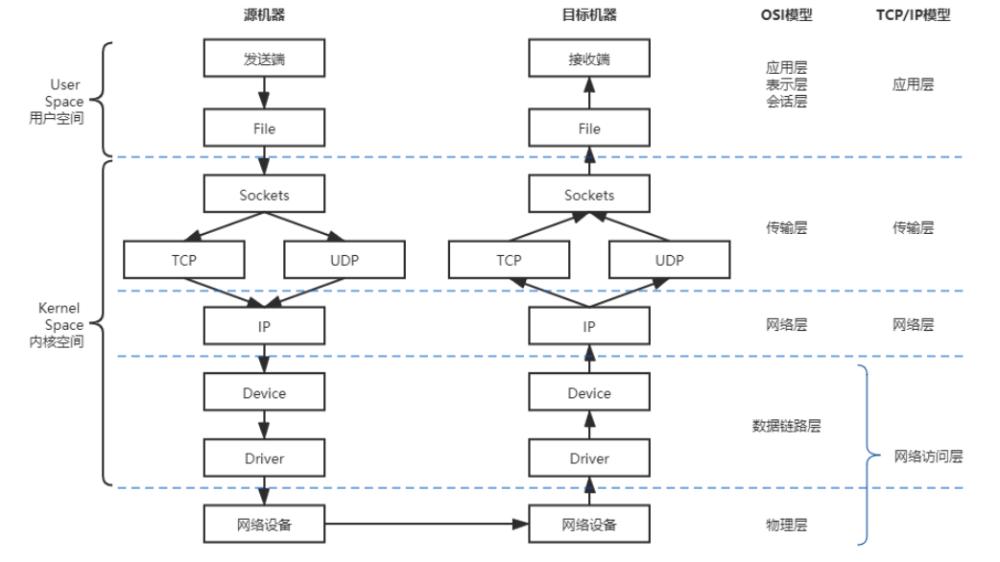
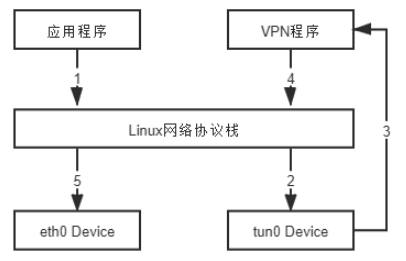
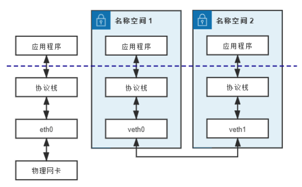
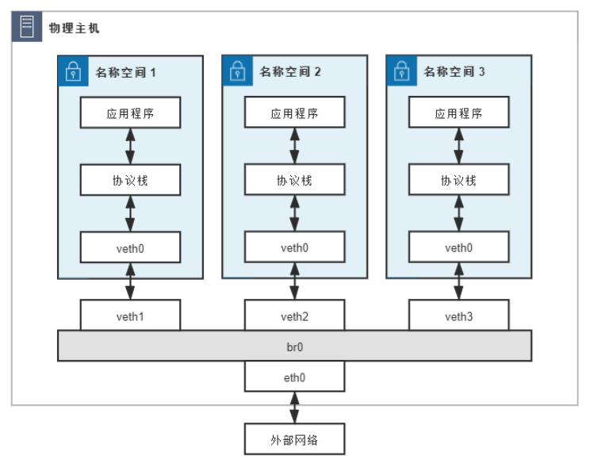
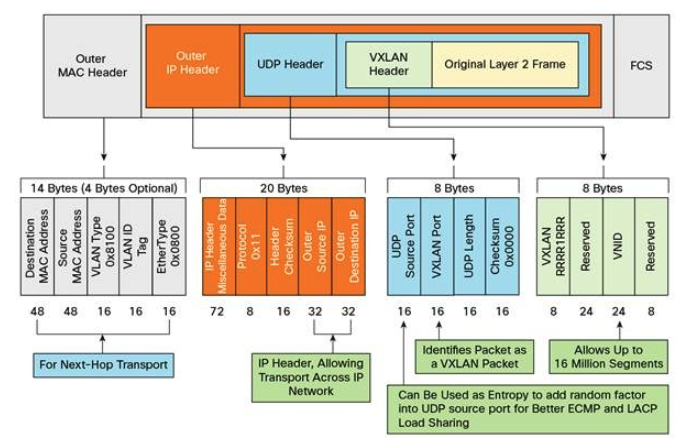
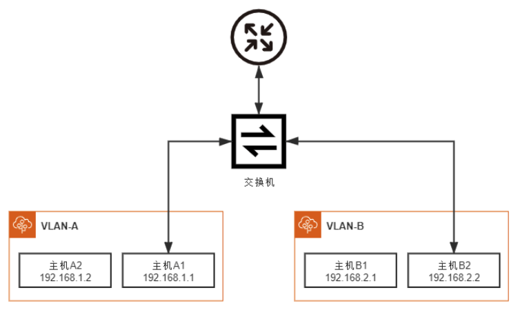
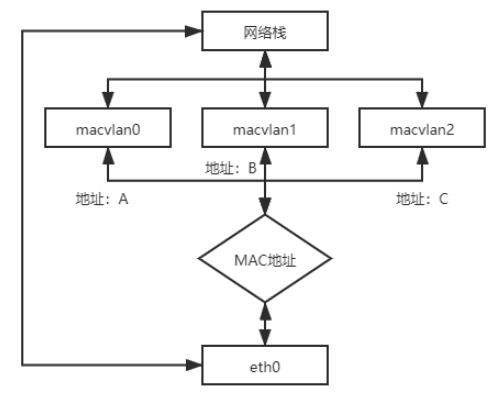

## Linux 網絡虛擬化
基於 Linux 系統的網路虛擬化技術來實現的容器間網路通訊 => 只關注那些為了相互隔離的 Linux 網絡名稱空間可相互通訊而設計出來的虛擬化網路設施 

### 網路通訊模型

Linux 系統下的網路通訊模型

> 特點： 透過「分層」的方式來處理網路請求

訊息從來源端發送請求給接收端，會逐層進行傳送，當中會經過幾個階段：
- socket：最靠近 user space 的抽象層，往下會通往傳輸層的協議。Linux Socket 從 BSD Socket 發展而來。
- TCP/UDP: 對應網路傳輸層，Linux 支援 TCP/UDP 兩大協議，將Socket送來的資料封裝後進行傳輸(e.g. TCP Segment)。
- IP: 網際網路協議。另外加入 IP header, address, 協議版本號等，封裝成 IP 封包後送往下一層。
- Device: 網路設備。偏向系統的接口，提供統一的抽象界面。
- Driver: 網卡驅動程式。偏向硬體的接口。將網路封包封裝成 Ethernet Frame 

:::info
Frame: L2 的資料傳輸單元
:::

### 干預網路通訊
從Linux Kernel 2.4 版開始，Linux kernel 開放一套通用的過濾器框架 - Netfilter

Netfilter 圍繞 **網路層(IP 協議)** ，埋下五個 Hooks：
- PREROUTING：來自設備的封包進入協議棧後立即觸發此鉤子。PREROUTING 鉤子在進入IP 路由之前觸發，這意味著只要接收到的封包，無論是否真的發往本機，都會觸發此鉤子。一般用於目標網絡地址轉換(Destination NAT，DNAT)。
- INPUT：報文經過IP 路由後，如果確定是發往本機的，將會觸發此鉤子，一般用於加工發往本地進程的封包。
- FORWARD：報文經過IP 路由後，如果確定 **不** 是發往本機的，將會觸發此鉤子，一般用於處理轉發到其他機器的封包。
- OUTPUT：從本機程序發出的封包，在經過IP 路由前，將會觸發此鉤子，一般用於加工本地進程的輸出封包。
- POSTROUTING：從本機網卡出去的封包，無論是本機的程序所發出的，還是由本機轉發給其他機器的，都會觸發此鉤子，一般用於源網絡地址轉換(Source NAT，SNAT)。

Netfilter 允許在同一個 Hook 處註冊多個回調函數，因此向鉤子註冊回調函數時必須提供明確的優先級，以便觸發時能按照優先級從高到低進行啟動。

由於回調函數會存在多個，看起來就像掛在同一個鉤子上的一串鏈條，因此鉤子觸發的回調函數集合就被稱為“回調鏈”(Chained Callbacks) -> iptables 均有使用到“鏈”(Chain)的概念

iptables 預置的行為:
- DROP：直接將封包丟棄。
- REJECT：給客戶端返回Connection Refused 或Destination Unreachable 報文。
- QUEUE：將封包放入用戶空間的隊列，供用戶空間的程序處理。
- RETURN：跳出當前鏈，該鏈里後續的規則不再執行。
- ACCEPT：同意封包通過，繼續執行後續的規則。
- JUMP：跳轉到其他用戶自定義的鏈繼續執行。
- REDIRECT：在本機做端口映射。
- MASQUERADE：地址偽裝，自動用修改源或目標的IP 地址來做 NAT
- LOG：在/var/log/messages 文件中記錄日誌。
- ....

iptables 內建五張不可擴展的規則表：
- raw 表：用於去除封包上的連接追蹤機制(Connection Tracking)。
- mangle 表：用於修改封包的報文頭信息，如服務類型(Type Of Service，ToS)、生存週期(Time to Live，TTL)以及為封包設置Mark 標記，典型的應用是鏈路的服務質量管理(Quality Of Service，QoS)。
- nat 表：用於修改封包的源或者目的地址等信息，典型的應用是網絡地址轉換(Network Address Translation)。
- filter 表：用於對封包進行過濾，控製到達某條鏈上的封包是繼續放行、直接丟棄或拒絕(ACCEPT、DROP、REJECT)，典型的應用是防火牆。
- security 表：用於在封包上應用SELinux，這張表並不常用。

五張規則表的優先級：raw→mangle→nat→filter→security

在iptables 中新增規則時，需要按照規則的意圖指定要存入到哪張表中，如果沒有指定，預設將會存入 filter 表。

iptables 不僅是 Linux 系統自帶的一個網路工具，在容器間通訊中扮演相當重要的角色，如 Kubernetes 管理 Service 的 Endpoints 的核心組件 - kube-proxy，就依賴 iptables 來完成 ClusterIP 到 Pod 的通訊。

### 虛擬化網路設備

#### 網卡：tun/tap、veth
兩種主流的虛擬網卡。

**tun/tap:** 

**tap:** 模擬以太網(Ethernet)設備，操作 Ethernet Frame。 (L2)

**tun:** 模擬網路層設備，操作 IP 封包。(L3)

典型應用: VPN

(VPN 中數據流動示意圖)

> 容器與容器的直接通信並不會把 tun/tap 作為首選方案，一般是基於 veth 來實現。

veth: 又作虛擬乙太網(Virtual Ethernet)，Linux Kernel 2.6 版本後支援。是一對設備，也常被稱作veth pair。

(veth pair 工作示意圖)

兩個容器間的通訊採 veth 好處： 效能佳，但不適用多個容器間的通訊。

多個容器間通訊問題的解決方案： Linux Bridge

#### 交換機：Linux Bridge
Linux 系統下的虛擬化交換機。

自 Linux Kernel 2.2 版本開始提供的 L2 轉發工具，接入任何位於 L2 的網路設備，透過指令- `brctl` 管理。

當有 L2 數據包(Ethernet Frame)從網卡進入 Linux Bridge，它將根據數據包的類型和目標 MAC 地址，按規則轉發處理:

- 如果數據包是廣播幀(Broadcast Frame)，轉發給所有接入網橋(Bridge)的設備。
- 如果數據包是單播幀(Unicast Frame)：
    - 且MAC 地址在地址轉發表中不存在，則洪氾(Flooding)給所有接入網橋的設備，並將響應設備的接口與MAC 地址學習(MAC Learning)到自己的MAC 地址轉發表中。
    - 且MAC 地址在地址轉發表中已存在，則直接轉發到地址表中指定的設備。
- 如果數據包是此前轉發過的，又重新發回到此 Bridge，說明冗餘鏈路產生了環路。由於以太幀(Ethernet Frame)不像 IP 報文那樣有TTL 來約束，因此一旦出現環路，如果沒有額外措施來處理的話就會永不停歇地轉發下去。
對於這種數據包就需要交換機實現生成樹協議(Spanning Tree Protocol，STP)來交換拓撲信息，生成唯一拓撲鏈路以切斷環路。

> #### Linux Bridge 與普通的物理交換機之間的差異：Linux Bridge 不僅做 L2 數據轉發，也能接到 L3 協議中。

最基本的容器間通訊形式: 透過 NAT 轉換，實現一個最原始的單 IP 容器網路

- 網橋(Bridge)br0：分配IP 地址192.168.31.1
- 容器：三個網絡名稱空間(容器)，分別編號為1、2、3，均使用veth pair 接入網橋，且有如下配置：
    - 在容器一端的網卡名為veth0，在網橋一端網卡名為veth1、veth2、veth3
    - 三個容器中的 veth0 網卡分配 IP 地址：`192.168.1.10`、`192.168.1.11`、`192.168.1.12`
    - 三個容器中的 veth0 網卡設置 Gateway 為網橋，即 `192.168.31.1`
    - 網橋中的 veth1、veth2、veth3 無IP 地址
- 物理網卡eth0：分配的IP 地址 `14.123.254.86`
- 外部網絡：外部網絡中有一台伺服器，地址為 `122.246.6.183`

**Scenario:** 命名空間1(Namespace1)中的應用程式想訪問外網地址為 `122.246.6.183` 的伺服器

> #### 難題：
> 網路的物理拓撲結構相對固定，很難追上雲原生時代的分散式系統的邏輯拓撲結構變動頻率

發展出軟體定義網絡(Software Defined Network; SDN): 
- 物理的網路之上再造一層虛擬化的網路
- 切出上下層
    - Overlay: 下層; 物理網路
    - Underlay: 上層; 邏輯網路 => 跨主機的容器溝通多採用此方式

#### 網絡：VXLAN
VLAN(虛擬區域網路) 的職責：劃分廣播區域，將連接在同一個物理網路上的設備區分開來。 

方法： Ethernet Frame 中加上 VLAN Tag。

缺陷： 
- 設計上的缺陷： VLAN ID 為 12 Bits 的數值，最多只能有 4096(2^12) 種取值
- 實現上的缺陷: 跨資料中心的傳遞 -> 不利於大型分散式系統

針對 VLAN 的缺陷，IETF 定義 VXLAN(Virtual eXtensible Local Area Network) 規範，三層虛擬化網路(Network Virtualization over Layer 3; NVO3)的標準技術規範之一，並且在 Linux Kernel 3.7 版本開始支援 VXLAN。

VXLAN 採用 L2 over L4，將 L2 的 Ethernet Frame 放在 L4 的 TCP Segment，另外加入 VXLAN Header。

VXLAN Header 裡有 24 Bits 的 VLAN ID => 1677 萬種取值，足夠大型分散式系統的應用。

- 好處：靈活性、擴展性和可管理性。
- 缺陷：傳輸效率下降、延遲增加。

#### 副本網卡：MACVLAN
兩個 VLAN 溝通方式：透過 L3 的路由設備

路由器上的兩個接口分別設置不同的 IP 地址，然後用兩條網線分別連接到交換機。

> 數量太多的話(e.g. VLAN 上限：4096)，管理起來會很麻煩。

MACVLAN 為一種虛擬網卡技術，允許對同一個網卡設置多個 IP、MAC 地址，打破 MAC 地址與網卡接口「一對一的關係」。

作法: 多個虛擬的網卡，共用一個物理網卡。

### 容器間通訊
以 Docker 為例提供的容器間的[網路通訊](https://docs.docker.com/network/)方式。

安裝 Docker 過程中會自動在主機上建一個名為 `docker0` 的網橋，以及三種不同的 Docker 網路方案。

透過 `docker network ls` 指令 docker 提供三種內建網路方案，啟用 docker container 時透過 `--network` 指定網路模式：
- 橋接模式: `--network=bridge`。
    - 預設模式
    - Docker 會為新容器分配獨立的網路命名空間
    - 建好 veth pair，一端接入容器，另一端接入到 docker0 網橋上
- 主機模式: `--network=host`。
    - Docker 不會為新容器分配獨立的網路命名空間
    - 不會擁有自己獨立的 IP 地址。
- 空置模式: `--network=none`。
    - Docker 會為新容器分配獨立的網路命名空間
    - 不會創建任何虛擬的網路設備
    - 用戶去做自定義的網路配置

Docker 也支援讓使用者自訂的網路模式
- **容器模式:** `--network=container: <container name>`; 容器模式下，共享一切的「網路資源」
- **MACVLAN 模式:** `docker network create -d macvlan`; 允許為容器指定一個副本網卡，容器透過副本網卡的 MAC 地址來使用主機上的物理設備
- **Overlay 模式:** `docker network create -d overlay`; 指VXLAN，主要用於 Docker Swarm 服務之間進行通訊。

## 容器網路與生態

### CNM 與 CNI