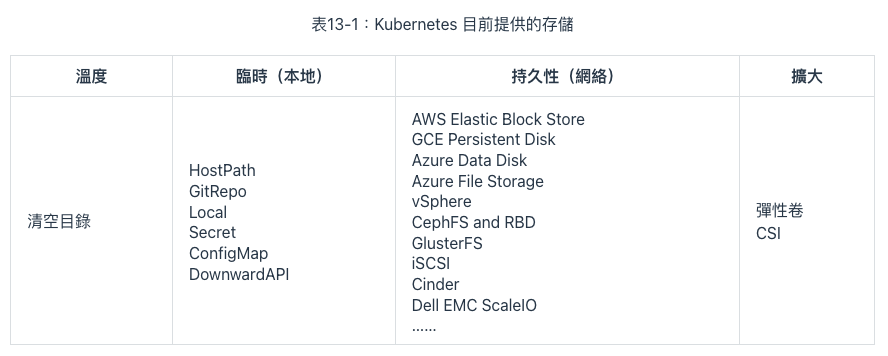
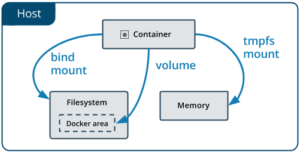
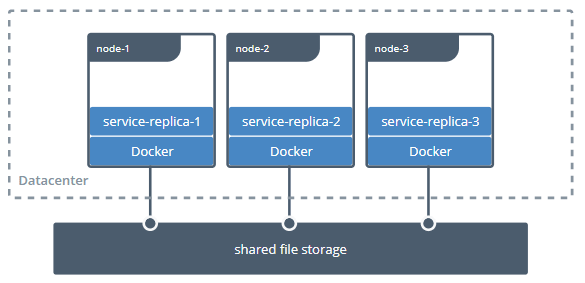
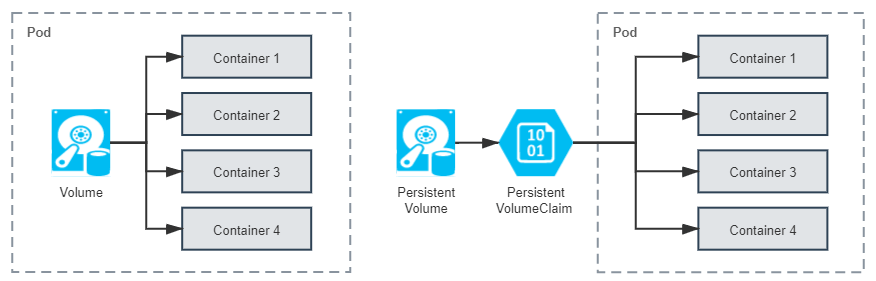
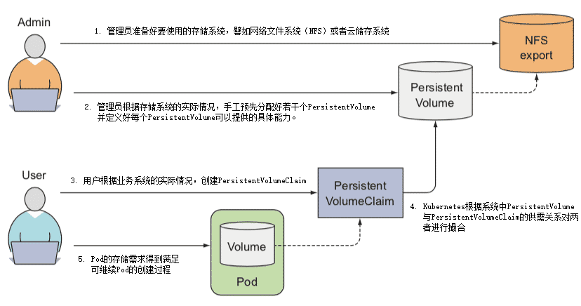
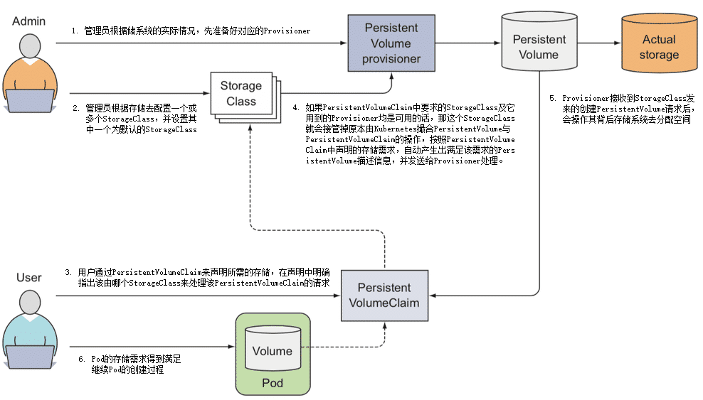
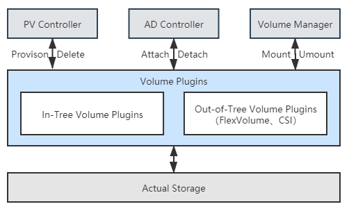
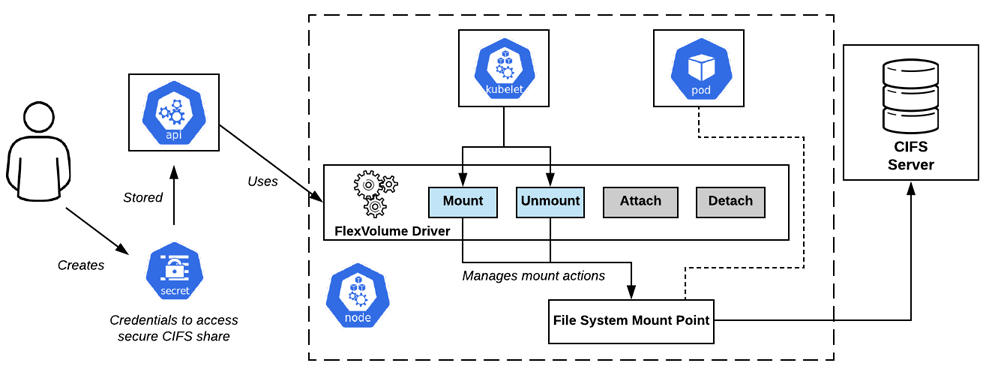
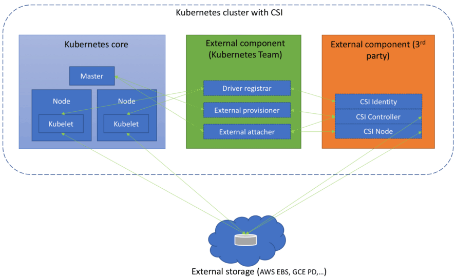
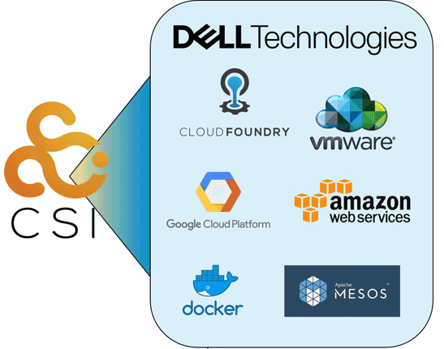

# 持久化存储

## Kubernetes 存儲設計

存儲技術本來就門類眾多，為了盡可能多地兼容各種存儲，Kubernetes 不得不預置了很多 In-Tree（意思是在 Kubernetes 的代碼樹里）插件來對接，讓用戶根據自己業務按需選擇。



- Kubernetes 是一個工業級的、面向生產應用的容器編排系統

### Mount 和 Volume

- Mount: 表示將某個外部存儲掛載到系統中
- Volume: 表示物理存儲的邏輯抽象

> 目的是為物理存儲提供有彈性的分割方式

#### Docker 內建支持了三種掛載類型

- Bind: `--mount type=bind`
- Volume: `--mount type=volume`
- tmpfs(用於在內存中讀寫臨時數據): `--mount type=tmpfs`



Ref: [Docker 官網文檔](https://docs.docker.com/storage/)

Bind Mount 是 Docker 最早提供的（發佈時就支持）掛載類型，作用是把宿主機的某個目錄（或文件）掛載到容器的指定目錄（或文件）下

```shell
docker run -v /icyfenix/html:/usr/share/nginx/html nginx:latest
```

Docker Swarm 中藉用了 `--mount` 參數過來，這個參數默認創建的是 Volume Mount，可以通過明確的 type 子參數來指定另外兩種掛載類型

```shell
docker run --mount type=bind,source=/icyfenix/html,destination=/usr/share/nginx/html nginx:latest
```

:::note
Docker 最初認為“Volume”就只是一種“外部宿主機的磁盤存儲到內部容器存儲的映射關係”，但後來眉頭一皺發現事情並沒有那麼簡單：存儲的位置並不局限只在外部宿主機、存儲的介質並不局限只是物理磁盤、存儲的管理也並不局限只有映射關係。
:::

Bind Mount 只能讓容器與本地宿主機之間建立了某個目錄的映射，如果想要在不同宿主機上的容器共享同一份存儲，就必須先把共享存儲掛載到每一台宿主機操作系統的某個目錄下，然後才能逐個掛載到容器內使用



Ref: [Docker 官網文檔](https://docs.docker.com/storage/volumes/)

> 這種存儲範圍超越了宿主機的共享存儲，配置過程卻要涉及到大量與宿主機環境相關的操作，只能由管理員人工去完成，不僅煩瑣，而且每台宿主機環境的差異導致還很難自動化。

:::tip

- 提出 Volume 最核心的一個目的是為了提升 Docker 對不同存儲介質的支撐能力，這同時也是為了減輕 Docker 本身的工作量。
- 創建 Volume 時不指定卷驅動，那默認就是 local 類型，在 Volume 中存放的數據會存儲在宿主機的 `/var/lib/docker/volumes/` 目錄之中。

:::

### 靜態存儲分配

:::info
Kubernetes 將 Volume 分為持久化的 PersistentVolume 和非持久化的普通 Volume 兩類。
:::

- 普通 Volume 的設計目標不是為了持久地保存數據，而是為同一個 Pod 中多個容器提供可共享的存儲資源
- 與掛載它的 Pod 相同的生命週期
- Pod 中不同的容器能共享相同的普通 Volume，容器重新啟動時，普通 Volume 中的數據也會能夠得到保留
- Pod 銷毀，普通 Volume 也將不復存在



#### [PersistentVolume](https://jamesdefabia.github.io/docs/user-guide/persistent-volumes/)

- 能夠將數據進行持久化存儲的一種資源對象
- 獨立於 Pod 存在，生命週期與 Pod 無關
- 不應該依附於任何一個宿主機節點，否則必然會對 Pod 調度產生干擾限制

> Kubernetes 官方給出的概念定義也特別強調了 PersistentVolume 是由管理員（運維人員）負責維護的，用戶（開發人員）通過 PersistentVolumeClaim 來匹配到合乎需求的 PersistentVolume。

:::note
**PersistentVolume & PersistentVolumeClaim**

PersistentVolume（PV）是集群中由管理員配置的一塊存儲。
PersistentVolumeClaim（PVC）是用戶對存儲的請求。

PersistentVolume 是由管理員負責提供的集群存儲。
PersistentVolumeClaim 是由用戶負責提供的存儲請求。
:::

**PersistentVolume**

> 是 Volume 這個抽象概念的具象化表現，通俗地說就它是已經被管理員分配好的具體的存儲，這裡的“具體”是指有明確的存儲系統地址，有明確的容量、訪問模式、存儲位置等信息

**PersistentVolumeClaim**

> 是 Pod 對其所需存儲能力的聲明，通俗地說就是滿足這個 Pod 正常運行要滿足怎樣的條件，譬如要消耗多大的存儲空間、要支持怎樣的訪問方式。

#### 兩者配合工作的具體過程如下

1. 管理員準備好要使用的存儲系統，它應是某種網絡文件系統（NFS）或者云儲存系統，一般來說應該具備跨主機共享的能力。
2. 管理員根據存儲系統的實際情況，手工預先分配好若干個 PersistentVolume，並定義好每個 PersistentVolume 可以提供的具體能力。譬如以下例子所示：

   ```yaml
   apiVersion: v1
   kind: PersistentVolume
   metadata:
     name: nginx-html
   spec:
     capacity:
       storage: 5Gi
     accessModes:
       - ReadWriteOnce
     persistentVolumeReclaimPolicy: Retain
     nfs:
       path: /html
       server: 172.17.0.2
   ```

3. 用戶根據業務系統的實際情況，創建 PersistentVolumeClaim，聲明 Pod 運行所需的存儲能力。

   ```yaml
   kind: PersistentVolumeClaim
   apiVersion: v1
   metadata:
   name: nginx-html-claim
   spec:
   accessModes:
     - ReadWriteOnce
   resources:
     requests:
       storage: 5Gi
   ```

4. Kubernetes 創建 Pod 的過程中，會根據系統中 PersistentVolume 與 PersistentVolumeClaim 的供需關係對兩者進行撮合，如果系統中存在滿足 PersistentVolumeClaim 聲明中要求能力的 PersistentVolume 則撮合成功，將它們綁定。如果撮合不成功，Pod 就不會被繼續創建，直至系統中出現新的或讓出空閒的 PersistentVolume 資源。
5. 以上幾步都順利完成的話，意味著 Pod 的存儲需求得到滿足，繼續 Pod 的創建過程。



Ref: [《Kubernetes in Action》](https://www.manning.com/books/kubernetes-in-action)

:::tip

- Kubernetes 對 PersistentVolumeClaim 與 PersistentVolume 撮合的結果是產生一對一的綁定關係
- 即使 PersistentVolumeClaim 申請的存儲空間比 PersistentVolume 能夠提供的要少，依然要求整個存儲空間都為該 PersistentVolumeClaim 所用，這有可能會造成資源的浪費

:::

### 動態存儲分配

> 在 2017 年 Kubernetes 發布 1.6 版本後，終於提供了今天被稱為動態存儲分配（Dynamic Provisioning）的解決方案

#### 動態存儲分配方案

指在用戶聲明存儲能力的需求時，不是期望通過 Kubernetes 撮合來獲得一個管理員人工預置的 PersistentVolume，而是由特定的資源分配器（Provisioner）自動地在存儲資源池或者云存儲系統中分配符合用戶存儲需要的 PersistentVolume，然後掛載到 Pod 中使用，完成這項工作的資源被命名為 StorageClass。

1. 管理員根據存儲系統的實際情況，先準備好對應的 Provisioner。
2. 管理員不再是手工去分配 PersistentVolume，而是根據存儲去配置 StorageClass。

   ```yaml
   apiVersion: storage.k8s.io/v1
   kind: StorageClass
   metadata:
     name: standard
   provisioner: kubernetes.io/aws-ebs #AWS EBS 的 Provisioner
   parameters:
     type: gp2
   reclaimPolicy: Retain
   ```

3. 用戶依然通過 PersistentVolumeClaim 來聲明所需的存儲，但是應在聲明中明確指出該由哪個 StorageClass 來代替 Kubernetes 處理該 PersistentVolumeClaim 的請求

   ```yaml
   apiVersion: v1
   kind: PersistentVolumeClaim
   metadata:
     name: standard-claim
   spec:
     accessModes:
       - ReadWriteOnce
     storageClassName: standard
     resource:
       requests:
         storage: 5Gi
   ```

4. 如果 PersistentVolumeClaim 中要求的 StorageClass 及它用到的 Provisioner 均是可用的話，那這個 StorageClass 就會接管掉原本由 Kubernetes 撮合 PersistentVolume 與 PersistentVolumeClaim 的操作，按照 PersistentVolumeClaim 中聲明的存儲需求，自動產生出滿足該需求的 PersistentVolume 描述信息，並發送給 Provisioner 處理。
5. Provisioner 接收到 StorageClass 發來的創建 PersistentVolume 請求後，會操作其背後存儲系統去分配空間，如果分配成功，就生成並返回符合要求的 PersistentVolume 給 Pod 使用。
6. 以上幾步都順利完成的話，意味著 Pod 的存儲需求得到滿足，繼續 Pod 的創建過程。



Ref: [《Kubernetes in Action》](https://www.manning.com/books/kubernetes-in-action)

Dynamic Provisioning 與 Static Provisioning 並不是各有用途的互補設計，而是對同一個問題先後出現的兩種解決方案。

指定 no-provisioner 作為 Provisioner 的 StorageClass，以 Local Persistent Volume 來代替

```yaml
apiVersion: storage.k8s.io/v1
kind: StorageClass
metadata:
  name: local-storage
provisioner: kubernetes.io/no-provisioner
volumeBindingMode: WaitForFirstConsumer
```

## 容器存儲與生態

:::tip
容器存儲具有很強的多樣性，如何對接後端實際的存儲系統，並且完全發揮出它所有的性能與功能並不是 Kubernetes 團隊所擅長的工作，這件事情只有存儲提供商自己才能做到最好。
:::

### Kubernetes 存儲架構

Kubernetes 參考了傳統操作系統接入或移除新存儲設備做法，把接入或移除外部存儲這件事情分解為以下三種操作：

- 首先，決定應**準備（Provision）**何種存儲，Provision 可類比為給操作系統擴容而購買了新的存儲設備。這步確定了接入存儲的來源、容量、性能以及其他技術參數，它的逆操作是**移除（Delete）**存儲。
- 然後，將準備好的存儲**附加（Attach）**到系統中，Attach 可類比為將存儲設備接入操作系統，此時儘管設備還不能使用，但你已經可以用操作系統的 `fdisk -l` 命令查看到設備。這步確定了存儲的設備名稱、驅動方式等面向系統一側的信息，它的逆操作是**分離（Detach）**存儲設備。
- 最後，將附加好的存儲**掛載（Mount）**到系統中，Mount 可類比為將設備掛載到系統的指定位置，也就是操作系統中 mount 命令的作用。這步確定了存儲的訪問目錄、文件系統格式等面向應用一側的信息，它的逆操作是**卸載（Unmount）**存儲設備。

以上提到的 Provision、Delete、Attach、Detach、Mount、Unmount 六種操作，並不是直接由 Kubernetes 來實現，實際行為均是在存儲插件中完成的，它們會分別被 Kubernetes 通過兩個控制器及一個管理器來進行調用，這些控制器、管理器的作用分別是：

- **PV 控制器（PersistentVolume Controller）**
  > PV 控制器實現了 PersistentVolume 和 PersistentVolumeClaim 的生命週期管理職能，在這個過程中，會根據需要調用存儲驅動插件的 Provision/Delete 操作。
- **AD 控制器（Attach/Detach Controller）**
  > AD 控制器的期望狀態是“所有被調度到準備新創建 Pod 的節點，都附加好了要使用的存儲；當 Pod 被銷毀後，原本運行 Pod 的節點都分離了不再被使用的存儲”，如果實際狀態不符合該期望，會根據需要調用存儲驅動插件的 Attach/Detach 操作。
- **Volume 管理器（Volume Manager）**
  > Volume 管理器實際上是 kubelet 的一部分，是 kubelet 中眾多管理器的其中一個，它主要是用來支持本節點中 Volume 執行 Attach/Detach/Mount/Unmount 操作。



:::info
後端的真實存儲依次經過 Provision、Attach、Mount 操作之後，就形成了可以在容器中掛載的 Volume，當存儲的生命週期完結，依次經過 Unmount、Detach、Delete 操作之後，Volume 便能夠被存儲系統回收。
:::

### FlexVolume 與 CSI

**[FlexVolume](https://github.com/kubernetes/community/blob/master/contributors/devel/sig-storage/flexvolume.md)**

- Kubernetes 很早期版本（1.2 版開始提供，1.8 版達到 GA 狀態）就開始支持的擴展機制，它是只針對 Kubernetes 的私有的存儲擴展
- 目前已經處於凍結狀態，可以正常使用但不再發展新功能了

**[CSI（Container Storage Interface）](https://github.com/container-storage-interface/spec/blob/master/spec.md)**

- CSI 是公開的技術規範，任何容器運行時、容器編排引擎只要願意支持，都可以使用 CSI 規範去擴展自己的存儲能力，這是目前 Kubernetes 重點發展的擴展機制

#### FlexVolume



Ref: [圖片來源](https://laptrinhx.com/kubernetes-volume-plugins-evolution-from-flexvolume-to-csi-2724482856/)

如果僅僅考慮支持最基本的 Static Provisioning，那實現一個 FlexVolume Driver 確實是非常簡單的。然而也是由於 FlexVolume 過於簡單了，導致它應用起來會有諸多不便之處，譬如：

- FlexVolume 並不是全功能的驅動：FlexVolume 不包含 Provision 和 Delete 操作，也就無法直接用於 Dynamic Provisioning，除非你願意再單獨編寫一個 External Provisioner。
- FlexVolume 部署維護都相對繁瑣：FlexVolume 是獨立於 Kubernetes 的可執行文件，當集群節點增加時，需要由管理員在新節點上部署 FlexVolume Driver，有經驗的系統管理員通常會專門編寫一個 DaemonSet 來代替人工來完成這項任務。
- FlexVolume 實現複雜交互也相對繁瑣：FlexVolume 的每一次操作，都是對插件可執行文件的一次獨立調用，這種插件實現方式在各種操作需要相互通訊時會很彆扭。譬如你希望在執行 Mount 操作的時候，生成一些額外的狀態信息，這些信息在後面執行 Unmount 操作時去使用，那就只能把信息記錄在某個約定好的臨時文件中，對於一個面向生產的容器編排系統，這樣的做法實在是過於簡陋了。

#### CSI

CSI 規範可以分為需要容器系統去實現的組件，以及需要存儲提供商去實現的組件兩大部分。前者包括了存儲整體架構、Volume 的生命週期模型、驅動註冊、Volume 創建、掛載、擴容、快照、度量等內容，這些 Kubernetes 都已經完整地實現了，大體上包括以下幾個組件：

- Driver Register：負責註冊第三方插件，CSI 0.3 版本之後已經處於 Deprecated 狀態，將會被 Node Driver Register 所取代。
- External Provisioner：調用第三方插件的接口來完成數據卷的創建與刪除功能。
- External Attacher：調用第三方插件的接口來完成數據卷的掛載和操作。
- External Resizer：調用第三方插件的接口來完成數據卷的擴容操作。
- External Snapshotter：調用第三方插件的接口來完成快照的創建和刪除。
- External Health Monitor：調用第三方插件的接口來提供度量監控數據。

需要存儲提供商去實現的組件才是 CSI 的主體部分，即前文中多次提到的“第三方插件”。這部分著重定義了外部存儲掛載到容器過程中所涉及操作的抽象接口和具體的通訊方式，主要包括以下三個 gRPC 接口：

- **CSI Identity 接口**：用於描述插件的基本信息，譬如插件版本號、插件所支持的 CSI 規範版本、插件是否支持存儲卷創建、刪除功能、是否支持存儲卷掛載功能，等等。
- **CSI Controller 接口**：用於從存儲系統的角度對存儲資源進行管理，譬如準備和移除存儲（Provision、Delete 操作）、附加與分離存儲（Attach、Detach 操作）、對存儲進行快照，等等。
- **CSI Node 接口**：用於從集群節點的角度對存儲資源進行操作，譬如存儲卷的分區和格式化、將存儲卷掛載到指定目錄上、或者將存儲卷從指定目錄上卸載，等等。



Ref: [圖片來源](https://medium.com/google-cloud/understanding-the-container-storage-interface-csi-ddbeb966a3b)

:::info
與 FlexVolume 以單獨的可執行程序的存在形式不同，CSI 插件本身便是由一組標準的 Kubernetes 資源所構成，CSI Controller 接口是一個以 StatefulSet 方式部署的 gRPC 服務，CSI Node 接口則是基於 DaemonSet 方式部署的 gRPC 服務。
:::

### 從 In-Tree 到 Out-of-Tree

從 1.14 版本開始，Kubernetes 啟動了 In-Tree 存儲驅動的 CSI 外置遷移工作，按照計劃，在 1.21 到 1.22 版本（大約在 2021 年中期）時，Kubernetes 中主要的存儲驅動，如 AWS EBS、GCE PD、vSphere 等都會遷移至符合 CSI 規範的 Out-of-Tree 實現，不再提供 In-Tree 的支持。

這種做法在設計上無疑是正確的，然而，這又面臨了此前提過的該如何兼容舊功能的策略問題，譬如下面 YAML 定義了一個 Pod：

```yaml
apiVersion: v1
kind: Pod
metadata:
  name: nginx-pod-example
spec:
  containers:
    - name: nginx
      image: nginx:latest
      volumeMounts:
        - name: html-pages-volume
          mountPath: /usr/share/nginx/html
        - name: config-volume
          mountPath: /etc/nginx
      volumes:
        - name: html-pages-volume
          hostPath:
            path: /srv/nginx/html
            type: Directory
        - name: config-volume
          awsElasticBlockStore:
            volumeID: vol-0b39e0b08745caef4
            fsType: ext4
```

其中用到了類型為 hostPath 的 Volume，這相當於 Docker 中驅動類型為 local 的 Volume，不需要專門的驅動；而類型為 awsElasticBlockStore 的 Volume，從名字上就能看出是指存儲驅動為 AWS EBS 的 Volume，當 CSI 遷移完成，awsElasticBlockStore 從 In-Tree 卷驅動中移除掉之後，它就應該按照 CSI 的寫法改寫成如下形式：

```yaml
- name: config-volume
  csi:
    driver: ebs.csi.aws.com
    volumeAttributes:
      - volumeID: vol-0b39e0b08745caef4
      - fsType: ext4
```

:::note
Kubernetes 1.17 中又提出了稱為 CSIMigration 的解決方案，讓 Out-of-Tree 的驅動能夠自動偽裝成 In-Tree 的接口來提供服務。
:::

:::tip
好的設計需要權衡多個方面的利益，很多時候都得顧及現實的影響，要求設計向現實妥協，而不能僅僅考慮理論最優的方案。
:::

### 容器插件生態



Ref: [圖片來源](https://blog.dellemc.com/en-us/kubernetes-data-protection-hits-mainstream-with-container-storage-interface-csi-117/)

- 塊存儲
  > 數據存儲的最古老形式，數據都儲存在固定長度的一個或多個塊（Block）中，想要讀寫訪問數據，就必須使用與存儲相匹配的協議（SCSI、SATA、SAS、FCP、FCoE、iSCSI……）來進行的。
- 文件存儲:
  > 最貼近人類用戶的數據存儲形式，數據存儲在長度不固定的文件之中，用戶可以針對文件進行新增、寫入、追加、移動、複製、刪除、重命名等各種操作，通常文件存儲還會提供有文件查找、目錄管理、權限控制等額外的高級功能。
- 對象儲存:
  > 相對較新的數據存儲形式，是一種隨著雲數據中心的興起而發展起來的存儲，是以非結構化數據為目標的存儲方案。
