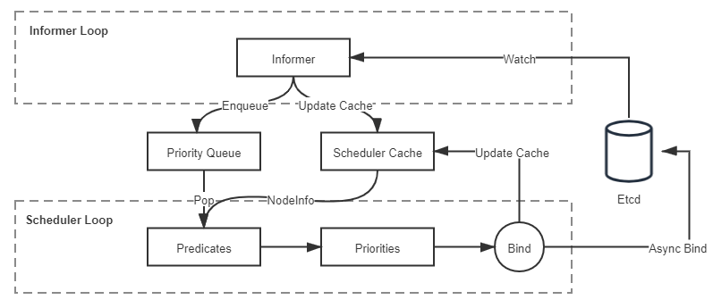

# 資源與調度

> 調度是指為新創建出來的 Pod 尋找到一個最恰當的宿主機節點來運行它，這個過程成功與否、結果恰當與否，關鍵取決於容器編排系統是如何管理與分配集群節點的資源的。

## 資源模型

資源在 Kubernetes 中是極為常用的術語，廣義上講，Kubernetes 系統中所有你能夠接觸的方方面面都被抽象成了資源

- 工作負荷的資源（Pod、ReplicaSet、Service、……）
- 存儲的資源（Volume、PersistentVolume、Secret、……）
- 策略的資源（SecurityContext、ResourceQuota、LimitRange、……）
- 身份的資源（ServiceAccount、Role、ClusterRole、……）

從編排系統的角度來看，Node 是資源的提供者，Pod 是資源的使用者，調度是將兩者進行恰當的撮合。

Node 通常能夠提供的三方面的資源：

- 計算資源（如處理器、圖形處理器、內存）
  - 處理器這樣的資源被稱作可壓縮資源（Compressible Resources）
  - 內存這樣的資源，則被稱作不可壓縮資源（Incompressible Resources）
- 存儲資源（如磁盤容量、不同類型的介質）
- 網絡資源（如帶寬、網絡地址）

## 服務質量與優先級

:::tip
設定資源計量單位的目的是為了管理員能夠限制某個 Pod 對資源的過度佔用，避免影響到其他 Pod 的正常運行。
:::

- 具體的配置是 Pod 的 `spec.containers[].resource.limits/requests.cpu/memory` 字段。
  - `requests` 是給調度器用的，Kubernetes 選擇哪個節點運行 Pod，只會根據 `requests` 的值來進行決策
  - `limits` 才是給 cgroups 用的，Kubernetes 在向 cgroups 的傳遞資源配額時，會按照 `limits` 的值來進行設置。

**服務質量等級（Quality of Service Level，QoS Level）**

> 質量等級是 Pod 的一個隱含屬性，也是 Kubernetes 優先保障重要的服務，放棄一些沒那麼重要的服務的衡量準繩。

Kubernetes 目前提供的服務質量等級一共分為三級，由高到低分別為 Guaranteed、Burstable 和 BestEffort。

- Guaranteed: Pod 中所有的容器都設置了 `limits` 和 `requests`，且兩者的值相等
- Burstable: Pod 中有部分容器的 `requests` 值小於 `limits` 值，或者只設置了 `requests` 而未設置 limits
- BestEffort: `limits` 和 `requests` 兩個都沒設置

:::note
除了服務質量等級以外，Kubernetes 還允許系統管理員自行決定 Pod 的優先級，這是通過類型為 PriorityClass 的資源來實現的。
:::

**優先級（Priority）**

:::info
優先級會影響調度這很容易理解，它是指當多個 Pod 同時被調度的話，高優先級的 Pod 會優先被調度。
:::

優先級影響更大的另一方面是指 Kubernetes 的**搶占機制（Preemption）**，正常未設置優先級的情況下，如果 Pod 調度失敗，就會暫時處於 Pending 狀態被擱置起來，直到集群中有新節點加入或者舊 Pod 退出。

## 驅逐機制

:::info
Pod 的驅逐機制是通過 kubelet 來執行的，kubelet 是部署在每個節點的集群管理程序，由於本身就運行在節點中，所以最容易感知到節點的資源實時耗用情況。kubelet 一旦發現某種不可壓縮資源將要耗盡，就會主動終止節點上較低服務質量等級的 Pod，以保證其他更重要的 Pod 的安全。被驅逐的 Pod 中所有的容器都會被終止，Pod 的狀態會被更改為 Failed。
:::

- 可用內存（`memory.available`）
- 宿主機的可用磁盤空間（`nodefs.available`）
- 文件系統可用 inode 數量（`nodefs.inodesFree`）
- 可用的容器運行時鏡像存儲空間（`imagefs.available`）

後面三個的閾值都是按照實際容量的百分比來計算的，具體的默認值如下：

```
memory.available < 100Mi
nodefs.available < 10%
nodefs.inodesFree < 5%
imagefs.available < 15%
```

管理員可以在 kubelet 啟動時，通過命令行參數來修改這些默認值

```shell
$ kubelet --eviction-hard=memory.available<10%
```

驅逐機制中就有了軟驅逐（Soft Eviction）、硬驅逐（Hard Eviction）以及優雅退出期（Grace Period）的概念：

- **軟驅逐**：通常配置一個較低的警戒線（譬如可用內存僅剩 20%），觸及此線時，系統將進入一段觀察期。
- **硬驅逐**：通常配置一個較高的終止線（譬如可用內存僅剩 10%），一旦觸及此紅線，立即強制殺掉 Pod，不理會優雅退出。

軟驅逐是為了減少資源抖動對服務的影響，硬驅逐是為了保障核心系統的穩定，它們並不矛盾，一般會同時使用，譬如以下例子所示：

```shell
$ kubelet --eviction-hard=memory.available<10% \
          --eviction-soft=memory.available<20% \
          --eviction-soft-grace-period=memory.available=1m30s \
          --eviction-max-pod-grace-period=600
```

## 默認調度器

Kubernetes 是如何撮合 Pod 與 Node 的，這其實也是最困難的一個問題。調度是為新創建出來的 Pod 尋找到一個最恰當的宿主機節點去運行它，這句話裡就包含有“運行”和“恰當”兩個調度中關鍵過程，它們具體是指：

1. **運行**：從集群所有節點中找出一批剩餘資源可以滿足該 Pod 運行的節點。為此，Kubernetes 調度器設計了一組名為 Predicate 的篩選算法。
2. **恰當**：從符合運行要求的節點中找出一個最適合的節點完成調度。為此，Kubernetes 調度器設計了一組名為 Priority 的評價算法。

**共享狀態（Shared State）的雙循環調度機制**

這種調度機制後來不僅應用在 Google 的 Omega 系統（Borg 的下一代集群管理系統）中，也同樣被 Kubernetes 繼承了下來。



- **Informer Loop**
  - 它是一系列 Informer 的集合，這些 Informer 持續監視 Etcd 中與調度相關資源（主要是 Pod 和 Node）的變化情況，一旦 Pod、Node 等資源出現變動，就會觸發對應 Informer 的 Handler。
  - 根據 Etcd 中的資源變化去更新調度隊列（Priority Queue）和調度緩存（Scheduler Cache）中的信息，譬如當有新 Pod 生成，就將其入隊（Enqueue）到調度隊列中，如有必要，還會根據優先級觸發上一節提到的插隊和搶占操作。
- **Scheduler Loop**

  > 核心邏輯是不停地將調度隊列中的 Pod 出隊（Pop），然後使用 Predicate 算法進行節點選擇。

  - **Predicate**
    > 一組節點過濾器（Filter）
    - **通用過濾策略**：最基礎的調度過濾策略，用來檢查節點是否能滿足 Pod 聲明中需要的資源。
    - **卷過濾策略**：與存儲相關的過濾策略，用來檢查節點掛載的 Volume 是否存在衝突（譬如將一個塊設備掛載到兩個節點上），或者 Volume 的可用區域是否與目標節點衝突，等等。
    - **節點過濾策略**：與宿主機相關的過濾策略，最典型的是 Kubernetes 的污點與容忍度機制（Taints and Tolerations），譬如默認情況下 Kubernetes 會設置 Master 節點不允許被調度，這就是通過在 Master 中施加污點來避免的。

:::tip
Predicate 算法所使用的一切數據均來自於調度緩存，絕對不會去遠程訪問節點本身。只有 Informer Loop 與 Etcd 的監視操作才會涉及到遠程調用，Scheduler Loop 中除了最後的異步綁定要發起一次遠程的 Etcd 寫入外，其餘全部都是進程內訪問，這一點是調度器執行效率的重要保證。
:::

調度緩存就是兩個控制循環的共享狀態（Shared State），這樣的設計避免了每次調度時主動去輪詢所有集群節點，保證了調度器的執行效率。
