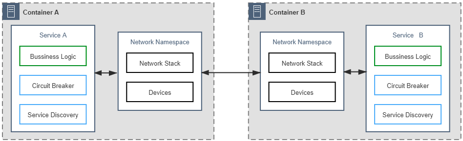
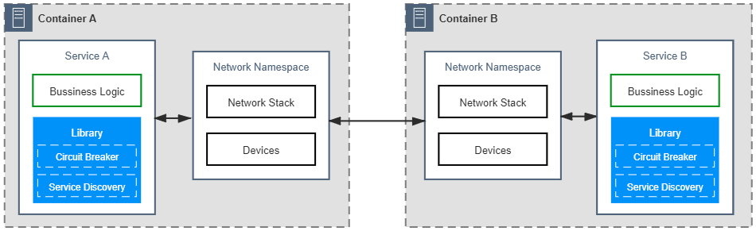
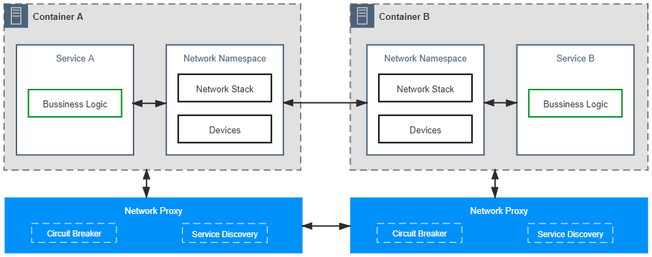
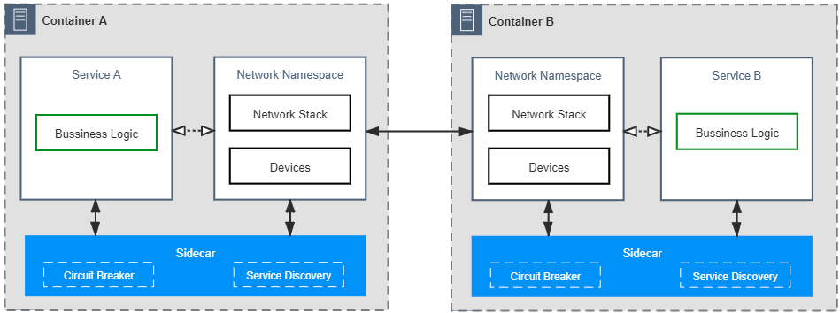
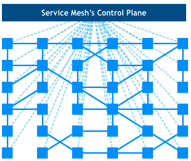
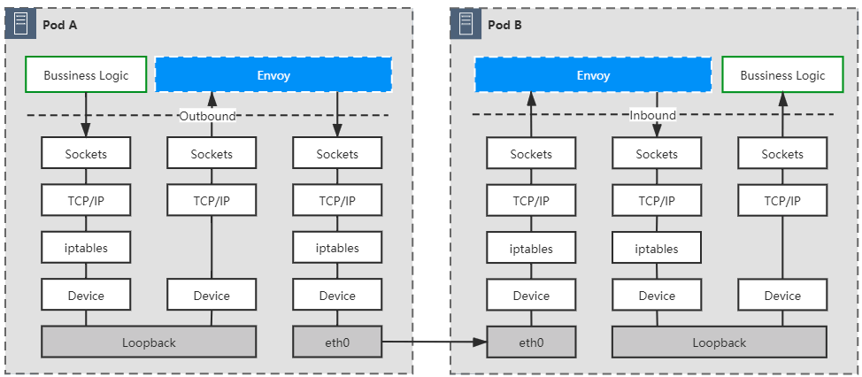
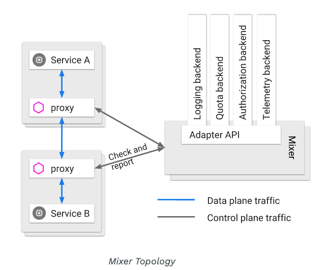
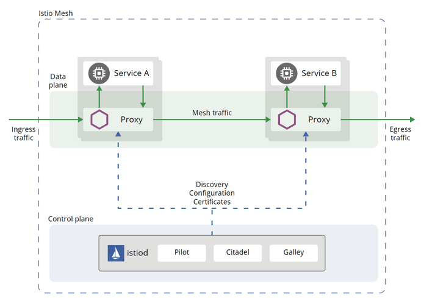
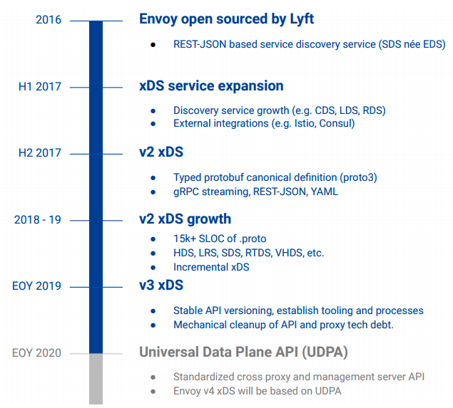

# Service Mesh
- 在複雜的distributed and microservices架構中，確保網路請求被可靠的傳遞

### What is Service Mesh?
- 處理程式之間通信的基礎設施
- Sidecar pattern
    - 在container旁邊的輔助程式

## 透明通信的沿革
### 通信的成本: 確保通信的品質從應用程式逐步轉移到基礎建設
#### 第一階段: 通信的可靠性透過開發者保障

- 錯誤中學習
    - 開發者初期提供http api或者rpc給caller，但在發展過程中遇到問題，所以在程式邏輯中打補丁，最後形成程式邏輯跟處理通信代碼混在一起的情況。
- Cons
    - 這個working model，代表要讓後端也很熟悉通信處理，對開發者要求高，不易培養。
    - 通信跟業務邏輯混雜，系統複雜度容易變高，維護性低。

#### 第二階段: 抽出通信邏輯，各司其職

- 通信邏輯模組化，並由專門的開發者實作，可以想像內不可能出線處裏通信的SDK，後端只要透過call指定方法或api就可以確保通信。
- Cons
    - 後端還是要學習如何使用SDK
    - 各個語言都要有對應的SDK

#### 第三階段: 將通信獨立到應用程式之外，程式透過網路代理來溝通，由專門的網路代理提供商來處理

- 單獨的通信process，可以讓通信與語言完全拖勾，Network Proxy還是跟服務住在同個容器或者虛擬機，接管網路七層或網路四層。
- Gateway Proxy: 如果代理部署與應用程式分開，就可以讓代理同時管理多個應用程式的通信服務。
- Sidecar Proxy: 如果代理部署與應用程式靠近，共享容器的網路空間，邊車代理。
- Cons
    - 通信服務提供者，不是管理者。

#### 第四階段: 邊車模式，通信可靠性透過通信基礎設施來保障

- 強制性接管: 因為跟應用程式容器共享網路空間，他對網路的控制是透過容器的iptables實現。
- 對既有的應用程式邏輯不需要處理，只要掛上Sidecar就可以透過Sidecar proxy管理網路。
- Cons
    - 應用程序服務的ip地址需要運維人員或開發人員維運。

#### 第五階段: 服務網格，管理Sidecars，並且將Data Plane以及Control Plane分離開

- Data Plane
    - Sidecars: Sidecar之間的通信，轉發應用城市之間的數據封包
- Control Plane
    - Proxy and Control Plane之間的通信: Sidecar要得到服務發現等從Control Plane來的資訊。

## Service Mesh
### Data Plane: Envoy -> istio-proxy
- istio-proxy
    - pilot-agent: 對envoy生命週期管理，包含啟動、重啟以及退出。
    - envoy
#### 代理注入
- Chassis: 輕量的SDK，對應用程式有侵入性，Apache的ServiceComb Mesher。
- Injector:
    - 手動注入
        - istioctl kube-inject -f YOUR_POD.YAML
    - 自動注入
        - K8s Mutating Webhook Dynamic Admission Control
            - 對k8s `namespace`配置`istio-injection=enabled`
            - 在pod CREATE階段會觸發Mutating Webhook，call injector

#### 流量挾持

- initContainer
    - 攔截所有流量，除了15090(Mixer)以及15020(Ingress Gateway)
    - 轉發到15006(Envoy Inbound Port)
    - 再從15001(Envoy Outbound Port)出去
- eBPF(Extended Berkeley Packet Filter)
    - 在socket layer直接轉發，不用再透過TCP/IP，可以減少一次Loop back

#### 可靠通信
- Envoy透過三種Resources去定義流量的管理
    - Listener: Listen Downstream data
    - Cluster: Connect Upstream Host，可以看作是Service
    - Router: 決定Downstream data要dispatch到哪個cluster，核心資訊是Cluster相關規則
    - Filter: plugin
- Terminology
    - xDS: 發現以及訪問Envoy資源的協議
    - LDS(Listener Discovery Service): 自動發現Listener的服務，是所有xDS協議基礎，LDS可以去發現Envoy配置的Listner。
    - CDS(Cluster Discovery Service): Control Plane會將所有發現可以訪問的服務都給Envoy。
    - EDS(Endpoint Discovery Service): 被標記為EDS代表這些endpoint 地址該由xDS轉發，而不是依靠DNS。
    - RDS(Router Discovery Service): 自動發現Router的服務。

### Control Plane
- 不直接參與通信，但提供配置與策略，指導別人通信。
- Istio在1.5之前透過四個組件Mixer、Pilot、Galley、Citadel來完成Control Plane的工作，但後續被詬病過度設計，將Pilot、Galley、Citadel整合為Istiod。
    - Mixer: 從 Envoy 網路代理和其他元件蒐集觀測數據，並將其發送到 Mixer 進行評估。使 Istio 可以與各種微服務進行互動。
        
    - Pilot: Envoy Sidecar的服務發現、智慧路由的流量管理功能(ex: A/B測試，金絲雀部署等)和彈性(ex: Timeout、Retry、Circuit Breaker)，將控制流量的路由規則轉換成Envoy 的形式，並在運作時將其發送到Sidecar。
    - Citadel: 內建的憑證管理來實現微服務之間使用者的身分驗證，使用了 Citadel可以透過身分驗證的方式來實行路由策略。
    - Galley：Istio 負責設定的引入、處理及發送的工作。
        

#### Interact with Data Plane
- Inject Sidecar
- 策略分發: 原本Pilot核心工作。
- 配置分發: 監聽多種配置來源資料(kube-apiserver)。原本Galley的核心工作。

#### 流量控制
- 請求路由: VirtualService、DestinationRule等K8s CRD的規則
- 流量治理: Timeout、Retry、Circuit Breaker
- 調試能力: A/B測試

#### 通信安全
- 生成CA證書
- SDS服務代理: 早期透過K8s Secret掛到Pod中，目前透過SDS代理來保證私鑰不會在網路傳輸。
- 認證
- 授權

#### 可觀測性
- 日誌搜集: ELK
- 鏈路追蹤: Zipkin
- 指標度量: 響應延遲、流量大小、錯誤數量、飽和度

### Service Mesh and Ecosystem
- 從各做各的，到統一介面
    - 2019 KubeCon，MS與 Linkerd、HashiCorp、Solo、Kinvolk、Weaveworks共同宣布Service Mesh Interface(SMI)

#### SMI由四方面API構成
- Traffic Specs: 定義流量的表示方式，目前有TCP跟HTTP。
- Traffic Split: 基於K8s `Service`而來，如果要拆分流量就要定義Service 層次結構，目前Istio透過virtualservice來解決。
- Traffic Metrics: 符合K8s Metrics API。
- Traffic Access Control: Support `ServiceAccount` in K8s

