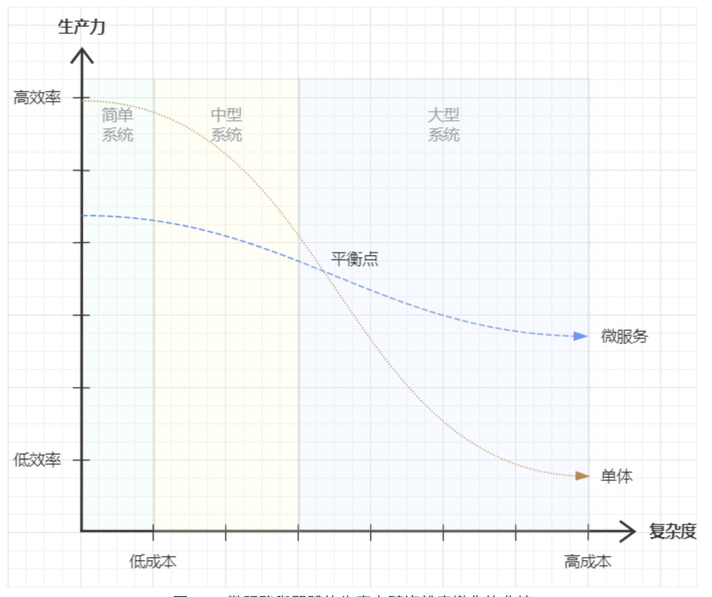
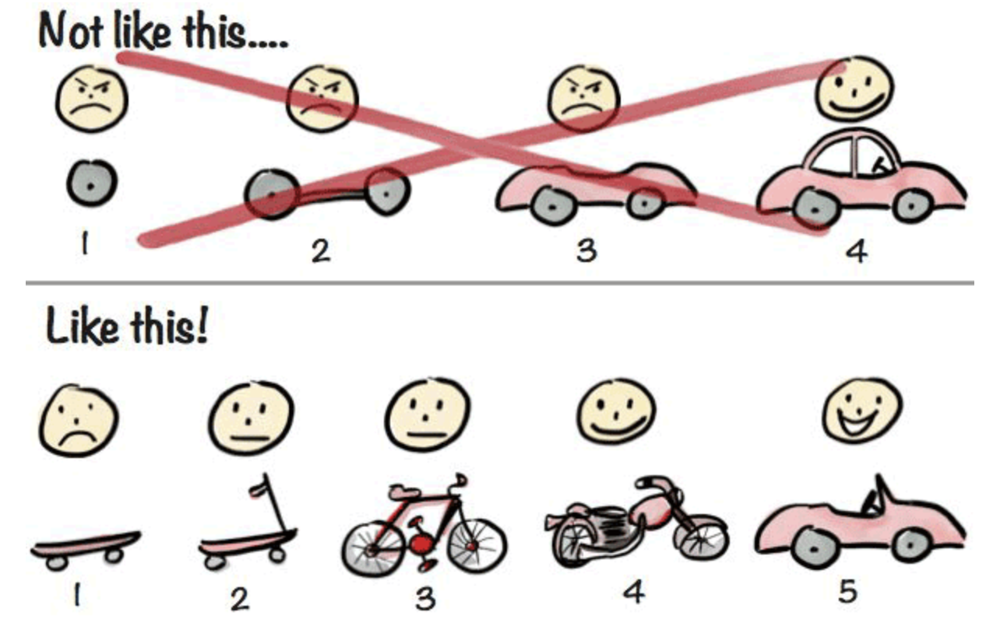

## 沒有銀彈：軟體開發中任何一項技術、方法、架構都不可能是銀彈

本章：哪些場景適合去使用微服務，以及一些已經被驗證過、被總結為經驗的最佳的實踐方式，更主要是討論什麼場景不適合微服務，微服務存在哪些理解誤區。因為微服務也不是銀彈。

## 目的：微服務的驅動力

微服務的目標是將應用邏輯適當的分解，目的是當作了有效的拆分，我們可以實現敏捷開發和部署。

> 能夠通過擴展硬體的手段解決問題就盡量別使用複雜的軟體方法，因為硬體的成本能夠持續穩定地下降，而軟體開發的成本則不可能。
> 
> 把系統拆成多個微服務，一旦在某個關鍵地方依然卡住了業務邏輯，其整體的結果往往還不如單體，沒有清晰的職責劃分，導致擴展性失效，多加機器往往還不如單機。

通常比較常見的、合理的驅動力來自組織外部、內部兩方面

### 當意識到沒有什麼技術能夠包打天下
你不會一開始就想用 C 去寫 ML 的應用。

很多時候為異構能力（不同業務邏輯的目標）進行的分佈式部署，並不是你想或者不想的問題，而是沒有選擇、無可避免的。

### 當個人能力因素成為系統發展的明顯制約
在單體架構下，沒有什麼有效阻斷錯誤傳播的手段，而微服務能夠物理劃分系統的**整體**與**部分**
由擁有較深技術水準的人員去保證關鍵的技術的品質，其他大量外圍的功能即使沒有那麼高的技術，也能保證系統整體的穩定和局部的容錯與自癒，以進行快速迭代。

### 當遇到來自外部商業層面對內部技術層面提出的要求
客戶說要 -> 微服務架構變成大型系統先進性的背書

### 變化發展特別快的創新業務系統往往會自主地向微服務架構靠近
避免程式碼在 library / package 的各種依賴而導致糾纏不清，讓系統有更好的可觀測性和自癒能力

### 大規模的、業務複雜的、歷史包袱沉重的系統也可能主動向微服務架構靠近
微服務在裡面扮演的角色是將**部分**系統拆除、修改、更新、替換

## 前提：微服務需要的條件 (= 什麼情況下可以開始微服務化)
解決非技術方面的問題，準確地說是人的問題，因為分散式不是一項純粹的技術性工作。

### 決策者與執行者都能意識到康威定律在軟件設計中的關鍵作用

:::info 康威定律
系統的架構趨同於組織的溝通結構。
:::

為了推進軟體架構的微服務化而配合地調整組織架構，通常不是一件容易的事情。因為架構不僅僅是個技術問題，更是一種社交活動，甚至還可能會涉及利益的重新分配。

這些問題不僅需要執行者有良好的社交能力，還需要更上層的決策者充分理解架構演變同步調整組織結構的必要性，為微服務化打破局部的利益藩籬。

### 組織中具備一些對微服務有充分理解、有一定實踐經驗的技術專家
微服務在架構方面帶來了額外的複雜性

開發 business logic 的 programer 可以不去深究跟踪治理、負載均衡、故障隔離、認證授權、伸縮擴展這些系統性的問題(?)，它們被掩埋在基礎設施之下

總使 Kubernetes、Istio、Spring Cloud、Dubbo 等現成的開源工具好用方便，但它們本身也具備不低的複雜性，所以我們需要可以在微服務架構中撐起系統主幹的技術專家和運維專家

由於更先進的軟體架構已經允許更平庸的開發者也同樣能寫出可運行、可用於生產的軟件產品，同時又對精英開發者提出更多、更複雜的技術要求。

所以在未來的資訊行業(now?)，軟體工程師被分成：完成 function 的 programer (碼農)與金字塔頂端架構師(ChatGPT 馴獸師)。

### 系統應具有以自治為目標的自動化與監控度量能力
微服務是由大量松耦合服務互相協作構成的系統，所以自動化與監控作度量為它的建設前提是順理成章的《Microservice Prerequisites》Martin Fowler 2014

Rapid Provisioning：即使不依賴雲計算數據中心（中心化的單一節點）的支持，也有能力在短時間內迅速地啟動好一台新的服務器。

Basic Monitoring：監控**體系**有能力迅速捕捉到整體系統中出現的技術問題和業務問題。

Rapid Application Deployment：有能力通過全自動化的部署管道，將服務的變更迅速部署到測試或生產環境中。

:::info 部署管道 deployment pipeline
將 build 拆分成多個 stages, 而每個 stage 就可為這次的部署提供足夠的信心程度，遇到問題也能夠及時地知道錯誤發生地。

在實踐 CD 的過程中使用 deployment pipeline 可以更清楚的掌握系統的瓶頸、自動化機會和協作點。
:::

筆者認為微服務自動化的最終目的是構築一個可持續的生態系統，但並不是指要達到如此高的自動化程度之後才能開始微服務，只要滿足與系統規模和目標相匹配的自動化能力，建設微服務的不同時期，由不同程度的人力去參與運維完全是合情合理的。

### 複雜性已經成為製約生產力的主要矛盾
當單體架構與微服務架構的生產力曲線已經到達交叉點，此時開始進行微服務化才是有收益的。然而現實中很多架構師卻不得不在這上面**主動去犯錯**。

因為我們潛意識中總會希望系統建設是“少走幾步能到位”，不能真正地接受**演進式設計**。

:::info 演進式設計
從長遠(?)來看，許多服務將被廢棄而不是發展。
長期來看，多數服務的結局都是報廢而非演進。
:::

## 邊界：微服務的粒度
識別微服務的邊界 => 領域趨動設計 Domain Driven Design(DDD)
:::info
Domain-Driven Design: Tackling Complexity in the Heart of Software https://www.tenlong.com.tw/products/9789864343874
Microservices Patterns: With examples in Java https://www.tenlong.com.tw/products/9787111624127
:::

本章作者從業務之外的其他角度，從非功能性、研發效率

### 微服務粒度的下界
* 獨立:能夠獨立發布、獨立部署、獨立運行與獨立測試
* 內聚:強相關的功能與數據在同一個服務中處理
* 完備:一個服務包含至少一項業務實體與對應的完整操作

### 微服務並非越小越好
* 性能:服務粒度大小必須考慮到消耗在網絡上的時間與方法本身執行時間的比例，避免設計得的過於瑣碎，客戶端不得不多次調用服務才能完成一項業務操作。
* 一致性:如果某些數據必須要求保證強一致性的話，那它們本身就應當聚合在同一個微服務中，數據一致性是內聚。
* 可用性:微服務架構中應該把各種錯誤是為意料中。如果兩個微服務都必須依賴對方可用才能正常工作，那就應當將其合併到同一個微服務中。

### 微服務粒度的上界
一個 2 Pizza Team 能夠在一個研發週期內完成的全部需求範圍。

#### 人數
微服務的上界並非受限於技術，而是受限於人，更準確地說，受限於人與人之間的社交協作。
>> 溝通成本 = n×(n-1)/2 ，n 為參與項目的人數

#### 研發週期
人員數量固定的前提下，這個答案不僅與開發者的能力水平相關，更是與研發模式和周期相關。
* 瀑布開發
* Scrum
* Daily build

在上下界範圍內，架構師會根據業務和團隊的實際情況來靈活劃定微服務的具體粒度。（極少被討論到的）
* 要求微服務至少包含一項完整的服務，不超過上界的前提下，這個微服務包含了兩項、三項業務操作是否合理。
* 要求單個研發週期內能處理掉一個微服務的全部需求，不超過下界的前提下，一個週期就能完成分屬於兩個、三個微服務的全部需求時，是縮短研發週期更合理，還是允許這個週期內同時開發幾個微服務。

## 治理(Governance)：理解系統複雜性

治理：讓產品（系統、業務、流程、服務）能夠符合預期地穩定運行，並持續保持在一定的品質上。
作者從靜態與發展兩種角度解釋治理與復雜性的關係。

### 靜態的治理

要求一個資訊系統能夠符合預期地運行，乍聽之下算不上什麼**高標準**。不過，當複雜性高到一定程度的時候，就需要靠治理來達到正常運行這個目標。

複雜是相對於人而言的，是一個主觀標準，每個人都可以有不同的裁量。

基於大型軟體都是由開發者們互相協作完成的這個出發點，作者列出複雜性的來源
* Cognitive Load：人接受業務、概念、模型、設計、接口、程式碼等信息所帶來的負擔大小，其中也包含技術的認知複雜度。系統中個體的 Cognitive Load 越大，系統就越複雜。
* Collaboration Cost(合作成本)：團隊共同研發時付出的溝通、管理成本高低。系統個體間協作的成本越高，系統就越複雜。本質上是來自合作的溝通複雜度。

# Cognitive Load 

來自技術的認知複雜度，而微服務或分散式系統所提倡許多理念，理解的角度都是機器而不是人，有意無意地加劇了該現象。

由於認知負荷是與概念、模型、業務、程式碼的規模呈正比關係，這些工作都是由人來做的，所以可以將 Cognitive Load 複雜度 視為 O(k×N)，單體與微服務的差別是複雜度比例係數 k 的大小差別，微服務架構的 k 要比單體架構的 k 更大。
> OOP 是容易理解的，但服務間的溝通大部分使用的是面向**資源**而非面向**Object**，換句話說當你為服務間以 Object 去思考的時候代表你違反了上面提到的微服務的粒度下界
> 定外搭建微服務還需要考量 async、粗粒度服務接口（粗粒度API 比細粒度API 更難使用?）、容錯處理、去中心化（儘管中心化設計會降低可用性，但確實比非中心化有更高的可管理性）等等
> 這些都提高了 Cognitive Load

# 合作成本

計算的方式按前面章節提出的是 O(n^2)，但在微服務架構下，組織的拆分與產品的拆分對齊（康威定律），微服務系統間的關聯變成服務內部的 IPC 和服務之間的 API，組織的溝通也被拆成團隊內部與團隊之間，就如同 divide and conquer => O(NlogN)。

整體複雜度是 Cognitive Load 與合作成本兩者之和，對於單體架構是 O(k×N) + O(N^2)，對於微服務架構，整體複雜度就是 O(k×N) + O(NlogN)，N 的規模增加時單體架構的複雜度增長更快

軟體規模小時微服務的複雜度高於單體系統，規模大時則相反。**這裡的原因就是微服務的 Cognitive Load 較高，但是協作成本較低。**

以數據量化複雜度，並量化出不同架構的複雜度，重點是提出微服務應對複雜性的手段:分治

### 發展的治理

治理對動態發展方面的要求，是指它指採取某些措施，讓軟件系統能夠持續保持一定的質量。

Architectural Decay(架構腐化)：任何靜態的治理方案只能延緩，不能根治。

高級技術專家不可能持續參與軟體穩定之後的迭代過程，反過來，如果持續綁定在同一個達到穩定之後的項目上，也很難培養出技術專家。
* 新人加入，技術專家偶爾來評審一下或救一救火
* 時間長了出現某些並不適合放進最初設計中的需求
* 工期緊 任務重 業務複雜 代碼不熟悉 都會成為欠下一筆技術債的妥協理由，導致原則底線每一次被細微地突破
* 最終出現破窗效應

:::info 破窗效應
任何一次違反架構設計，就像是在打破一扇窗戶，如果不及時修補，修復的成本會越來越高，而且會有越來越多的窗戶被打破。
最終導致系統難以維護，需要捨棄
:::

架構腐化是軟體發展中出現的問題，任何靜態的治理方案都只能延緩，不能根治。 => 演進式設計是治理架構腐化唯一有效的辦法

大型系統的建設是一個不斷推倒重來的演進過程，前一個版本對後一個版本的價值在於它滿足了這個階段用戶的需要，讓團隊成功適應了這個階段的複雜度，可以向下一個台階邁進。

對於客戶來說，一個能在演進過程中逐步提供價值的系統，體驗也要遠好於一個憋大招的系統（哪怕這大招最終能成功憋）。

> 很多人理解軟體架構師類會想成建築設計骨架、繪製圖紙的建築架構師，這裡面其實潛藏著極大的誤導。
> 一個複雜的軟體與一棟複雜的建築看似有可比性，兩者的演進過程卻截然不同。
> 萬丈高樓也是根據預先設計好的完整詳盡圖紙準確施工而建成的，但是任何一個大型的軟件系統都絕不可能這樣建造出來。
> 演進式設計與建築設計的關鍵區別是，它不像是“造房子”，更像是“換房子”。

演進式設計並非『我做的東西終究是要換掉的』這樣消極的角度，我們確實無法避免架構腐化，卻完全有必要依靠良好的設計和治理，讓產品的質量維持一段合理的**保質期**，讓它在合理的生命週期中發揮價值。

複雜性本身不是洪水猛獸，無法處理的複雜性才是。先進的生產力都伴隨著更高的複雜性，需要有與生產力符合的生產關係（治理策略）來匹配，敏銳地捕捉到生產力的變化，隨時調整治理策略，這才是架構師治理複雜性的終極方法。