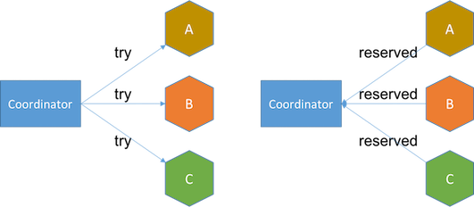

# 交易處理 (Transaction)
一個應用程式的系統可能遇到的幾種錯誤：
- 資料庫故障
- 應用程式崩潰
- 應用程式與資料庫間的網路連線中斷
- ~~各種鬼故事~~......

資料庫的交易(Transaction)消除資料是否更新的疑慮，修改資料必須滿足定義好的規則，包含資料的完整性、失敗時觸發回滾 (rollback) 等等。

**Transaction(TX):**
- SQL 語句的集合，視為一個工作單元，資料庫處理的邏輯單位
- 週期：Begin → Commit (or Rollback)


:::info目的
保持資料庫中資料狀態的「一致性」**C**onsistency
:::

資料庫的經典理論，TX 具備的特性：
- **原子性**（**A**tomic）: 每個 TX 有兩種可能結果 → 全部執行成功 or 全部失敗不執行(只要其中一個失敗就讓修改的資料全部 rollback 到 TX 開始前的狀態)
- **隔離性**（**I**solation）： 確保每個 TX 在進行時不會互相干擾
- **持久性（D**urability）: TX 保證所有成功被 commit 的資料修改都能夠正確地被永久儲存(成功寫到硬碟或 SSD 上)

:::info補充
儲存點 (save point):

SAVEPOINT 指令定義一個 TX 儲存點，允許取消部份TX，而只提交(commit)剩餘的部份，可以在交易中插入儲存點，有需要時可以 rollback 到儲存點，而不用 rollback 整個 TX。
:::

舉例：
- 銀行轉帳
- 蝦皮購物

TX 的概念延伸到所有需要保證資料一致性的應用場景 e.g. 快取機制、Message Queue、分散式的儲存架構。

上述的應用場景與資料庫的 TX 一致性非完全相同的概念：
- 內部一致性：一個服務使用一個資料源，透過 A、I、D 來確保資料一致性
- 外部一致性：一個服務使用多個資料源、多個服務使用多個不同資料源，涉及多個資料源的 TX 一致性 → 分散式系統遇到的難題

資料一致性分三種特性:
- 強一致性：寫完之後，任何讀取的資料都是最新的值
- 弱一致性：寫完之後，無法保證都能讀取到最新的資料
- 最終一致性(後面談 CAP 理論)：寫完之後，最後一定能讀到最新的值

## 3.1　本地交易 (Local Transaction)
又作「Local Transaction」，適用於單個服務使用單個資料源的場景。

實現原理源自於 [ARIES](https://en.wikipedia.org/wiki/Algorithms_for_Recovery_and_Isolation_Exploiting_Semantics) 理論，現代關係型資料庫的理論基礎。
## 3.1.1 實現原子性和持久性
滿足原子性和持久性的最大困難點：
「寫入硬碟」這個動作並非原子的，除了有「寫入」與「未寫入」狀態，還存在「正在寫」偏向中間的狀態。

可能發生幾種情形：

**未提交 TX，寫入後 crash**:

應用程式還沒修改完資料，但資料庫已將部分資料的變動寫入硬碟，發生故障的狀況，經重啟後，資料庫必須要有辦法得知故障前發生過一次「不完整」的操作，將已修改過的資料從硬碟中恢復成沒有改過的樣子，確保原子性。
    
**已提交 TX，寫入前 crash**:

應用程式修改完所有資料並完成 commit，但資料庫還未將所有變動資料寫入硬碟，發生故障時經過重啟，資料庫必須將未完成的資料重新寫入硬碟，滿足持久性。

### Commit Logging 
以「日誌」的形式依序將修改資料的操作包含的所有訊息(e.g. 修改哪筆資料、資料保存在硬碟裡的哪個區塊等)，都先記錄到硬碟裡，保障資料持久性、原子性兩個特性。

只有在 commit log 成功紀錄在硬碟裡，資料庫在日誌中看到代表 TX 成功的提交紀錄（Commit Record）後，才會根據日誌上的訊息對真正的資料進行修改。

修改完成後，在日誌中加入一條“結束記錄” （End Record）表示 TX 滿足持久性。

#### 日誌一旦成功寫入提交紀錄(Commit Record): 

整個 TX 視為成功，即便真正修改資料時發生故障，資料庫重啟後根據已經寫入硬碟的日誌進行恢復、繼續修改資料即可，保證持久性。
#### 日誌沒有成功寫入提交紀錄(Commit Record)就發生故障： 

整個 TX 就是失敗的，資料庫重啟後會看到一部分沒有 commit 紀錄的日誌，標記為 rollback 狀態，退回到 TX 開始之前，保證原子性。

**缺陷：**

影響資料庫的效能。

### Solution: Write-Ahead Logging (WAL)
> 又作「預寫日誌」，允許在 TX commit 之前，提前寫入變動資料。

寫入變動資料的時間點以 TX commit 時為界去劃分，分作 `FORCE` 和 `STEAL` 兩類：
- `FORCE` :  TX commit 之「後」
    - 要求變動資料必須同時完成寫入則稱為 `FORCE`
    - 不強制須同時完成寫入則稱為 `NO-FORCE`
- `STEAL` : TX commit 之「前」
    - 允許變動資料提前寫入稱為 `STEAL`
    - 不允許變動資料提前寫入稱為 `NO-STEAL`

**LSN–Log (Log Sequence Number Log)**

每條 WAL log 都會帶有一串序號，稱作 LSN(Log Sequence Number)，紀錄 TX 改動內容。

WAL 提供額外的機制: 增加 **Undo Log** 的日誌類型。
#### Undo Log：
在改動的資料寫入硬碟前，須先記錄 Undo log，後續遇到需要 rollback 或是故障的情況，把這些 Undo log 紀錄內容都抹除掉。

#### Redo Log：
紀錄修改資料的操作內容。遇到故障時，藉由 WAL 寫入的 TX Log 來恢復重做。

#### WAL 故障恢復時會執行三個階段：
- Analysis(分析)：從硬碟裡尋找最後(新)一次的檢查點(已成功地寫入硬碟裡滿足持久化)，開始對日誌進行掃描，找出沒有結束記錄的 TX，組成集合待恢復的 TX。
- Redo(重做)：分析階段中產生的待恢復的 TX 集合來還原狀態。
- Undo(回滾)：經過分析、重做階段後剩餘待恢復的 TX 集合，即需要回滾的 TX，依 Undo Log 內容將提前寫入硬碟的資料修改重新寫回去。


## 3.1.2 實現隔離性
資料庫遇到多個 TX 的併發(Concurrency)問題：

以下皆以假定「兩個並行」的 TX 為例。

> 註：經 [Hussein Nasser](https://www.husseinnasser.com/p/about-hussein.html) 同意，以下圖片均來自簡報部分的內容。

**Dirty Read:**

一個 TX 處理過程中讀取到另一個 TX 未 `committed` 的資料


**Phantom Read:**

兩個完全相同的範圍 TX，連續兩次讀取時，讀取出來的 **「筆數」** 跟上次不同


**Non-repeatable Read (Read Skew):**

同一個 TX 中，重複讀取時會拿到不一致的資料


**Lost updates:**

TX1 的 UPDATE 遭到 TX2 覆寫，導致更新的資料不一樣


> 常見手段：加鎖🔒
> - **寫鎖（Write Lock; Exclusive Lock -> X-Lock）：**
>   只有拿到寫鎖的 TX 才能對資料做寫入，未釋放鎖的階段，其他 TX 不能寫入資料，也不能加讀鎖
> - **讀鎖（Read Lock; Shared Lock -> S-Lock）：**
> 多個 TX 可對同筆資料加多個讀鎖，被加上讀鎖的資料就不能再被加上寫鎖，所以其他 TX 不能對該筆資料進行寫入，
> 但仍然可讀取。
> - **範圍鎖（Range Lock）:**
> 對於某個範圍直接加排他鎖，在這個範圍內的資料都不能被寫入
> e.g.
>
```sql
SELECT * FROM purchases FOR UPDATE;
```

常見的隔離層級：
### Read Uncommitted
允許讀取尚未被 `committed` 的資料，屬於最低層級。

鎖的組合：寫鎖
### Read Committed
只允許讀取已被 `committed` 的資料，可解決 Dirty Read 的問題。

鎖的組合：寫鎖+讀鎖(讀完之後釋放鎖)
### Repeatable Read 
讀到的資料只會是 TX 開始前已經 `committed` 的資料，不會讀取到尚未 `committed` 的資料，或者在 TX 期間被其他並行的 TX 完成 `committed` 的變更

鎖的組合：寫鎖+讀鎖(持續)
### Serializable
採序列化，最嚴格的隔離層級，多個 TXs 變成一個個「接續執行」，效能也最差。

鎖的組合：寫鎖+讀鎖+範圍鎖

實現方法：
- 連續執行 TX： 簡單粗暴，每一個時間點只會有一個 TX 執行。
- 二階段鎖 (Two-Phase Locking; 2PL)：
    - TX1 讀資料 & TX2 寫資料，TX2 必須等 TX1 完成提交 or 中斷
    - TX1 寫資料，而 TX2 讀資料，TX2 仍必須等 TX1 完成提交 or 中斷
- 序列化快照隔離 (Serializable Snapshot Isolation; SSI)

Two-Phase Locking - source: [How does the 2PL (Two-Phase Locking) algorithm work](https://vladmihalcea.com/2pl-two-phase-locking/)


**TX 嚴格程度:**

SERIALIZABLE > REPEATABLE READ > READ COMMITTED > READ UNCOMMITTED

隔離層級比較表(以 [Postgres](https://www.postgresql.org/docs/current/transaction-iso.html) 為例)：


### Snapshot(MVCC)
對每個產生的新資料做 snapshot，產生一個新版本，同時保留舊的版本，允許 TX 讀取這些 snapshot 的最新版本 => Multi-Version Concurrency Control (MVCC) 的方式實現
- 好處: 不須在資料表裡設置鎖(lock)來避免衝突
- 缺點: 每筆紀錄都需要額外的儲存空間

:::info Discussion
樂觀鎖（Optimistic Locking）vs. 悲觀鎖（Pessimistic Locking）
:::
## 3.2 全局交易 (Global Transaction)
> 書裡定調：在「分散式」環境中仍追求「強一致性」的 TX 方案

案例：線上書店，用戶、商家、倉庫分別處於「不同的資料庫」中
```java
public void buyBook(PaymentBill bill) {
    userTransaction.begin();
    warehouseTransaction.begin();
    businessTransaction.begin();
	try {
        userAccountService.pay(bill.getMoney());
        warehouseService.deliver(bill.getItems());
        businessAccountService.receipt(bill.getMoney());
        userTransaction.commit();
        warehouseTransaction.commit();
        businessTransaction.commit();
	} catch(Exception e) {
        userTransaction.rollback();
        warehouseTransaction.rollback();
        businessTransaction.rollback();
	}
}
```

為解決「分散式」環境中的「一致性」問題，X/Open 組織提出了一套名為 X/Open XA（XA 是eXtended Architecture 的縮寫; 擴展架構），概念源自分散式交易處理參考模型([Distributed Transaction Processing](https://en.wikipedia.org/wiki/Distributed_transaction); DAP)。

DTP模型概念圖


元件：
- Resource Manager：提供介面共享資源的訪問(e.g. 資料庫)
- Transaction Manager：協調 AP 和 RM，負責指示 RM 處理 TX 運作 e.g. 成功 commit，失敗 rollback
- Application：定義交易邊界並訪問資源。

為了能讓多個資料庫共同參與的 TX 保持原子性與一致性，XA 將 TX 提交(commit)過程拆分成為兩階段
### 兩段式提交(2 Phase Commitment; 2PC)
前提假設：
- 網路在提交階段的短時間內是可靠的，網路傳輸在整個過程都不會出現誤差
- 每個參與的 TX 都有 WAL 日誌
- 所有崩潰的節點最終都會恢復，不會一直處於崩潰狀態
- 各節點上的 TX 狀態即使碰到機器崩潰都可從 WAL 日誌上恢復

角色：
- 協調者(Coordinator)：負責發起與維護兩段式提交流程
- 參與者(Participant)：參與 TX 的資料庫


階段：
- 投票階段(Voting Phase)：
    1. 協調者發送請求給所有的參與者 
    2. 參與者會回覆是否已經準備好提交(e.g. `Prepare`, `Abort`)。 Note: 協調者會有 timeout 機制。
- 提交階段(Commit Phase)：
    1. 協調者搜集投票結果：
        1. All `Yes`: 宣告成功，發送 `Commit` 請求給每個參與者
        2. Not all `Yes`，協調者決定放棄交易，發送 `Abort` 給參與者

缺點：
- 單點問題：協調者的 TX 管理器無法正常運作 => 整個 TX 被 blocking
- 效能問題：經歷兩次遠端的呼叫，多次資料持久化
- 資料不一致：當網路穩定性和故障恢復能力的假設不成立時，仍可能出現一致性問題

### 三段式提交(3 Phase Commitment; 3PC)
針對 2PC 提出的改進方案。
- 「準備階段」=> `CanCommit`, `PreCommit` 階段
- 「提交階段」 => `DoCommit` 階段


- `CanCommit`: 類似於 2PC 的投票階段
- `PreCommit`: 根據參與者的答覆，決定預備的 TX。
- `DoCommit`: 原 2PC 的提交階段

缺點：
- 依舊沒有解決 2PC 資料不一致的問題
- 處理時間也延遲了(多了一個 `PreCommit` 階段)

### 小節：
兩個演算法都是為了能達到「強一致性」的標準而設計，都不是很完美，仍無法完全滿足分散式交易所需要的「一致性」、
「可用性」。

## 3.3 共享交易 (Share Transaction)
多個服務之間會產生業務邏輯會有交集，直接讓各個服務共享同個資料庫。


## 3.4 分散式交易 (Distributed Transaction)
資料庫正式邁入分散式的系統架構。


> 挑戰： 多個節點的資料分區、跨節點作資料同步

### CAP 定理
分散式計算領域所公認的著名定理 - [CAP 理論](https://en.wikipedia.org/wiki/CAP_theorem)源自 Eric Brewer [論文](https://users.ece.cmu.edu/~adrian/731-sp04/readings/GL-cap.pdf)。


> 分散式系統裡，一致性(Consistence)、可用性(Availability)、分區容錯性(Partition Tolerance)三者中的兩個，另外一個必須被犧牲。

#### 一致性 (**C**onsistency)
- *強一致性：讀到的資料「總是」最新的 e.g. 銀行系統
- 最終一致性：在一段時間後，資料會最終達到一致狀態 e.g. DNS 系統

#### 可用性 (**A**vailability)
系統不間斷地提供服務的能力 e.g. SLA

客戶端在可用的時間範圍之內，盡力提供服務。

冗餘(Redundant) 策略： 提供 2+ 以上的節點

#### 分區容錯 (**P**artition tolerance)
任意數量的節點間網路出現問題，系統仍能夠持續運作。

分區:
- 節點在不同地理位置
- 節點在同個地理位置的區域網路
- 節點在不同地理位置，但屬於內網架構

比較個別捨棄 C、A、P 時所帶來的影響

### CA，捨棄 P
放棄分區容錯，等於不考慮分散式系統架構。

> 單機資料庫下引進 CAP 定理似乎沒太大意義？非獨立的選擇條件

### CP，捨棄 A
關注資料的「強一致性」，滿足一致性(C)、分區容錯性(P)，用於對資料品質要求很高的場域。

### AP，捨棄 C
關注資料的「可用性」a.k.a. 水平擴展，滿足可用性(A)、分區容錯性(P)

> 取得平衡的設計:
> - 不追求「強一致性」，採用「最終一致性」 => 適合資料更新容許一點延遲的場合
> - 現實設計的系統可放寬一致性和可用性標準

:::infoDiscussion
- CAP 中的 Consistency vs. ACID 中的 Consistency
- CAP 理論落地實踐的細節
:::

補充資料：[CAP-FAQ](https://github.com/henryr/cap-faq)

### 可靠事件隊列
「最終一致性的概念」源自 Dan Pritchett 發表的論文 - [Base: An Acid Alternative](https://queue.acm.org/detail.cfm?id=1394128)

BASE 分別是：
- 基本可用性(**B**asically **A**vailable)：分散式系統在出現故障時，保證核心可用
- 軟狀態(**S**oft State)：允許系統存在中間狀態，而該中間狀態不會影響系統整體可用性
- 最終一致性(**E**ventually Consistent)：在一段時間後，資料會最終達到一致狀態

> 對 CAP 的延伸和補充，即便無法達成強一致性，但採用合適的方法達到最終一致性


延伸： [最大努力交付(Best-effort delivery)](https://en.wikipedia.org/wiki/Best-effort_delivery) e.g. TCP 協議

### TCC 交易
可靠消息隊列雖保證最終的結果相對可靠，但整個過程完全沒有任何隔離性，TCC 解決缺乏隔離性帶來的問題。

- `Try`：嘗試執行階段，完成所有業務可執行性的檢查，並且預留好全部需用到的業務資源。
- `Confirm`：確認執行階段，不做任何業務檢查，直接使用 `Try` 階段準備的資源來完成業務處理。
- `Cancel`：取消執行階段，釋放 `Try` 階段預留的業務資源。 

**TCC - Try**



**TCC - Confirm**


[圖3-8 TCC 的執行過程](http://icyfenix.cn/architect-perspective/general-architecture/transaction/distributed.html#tcc-%E4%BA%8B%E5%8A%A1)

### SAGA 交易
> 將大的 TX 拆成多個小的 TX，適用在長時間交易(long running transactions)，。

- 大 TX 拆成若干個小 TXs，按順序進行提交 -> Ti
- 替每一個小的 TX 設計補償機制 -> Ci

若所有小的 TX 未完整成功提交，便啟動恢復機制：
- 正向恢復(Forward Recovery): TX提交失敗，則一直對TX進行「重試」，直到成功為止; T1,T2....Ti(失敗),Ti(重試)....Ti+1....Tn
- 反向恢復(Backward Recovery): TX 提交失敗，則一直執行 Ci 對 Ti 進行「補償」，直到成功為止; T1,T2....Ti(失敗),Ci(補償)...,C2,C1。

考量到本身可能會崩潰，設計日誌機制(a.k.a SAGA Log)以保證系統恢復後能追蹤到小的 TX 的執行情況。

### 總結：
分散式交易中沒有一招打天下的解決辦法，評估當下的情境，選用合適的 TX 處理方案才是有效的做法