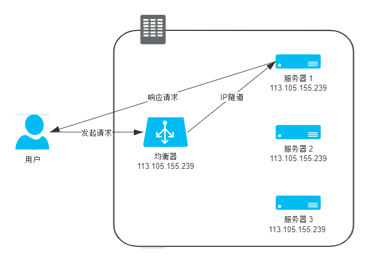
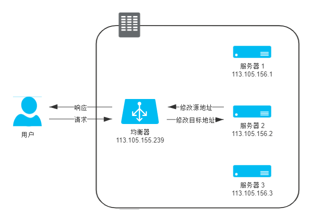
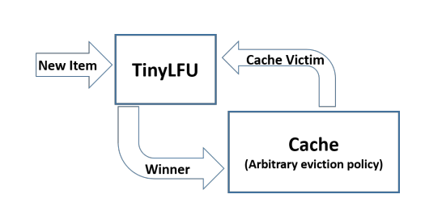
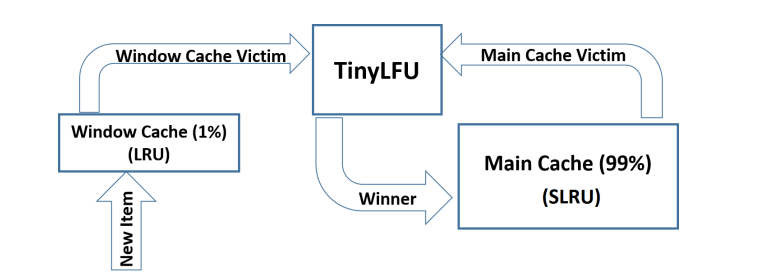
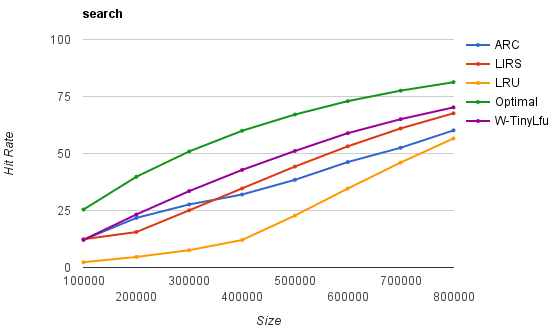
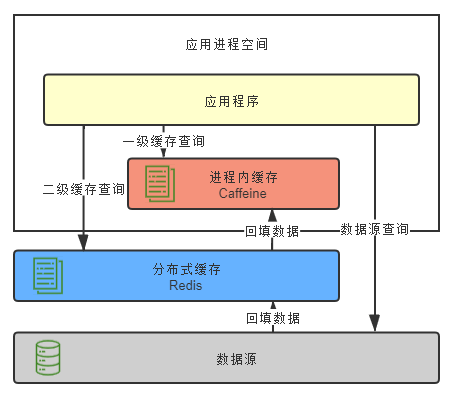

## 4.5 負載均衡 Load Balancing

:::info 負載均衡 Load Balancing
調度後方的多臺機器，以統一的接口對外服務的技術（組件）。
:::

從形式上可以分爲**四層負載均衡**（[傳輸層](https://en.wikipedia.org/wiki/OSI_model)）和**七層負載均衡**（[應用層](https://en.wikipedia.org/wiki/OSI_model)）。
- 四層的優勢是性能高，七層的優勢是功能強
- 做多級混合負載均衡，通常是低層的負載均衡在前，高層的負載均衡在後

表 4-1 OSI 七層模型

|     | 
**層**
 | 
**數據單元**
 | **功能**                                                                                                                                         |
| --- | ------------------------------------- | ------------------------------------------ | ------------------------------------------------------------------------------------------------------------------------------------------------ |
| 7   | 應用層  Application Layer         | 數據 Data                              | 提供為應用軟件提供服務的接口，用於與其他應用軟件之間的通信。典型協議：HTTP、HTTPS、FTP、Telnet、SSH、SMTP、POP3 等                               |
| 6   | 表達層 Presentation Layer         | 數據  Data                             | 把數據轉換爲能與接收者的系統格式兼容並適合傳輸的格式。                                                                                           |
| 5   | 會話層  Session Layer             | 數據  Data                             | 負責在數據傳輸中設置和維護計算機網絡中兩臺計算機之間的通信連接。                                                                                 |
| 4   | 傳輸層  Transport Layer           | 數據段 Segments                        | 把傳輸表頭加至數據以形成數據包。傳輸的表頭包含了所使用的協議等發送信息。典型協議：TCP、UDP、RDP、SCTP、FCP 等                                      |
| 3   | 網絡層  Network Layer             | 數據包 Packets                         | 決定數據的傳輸路徑選擇和轉發，將網絡表頭附加至數據段後以形成報文（即數據包）。典型協議：IPv4/IPv6、IGMP、ICMP、EGP、RIP 等                       |
| 2   | 數據鏈路層  Data Link Layer       | 數據幀 Frame                           | 負責點對點的網絡尋址、錯誤偵測和糾錯。当表頭和表尾被附加至數據包後，就形成數據幀（Frame）。典型協議：WiFi（802.11）、Ethernet（802.3）、PPP 等。 |
| 1   | 物理層 Physical Layer             | 比特流 Bit                             | 在物理網絡上傳送數據幀，它負責管理電腦通信設備和網絡媒體之間的互通。包括了針脚、電壓、綫纜規範、集綫器、中繼器、網卡、主機接口卡等。               |

### 四層負載均衡

:::info 四層負載均衡
以維持同一個TCP連接的來達成負載均衡的模式。
主要工作在第二層（[數據鏈路層](https://en.wikipedia.org/wiki/OSI_model)，改寫MAC地址）和第三層（[網絡層](https://en.wikipedia.org/wiki/OSI_model)，改寫IP地址）。
:::

#### 數據鏈路層負載均衡

數據鏈路層負載均衡修改請求的數據幀中的MAC目標地址，在第二層轉發請求到真實服務器（Real Server）的網卡上。

使用這種負載均衡模式時，真實物理服務器集群所有機器的[虛擬IP地址（Virtual IP Address，VIP）](https://en.wikipedia.org/wiki/Virtual_IP_address)需要被配置成與負載均衡器的VIP一樣。
這樣從負載均衡器轉發的第三層的數據包可以直接在Real Server上被處理，并且響應結果不用再通過負載均衡器進行地址交換，可以直接返回到客戶端，效率高。

這種負載均衡模式也被稱爲*三角傳輸模式（Direct Server Return，DSR）*、*單臂模式（Single Legged Mode）*或*直接路由（Direct Routing）*。

缺點：
- 無法勝任需要感知應用層協議信息的場景
- 負載均衡器必須和Real Server在同一個子網中，無法跨VLAN

適合用來做第一級的負載均衡，用來鏈接其他下級負載均衡器。

#### 網絡層負載均衡

網絡層負載均衡修改Headers中的IP地址來轉發數據包：
創建一個新的數據包，把原來數據包的Headers和Payload整體作爲新數據包的Payload，在新數據包的Headers中寫入real server的IP為目標地址轉發。
Real server上要有拆包機制，可以把負載均衡器加的Headers拿掉，處理原來的數據包。
這種方式叫*[IP隧道（IP Tunnel）](https://en.wikipedia.org/wiki/IP_tunnel)*傳輸。

優點：
- 可以跨VLAN傳輸
- 依然具備三角傳輸的高效特性

缺點：
- 要求Real Server必須支持[IP隧道協議（IP Encapsulation）](https://en.wikipedia.org/wiki/Encapsulation_(networking))
- 要求Real Server要有和負載均衡器一樣的VIP，才能被客戶端認得，需要專門配置
- 如果有多個服務共用一臺服務器的時候，就不能改VIP了

#### NAT模式

和IP隧道模式類似，不過是直接把請求數據包中的目標IP改為Real Server的IP。

優點：
- 相比IP隧道模式，不要求real server要能拆包
- 容易維護

缺點：
- 客戶端有可能不認識real server的IP導致不能處理response，所以response要回到負載均衡器上，修改源IP後再回傳給客戶端。
  流量大的時候性能受限于負載均衡器

這種方式被稱爲*[NAT（Network Address Translation, 網絡地址轉換）模式](https://en.wikipedia.org/wiki/Network_address_translation)*。
還有更徹底的Source NAT（SNAT），修改目標IP為real server的IP，並修改源IP為負載均衡器的IP，無需配置網關，但real server會拿不到真實請求IP。

### 七層負載均衡
#### 應用層負載均衡

Real server、負載均衡器和客戶端三者之間由兩條獨立的TCP通道來維持通信，負載均衡器代理請求。

與四層均衡器相比：
- 網絡性能差
  - 至少多一輪TCP握手
  - 性能受限于負載均衡器的帶寬
  - 因爲可用的解析規則多而通常更耗CPU
- 功能強
  - 可以根據應用層的内容做更明智的決策

可能可以實現的功能：
- 所有CDN可以做的緩存方面的工作都可以實現
- 更智能化的路由，e.g.根據用戶身份路由（VIP服務器）
- 抵禦某些安全攻擊，e.g. 可以過濾特定報文：SYN flood、flood、SQL注入等
- 在微服務架構中，實現鏈路處理措施

### 均衡策略與實現
均衡策略回答“誰來處理用戶請求”的問題，常見的均衡策略及其優缺點：

|均衡策略|定義|實用場景|
|-------|----|----|
|輪詢均衡（Round Robin）|輪流分配請求給集群中的服務器|集群中所有服務器有相同軟硬件配置且平均服務請求相對均衡|
|權重輪詢均衡（Weighted Round Robin）|根據服務器的不同性能順序分配請求|集群中服務器性能不一|
|隨機均衡（Random）|隨機分配請求||
|權重隨機均衡（Weighted Random）|根據服務器的不同性能隨機分配請求|集群中服務器性能不一|
|一致性哈希均衡（Consistency Hash）|用數據包的某些參數計算哈希值，讓請求落在固定的服務器上，服務器的故障只影響該服務器的哈希||
|響應速度均衡（Response Time）|根據響應時間（負載均衡器與服務器之間的響應時間）來分配請求|追求響應速度的場景|
|最少連接數均衡（Least Connection）|根據服務器正在處理的連接數量分配請求|需要長時間處理的請求服務，如FTP傳輸|

負載均衡器的實現分爲軟件均衡器和硬件均衡器。軟件均衡器分爲：
- 直接建設在OS内核的，性能更佳，e.g. LVS（Linux Virtual Server）
- 應用程序形式的，選擇廣汎、使用方便、功能不受限于内核版本，e.g. nginx、HAProxy、KeepAlived

硬件均衡器通常用應用專用集成電路（Application Specific Integrated Circuit, ASIC）來實現，e.g. F5和A10公司的負載均衡產品。

:::info總結
負載均衡器用來為服務分配負載，以達到高可用、高性能的目的。

常見的負載均衡形式有高效能的四層負載均衡和功能強的七層負載均衡的形式，用來轉發請求。
均衡策略用來決定負載均衡器要把請求轉發到哪個real server上。
:::

## 4.6 服務端緩存 Cache

服務端緩存（下稱緩存）有許多負面作用：
- 從開發角度來説，因爲要考慮緩存的失效、更新、一致性等問題，引入緩存會**提高系統複雜度**
- 從維護角度來説，緩存會**掩蓋掉一些缺陷**，讓問題更晚才被發現，或在更遠的地方被發現
- 從安全角度來説，緩存可能**泄露某些保密數據**，也容易受到攻擊

**透過升級硬件來增强CPU、I/O本身的性能比引入緩存更佳。**
在衆多負面作用下，依然會選擇使用緩存的理由：
- 緩解CPU壓力
- 緩解I/O壓力

### 緩存屬性
#### 吞吐量
:::info 吞吐量
以OPS值（每秒操作數，Operations per Second）來衡量，反映了對緩存進行**并發**讀寫的效率，即緩存本身的工作效率高低。
:::

不考慮并發的場景下，緩存的訪問效率已經是常量複雜度。
在多綫程并發場景下，需要有綫程安全措施來保證緩存能夠被正確讀寫，實現方式可能全局加鎖或分段加鎖，都會有一定的吞吐量損失。

作者提到JDK 8改進後的ConcurrentHashMap基本是是吞吐量最高的緩存容器了。
若要考慮緩存的其他屬性，就會涉及到不同緩存方案的權衡問題。
如下圖中所示，主流的進程内緩存實現方案對比性能差異明顯。

](./ch4/4-12.png)

吞吐量收多方面因素的共同影響：
- 存在競爭風險時如何處理同步（主要有使用鎖實現的悲觀同步和使用CAS實現的樂觀同步）
- 如何避免[偽共享現象（False Sharing）](https://en.wikipedia.org/wiki/False_sharing)
- 【最關鍵】如何設計資料結構盡可能避免數據競爭

最主要的數據競爭源於爲了實現擴展功能（緩存的淘汰策略、失效重載等），伴隨讀寫操作需要做資料的狀態維護。

對上述問題有兩種處理思路：
- 以Guava Cache爲代表的同步處理機制，訪問緩存和狀態變更的操作一起做，用分段加鎖的方式減少數據競爭。
- 以Caffeine為代表的異步日志提交機制，參考了經典的數據庫設計理論，將對讀寫數據的過程看作是日志的提交過程。

作者特別介紹Caffeine的實現方式：給每條綫程都設置專門的[環形緩存區](https://en.wikipedia.org/wiki/Circular_buffer)來記錄由於數據讀取而產生的狀態變動日志。
讀取緩存時，數據從ConcurrentHashMap返回，狀態信息變更存入緩存中，由後臺綫程異步處理。
異步處理速度跟不上狀態變更的速度就會導致緩衝區被寫滿，此後的狀態變更信息會被**丟棄**直到緩衝區重新富餘。

Caffeine通過環形緩存區達到幾乎和ConcurrentHashMap相同的讀取性能；
在寫入數據時，Caffeine不允許丟失任何狀態，所以使用ArrayQueue來存放狀態變更信息，有一定的性能損失，相比ConcurrentHashMap約慢10%。

:::info [環形緩衝（Ring Buffer或Circular Buffer）](https://en.wikipedia.org/wiki/Circular_buffer)

一種擁有讀、寫兩個指針的資料結構，在CS領域中有廣汎的應用。

 [環形緩衝工作原理](https://en.wikipedia.org/wiki/File:Circular_Buffer_Animation.gif)

:::

#### 命中率

:::info 命中率
成功從緩存中返回結果次數與總請求次數的比值，反映了引入緩存的價值高低。
:::

因爲容量有限，緩存要能夠人工或自動淘汰低價值數據，即緩存的[淘汰策略](https://en.wikipedia.org/wiki/Cache_replacement_policies)，或稱作替換策略、清理策略。
最基礎的淘汰策略方案有以下三種：
- FIFO（First In First Out）：優先淘汰最早進入緩存的數據，但數據被存入緩存的早晚不能很好地衡量數據的價值
- LRU（Least Recent Used）：優先淘汰最久未被訪問的數據，常采用LinkedHashMap實現，保證讀取性能並記錄數據的時間順序
- LFU（Least Frequently Used）：優先淘汰最不常被訪問的數據，以訪問計數器的方式實現，淘汰計數器數值最小的數據；但維護計數器影響吞吐量，且未考慮隨時間變化的數據訪問熱度
- TinyLFU（Tiny Least Frequently Used）：使用[Count–Min Sketch算法](https://en.wikipedia.org/wiki/Count%E2%80%93min_sketch)以少量樣本數據估計全體數據的特徵，犧牲準確性但不用維護計數器；
  使用基於“滑動時間窗”的熱度衰減算法解決數據熱度隨時間變化的問題
  
- [W-TinyLFU（Windows-TinyLFU）](https://arxiv.org/pdf/1512.00727.pdf)：為解決稀疏突發訪問（短時間高頻訪問，但平時熱度地的數據）的問題：
  維護兩個Cache，window cache讓新數據纍計熱度根據LRU淘汰，如果能通過TinyLFU閾值的再放入main cache，根據LFU分段淘汰
  

根據Caffeine官方給出的統計，在包含資料庫、網站和分析類等應用場景中，集中淘汰策略排名基本沒變，其中Optimal是理想曲綫，可以看到W-TinyLFU表現最佳。

#### 擴展功能
緩存除了基本讀寫功能外所提供的額外管理功能，如：
- **加載器**： CacheLoader，讓緩存可以主動加載數據
- **淘汰策略**
- **失效策略**：緩存的數據可以在一段時間後自動失效或自動刷新
- **事件通知**：可以監聽數據狀態變動，進而做額外操作；或可以監視緩存數據
- **并發級別**：通過分段加鎖實現的緩存，往往可以設置并發級別，即緩存内部存儲數據的Map數量，過大會有大的時間、空間開銷；過小會有鎖競爭
- **容量控制**：通過設定初始容量來減少擴容頻率，設定最大容量來觸發淘汰機制
- **引用方式**：可以將數據設置爲軟引用或弱引用，將緩存與Java虛擬機的垃圾收集機制聯係起來
- **統計信息**： 提供緩存命中率、平均加載時間和自動回收技術等統計數據。
- **持久化**： 支持吧數據寫到數據庫或磁盤，分佈式緩存中比較用得到，e.g. [Redis](https://redis.io/)就支持持久化，[Memcache](https://memcached.org/)就不行

#### 分佈式支持
即是否能在各個服務節點中高效地被共享，與網絡相關的操作在這裏比較關鍵。

根據使用緩存的需求選擇不同分佈式緩存：
- 甚少更新但頻繁讀取，適合用**複製式緩存**：
  每個節點都有一個副本，讀取性能高，但數據變更代價大。代表有[JBossCache](https://jbosscache.jboss.org/)、[Infinispan](https://infinispan.org/)。
- 頻繁更新也頻繁讀取，適合用**集中式緩存**：
  讀寫都需要網絡訪問，讀取性能不如複製式緩存高，但不會隨著集群節點數量增加而增加負擔，且能夠為異構語言提供服務，如C語言編寫的[Memcached](https://memcached.org/)可以為Java的應用提供緩存服務。
  代表有[Redis](https://redis.io/)。

根據數據一致性的要求又可以把緩存分為AP和CP兩種類型：
- Redis就是AP式，高性能、高可用但不保證强一致性。
- ZooKeeper、Doozerd、Etcd 等能保證强一致性，但吞吐量不如Redis，常和Redis和其他分佈式緩存搭配使用。

分佈式和進程内緩存各有所長，可以互相搭配使用，構成透明多級緩存（Transparent Multilevel Cache，TMC）如上圖所示。
不過這樣也有些缺點：
- 代碼侵入性大：開發人員要實現查詢和回填功能
- 也不便於管理：超時、刷新策略要設置多遍
- 更新數據麻煩，常見的設計原則是以分佈式緩存中的數據爲準，訪問以進程内緩存爲先。

### 常見緩存風險及其應對方法
#### 緩存穿透
查詢的數據在數據庫中根本不存在，導致永遠都還是要訪問數據庫。
解決方法：
- 如果業務邏輯本身不能避免緩存穿透，那可以在一定時間内對返回爲空的key值依然進行緩存，讓這段時間内緩存最多被穿透一次，數據庫一有這個值就主動更新緩存。
- 對於惡意攻擊導致的緩存穿透，通常會在緩存之前設置布隆過濾器來解決，布隆過濾器用最小代價判斷key是否存在，如果不存在就直接返回，不查緩存也不查資料庫。
#### 緩存擊穿
緩存中某些熱點數據突然失效，同時有多個針對該數據的請求發送過來，這些請求會直接去查找真是數據源，導致其壓力劇增。
解決方法：
- 加鎖同步：以請求該數據的key值為鎖，只讓一個請求訪問真實數據源，剩下的綫程先阻塞或采重試策略。
- 熱點數據用程式手動管理：有計劃地更新、淘汰緩存數據，避免由緩存自動管理。
#### 緩存雪崩
大批不同數據在短時間一起失效，使得不同數據的請求同時訪問數據源，導致其壓力劇增。

解決方法：
- 提升緩存系統的可用性，建立分佈式緩存的集群
- 啓用透明多級緩存，讓緩存中的數據有不一樣的加載時間，分散過期時間
- 將緩存的生存期設定爲一個時間段内的隨機時間，原理同上
#### 緩存污染
緩存中數據與真實數據源中數據不一致，通常由開發者更新緩存不規範造成。

解決方法即遵循緩存的設計模式：

|緩存設計模式|讀|寫|優點|缺點|
|-----------|--|--|---|---|
|Cache Aside|先從緩存讀，沒有的話再讀資料庫|寫入資料庫|最簡單；保證數據不會丟失|第一次一定會miss；可能會有資料不一致的問題|
|Read Through|只從緩存讀，由緩存負責資料庫中加載資料|寫入資料庫|clean code|第一次一定會miss；可能會有資料不一致的問題|
|Write Through|通常搭配read through|寫入緩存和資料庫|clean code；不會有cache miss|寫入會延遲|
|Write Behind Caching|從緩存讀取|直接寫入緩存，異步寫入資料庫|不會有cache miss；適合write heavy的場景|數據可能丟失|

:::info總結
服務端的緩存并非多多益善，有收益也有風險。
如果可以通過升級硬件來滿足需要的話，它往往比引入緩存更好。
:::