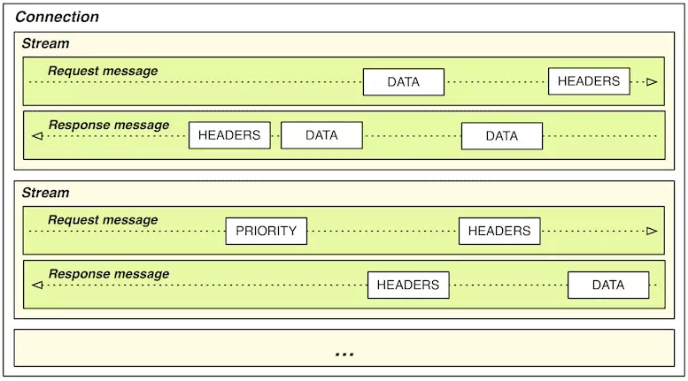

# 透明多及分流系統(Transparent Multilevel Diversion System)

:::tip
“分布广阔”源于“多级”，“意识不到”谓之“透明”
:::

從瀏覽器發出請求到收到回應的過程當中，會經過許多組件來達成這個回應能夠快速有效的到達客戶端手中，其中經過的不同的设施、部件在系统中有各自不同的價值

- 本地緩存、CDN、反向代理：位於客戶端或網絡的邊緣，能夠迅速響應用戶的請求，避免給後方的 I/O 與 CPU 帶來壓力
- Cluster Service: 有一些組件容易被擴展，可以快速部署到多台機器以乘載與用戶量匹配的併發性能，這樣的組件適合作為系統主要業務邏輯的載體
- 服務註冊中心、配置中心：有一些組件的穩定性會影響多個系統的存活與否，高可用性對於該組建而言至關重要，要不斷進行容錯備份
- 單點部件：只能依靠升級機器本身的存儲與運算效能來提升處理能力，如系統入口的路由、網關或者負載均衡器（它們都可以做集群，但一次網路請求中無可避免至少有一個是單點的部件）、位於請求調用鏈末端的資料庫等，都是典型的單點部件。

在設計系統時可以掌握兩個原則

1. 盡量減少單點組件，應搭配其他分流組件讓實際訪問道單點組件的流量降至最低

   例如：獲得一張儲存在資料庫的使用者照片，則要避免請求大多數都要到資料庫取得資料後返回
   讓系統在大多數的時間都能夠得到預期的結果，且讓單點系統在出現故障時能被迅速補救自，這便是系統架構中多級分流的意義

2. 系統的設計還是要回歸到使用需求，不是每個系統都必須具備乘載高併發與高可用性，同時也必須考量團隊維運的成本，總結而言，奧卡姆剃刀原則可以很精確的說明這個情況:

:::info
在能滿足需求的前提下，**最簡單的系統就是最好的系統**。
:::

## 4.1 客戶端快取 Client Cache

Http 協議在最一開始的設計就是保持 stateless 的特性
由於每次請求都是獨立的，服務端不保存在此之前的請求狀態和資源，導致多次請求與回應中往往都攜帶了重複的資源，這樣的資料傳輸易造成網路性能降低

因此，client cache 便是要解決此問題的，在 Http 從 1.0 到 2.0 的演進中
，有三種常見的緩存機制逐漸形成：

### 狀態快取

定義：不經過 server，直接在客戶端就返回過去請求中留下的結果

例如：

1. 301 永久導向
2. 後來在 RFC6797 中增加了[HSTS](https://en.wikipedia.org/wiki/HTTP_Strict_Transport_Security)（HTTP Strict Transport Security）機制，用於避免依賴 301/302 跳轉 HTTPS 時可能產生的降級中間人劫持

### 4.1.1 強制快取

- 定義資源時效性，確保在資源失效以前都會以快取資源返回
- 有效情境：瀏覽器輸入網址發送請求、Hyperlink、新開視窗、切換上一頁與下一頁
- 無效情境：主動刷新頁面會自動失效

Http 協議在 Header 有兩個參數可實現強制快取:

- **Expires** ：

```bash
HTTP/1.1 200 OK
Expires: Wed, 8 Apr 2020 07:28:00 GMT
```

- 在 Http/1.0 就支援，定義方式為截止時間的 timestamp
- Response Header 若攜帶此參數，則代表服務端保證在這個時間點之內該資源不會有變化，瀏覽器則直接保存這個請求資源，下次訪問時就不會將請求導至服務端
- 缺點：

  - 受限於本地時區，若修改了瀏覽器的時區，服務端回傳的截止日期將會失真
  - 私有資源緩存可能會被未有權限的使用者獲取到
  - 無法實現 **不緩存** 的語意（有時需使用 _“xx.js?t=1586359920”_、_“xx.jpg?t=1586359350”_，來保證每次資源都會重新獲取。)

- **Cache Control**：

```bash
HTTP/1.1 200 OK
Cache-Control: max-age=600
```

- Http/1.1 協議開始支援
- 如與 Expires 有衝突，則以 Cache-Control 為準
- 同時出現於 request 與 response header
- 提供多項參數來實現不同的快取機制:
  - max-age: 定義在請求時間多少秒後失效
  - s-maxage: 同 max-age， 差別在於這是定義 CDN 或 Proxy 的快取時效
  - public：定義是否涉及到用戶身份的私有資源，可被 CDN 或 Proxy 快取住
  - private: 同 public，只能在客戶端被快取
  - no-cache: 讓強制快取完圈失效的參數
  - no-store: 同 session 內的請求可被快取，但禁止瀏覽器與 CDN 以任何形式保存資源
  - no-transform: 禁止資源被修改，會讓 CDN 與代理服務的 Gzip 壓縮失效
  - min-fresh: 只有在 request header 會出現，用於建議服務端資源失效的時間(快取時效則會介於 max-age 到 min-fresh 的時間範圍)
  - only-if-cached: 只有在 request header 會出現，告訴服務端不須發送資源內容，讓客戶端強制使用本地快取的內容，如果本地快取不存在，則直接返回 503/Service Unavailable
  - must-revalidate: 資源過期後，必須從服務端重新獲取，也就是在 max-age 時間到後等同 no-cache 的狀態
  - proxy-revalidate: 同 must-revalidate，差別在於是定義給 CDN 或代理服務的快取失效行為

### 4.1.2 協商快取

- 以資源的變化檢查作為快取機制
- 相較於強制快取、效能較差，因會多一次變化檢查的開銷
- 有效情境：瀏覽器輸入網址發送請求、Hyperlink、新開視窗、切換上一頁與下一頁、刷新頁面
- 無效情境：強制刷新(Command/Control + F5)、在 DevTools 設定禁止快取(request header 會帶上 _Cache-Control: no-cache_)
- 主要有兩種實現機制：

1. **Last-Modified、If-Modified-Since**：Last-Modified 由 response header 帶回，下次發送同樣位置的請求時，會在 request header 帶上 If-Modified-Since 

當服務端確認此資源在 If-Modified-Since 的時間後沒有更動過，則以 304/Not Modified 返回

```bash
HTTP/1.1 304 Not Modified
Cache-Control: public, max-age=600
Last-Modified: Wed, 8 Apr 2020 15:31:30 GMT
```

反之，則返回 200/OK ，並攜帶新的資源

```bash
HTTP/1.1 200 OK
Cache-Control: public, max-age=600
Last-Modified: Wed, 8 Apr 2020 15:31:30 GMT

Content
```

2. **Etag、If-None-Match**：Etag 由 response header 提供，Etag 的生成方式可自行定義（Apache 以文件索引、大小與最後修改時間進行 hash 雜湊獲得），下次發送同樣位置的請求時，會在 request header 帶上 If-None-Match 

服務器的比對方式與 Last-Modified 相同
資源沒被更動，返回 304/Not Modified

```bash
HTTP/1.1 304 Not Modified
Cache-Control: public, max-age=600
ETag: "28c3f612-ceb0-4ddc-ae35-791ca840c5fa"
```

反之，則返回 200/OK 與新的資源

```
HTTP/1.1 200 OK
Cache-Control: public, max-age=600
ETag: "28c3f612-ceb0-4ddc-ae35-791ca840c5fa"

Content
```

#### Etag 與 Last-Modified 比較

1. Etag 可以解決 Last-Modified 文件在其支援的時間精度內多次修改資源所造成的資源的一致性問題
2. Etag 由於多了 hash 計算的消耗，因此是 http 中效能最差的緩存機制
3. 當 Etag 與 Last-Modified 同時存在時，會以 Etag 優先檢查，再檢查 Last-Modified 這是為了防止有一些 http 服務器未將修改日期納入雜湊範圍內

#### 快取綜合討論

1. 兩種機制可同時並存
2. 當強制快取的時效性還存在則直接採用強制快取的結果
3. 強制快取失效或是被禁止(no-cache/must-revalidate)，則採用協商快取的比對機制

#### 單一 URL 多資源返回的實現

透過 HTTP 的內容協商機制實現不同版本資源的獲得

- request header: Accept\*（Accept、Accept-Language、Accept-Charset、Accept-Encoding）
- response header: Content-\*（Content-Language、Content-Type、Content-Encoding）
- Vary: 定義快取要返回的內容依據

例子 : 根據 MIME 類型與瀏覽器類型作為資源快取依據

```bash
HTTP/1.1 200 OK
Vary: Accept, User-Agent
```

## 4.2 域名解析 DNS Lookup

- IP 位址與網域名的對應
- 身為全世界最大且使用頻繁的查詢系統，DNS 的分流機制有著舉足輕重的地位
- 尚未有快取的情境下，訪問某個網站時 DNS 的解析步驟如下
  1. 客戶端檢查本地 DNS 緩存，該緩存以 TTL 決定時效性
  2. 客戶端發送地址至 Local DNS
  3. Local DNS 會依照是否有**權威伺服器**的順序依次查詢地址紀錄：`www.icyfenix.com.cn -> icyfenix.com.cn -> com.cn -> cn`
  4. 如果 Local DNS 是全新的，意味著在查詢締紀錄的過程中勢必會找到根域名伺服器(也就是 `cn`)，此時就會依照上述順序反向查詢回來，直到找到能夠解釋的權威伺服器位址：`cn -> com.cn -> icyfenix.com.cn -> www.icyfenix.com.cn`
- 根據上述步驟查詢到的地址未必就是 ip 位址，例如： IPv4 下的 ip 位址為 A 紀錄，IPv6 下的 AAAA 記錄、主機別名 CNAME 記錄等
- 每個紀錄類型可包含多條 A 紀錄，權威伺服器可依照訪問者所在地區的不同、電信服務商的不同來回傳對應的 A 紀錄，這樣的做法可讓訪問者導引到最適合的數據中心，達成分流與加速的成效

### 名詞解釋

- **權威網域名稱伺服器（Authoritative DNS）**：負責翻譯特定網域名稱的 DNS 伺服器，“權威”意旨網域名稱翻譯的結果是由它而定的，在翻譯過程中可根據來訪機器、網路鏈路、服務內容等各種資訊翻譯出不同的結果
- **根域名伺服器（Root DNS）**：是指固定的、無需查詢的頂級網域名稱（Top-Level Domain）伺服器。 全世界一共有 13 組根域名伺服器，13 這個數字主要是因為 DNS 使用 UDP 傳輸協定進行資料交換，未分片的 UDP 封包在 IPv4 下最大有效值為 512 位元組，最多可以存放 13 組地址記錄。

各級服務器均無緩存，則會影響回應傳輸速度


### DNS 預取 (DNS Prefetching)

- 一種前端優化的手段，避免在各層級的服務器都沒有快取的情境下，DNS 查詢速度太慢的問題
- 作法為，在網頁載入時生成一個 link 請求，促使瀏覽器提前對該域名進行預解釋，譬如下面代碼所示：

```html
<link rel="dns-prefetch" href="//domain.not-icyfenx.cn" />
```

### HTTPDNS (DNS over HTTPS，DoH)

- 將 DNS server 開放為 HTTPS 查詢服務已取代原本透過 UDP 協定的解析方式，直接從 根域名伺服器獲得解析結果
- 這樣的做法可以避免遞迴解析域名的過程中可能會被中途攔截的問題（位於頂層的根域名伺服器，像是 cn 權威伺服器，安全防護做得很完善，比較不會有此問題，但 Local 端的 DNS 服務商就未必），以及避免掉有些 Local DNS 服務商返回錯誤的 IP 位置以置入廣告，從中牟利等問題。

## 4.3 傳輸鏈路優化 Transmission Optimization

定義：從客戶端發送請求，從中經過 client cache、DNS 解析，這些請求流量正式導向伺服器的過程

在前端優化的手段中，多半是在優化傳輸鏈路的品質，讓請求能夠與應用層與傳輸層的方式互相配合，以 Yahoo YSlow-23 條原則為例：

1. Minimize HTTP Requests 減少請求數量

   減少請求數量會讓建立通信鏈路進行數據傳輸的次數降低，減少開銷，對於前端開發者來說，以下方式可以減少請求數量：

- 雪碧圖（CSS Sprites）
- CSS、JS 文件合併/內聯（Concatenation / Inline）
- 分段文件（Multipart Document）
- 媒體（圖片、音訊）內聯（Data Base64 URI）
- 合併 Ajax 請求（Batch Ajax Request）

2. Split Components Across Domains 擴大併發請求數

   現代瀏覽器（Chrome、Firefox）一般對每個域名支援 6 個（IE 為 8-13 個）併發請求，如果希望更快地載入大量圖片或其他資源，需要進行網域名稱分片（Domain Sharding），將圖片同步到不同主機或者同一個主機的不同網域名稱上。

3. GZip Components 啟用壓縮傳輸

   啟用壓縮能夠大幅度減少需要在網路上傳輸內容的大小，節省網路流量。

4. Avoid Redirects 避免頁面重定向

   當頁面發生了重定向，就會延遲整個文檔的傳輸。 在 HTML 文件到達之前，頁面中不會呈現任何東西，降低了用戶體驗。

5. Put Stylesheets at the Top，Put Scripts at the Bottom 按重要性調節資源優先順序

   將重要的、馬上就要使用的、對用戶端展示影響大的資源，放在 HTML 的頭部，以便優先下載。

這些方式會依據 HTTP 協定的持續發展而有所變化，都是在滿足一個需求，也就是做出**適合 HTTP 傳輸的請求**

### 4.3.1 連接數優化

- HTTP（特指 HTTP/3 以前）是以 TCP 為傳輸層的應用層協定
- HTTP 傳輸物件的主要特徵是數量多、時間短、資源小、切換快，與 TCP 協定的要求有牴觸
- 前端開發者以減少發出的請求數量，增加用戶端到服務端的連接數量來緩解兩者之間的矛盾

以下兩張圖顯示了這些優化手段能夠有效降低對 TCP 的連接數量：頁面平均請求沒有改變的情況下，桌面端下降 3.8%，移動端上升 1.4%），TCP 連接正在持續且幅度較大地下降（桌面端下降 36.4%，移動端下降 28.6%）。


然而這些優化手段也會有些副作用，否則他們早已成為標準的開發設計原則了，例如：

- 如果你用 CSS Sprites 將多張圖片合併，意味著任何場景下哪怕只用到其中一張小圖，也必須完整載入整個大圖片; 任何場景下哪怕一張小圖要進行修改，都會導致整個緩存失效，類似地，樣式、腳本等其他文件的合併也會造成同樣的問題。
- 如果你使用了媒體內嵌，除了要承受 Base64 編碼導致傳輸容量膨脹 1/3 的代價外（Base64 以 8 bit 表示 6 bit 資料），也將無法有效利用緩存。
- 如果你合併了非同步請求，這就會導致所有請求返回時間都受最慢的那個請求的拖累，整體回應速度下降.
- 如果你把圖片放到不同子域下面，將會導致更大的 DNS 解析負擔，而且瀏覽器對兩個不同子域下的同一圖片必須持有兩份緩存，也使得緩存效率的下降。

#### 連接復用技術

- 又稱持久連接（Persistent Connection）、連接 Keep-Alive 機制
- 原理：讓用戶端對同一個網域名稱長期持有一個或多個不會用完即斷的 TCP 連接
- 作法：在客戶端維護一個 FIFO Queue ，讓獲取資源的請求都使用同一個 connection ，以降低 TCP 連接成本
- 缺點：隊首阻塞（Head-of-Line Blocking），如果第一個請求叫消耗較久的運算時間，即便在服務端其他請求的任務可以並行，但回傳時仍需要依照請求順序返回，原因是只使用一個 TCP 連接來傳輸多個資源的話，如果順序亂了，用戶端就很難區分哪個數據包歸屬哪個資源了。

#### 另一種複用術：Http Pipeline

- 在服務端也建立 Queue ，來安排返回的資源順序
- 雖然無法避免 Head-of-Line Blocking 的問題，但由於服務端較能掌握資源消耗的情況，因此可以更有效的安排資源傳輸
- 實行尚需多方共同支持，因此推廣不易

#### HTTP/2 多路複用（HTTP/2 Multiplexing）



原理：

- 傳輸最小單位的差異：HTTP/1.x 為請求；HTTP/2 為 frame(幀)
- frame 可以用來描述各種數據獲控制標識，每個 frame 會對應到一個 stream ID，stream 則是數據通道
- 用戶端可以依照每一 frame 所對應的 stream Id，組合出回應的內容
- 真正解決 Head-of-Line Blocking

HTTP/2 Multiplexing 的出現使得前述提到的降低 HTTP 請求數的必要性降低了很多，但由於 HTTP header 佔傳輸成本中比較大，還是必須考慮如何壓縮 header，降低請求數還是能減少 header 的傳輸量。
不過，原先透過合併資源減少請求數對節省 headers 的傳輸並無太大的效用：

- Header 的傳輸成本在圖片、樣式、腳本這些靜態資源的請求中，通常並不佔主要。
- 在 HTTP/2 中 Header 壓縮的原理是基於字典編碼的信息複用，同一個連接上產生的請求和回應越多，動態字典積累得越全，頭部壓縮效果也就越好。 所以 HTTP/2 是單域名單連接的機制，合併資源和網域名稱分片反而對性能提升不利。
- HTTP/2 得更適合傳輸小資源，由於只有一個 TCP 連接，一個錯誤的 TCP 封包會導致所有的 stream 都必須等待這個封包重傳成功（HTTP/3 要解決的問題
  - 傳輸 1000 張 10K 的小圖，HTTP/2 比 HTTP/1.x 快
  - 傳輸 10 張 1000K 的大圖，則應該 HTTP/1.x 會更快

### 4.3.2 傳輸壓縮

- 靜態預壓縮（Static Precompression）
  - 早期網路時代會採用的方式
  - 透過 request header 中的 `Accept-Encoding： gzip`，決定是否要返回壓縮後的資源
  - 透過 Content-Length 可以知道傳輸資源的大小
- 即時壓縮（On-The-Fly Compression）：

  - 邊壓縮邊在 stream 中傳輸
  - 提高首位元節時間（Time To First Byte，TTFB）
  - 伺服器無法回應確切的 Content-Length

- 持久連接機制與即時壓縮相抵觸，在 HTTP/1.0 雖然兩者都支援，卻只能擇一採用。
- 分塊傳輸編碼（Chunked Transfer Encoding）
  - HTTP/1.1 啟用
  - 解決了持久連接機制與即時壓縮牴觸的問題
  - 原理：在 response header 中加入 `Transfer-Encoding： chunked` 之後，就代表這個回應報文將採用分塊編碼，報文中的 Body 改用 chunk 傳輸。
  - 每個 chunk 包含十六進位的長度值和對應長度的內容，最後以一個長度值為 0 的 chunk 來表示資源結束

```bash
HTTP/1.1 200 OK
Date: Sat, 11 Apr 2020 04:44:00 GMT
Transfer-Encoding: chunked
Connection: keep-alive

25
This is the data in the first chunk

1C
and this is the second one

3
con

8
sequence

0
```

根據分塊長度可知，前兩個分塊包含換行符（CRLF，即\r\n 字元）

```bash
"This is the data in the first chunk\r\n"      (37 字符 => 十六进制: 0x25)
"and this is the second one\r\n"               (28 字符 => 十六进制: 0x1C)
"con"                                          (3  字符 => 十六进制: 0x03)
"sequence"                                     (8  字符 => 十六进制: 0x08)
```

解碼內容：

```
This is the data in the first chunk
and this is the second one
consequence
```

#### 總結

- HTTP/1.1 通過分塊傳輸解決了即時壓縮與持久連接並存的問題
- HTTP/2 由於多路複用和單域名單連接的設計，已經無須再刻意去提持久鏈接機制了，但數據壓縮仍然有節約傳輸頻寬的重要價值。

### 4.3.3 快速 UDP 網路連接（Quick UDP Internet Connections，QUIC）

- 替換掉 HTTP over TCP 的根基
- 自己實現傳輸能力的優勢，不依靠底層協定
- 考量到行動裝置的支援度，提出了連接標識碼的概念，可以唯一地標識用戶端與伺服器之間的連接，而無須依靠 IP 位址，讓行動裝置在切換不同的 wifi 熱點時有著低延遲的優勢，在切換網路後，只需向服務端發送一個包含此標識符的封包即可重用既有的連接，即使 IP 位址發生變化，原始連接連接標識碼依然是有效的

### 小結

- TCP 與 HTTP 協定乘載了大多數的用戶與造就目前的技術慣性，在基礎設施的建制多半也是針對 TCP 所建造，因此透過 Google 和 IETF 的推動轉換仍有難度
- Google 在推動 QUIC 和傳統 TCP 連接，並在 QUIC 連接失敗時以零延遲回退到 TCP 連接，盡可能讓使用者無感知地逐步地擴大 QUIC 的使用面
- 根據 W3Techs 的數據，HTTP/2 與 HTTP/3 的支援度都在逐年擴大與提升，許多既有的設備、程式、知識都會在未來幾年時間里出現重大更新。

## 4.4 內容分發網路 Content Distribution Network

CDN 是透明分流系統所具特質綜合運用下誕生的經典例子，一個運作良好的 CDN 網路能為網路系統解決跨運營商、跨地域物理距離所導致的延遲問題，能為網站流量頻寬起到分流、減負的作用。
其工作流程主要包含路由解析、內容分發、負載均衡和所能支援的 CDN 應用內容四個方面 (負載均衡在下一節會提到

### 4.4.1 路由解析

CDN 將使用者請求導引到它的資源伺服器上是依靠 DNS 伺服器實現的，在沒有 CDN 介入的情況下，一個 request 從用戶端到服務端的解析過程如下圖


若有 CDN 介入，則具體的 DNS 解析流程會如下圖


1. 架設好“icyfenix.cn”的伺服器後，將伺服器的 IP 位址在 CDN 服務商上註冊為“源站”，註冊後你會得到一個 CNAME，即“icyfenix.cn.cdn.dnsv1.com.”。
2. 將得到的 CNAME 在 DNS 服務商註冊一條 CNAME
3. 第一位用戶來訪時會經過 DNS 服務商，再將結果返回給本地 DNS，後續的資料傳輸鏈路都由 CDN 接管
4. 本地 DNS 查詢 CNAME 時，會找到 CDN 服務商所架設的權威 DNS，這個服務將會從全國各地能提供服務的 CDN 緩存節點中挑選一個最適合的，將它的 IP 代替源站的 IP 位址返回
5. 瀏覽器從本地 DNS 拿到 IP 位址，將該 IP 當作源站伺服器來進行訪問，此時該 IP 的 CDN 節點上可能有，也可能沒有緩存過源站的資源
6. 經過內容分發后的 CDN 節點，就有能力代替源站向使用者提供所請求的資源。

### 4.4.2 內容分發

CDN 接管了用戶的請求後，緩存節點必須有使用者想要的資料，否則 CDN 會需要向原站索取，其中會牽涉到「如何獲取源站資源」和「如何管理（更新）資源」兩個子題

#### 如何獲取源站資源

CDN 獲得原站資源的過程，主要有以下兩種方式

1. 主動分發(Push):由原站主動發起，將資源推送到各個 CDN 節點上，在要預載大量資源的場景最常被使用到
2. 被動回源(Pull):由使用者訪問所觸發，將需求發送到 CDN 之後，CDN 若沒有緩存結果，則會向原站索取，再返回給使用者，首次傳輸的速度會較慢

#### 如何管理資源

- 多半取決於 CDN 服務商的設計，透過 HTTP 協定中的 header 所定義的方式，在開發者不瞭解 HTTP 快取機制的情形下效能反而更差
- 常見做法為超時被動失效與手工主動失效兩種
  - 超時被動失效：給予緩存存留期限，超過後自動失效
  - 手工主動失效：CDN 服務商提供介面讓程式觸發，例如：icyfenix.cn 就是透過網站更新時觸發 CI 讓 CDN 內容做更新

### 4.4.3 CDN 應用

- 加速靜態資源：CDN 主要工作。
- 安全防禦：CDN 對某些攻擊手段的防禦，如對 DDoS 攻擊的防禦尤其有效。
- 協議升級：不少 CDN 供應商都同時對接（代售 CA 的）SSL 證書服務，可以實現源站與對外開放的站是不同協議的
- 狀態緩存：CDN 不僅可以緩存源站的資源，還可以緩存源站的狀態
  - 源站的 301/302 轉向就可以緩存起來讓用戶端直接跳轉、還可以通過 CDN 開啟 HSTS、可以通過 CDN 進行 OCSP 裝訂加速 SSL 證書訪問
  - 對任意狀態碼（譬如 404）進行一定時間的緩存，以減輕源站壓力
- 修改資源：CDN 可以在返回資源給用戶的時候修改它的任何內容，以實現不同的目的。
  - 可以對源站未壓縮的資源自動壓縮並修改 Content-Encoding，以節省使用者的網路頻寬消耗
  - 可以對源站未啟用用戶端緩存的內容加上緩存 Header，自動啟用用戶端緩存
  - 可以修改 CORS 的相關 Header，將源站不支援跨域的資源提供跨域能力
- 訪問控制：CDN 可以實現 IP 黑/白名單功能，根據不同的來訪 IP 提供不同的回應結果，根據 IP 的訪問流量來實現 QoS 控制、根據 HTTP 的 Referer 來實現防盜鏈
- 注入功能：CDN 可以在不修改原始程式碼的前提下，為源站注入各種功能
- 繞過某些不存在的網路措施 XD

下圖是國際 CDN 巨頭 CloudFlare 提供的 Google Analytics、PACE、Hardenize 等第三方應用，在 CDN 下均能做到無須修改源站任何 code 即可使用。


