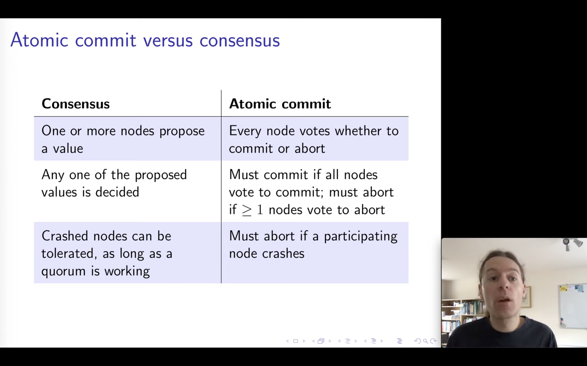
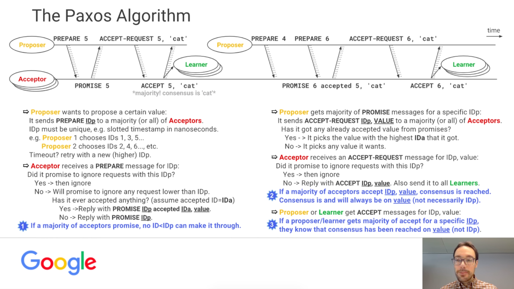
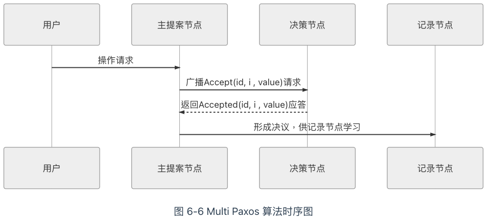

# 分佈式共識算法
這節會介紹兩三種具代表性的分佈式共識算法，為後續打好基礎。
先從一個淺顯的場景，引出本章的主題
> Q: 如果你有一份很重要的數據，要確保它長期存儲在電腦上不會丟失，你會怎麽做？
A: 多買幾塊硬碟。假設一塊硬碟每年損壞的機率是5％，那把文件複製到另外一塊硬碟上，
兩個硬碟同時壞掉而損失資料的機率只有0.25％，3個0.0125％，4個0.000625％，
也就是一年內有超過99.999％的機率是不會同時損失數據的。

軟體系統裡，保障可靠性跟可用性會面臨的困難：
**可靠性** 
* 程序出錯
* 硬碟損壞
* 網路分區
* 電源故障
解決方法: 增加擁有同樣副本的機器數量
與硬碟備份的方法相比，有本質上的區別

> 如果你有一份會隨時變動的數據，要確保它正確地存儲於網絡中的幾臺不同機器之上，你會怎麽做？

最容易想到的答案: 數據同步
* 2PC/3PC
* MySQL Cluster
以同步為代表的數據複製方法，被稱為狀態轉移 (State Transfer)，但通常會犧牲可用性。
這往往不能夠接受，一些系統可能要求要99.999999％可靠，同時也要達到99.999％可用

> 如果你有一份會隨時變動的數據，要確保它正確地存儲於網絡中的幾台不同機器之上，並且要盡可能保證數據是隨時可用的，你會怎麽做？

分布式系統主流式透過操作轉移(Operation Transfer)，透過某種操作，最終轉換為目標狀態。使用確定的操作，使狀態間產生確定的轉移計算結果，在CS領域稱為狀態機 (State machine)

:::info
額外知識：狀態機復製
狀態機有一個特性：任何初始狀態一樣的狀態機，如果執行的命令序列一樣，則最終達到的狀態也一樣。如果將此特性應用在多參與者進行協商共識上，可以理解為系統中存在多個具有完全相同的狀態機（參與者），這些狀態機能最終保持一致的關鍵就是起始狀態完全一致和執行命令序列完全一致。
:::

根據狀態機的特性，要讓多臺機器的最終狀態一致，只要確保它們的初始狀態是一致的，並且接收到的操作指令序列也是一致的即可，無論這個操作指令是新增、修改、刪除抑或是其他任何可能的程序行為，都可以理解為要將一連串的操作日誌正確地廣播給各個分布式節點。廣播指令與指令執行期間，允許系統內部狀態存在不一致的情況，即並不要求所有節點的每一條指令都是同時開始、同步完成的，只要求在此期間的內部狀態不能被外部觀察到，且當操作指令序列執行完畢時，所有節點的最終的狀態是一致的，這種模型就被稱為狀態機復製（State Machine Replication）。

考慮到分布式環境下網絡分區現象是不可能消除的，甚至允許不再追求系統內所有節點在任何情況下的數據狀態都一致，而是采用「少數服從多數」的原則，
一旦系統中過半數的節點中完成了狀態的轉換，就認為數據的變化已經被正確地存儲在系統當中，這種思想稱為[Quorum](https://en.wikipedia.org/wiki/Quorum_(distributed_computing))機製

Quorum 英文裡是法定人數的意思

#### Consensus vs. Consistency
* 一致性(Consistency) 是指數據不同副本之間的差異
* 共識（Consensus）是指達成一致性的方法與過程

分布式一致性算法 == “Distributed Consensus Algorithm”

Recap: 
可靠性在分布式系統會遇到更多挑戰 -> 保持不同機器所有狀態一致再開始運作會降低可用性 -> 考慮採用狀態機複製 -> 但網路分區不可能消除，於是引進Quorum

## 6.1 Paxos 
參考資料:
* https://www.youtube.com/watch?v=BhosKsE8up8&t=4545s&ab_channel=BitTiger%E5%AE%98%E6%96%B9%E9%A2%91%E9%81%93BitTigerOfficialChannel
* https://www.youtube.com/watch?v=d7nAGI_NZPk&ab_channel=GoogleTechTalks

發明者 Leslie Lamport (LaTeX 的 La)，Paxos 幾乎就是 Consensus 的代名詞，
### 算法流程
* 提案節點：稱為 Proposer，提出對某個值進行設置操作的節點，設置值這個行為就被稱之為提案（Proposal），值一旦設置成功，就是不會丟失也不可變的。，應該類比成日誌記錄操作，在後面介紹的 Raft 算法中就直接把「提案」叫作「日誌」了。
* 決策節點：稱為 Acceptor，是應答提案的節點，決定該提案是否可被投票、是否可被接受。提案一旦得到過半數決策節點的接受，即稱該提案被批準（Accept），提案被批準即意味著該值不能再被更改，也不會丟失，且最終所有節點都會接受該它。
* 記錄節點：被稱為 Learner，不參與提案，也不參與決策，只是單純地從提案、決策節點中學習已經達成共識的提案，譬如少數派節點從網絡分區中恢復時，將會進入這種狀態。

## 工作实例
https://ongardie.net/static/raft/userstudy/paxos.pdf
slides: 13, 14, 15, 16

缺點：
* 只能對單個值形成決議
* 需要兩次網路請求和應達
* 高併發情況可能形成活鎖

下一節介紹 Multi-Paxos 和一些理論上等價的演算法 (Raft, ZAB)

## 6.2 Multi Paxos
Basic Paxos問題: 活鎖
問題根源：每個提案節點都是平等的
解決：在平等節點挑一個意見領袖

Multi Paxos 對 Basic Paxos 的核心改進是增加了「選主」的過程，提案節點會通過定時輪詢（心跳），確定當前網絡中的所有節點裏是否存在有一個主提案節點，一旦沒有發現主節點存在，節點就會在心跳超時後使用 Basic Paxos 中定義的準備、批準的兩輪網絡交互過程，向所有其他節點廣播自己希望競選主節點的請求，希望整個分布式系統對「由我作為主節點」這件事情協商達成一致共識，如果得到了決策節點中多數派的批準，便宣告競選成功。

當選主完成之後，除非主節點失聯之後發起重新競選，否則從此往後，就只有主節點本身才能夠提出提案。此時，無論哪個提案節點接收到客戶端的操作請求，都會將請求轉發給主節點來完成提案，而主節點提案的時候，也就無需再次經過準備過程，因為可以視作是經過選舉時的那一次準備之後，後續的提案都是對相同提案 ID 的一連串的批準過程。也可以通俗理解為選主過後，就不會再有其他節點與它競爭，相當於是處於無並發的環境當中進行的有序操作，所以此時系統中要對某個值達成一致，只需要進行一次批準的交互即可。

思考「分布式系統中如何對某個值達成一致」這個問題，可以把該問題劃分做三個子問題來考慮，可以證明（具體證明就不列在這裏了，感興趣的讀者可參考結尾給出的論文）當以下三個問題同時被解決時，即等價於達成共識：

* 如何選主（Leader Election）。
* 如何把數據復製到各個節點上（Entity Replication）。
* 如何保證過程是安全的（Safety）。

* 選主：用 Paxos
* 數據複製：
  * heartbeat
  * 例子：網路分區
* 安全
    * 協定性（Safety）：所有的壞事都不會發生（something "bad" will never happen）。
      * 保證了選主的結果一定是有且只有唯一的一個主節點，不可能同時出現兩個主節點
    * 終止性（Liveness）：所有的好事都終將發生，但不知道是啥時候（something "good" will must happen, but we don't know when）。
      * 保證選主過程是一定可以在某個時刻能夠結束的。

以上述三個問題來思考共識算法，即為Raft算法
Raft: https://web.stanford.edu/~ouster/cgi-bin/papers/raft-atc14
http://thesecretlivesofdata.com/
後來更成為 Etcd、LogCabin、Consul 等重要分布式程序的實現基礎，ZooKeeper 的 ZAB 算法與 Raft 的思路也非常類似，這些算法都被認為是 Multi Paxos 的等價派生實現。

## 6.3 Gossip 協議
Paxos、Raft、ZAB 等分布式算法經常會被稱作是「強一致性」的分布式共識協議，其實在說「盡管系統內部節點可以存在不一致的狀態，但從系統外部看來，不一致的情況並不會被觀察到，所以整體上看系統是強一致性的」。

與它們相對的，還有另一類被冠以「最終一致性」的分布式共識協議，這表明系統中不一致的狀態有可能會在一定時間內被外部直接觀察到。
例如 DNS 系統，在各節點緩存的 TTL 到期之前，都有可能與真實的域名翻譯結果存在不一致。在本節中，筆者將介紹在比特幣網絡和許多重要分布式框架中都有應用的另一種具有代表性的「最終一致性」的分布式共識協議：Gossip 協議。

最初叫「流行病算法」（Epidemic Algorithm）

筆者按照習慣也把 Gossip 也稱作是「共識協議」，但首先必須強調它所解決的問題並不是直接與 Paxos、Raft 這些共識算法等價的，只是基於 Gossip 之上可以通過某些方法去實現與 Paxos、Raft 相類似的目標而已。一個最典型的例子是比特幣網絡中使用到了 Gossip 協議，用它來在各個分布式節點中互相同步區塊頭和區塊體的信息，這是整個網絡能夠正常交換信息的基礎，但並不能稱作共識；比特幣使用工作量證明（Proof of Work，PoW）來對「這個區塊由誰來記賬」這一件事情在全網達成共識，這個目標才可以認為與 Paxos、Raft 的目標是一致的。

優點
* 不要求網路節點連通性和穩定性，能夠容忍網路上節點隨意增加或減少
缺點
* 各節點狀態不一致
* 無法預估需要多長時間可以達成全網消息一致

取捨
* 一致性耗費時間
* 消息冗餘量

因此Gossip 設計兩種可能消息傳播模式
* Anti-Entropy: 反熵，反混亂，提昇個節點之間的相似度為目標，會同步節點的全部數據，但會給網路帶來巨大傳輸開銷
* Rumor-Mongering：傳遙，以傳播消息為目標，僅僅發送新到達節點的數據，即只對外發送變更信息，消息量顯著減少
