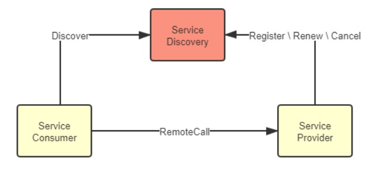
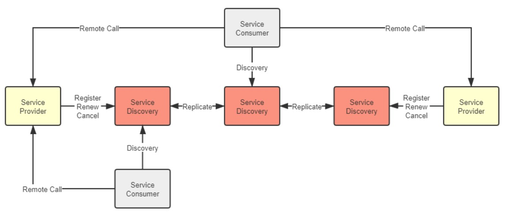
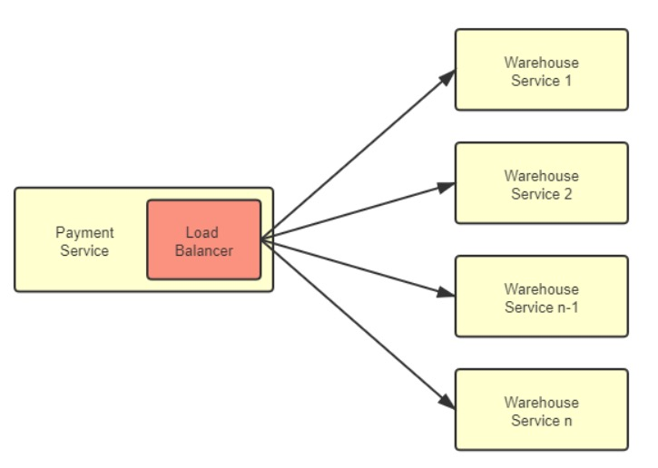
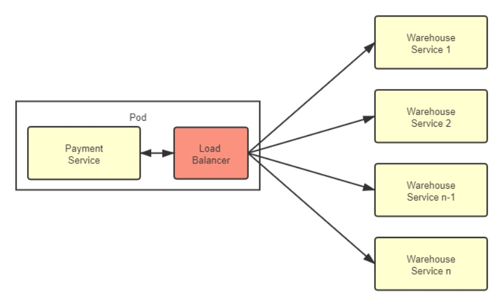

微服務架構的重要設計原則之一是「通過服務實現獨立自治的組件」（Componentization via Services），強調應該使用「服務」（Service）而不是「函式庫」（Library）來構建組件化的程式。

- 函式庫（Library）：在編譯期靜態連結到程式中，在本地使用方法來調用功能。
- 服務（Service）：進程外的組件，通過調用遠程方法來使用其中的功能。

使用服務來構建程式，可實現軟體系統在物理層面上的「整體」與「部分」真正隔離。這對於構建可靠的大型軟體系統非常寶貴。

但是，微服務架構在複雜性和執行效能方面付出了極大的代價。

在一個由多個微服務相互調用才能正常運作的分佈式系統中，每個節點都互相扮演著服務的生產者和消費者的多重角色，形成了一個複雜的網狀調用關係。

此時，至少有以下三個問題需要考慮和解決：

1. 對消費者來說，外部的服務是由誰提供？在什麼網路位置上？
2. 對生產者來說，哪些內部服務需要公開？哪些應該隱藏？應該以什麼形式公開服務？在集群中以什麼規則分配請求？
3. 對調用過程來說，如何保證每個遠程服務都接收到相對平均的流量，以獲得最高的服務品質和可靠性？

這三個問題的解決方案通常被稱為「服務發現」、「服務的網關路由」和「服務的負載均衡」。

## 7.1 服務發現（Service Discovery）

程式設計中常使用的函式庫封裝技術，讓電腦能夠透過不同模組之間的方法呼叫，組裝出可複用的指令序列，使得軟體開發的規模更為龐大。

不論是在編譯期間連結的 C、C++ 語言，還是在執行期間連結的 Java 語言，都需要透過連結器（Linker）將程式碼中的符號參照轉換為模組入口或程序內存地址的直接參照。

而隨著服務化的普及，軟體系統能夠透過分布於網路上不同的機器相互協作，以實現功能複用，這是軟體發展規模的第二次飛躍。

此時，如何確定目標方法的確切位置，便是與編譯連結同等重要的研究課題，解決這個問題的過程被稱為「服務發現」（Service Discovery）。

### 7.1.1 服務發現的意義

遠端服務調用通常使用全限定名（Fully Qualified Domain Name，FQDN）、端口號和服務標識三元組確定服務位置。

全限定名代表網路中主機的精確位置，端口代表主機上提供 TCP/UDP 網路服務的程序，服務標識代表程序提供的某個具體方法入口。

不同協議具有不同的標識形式，如：

1. REST 使用 URL 地址
2. RMI 使用 Stub 類中的方法
3. SOAP 使用 WSDL 定義方法等。

遠端服務標識的多樣性，使得服務發現有兩種理解：

1. 一種是「百科全書式」的服務發現，如 UDDI，包括企業信息、聯繫地址、分類目錄等，
2. 另一種是類似於 DNS 的「門牌號碼式」服務發現，只需將代表服務提供者的全限定名轉換為服務實際主機 IP 地址，不關心服務廠家和方法細節。

後一種服務發現是主流，服務坐標為「全限定名+端口號」。

本文的服務發現特指後一種。

原本服務發現僅依賴 DNS 將全限定名轉換為一至多個 IP 地址或其他類型的記錄。

負載平衡器也實際上承擔了一部分服務發現的職責。

然而，隨著微服務的流行，服務的宕機、重啟和上線、下線變得更加頻繁，僅靠 DNS 和負載平衡器等基礎設施已無法跟上服務變化的步伐。

人們嘗試使用 ZooKeeper 這樣的分布式 K/V 框架完成服務註冊與發現，但 ZooKeeper 是底層的分布式工具，用戶需要做更多工作才能滿足服務發現的需求。

2014 年，Netflix 內部經過長時間考驗的服務發現框架 Eureka 開源，很快成為 Spring 默認的遠程服務發現的解決方案。

到 2018 年，Consul 和 Nacos 成為 Spring Cloud Eureka 的替代品。

服務發現框架已經發展成熟，不僅支持 DNS 或 HTTP 請求進行符號與實際地址的轉換，還支持各種健康檢查方式、集中配置、K/V 存儲和跨數據中心數據交換等功能。

隨著雲原生時代的來臨，基礎設施的靈活性得到了增強，最初的使用基礎設施來透明化服務發現的方式又被人們所重視。

如何在基礎設施和網絡協議層面，對應用進行服務發現是當前服務發現的一個主要發展方向。

### 7.1.2 可用與可靠（Availability and Reliability）

服務發現具體包含三個過程：

1. 服務的註冊（Service Registration）：服務啟動時，透過某些形式（呼叫 API、產生 event message、寫入資料庫、在 ZooKeeper/Etcd 指定位置紀錄等），將服務的位置資訊（如 IP、端口、服務標識等）註冊到服務發現中心。
2. 服務的維護（Service Maintaining）：服務發現中心須確保服務列表是健康的，透過各種手段（HTTP、TCP、長連接、心跳、探針、執行緒狀態等），監控服務是否健康存活，將不健康的服務自動從服務列表中剔除。
3. 服務的發現（Service Discovery）：把服務的識別符號（FQDN 等）轉換成實際座標，通常透過 HTTP API 或 DNS Lookup 來完成。也有一些少用方式，例如 Kubernetes 支援注入環境變數來做服務發現。

除了上述三個必備功能，服務發現框架可能還有其他選配功能，像是：

1. 負載平衡
2. 流量管控
3. Key/Value 儲存
4. Meta Data 管理
5. 業務分組等等

後面章節會有專門介紹，這裡不展開。

接著我們來探討在分布式環境裡，服務發現框架遇到的 CAP 難題。

服務發現既要高可用，也要高可靠，這是因為服務發現在整個系統中的特殊地位。

典型的服務發現系統架構如下圖：



包含三種角色：

1. 服務發現中心（Service Discovery）
2. 服務提供者（Service Provider）
3. 服務消費者（Service Consumer）

三者會進行以下操作：

1. 服務提供者在服務註冊中心註冊、續約、下線自己的真實座標
2. 服務消費者根據某種符號從服務註冊中心獲取服務提供者的真實座標
3. 服務消費者呼叫服務提供者

三者在系統中相互關係是對等的。

但在真實世界，服務發現中心的地位是特殊的。它不依賴其他服務，但被所有其他服務共同依賴，是系統中最基礎的服務。

為了確保服務發現中心的可用性，通常我們會以集群的方式部署它，通常使用三或五個節點（通常不超過七個，否則資料複製成本太高）。

真實世界的系統架構通常如下：



我們要特別注意各服務發現中心之間的「Replicate」實踐。

我們希望服務發現中心永遠可用，而且能從任何節點拿到一致的資訊，避免發生拿回來的服務地址的服務其實已經下線的狀況。高可用和高一致性就構成了 CAP 矛盾，不可能同時滿足。

以兩個最具代表性的服務發現框架 Netflix Eureka 和 Hashicorp Consul 來說明：

1. Eureka 的選擇是優先保證高可用性，相對犧牲系統中服務狀態的一致性。
   Eureka 的各個節點間採用異步複製來交換服務註冊資訊，當有新服務註冊進來時，並不需要等待資訊在其他節點複製完成，而是馬上在該服務發現節點宣告服務可見，只是不保證在其他節點上多長時間後才會可見。
   同時，當有舊的服務發生變動，譬如下線或者斷網，只會由超時機制來控制何時從哪一個服務註冊表中移除，變動資訊不會實時的同步給所有服務端與客戶端。
   這樣的設計使得不論是 Eureka 的服務端還是客戶端，都能夠持有自己的服務註冊表快取，並以 TTL（Time to Live）機制來進行更新，哪怕服務註冊中心完全崩潰，客戶端在仍然可以維持最低限度的可用。
   Eureka 的服務發現模型對節點關係相對固定，服務一般不會頻繁上下線的系統是很合適的，以較小的同步代價換取了最高的可用性；
   Eureka 能夠選擇這種模型的底氣在於萬一客戶端拿到了已經發生變動的錯誤地址，也能夠通過 Ribbon 和 Hystrix 模組配合來兜底，實現故障轉移（Failover）或者快速失敗（Failfast）。
2. Consul 的選擇是優先保證高可靠性，相對犧牲系統服務發現的可用性。Consul 採用 Raft 算法，要求多數派節點寫入成功後服務的註冊或變動才算完成，嚴格地保證了在集群外部讀取到的服務發現結果必定是一致的；同時採用 Gossip 協議，支持多數據中心之間更大規模的服務同步。Consul 優先保證高可靠性一定程度上是基於產品現實情況而做的技術決策，它不像 Netflix OSS 那樣有著全家桶式的微服務組件，萬一從服務發現中取到錯誤地址，就沒有其他組件為它兜底了。

Eureka 與 Consul 的差異帶來的影響主要不在於服務註冊的快慢（當然，快慢確實是有差別），而在於你如何看待以下這件事情：

假設系統形成了 A、B 兩個網絡分區後，A 區的服務只能從區域內的服務發現節點獲取到 A 區的服務坐標，B 區的服務只能取到在 B 區的服務坐標，這對你的系統會有什麼影響？

如果這件事情對你並沒有太大的影響，甚至有可能還是有益的，就應該傾向於選擇 AP 式的服務發現。譬如假設 A、B 就是不同的機房，是機房間的網絡交換機導致服務發現集群出現的分區問題，但每個分區中的服務仍然能獨立提供完整且正確的服務能力，此時儘管不是有意而為，但網絡分區在事實上避免了跨機房的服務請求，反而還帶來了服務調用鏈路優化的效果。

如果這件事情也可能對你影響非常之大，甚至可能帶來比整個系統宕機更壞的結果，就應該傾向於選擇 CP 式的服務發現。譬如係統中大量依賴了集中式緩存、消息總線、或者其他有狀態的服務，一旦這些服務全部或者部分被分隔到某一個分區中，會對整個系統的操作的正確性產生直接影響的話，那與其最後弄出一堆數據錯誤，還不如直接停機來得痛快。

### 7.1.3 註冊中心實現

在服務發現中，可用性和一致性是分布式系統永恆的矛盾，決策關注點是更能容忍服務列表不可用，還是服務數據不準確。

目前有三種服務發現方案：

1. 基於分布式 K/V 存儲框架的服務發現，例如 ZooKeeper、Doozerd、Etcd。
2. 於基礎設施（主要是指 DNS 伺服器）的服務發現，例如 SkyDNS、CoreDNS。
3. 專門用於服務發現的框架和工具，例如 Eureka、Consul 和 Nacos。

這些方案各有利弊，應根據需求選擇。

譬如，使用 K/V 框架可保證 CP，但需自行實現許多基礎能力；基於基礎設施來做服務發現可以應用透明，但需自行解決一些問題；專門用於服務發現的框架和工具可以做到以聲明代替編碼，但需要考慮語言和框架的集成問題。

---

## 7.2 閘道器與路由（Gateways and Routers）

### 7.2.1 閘道器的職責（Responsibilities of Gateways）

在單體架構下，負載均衡器負責分發流量給各個系統副本，所以網關的角色並不太重要。

但在微服務架構下，每個服務節點都有自己獨立的接口，需要一個統一的代理人角色對外交互。因此，微服務中的網關變得越來越重要，甚至成為必不可少的設施之一。

微服務中的網關主要負責統一對外提供服務，將流量路由到內部集群中正確的服務節點，同時也可以作為流量過濾器，提供安全、認證、授權、限流、監控、緩存等功能。

因此，微服務中的網關包括「路由器」和「過濾器」兩個基礎職能。

服務網關需要考慮路由的協議層次和性能可用性，以便正確地路由流量。

在協議層次方面，服務網關與負載均衡器的技術實現沒有太大差別，但服務網關需要能夠識別流量中的特徵來進行正確路由。

此外，服務網關能夠支持的網絡通信協議的層次將直接影響後端服務節點的服務通信方式。

如果服務集群只提供基於 TCP 的訪問服務，只需要部署四層網關即可，而如果要提供 HTTP 服務，則必須部署七層網關，以便根據 HTTP 报文中的 URL、Header 等信息來路由流量。

服務網關的另一個重點是其性能和可用性，因為網關是所有服務對外的總出口，是流量必經之地，所以網關的路由性能將對系統產生系統性的影響。

網關的性能取決於其工作模式和自身實現算法，其中工作模式是最關鍵的因素。

採用 DSR 三角傳輸模式可以獲得更好的性能，但由於大多數服務接口都基於 HTTP 協議，所以服務網關通常只能採用代理模式來支持七層路由。

在這種情況下，網關的性能主要取決於它們如何代理網絡請求，即它們的網絡 I/O 模型。

### 7.2.2 網路 I/O 模型（Network I/O Models）

網路 I/O 就是對數據流的操作，包含以下兩階段：

1. 等待數據從遠端主機到達本機緩衝區
2. 將資料從緩衝區複製到應用程式位址空間

根據這兩階段的不同實作，網路 I/O 模型可以分為兩類、五種模型，我們以「領取便當」為例說明：

1. 一類：非同步 I/O（Asynchronous I/O）：訂外賣，付錢後就可以去做其他事，飯做完後外送員送到門口後會打電話通知你。資料到達緩衝區後，不需要由主程式主動複製資料，而是操作系統複製完後會通知主程式。
2. 二類：同步 I/O（Synchronous I/O）：自己去餐廳裝飯，此時會有四種情境
   1. 阻塞 I/O（Blocking I/O）：你到了餐廳，發現飯還沒煮好，你也無法做別的，只能打個盹（線程休眠），直到飯煮好，這就是被阻塞了。阻塞 I/O 是最直觀的 I/O 模型，邏輯清晰，也比較節省 CPU 資源，但缺點就是線程休眠所帶來的上下文切換，這是一種需要切換到內核狀態的重負載操作，不應當頻繁進行。
   2. 非阻塞 I/O（Non-Blocking I/O）：你到了餐廳，發現飯還沒煮好，你就回去了，然後每隔三分鐘去餐廳看飯煮好了沒，直到飯煮好。非阻塞 I/O 能夠避免線程休眠，對於一些很快就能返回結果的請求，非阻塞 I/O 可以節省切換上下文切換的消耗，但對於較長時間才能返回的請求，非阻塞 I/O 反而白白浪費了 CPU 資源，所以目前不常用。
   3. 多路復用 I/O（Multiplexing I/O）：多路復用 I/O 本質上是阻塞 I/O 的一種，但它的好處是可以在同一條阻塞線程上處理多個不同端口的監聽。比方說你叫雷鋒，代表整個宿舍去餐廳打飯，到了餐廳，發現飯還沒煮好，還是繼續打盹，但哪個室友的飯煮好了，你就立刻把那份飯送回去，然後繼續打盹等待其他的飯煮好。多路復用 I/O 是目前高並發網路應用的主流，它下面還可以細分 select、epoll、kqueue 等不同實現，這裡就不展開了。
   4. 信號驅動 I/O（Signal-Driven I/O）：你去到餐廳，發現飯還沒做好，但你跟廚師很熟，跟他說飯做好了叫你，然後回去該幹嘛幹嘛，等收到廚師通知後，你把飯從餐廳拿回宿舍。這裡廚師的通知就是那個「信號」，信號驅動 I/O 與非同步 I/O 的區別是「從緩衝區獲取數據」這個步驟的處理，前者收到的通知是可以開始進行複製操作了，即要你自己從餐廳拿回宿舍，在複製完成之前執行緒處於阻塞狀態，所以它仍屬於同步 I/O 操作，而後者收到的通知是複製操作已經完成，即外賣小哥已經把飯送到了。

總結來看，第一類的非同步 I/O（Asynchronous I/O）是最方便的。但它受限於作業系統的支援度。

Windows NT Kernel 3.5 就支援了非同步 I/O，而 Linux Kernel 2.6 後才首次導入，Linux 高併發網路應用主要還是使用多路復用 I/O（Multiplexing I/O）。

在分析網關的性能時，通常只能進行定性分析，要量化地比較哪種網關性能最好、快多少是很困難的。就像我們都認為 Chrome 比 IE 快，但具體情境下快多少就很難明確說明。

網關也存在可用性問題，因為每個系統的網路調用中都至少有一個單點存在。

對於小型系統來說，網關很容易成為網路訪問中的單點，因此它的可用性非常重要。

針對網關的可用性，我們應該注意以下幾點：

1. 網關應盡可能輕量，因為附加過多的功能會增加網關的負擔。
2. 選擇網關時，應該盡可能选择经过长期考验的成熟產品，例如 Nginx Ingress Controller、KONG、Zuul 等，而不能一味追求最新產品的性能，需要在性能與可用性之間做出權衡。
3. 在需要高可用的生產環境中，應該在網關之前部署負載均衡器或等價路由器（ECMP），讓更成熟的設施充當整個系統的入口地址，這樣可以增強網關的可擴展性。

### 7.2.3 Backends for Frontends 閘道器（Backends for Frontends Gateways）

BFF（Backends for Frontends）是隨著微服務一同興起的概念，旨在讓網關能夠針對不同的前端聚合不同的服務，提供不同的接口和協議支援。

舉例來說，對於運行於瀏覽器的 Web 程序，服務網關就應提供基於 HTTP 協議的 REST 服務；而對於運行於桌面系統的程序，可以部署另一套網關，提供基於更高性能協議（如 gRPC）的接口。

在網關這個邊緣節點上，針對同一後端集群，裁剪、適配、聚合出適應不同前端的服務，有助於後端的穩定性，也有助於前端的能力提升。


---

## 7.3 客戶端負載平衡（Client-side Load Balancing）

先區分幾個容易搞混的概念：服務發現、網關路由、負載平衡、和下一章節會介紹的服務容錯。

這裡個名詞都有著「從服務集群中找到一個適合的服務來呼叫」的意義。

以下面例子來說明他們的差異：

假設你在廣東，你在線上書店買書，程式邏輯中會呼叫這支 API 完成購買，請求如下：

```plaintext
PATCH https://warehouse:8080/restful/stockpile/3

{amount: -1}
```

再假設這線上書店很大，在世界各地機房都部署有服務集群。

整個請求的傳輸過程如下：

1. 服務發現：將 warehouse FQDN 轉換成服務的 ip，理想上會優先連接最接近發起端的機房，因此此處會變轉換成廣州 IP `guangzhou-ip-wan`

```plaintext
PATCH https://guangzhou-ip-wan:8080/restful/stockpile/3
```

2. 網關路由：廣州機房的網關會根據請求的 URL 特徵，發現 URL 中的 `/restful/stockpile/**/restful/stockpile/**` 對應商品出貨服務，因此將請求的 IP 轉成內網 Warehouse 服務集群的入口地址：

```plaintext
PATCH https://warehouse-gz-lan:8080/restful/stockpile/3
```

3. 負載平衡：集群內有多個 Warehouse 服務，負載平衡器根據某種標準決定要呼叫哪個子服務（隨機、輪詢、或呼叫次數最少的），假設這次選用 `warehouse-gz-lan-node1` 服務，請求會被改寫如下：

```plaintext
PATCH https://warehouse-gz-lan-node1:8080/restful/stockpile/3
```

4. 如果 `warehouse-gz-lan-node1` 服務壞了，丟出 500 錯誤：

```plaintext
HTTP/1.1 500 Internal Server Error
```

5. 服務容錯：根據預先設定的故障轉移策略，在其他節點重試請求，例如改呼叫 `warehouse-gz-lan-node2`，此時請求被改寫如下：

```plaintext
PATCH https://warehouse-gz-lan-node2:8080/restful/stockpile/3
```

6. `warehouse-gz-lan-node2` 服務正常，請求成功：

```plaintext
HTTP/1.1 200 OK
```

上面 1、2、3、5，就對應了服務發現、網關路由、負載平衡、和服務容錯。

其中部分職責是有交叉的，例如步驟 1 服務發現，根據請求來源的物理位置分配機房，本質上是一種路由行為。

另外你是否覺得以上網路傳輸過程過於複雜？廣州機房內網的服務請求，在外網繞了一大圈，繞回機房內網另一個服務來回應，有方法能簡化嗎？

### 7.3.1 客戶端負載平衡器（Client-side Load Balancers）

對於大型系統來說，負載平衡器是不可或缺的設備。

以前，負載平衡器主要部署在整個服務集群的前端，將用戶請求分配到各個服務進行處理。

隨著微服務的發展，服務集群不僅收到來自外部的請求，還有越來越多的訪問請求是由集群內部的服務發起的，因此，直接在服務集群內部消化內部流量變得更加合理。

這促使一種新的分散式負載平衡方式的出現：客戶端負載平衡器（Client-side Load Balancers）。



此時傳統的負載平衡器，我們可以給他另一個名字：服務端負載平衡器（Server-side Load Balancers）。

客戶端負載平衡器相較於服務器端負載平衡器相比，差異與優點如下：

1. 客戶端負載平衡器是和服務實例一一對應的，而且與服務實例共存於同一進程中。這意味著信息交換是進程內的方法調用，不存在額外的網絡開銷；
2. 所有內部流量都僅在服務集群的內部循環，避免了流量繞場的尷尬局面；
3. 天然避免了集中式的單點問題；
4. 更加靈活，能夠為每個服務實例單獨設置平衡策略等參數，如具備親和性、隨機、輪詢、加權或最小連接等。

但客戶端負載平衡器也有一些缺點：

1. 與服務運行於同一進程內，因此其選型受編程語言的限制。這個缺陷有違於微服務中技術異構不應受到限制的原則。
2. 均衡器的穩定性會直接影響整個服務進程的穩定性，消耗的 CPU、內存等資源也同樣影響到服務的可用資源。
3. 內部網絡安全和信任關係變得複雜，攻破任何一個服務可能會導致整個集群受到影響。
4. 客戶端負載均衡器必須持續跟踪其他服務的健康狀況，以實現上線新服務、下線舊服務、自動剔除失敗的服務、自動重連恢復的服務等功能。這些操作需要通過訪問服務註冊中心來完成，數量龐大的客戶端負載均衡器持續輪詢服務註冊中心也會給它帶來不小的負擔。

### 7.3.2 代理負載均衡器（Proxy Load Balancers）

為解決這些問題，代理負載均衡器（Proxy Load Balancers）出現了。

代理均衡器改進了客戶端負載平衡器，將原本嵌入服務進程中的負載平衡器提取出來，作為一個特殊服務，放到邊緣代理中實現，這個代理服務與服務實例在同一 Pod 內，放到 Sidecar 裡實現。

流量關係如下：



客戶端負載平衡器與服務本身是 process 內通訊，而代理負載平衡器與服務本身是網絡通訊，數據要經過打包拆包、計算校驗和、維護序列號等步驟。

然而，Kubernetes 保證同一個 Pod 中的容器不會跨越不同的節點，這些容器共享同一個網絡名稱空間，所以代理均衡器與服務實例的交互實際上是對本機回環設備的訪問，所以它們比客戶端負載均衡器在性能上更高效且穩定。

代理負載均衡器（Proxy Load Balancers）的优点如下：

1. 不再受編程語言的限制，可以發展一個支持多種編程語言的通用的代理均衡器，
2. 避免了客戶端均衡器的穩定性影響到服務進程的穩定等問題。
3. 在服務拓撲感知方面代理均衡器也要更有優勢。由於邊車代理接受控制平面的統一管理，當服務節點拓撲關係發生變化時，控制平面就會主動向邊車代理髮送更新服務清單的控制指令，這避免了此前客戶端均衡器必須長期主動輪詢服務註冊中心所造成的浪費。
4. 在安全性、可觀測性上，由於邊車代理都是一致的實現，有利於在服務間建立雙向 TLS 通信，也有利於對整個調用鏈路給出更詳細的統計信息。

總之，通過同一個 Pod 的獨立容器實現的代理均衡器是目前最理想的處理微服務集群內部流量的方式，儘管服務網格本身還不夠成熟，對操作系統、網絡和運維方面的知識要求較高，但相信隨著時間的推移，未來這將會成為微服務的主流通信方式。

### 7.3.3 地域與區域（Regions and Zones）

最後再談一個與負載平衡器相關的話題，地域與區域（Regions and Zones）。在微服務或雲端常見。

1. Region 地域：例如華北、東北、華東、華南等。全球或全國規模的大型系統服務集群通常會在多個地理區域部署，如本篇所舉的案例。大型系統通過在不同的地理區域的機房部署來縮短用戶與服務器之間的物理距離，以提高響應速度。小型系統通常只在異地容災時才需要考慮地理區域。需要注意的是，不同地理區域之間沒有內網連接，所有流量都必須通過公共互聯網相連。如果微服務流量跨越不同地理區域，就和調用外部服務提供商的互聯網服務沒有什麼區別。因此，集群內部的流量不會跨越地理區域，服務發現和負載均衡器默認也不支持跨地理區域的服務發現和負載均衡。
2. Zone 區域：它是「可用區域(Availability Zones)」的縮寫。區域是指在地理上位於同一地區內，但是電力和網絡是互相獨立的物理區域。例如，在華東地區的上海、杭州和蘇州的不同機房就是同一地區的可用區域。同一地區的可用區域之間有內網連接，流量不占用公網帶寬，因此區域是微服務集群內流量能夠觸及的最大範圍。應用程式是部署在同一區域內，還是部署到不同的可用區域中，取決於你是否有需要做異地備援，以及對網絡延遲的容忍程度。

如果你追求高可用，譬如希望系統即使在某個地區發生電力或者骨幹網絡中斷時仍然可用，那可以考慮將系統部署在多個區域中。注意異地容災和異地雙活的差別：容災是非實時的同步，而雙活是實時或者準實時的，跨地域或者跨區域做容災都可以，但一般只能跨區域做雙活，當然也可以將它們結合起來同時使用，即「兩地三中心」模式。

如果你追求低延遲，譬如對時間有高要求的 SLA 應用，或者網絡遊戲服務器等，那就應該考慮將系統的所有服務都只部署在同一個區域中，因為儘管內網連接不受限於公網帶寬，但畢竟機房之間的專線容量也是有限的，難以跟機房內部的交換機相比，延時也受物理距離、網絡跳點數量等因素的影響。
