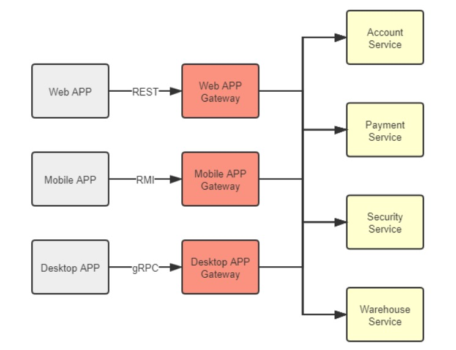

微服務架構的重要設計原則之一是「通過服務實現獨立自治的組件」（Componentization via Services），強調應該使用「服務」（Service）而不是「函式庫」（Library）來構建組件化的程式。

- 函式庫（Library）：在編譯期靜態連結到程式中，在本地使用方法來調用功能。
- 服務（Service）：進程外的組件，通過調用遠程方法來使用其中的功能。

使用服務來構建程式，可實現軟體系統在物理層面上的「整體」與「部分」真正隔離。這對於構建可靠的大型軟體系統非常寶貴。

但是，微服務架構在複雜性和執行效能方面付出了極大的代價。

在一個由多個微服務相互調用才能正常運作的分佈式系統中，每個節點都互相扮演著服務的生產者和消費者的多重角色，形成了一個複雜的網狀調用關係。

此時，至少有以下三個問題需要考慮和解決：

1. 對消費者來說，外部的服務是由誰提供？在什麼網路位置上？
2. 對生產者來說，哪些內部服務需要公開？哪些應該隱藏？應該以什麼形式公開服務？在集群中以什麼規則分配請求？
3. 對調用過程來說，如何保證每個遠程服務都接收到相對平均的流量，以獲得最高的服務品質和可靠性？

這三個問題的解決方案通常被稱為「服務發現」、「服務的網關路由」和「服務的負載均衡」。

## 7.1 服務發現（Service Discovery）

程式設計中常使用的函式庫封裝技術，讓電腦能夠透過不同模組之間的方法呼叫，組裝出可複用的指令序列，使得軟體開發的規模更為龐大。

不論是在編譯期間連結的 C、C++ 語言，還是在執行期間連結的 Java 語言，都需要透過連結器（Linker）將程式碼中的符號參照轉換為模組入口或程序內存地址的直接參照。

而隨著服務化的普及，軟體系統能夠透過分布於網路上不同的機器相互協作，以實現功能複用，這是軟體發展規模的第二次飛躍。

此時，如何確定目標方法的確切位置，便是與編譯連結同等重要的研究課題，解決這個問題的過程被稱為「服務發現」（Service Discovery）。

### 7.1.1 服務發現的意義

遠端服務調用通常使用全限定名（Fully Qualified Domain Name，FQDN）、端口號和服務標識三元組確定服務位置。

全限定名代表網路中主機的精確位置，端口代表主機上提供 TCP/UDP 網路服務的程序，服務標識代表程序提供的某個具體方法入口。

不同協議具有不同的標識形式，如：

1. REST 使用 URL 地址
2. RMI 使用 Stub 類中的方法
3. SOAP 使用 WSDL 定義方法等。

遠端服務標識的多樣性，使得服務發現有兩種理解：

1. 一種是「百科全書式」的服務發現，如 UDDI，包括企業信息、聯繫地址、分類目錄等，
2. 另一種是類似於 DNS 的「門牌號碼式」服務發現，只需將代表服務提供者的全限定名轉換為服務實際主機 IP 地址，不關心服務廠家和方法細節。

後一種服務發現是主流，服務坐標為「全限定名+端口號」。

本文的服務發現特指後一種。

原本服務發現僅依賴 DNS 將全限定名轉換為一至多個 IP 地址或其他類型的記錄。

負載平衡器也實際上承擔了一部分服務發現的職責。

然而，隨著微服務的流行，服務的宕機、重啟和上線、下線變得更加頻繁，僅靠 DNS 和負載平衡器等基礎設施已無法跟上服務變化的步伐。

人們嘗試使用 ZooKeeper 這樣的分布式 K/V 框架完成服務註冊與發現，但 ZooKeeper 是底層的分布式工具，用戶需要做更多工作才能滿足服務發現的需求。

2014 年，Netflix 內部經過長時間考驗的服務發現框架 Eureka 開源，很快成為 Spring 默認的遠程服務發現的解決方案。

到 2018 年，Consul 和 Nacos 成為 Spring Cloud Eureka 的替代品。

服務發現框架已經發展成熟，不僅支持 DNS 或 HTTP 請求進行符號與實際地址的轉換，還支持各種健康檢查方式、集中配置、K/V 存儲和跨數據中心數據交換等功能。

隨著雲原生時代的來臨，基礎設施的靈活性得到了增強，最初的使用基礎設施來透明化服務發現的方式又被人們所重視。

如何在基礎設施和網絡協議層面，對應用進行服務發現是當前服務發現的一個主要發展方向。

### 7.1.2 可用與可靠（Availability and Reliability）

服務發現具體包含三個過程：

1. 服務的註冊（Service Registration）：服務啟動時，透過某些形式（呼叫 API、產生 event message、寫入資料庫、在 ZooKeeper/Etcd 指定位置紀錄等），將服務的位置資訊（如 IP、端口、服務標識等）註冊到服務發現中心。
2. 服務的維護（Service Maintaining）：服務發現中心須確保服務列表是健康的，透過各種手段（HTTP、TCP、長連接、心跳、探針、執行緒狀態等），監控服務是否健康存活，將不健康的服務自動從服務列表中剔除。
3. 服務的發現（Service Discovery）：把服務的識別符號（FQDN 等）轉換成實際座標，通常透過 HTTP API 或 DNS Lookup 來完成。也有一些少用方式，例如 Kubernetes 支援注入環境變數來做服務發現。

除了上述三個必備功能，服務發現框架可能還有其他選配功能，像是：

1. 負載平衡
2. 流量管控
3. Key/Value 儲存
4. Meta Data 管理
5. 業務分組等等

後面章節會有專門介紹，這裡不展開。

接著我們來探討在分布式環境裡，服務發現框架遇到的 CAP 難題。

服務發現既要高可用，也要高可靠，這是因為服務發現在整個系統中的特殊地位。

典型的服務發現系統架構如下圖：

包含三種角色：

1. 服務發現中心（Service Discovery）
2. 服務提供者（Service Provider）
3. 服務消費者（Service Consumer）

三者會進行以下操作：

1. 服務提供者在服務註冊中心註冊、續約、下線自己的真實座標
2. 服務消費者根據某種符號從服務註冊中心獲取服務提供者的真實座標
3. 服務消費者呼叫服務提供者

三者在系統中相互關係是對等的。

但在真實世界，服務發現中心的地位是特殊的。它不依賴其他服務，但被所有其他服務共同依賴，是系統中最基礎的服務。

為了確保服務發現中心的可用性，通常我們會以集群的方式部署它，通常使用三或五個節點（通常不超過七個，否則資料複製成本太高）。

真實世界的系統架構通常如下：

我們要特別注意各服務發現中心之間的「Replicate」實踐。

我們希望服務發現中心永遠可用，而且能從任何節點拿到一致的資訊，避免發生拿回來的服務地址的服務其實已經下線的狀況。高可用和高一致性就構成了 CAP 矛盾，不可能同時滿足。

以兩個最具代表性的服務發現框架 Netflix Eureka 和 Hashicorp Consul 來說明：

1. Eureka 的選擇是優先保證高可用性，相對犧牲系統中服務狀態的一致性。
   Eureka 的各個節點間採用異步複製來交換服務註冊資訊，當有新服務註冊進來時，並不需要等待資訊在其他節點複製完成，而是馬上在該服務發現節點宣告服務可見，只是不保證在其他節點上多長時間後才會可見。
   同時，當有舊的服務發生變動，譬如下線或者斷網，只會由超時機制來控制何時從哪一個服務註冊表中移除，變動資訊不會實時的同步給所有服務端與客戶端。
   這樣的設計使得不論是 Eureka 的服務端還是客戶端，都能夠持有自己的服務註冊表快取，並以 TTL（Time to Live）機制來進行更新，哪怕服務註冊中心完全崩潰，客戶端在仍然可以維持最低限度的可用。
   Eureka 的服務發現模型對節點關係相對固定，服務一般不會頻繁上下線的系統是很合適的，以較小的同步代價換取了最高的可用性；
   Eureka 能夠選擇這種模型的底氣在於萬一客戶端拿到了已經發生變動的錯誤地址，也能夠通過 Ribbon 和 Hystrix 模組配合來兜底，實現故障轉移（Failover）或者快速失敗（Failfast）。
2. Consul 的選擇是優先保證高可靠性，相對犧牲系統服務發現的可用性。Consul 採用 Raft 算法，要求多數派節點寫入成功後服務的註冊或變動才算完成，嚴格地保證了在集群外部讀取到的服務發現結果必定是一致的；同時採用 Gossip 協議，支持多數據中心之間更大規模的服務同步。Consul 優先保證高可靠性一定程度上是基於產品現實情況而做的技術決策，它不像 Netflix OSS 那樣有著全家桶式的微服務組件，萬一從服務發現中取到錯誤地址，就沒有其他組件為它兜底了。

Eureka 与 Consul 的差异带来的影响主要不在于服务注册的快慢（当然，快慢确实是有差别），而在于你如何看待以下这件事情：

假设系统形成了 A、B 两个网络分区后，A 区的服务只能从区域内的服务发现节点获取到 A 区的服务坐标，B 区的服务只能取到在 B 区的服务坐标，这对你的系统会有什么影响？

如果这件事情对你并没有太大的影响，甚至有可能还是有益的，就应该倾向于选择 AP 式的服务发现。譬如假设 A、B 就是不同的机房，是机房间的网络交换机导致服务发现集群出现的分区问题，但每个分区中的服务仍然能独立提供完整且正确的服务能力，此时尽管不是有意而为，但网络分区在事实上避免了跨机房的服务请求，反而还带来了服务调用链路优化的效果。
如果这件事情也可能对你影响非常之大，甚至可能带来比整个系统宕机更坏的结果，就应该倾向于选择 CP 式的服务发现。譬如系统中大量依赖了集中式缓存、消息总线、或者其他有状态的服务，一旦这些服务全部或者部分被分隔到某一个分区中，会对整个系统的操作的正确性产生直接影响的话，那与其最后弄出一堆数据错误，还不如直接停机来得痛快。

### 7.1.3 註冊中心實現

在服務發現中，可用性和一致性是分布式系統永恆的矛盾，決策關注點是更能容忍服務列表不可用，還是服務數據不準確。

目前有三種服務發現方案：

1. 基於分布式 K/V 存儲框架的服務發現，例如 ZooKeeper、Doozerd、Etcd。
2. 於基礎設施（主要是指 DNS 伺服器）的服務發現，例如 SkyDNS、CoreDNS。
3. 專門用於服務發現的框架和工具，例如 Eureka、Consul 和 Nacos。

這些方案各有利弊，應根據需求選擇。

譬如，使用 K/V 框架可保證 CP，但需自行實現許多基礎能力；基於基礎設施來做服務發現可以應用透明，但需自行解決一些問題；專門用於服務發現的框架和工具可以做到以聲明代替編碼，但需要考慮語言和框架的集成問題。

---

## 7.2 閘道器與路由（Gateways and Routers）

### 7.2.1 閘道器的職責（Responsibilities of Gateways）

在單體架構下，負載均衡器負責分發流量給各個系統副本，所以網關的角色並不太重要。

但在微服務架構下，每個服務節點都有自己獨立的接口，需要一個統一的代理人角色對外交互。因此，微服務中的網關變得越來越重要，甚至成為必不可少的設施之一。

微服務中的網關主要負責統一對外提供服務，將流量路由到內部集群中正確的服務節點，同時也可以作為流量過濾器，提供安全、認證、授權、限流、監控、緩存等功能。

因此，微服務中的網關包括「路由器」和「過濾器」兩個基礎職能。

服務網關需要考慮路由的協議層次和性能可用性，以便正確地路由流量。

在協議層次方面，服務網關與負載均衡器的技術實現沒有太大差別，但服務網關需要能夠識別流量中的特徵來進行正確路由。

此外，服務網關能夠支持的網絡通信協議的層次將直接影響後端服務節點的服務通信方式。

如果服務集群只提供基於 TCP 的訪問服務，只需要部署四層網關即可，而如果要提供 HTTP 服務，則必須部署七層網關，以便根據 HTTP 报文中的 URL、Header 等信息來路由流量。

服務網關的另一個重點是其性能和可用性，因為網關是所有服務對外的總出口，是流量必經之地，所以網關的路由性能將對系統產生系統性的影響。

網關的性能取決於其工作模式和自身實現算法，其中工作模式是最關鍵的因素。

採用 DSR 三角傳輸模式可以獲得更好的性能，但由於大多數服務接口都基於 HTTP 協議，所以服務網關通常只能採用代理模式來支持七層路由。

在這種情況下，網關的性能主要取決於它們如何代理網絡請求，即它們的網絡 I/O 模型。

### 7.2.2 網路 I/O 模型（Network I/O Models）

網路 I/O 就是對數據流的操作，包含以下兩階段：

1. 等待數據從遠端主機到達本機緩衝區
2. 將資料從緩衝區複製到應用程式位址空間

根據這兩階段的不同實作，網路 I/O 模型可以分為兩類、五種模型，我們以「領取便當」為例說明：

1. 一類：非同步 I/O（Asynchronous I/O）：訂外賣，付錢後就可以去做其他事，飯做完後外送員送到門口後會打電話通知你。資料到達緩衝區後，不需要由主程式主動複製資料，而是操作系統複製完後會通知主程式。
2. 二類：同步 I/O（Synchronous I/O）：自己去餐廳裝飯，此時會有四種情境
   1. 阻塞 I/O（Blocking I/O）：你到了餐廳，發現飯還沒煮好，你也無法做別的，只能打個盹（線程休眠），直到飯煮好，這就是被阻塞了。阻塞 I/O 是最直觀的 I/O 模型，邏輯清晰，也比較節省 CPU 資源，但缺點就是線程休眠所帶來的上下文切換，這是一種需要切換到內核狀態的重負載操作，不應當頻繁進行。
   2. 非阻塞 I/O（Non-Blocking I/O）：你到了餐廳，發現飯還沒煮好，你就回去了，然後每隔三分鐘去餐廳看飯煮好了沒，直到飯煮好。非阻塞 I/O 能夠避免線程休眠，對於一些很快就能返回結果的請求，非阻塞 I/O 可以節省切換上下文切換的消耗，但對於較長時間才能返回的請求，非阻塞 I/O 反而白白浪費了 CPU 資源，所以目前不常用。
   3. 多路復用 I/O（Multiplexing I/O）：多路復用 I/O 本質上是阻塞 I/O 的一種，但它的好處是可以在同一條阻塞線程上處理多個不同端口的監聽。比方說你叫雷鋒，代表整個宿舍去餐廳打飯，到了餐廳，發現飯還沒煮好，還是繼續打盹，但哪個室友的飯煮好了，你就立刻把那份飯送回去，然後繼續打盹等待其他的飯煮好。多路復用 I/O 是目前高並發網路應用的主流，它下面還可以細分 select、epoll、kqueue 等不同實現，這裡就不展開了。
   4. 信號驅動 I/O（Signal-Driven I/O）：你去到餐廳，發現飯還沒做好，但你跟廚師很熟，跟他說飯做好了叫你，然後回去該幹嘛幹嘛，等收到廚師通知後，你把飯從餐廳拿回宿舍。這裡廚師的通知就是那個“信號”，信號驅動 I/O 與非同步 I/O 的區別是「從緩衝區獲取數據」這個步驟的處理，前者收到的通知是可以開始進行複製操作了，即要你自己從餐廳拿回宿舍，在複製完成之前執行緒處於阻塞狀態，所以它仍屬於同步 I/O 操作，而後者收到的通知是複製操作已經完成，即外賣小哥已經把飯送到了。

<!-- TODO -->

### 7.2.3 Backends for Frontends 閘道器（Backends for Frontends Gateways）

BFF（Backends for Frontends）是隨著微服務一同興起的概念，旨在讓網關能夠針對不同的前端聚合不同的服務，提供不同的接口和協議支援。

舉例來說，對於運行於瀏覽器的 Web 程序，服務網關就應提供基於 HTTP 協議的 REST 服務；而對於運行於桌面系統的程序，可以部署另一套網關，提供基於更高性能協議（如 gRPC）的接口。

在網關這個邊緣節點上，針對同一後端集群，裁剪、適配、聚合出適應不同前端的服務，有助於後端的穩定性，也有助於前端的能力提升。

---

## 7.3 客戶端負載平衡（Client-side Load Balancing）

### 7.3.1 客戶端負載平衡器（Client-side Load Balancers）

### 7.3.2 代理負載均衡器（Proxy Load Balancers）

### 7.3.3 地域與區域（Regions and Zones）
