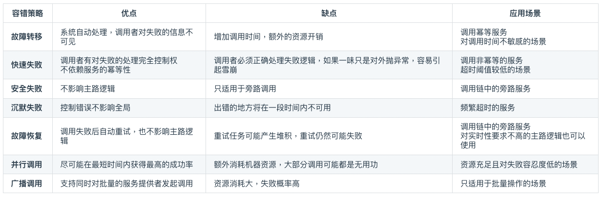
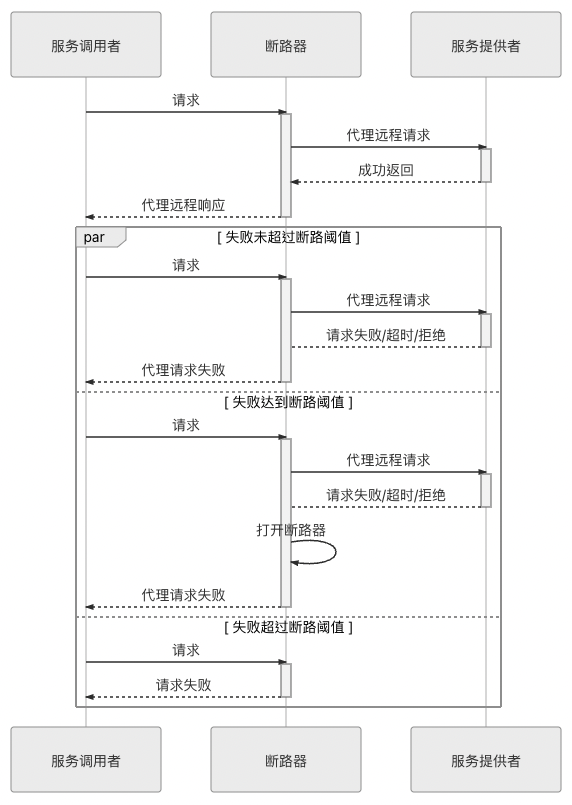
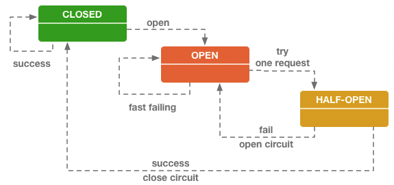
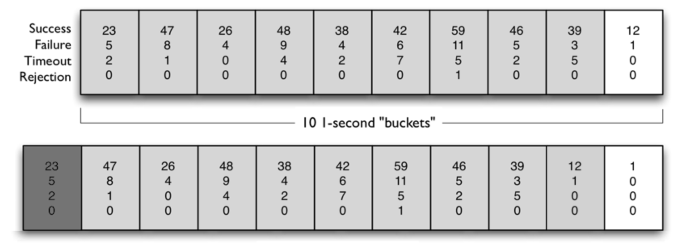
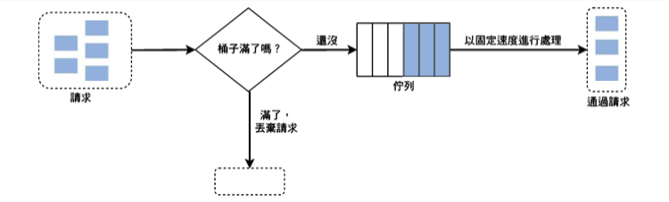
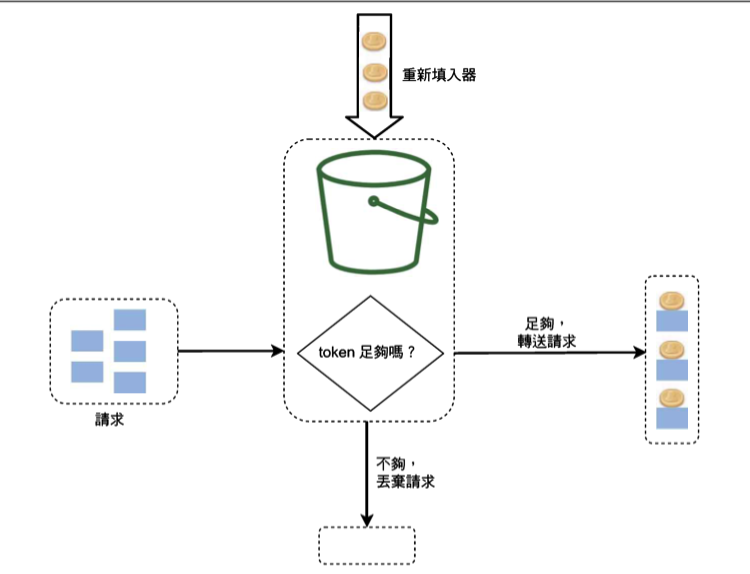

## 容錯性的設計應該被視為微服務架構設計預期就需要注意到的點
應該把 process crash, 網路中斷, 當機這些狀況視為意料中。
原系統重構或使用分散式架構就是期望提高可用性，最低限度也應該保證分散式後最地限度的可用性不能下降，否則何必重做？

#### 雪崩效應：錯誤從一個點開始層層影響相關的微服務。
> 如何防止雪崩效應就是容錯性設計原則的具體實踐，否則服務化越高系統越不穩定
>
> 防止雪崩效應 = 實踐容錯性設計，否則微服務架構 = 搬石頭砸自己的腳

#### 堵塞/未預期流量：服務能力有限，面臨超出預期的突發請求時需要很長的時間才恢復。

對以上的問題：服務容錯，流量控制解決。但這些方法的實踐需要與前面 registry, gateway, load balancer 配合。
所以本章說明他們的關聯＆工作原理。

:::info 微服務 9 特徵
1. 圍繞事務建立
2. 分散治理
3. 自治的組件
4. 產品思維
5. DB 去中心化
6. 強終端，弱管道
7. 容錯能力
8. 可演進性
9.  Infra 自動化
:::

## 服務容錯
### 容錯策略
* **容錯策略：面對故障要怎麼處裡**
* 設計模式：如何實現容錯策略

#### 故障轉移 Failover
* 對於重要的服務（經常被其他服所依赖）部署有多个副本，如果實際運行中原服務出現故障，系統自動切換到副本維持服務品質，而不會向 caller return 失敗
* 可能部署在不同 node, region
* 轉移需要有限制 ex.轉移次數 以防造成更多成本的消耗 or 轉移過程早已違反原 caller 的限制，即時回傳也是無效

> 

#### 快速失敗 Failfast
:::info idempotence 冪等性
數學：f(x) = f(f(x)) or f(n) = 1^n

軟體：對一同一個 api 發出多次同樣的請求，能保證實際只操作一次
:::
* Failover 可以用於冪等的服務，但如果服務非冪等，遇到問題時就應儘速讓 caller 知道。“堅決避免重試，盡快拋出異常”

#### 安全失敗 Failsafe
* 完整的服務流程通常包含主線任務和支線任務，有些支線任務沒打也可以去打王，所以對支線任務可以採用 failsafe 策略，即使支線任務失敗了也可暫時忽略
* 支線任務特性：沒有回傳值或回傳值不影響後續處理的結果
* 如果需要回傳值的話也可以還傳一個符合spec的空物件

#### 沈默失敗 Failsilent
* 如果大量請求都需要等到超時後才失敗，很容易因為這些請求佔據大量的資源，進而影響整個系統的問定性。
* 當出現第一個失敗的請求的時候就當這個服務一段時間都不能用了，改調用其他服務，不再對他分配流量。
* 熔斷思路(?)

#### 故障恢復 Failback
* 與 failfast 一起看
* 當服務出錯後將這次 request 失敗的資料塞進 queue 由系統再次消化，盡量讓失敗的 request 可以被正常執行。
* 冪等性，不需要即時響應的，用於對時效沒有嚴格限制的主線任務 or 不需 return 的支線任務
* 同 Failover 重試需要有限制

#### Forking
* 在錯誤發生前就考量怎麼做才有最大的成功可能性
* 一開始就呼叫多服務副本，只要一個成功就代表這個呼叫行為成功
* 以高成本換去成功的策略

#### Broadcast
* 同 Forking，但要每個都回傳成功才算是成功
* Broadcast 通常用於 refresh distributed cache(?)

### 容錯設計模式
* 容錯策略：面對故障要怎麼處裡
* **設計模式：如何實現容錯策略**

#### 斷路器
* Failfast
* 通過代理（斷路器對象）來一對一地(一個服務對應一個斷路器對象)接管服務 caller 的 request
* 斷路器會持續監控並統計服務返回的各種結果，當出現故障（失敗、超時、拒絕）的次數達到斷路器的閾值時，它狀態就自動變為“OPEN”，後續此斷路器代理的 request 都將直接返回調用失敗，而不會發出真正的 request。

* 斷路器就是一種有限狀態機，根據自身狀態變化自動調整代理請求策略。一般有三種狀態：
    * CLOSED：表示斷路器關閉，此時 request 會真正發送給服務。
    * OPEN：表示斷路器開啟，此時不會進行真正 request，直接給服務 caller 返回調用失敗的信息。
    * HALF OPEN：這是一種中間狀態。當進入 OPEN 狀態一段時間以後，會放行一次遠程調用，然後根據這次調用的結果成功與否，轉換為 CLOSED 或者 OPEN 狀態，以實現斷路器的彈性恢復。

* 閾值定義：在以下兩個條件**同時**滿足時，斷路器狀態轉變為 OPEN：
    * 一段時間（譬如 10 秒以內）內請求數量達到一定閾值（譬如 20 個請求）。這個條件的意思是如果請求本身就很少，那就用不著斷路器介入。
    * 一段時間（譬如 10 秒以內）內請求的故障率（發生失敗、超時、拒絕的統計比例）到達一定閾值（譬如 50%）。這個條件的意思是如果請求本身都能正確返回，也用不著斷路器介入。
    > 括號中舉例的數值是 Netflix Hystrix 的默認值，其他服務治理的工具，譬如 Resilience4j、Envoy 等也同樣會包含有類似的設置。

Ｑ：兩個 client 的角色呼叫一個 server 的角色，斷路器會有幾個？

:::info 熔斷 V.S 降級
A -> B

B熔斷後A可能需要降級

下游服務回復了故障訊息给上游服務後，上游服務必須主動***處理***呼叫失敗的後果，而不能讓故障擴散。

**處理**就是服務降級的演算法，他不只包含使用者介面的通知，還需要盡力的去透過其他路徑解決問題，ex.重試就是最低限度的降級邏輯

服務降級不一定要在錯誤發生後被動執行，他可能是主動執行的 ex.定期停機 or 可預期的流量高峰，這就屬於下面的流量控制
:::

#### 艙壁隔離
* Failsilent
* 不讓某一個服務的局部失敗演變成全局性的影響，就必須設置某種止損方案，這便是服務隔離的意義。
    * 雞蛋不要放在同一個籃子
    * 目前主流的 network access 是以 Thread per Request 來實現，只要請求一直不結束，就要一直佔用著某個 thread 不能釋放，而 thread is global resource
* 為每個服務單獨設立 thread pool，這些 thread pool 只用來控制單個服務的最大連接數，也就是當這個服務因超時故障時就只會最多阻塞 thread pool 內的連線，而不至於影響全局的連線數
* 使用局部的 thread pool 來控制服務的最大連接數有許多好處，當服務出問題時能夠隔離影響，當服務恢復後，還可以通過清理掉局部 thread pool，瞬間恢復該服務的功能
* 但是局部 thread pool 增加了 CPU 的開銷，每個獨立的 thread pool 都要進行排隊、調度和下文切換工作
* Semaphore 是一種可以用來控制服務最大連接數的辦法，並不需要建立局部 thread pool 只需要 counter，性能損耗可以忽略不計
* 在更宏觀的場景中，不是按調用 thread，可能是按功能、按子系統、按用戶類型等條件來隔離資源
* 一般來說，將服務層面的隔離實現在服務調用端或者 side car 代理上，將系統層面的隔離實現在 DNS 或者 gateway。

#### 重試
* 實踐 Failover or Failback
* 解決系統中的瞬時故障
    * 有可能自己恢復（Resilient）的臨時性失靈
    * 網絡抖動、服務的臨時過載（HTTP 503 Bad Gateway）
* 重试模式面临的风险反而大多来源于太过简单而导致的滥用。
* 使用時機為下列條件**同時**滿足
    * 在主線任務的關鍵服務做**同步**的重試
    * 只對於瞬時故障的失敗重試，至少不會是 HTTP 401 時重試
        * 功能完善的工具可以設定重試的演算法 ex.Retry Policy in Envoy 可以根據各種具體條件來設定不同的重試参數，其中就包含了 HTTP response status code
    *  只對冪等性的服務 or api 重試，ex. RESTful api POST、PUT、DELETE 通常是非幂等的，而 GET、HEAD、OPTIONS、TRACE 應該被設計成幂等的
    * 有明確的終止條件
        * 最久時間：同 Failover 的例子
        * 最大次數：通常最多 2 ~ 5，注意 response header 是否有帶 Retry-After
* 重試可能對系統帶來很大的負擔，因為重試可以在整個服務網路的多個環節去重試，ex.start from user client、gateway、load balancer，另外現在的微服務框架都很方便
> Netflix OSS 如果同時在 Zuul、Feign 和 Ribbon 上都打开了重試功能，且不考虑重試被超時终止的话，那總重試次數就是每個部分次數的乘機。假設他們都重試 4 次，且 Ribbon 可以轉移 4 个服務副本，理論上就會執行 4×4×4×4=256 次。

以上的設計模式都仰賴開發人員對服務邏輯的了解 & 運維人員的經驗去靜態調整配置參數和閾值，但不足以應付 Auto Scale 的大型分佈式系統。
需要系統不僅可以自動依據負載來調整數量規模，還要有能力**根據服務被使用的統計結果，或者啟發式搜索的結果來自動變更容錯策略和參數**，但這方面研究還處於摸索的階段，是服務治理的發展方向之一。

以上策略與設計目的是**避免雪崩效應**，但只讓故障不擴散不夠。我們要讓系統或至少核心功能能主動掌握流量決定服務量。

:::info 啟發式搜索
在解決問題的過程中，藉由啟發函數來量化目前解法與預期解決的目標的距離，進而增加解決方法的效率。
:::

:::info 短板效應
又稱木桶效應，影響一個團隊的關鍵因子，不在於團隊裡最強的人，而是程度最落後的那一位。
一套服務群裡面會影響到整個服務可用性的是效能最低的那個。
:::

## 流量控制
當系統資源不足以支撐外部超過預期的突發流量時，建立自我保護的機制：限流。
* 依據什麼限流：是否要控制，控制哪些流量，控制力度多大。通常需要一段時間營運來動態決定
* 如何限流
* 超額的流量如何處理：429 (否決式限流) or 讓請求排隊 (阻塞式限流)

### 流量統計指標
#### Transactions per Second(TPS)
* Transactions 具備原子性的操作邏輯

#### Hits per Second(HPS)：
* hit = request
* 如果一個 request 就可以完成所有操作邏輯，TPS = HPS

#### Queries per Second(QPS)
* 一台 server 可以響應的查詢次數
* 如果整個系統只有一台 server，HPS = QPS
* 在分散式系統裡，一個業務邏輯操作你會向多個 server 發出 request，也就有多個 query

TPS 是我們最直覺實際衡量流量的指標。因為我們不會要使用者來去理解他買本書打了多少個 api 用了幾個 server。

但實際上不同功能操作對於系統的壓力不同，無法類比，生活應用也不是壓力測試不會有固定腳本自動化執行，還要配合著神奇的 UX。

所以主流還是用 HPS 作為指標，因為他相對容易觀察，並可以反應系統當下與接下來一段時間的壓力走向。

不過限流指標沒有標準，實際可以根據系通需求定義。ex.同時在線人數 or 單位時間上下檔案大小

### 限流設計模式
#### Counter
* 設置一個計算器，根據當下的計數是否超過閾值來決定是否限流
* 它並不嚴謹，它只是針對時間點進行離散的統計
    * 每一秒計數器都沒有超過閾值，也不代表系統沒有遇到過大於閾值的壓力
    * 即使連續若干秒都超過了閾值，也不能代表流量壓力就一定超過了系統的承受能力

#### Sliding Window
* 以 Sliding Window 統計服務請求的數量，控制 request 不會超過限流的閾值
* 演算法：
    * 定義 Window 總大小(時間長度) & 統計週期(時間長度) & 閾值(X時間長度的Ｙ項指標)
    * 定期在每個統計週期執行以下動作
        1. 將最後一位的數組丟掉，元素都往後移一位，然後在開頭插入一個新的空元素 => slide window
        2. 將計數器中所有統計的數字寫入到開頭的空元素中
        3. 對數組中所有元素進行統計，並 reset 計數器數據供下一個統計週期使用
    * 
* 只適用於否決式限流，超過閾值的流量就必須強制失敗或降級，很難在細粒度上對流量曲線進行整形，無法削峰填谷

#### Leaky Bucket
* Traffic Shaping：限製網路設備的流量突變，使得 context 以比較均勻的速度向外發送，通常都需要用到緩衝區來實現
* Leaky Bucket Algorithm & Token Bucket Algorithm 為了達成 Traffic Shaping
* 演算法：
    * 請求 = 水
    * 緩衝區 = 池子
    * 處理 = 水流出
    * 水都先放進池子裡再慢慢流出，不過請求總是有時限的，所以緩衝區大小也必須是有限度
    * 池子滿了 = 有部分請求會遭遇失敗和降級。流量整形的角度來說是部分數據包被丟棄
    * 
* 通常以 FIFO Queue 作為緩衝區，控制池子大小與消化速度，消化速度通常是固定的，池大 = 還是可能遇到流量太大問題，池小 = 誤殺掉一部分正常的請求

#### Token Bucket
* Leaky Bucket 以流出水來代表處理需求，而流出水的速度是固定的。Token Bucket 以放入多少 token 來代表可以處理多少需求
* 演算法：
    1. 系統決定限流閥值後定期向 bucket 放入 token。 ex. 100 request/second => 每個 token 放入 bucket 的間隔為 1/100=10 毫秒
    2. bucket 可放的 token 有最大數量上限，多的會丟掉。最大數量上限由時限和服務處理能力共同決定的
    3. 當有請求進來時，首先要從 bucket 中取得一個准入的 token，然後才能進入系統處理，當需求發現 bucket 沒有 token 的時候就代表他遭遇失敗和降級
* 
* 在 token 中增加一個 timestamp，每次獲取 token 前，比較一下 timestamp 與當前時間，就可以計算出這段時間需要放多少 token 進去

### 分散式限流
* 微服務架構下，前面的限流設計模式就最多只能應用於集群最入口處的 gateway 上，對整個服務集群進行流量控制，而無法細粒度地管理流量在內部微服務節點中的流轉情況
* 能夠精細控制分散式集群中每個服務消耗量的限流算法才是分散式限流，需要讓各個服務節點的協同限流
* 只要可以共享統計數據，原本用於單機的限流模式理論上也是可以應用於分佈式環境中
    * 將所有服務的流量統計指標結果都存入集中式 cache 中
    * 並通過分佈式鎖、信號量等機制，解決這些數據的讀寫訪問時並發控制的問題
    * 代價是每次服務調用都必須要額外增加一次網絡開銷，所以流量壓力大時，限流本身反倒會顯著降低系統的處理能力
* 修改 Token Bucket
    * 當 request 進入 cluster 前在 gateway 取得一定數額的 token 作為“貨幣”
    * 不同等級 client 可能有不同初始額度
    * 每個服務時都要求消耗一定量的“貨幣”額度
    * 剩餘額度小於等於 0 時，就不再允許訪問其他服務了
    * 此時必須先發生一次網絡請求，重新向 Token Bucket 申請一次額度，成功後才能繼續訪問，不成功則進入降級邏輯
    > 
    >
    > A 的額度 QuanityA
    >
    > 服務 X 要消耗的額度 CostX
    >
    > A 訪問了 N 個服務以後，他剩餘的額度 LimitN
    * 剩餘額度 LimitN 就可以作為內部限流的指標
    * 可能存在業務操作已經執行到一半，卻無法從 Token Bucket 中再獲取到新額度而失敗，這種失敗的代價是比較高昂的，它浪費了部分已經完成了的服務資源，但 Z > B

* 分散式系統容錯是必須要有的，但分散式限流從不追求“越徹底越好”，往往需要權衡方案的代價與收益