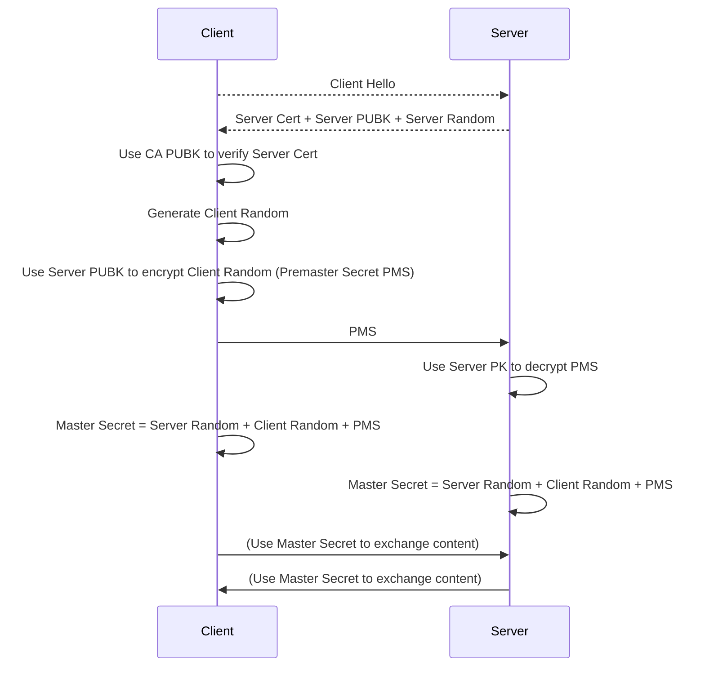
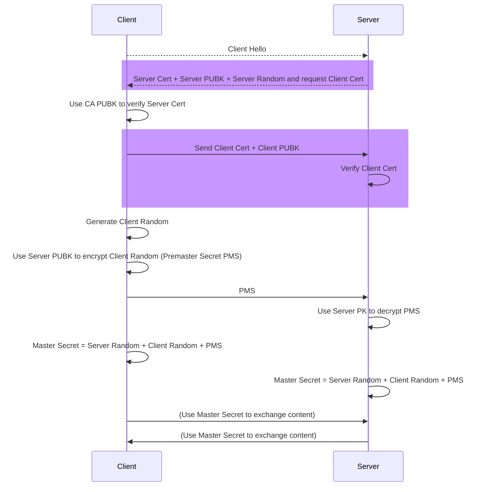
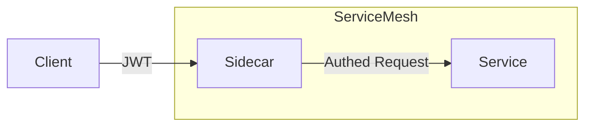

import Tabs from '@theme/Tabs';
import TabItem from '@theme/TabItem';

## 零信任網路

:::tip 木桶效應
又稱 短板理論 / Cannikin Law / Buckets Effect

決定木桶承水量的關鍵因素，是構成木桶的最短的木板高度
系統整體安全的強度，取決於最薄弱的那一個點
:::

### 邊界安全模型 (Perimeter-Based Security Model)

* 傳統做法，安全措施集中在各個區域的邊界上
* VPN, DMZ, Firewall, Intranet/Extranet
* 只要一個點被攻破，攻擊者就能侵入內網的其他系統

### 零信任安全模型 (Zero-Trust Security Model)

* [BeyondProd: How Google moved from perimeter-based to cloud-native security](https://cloud.google.com/blog/products/identity-security/beyondprod-whitepaper-discusses-cloud-native-security-at-google) - 2019 [(中譯版)](http://arthurchiao.art/blog/google-beyondprod-zh/)
* 「不應以某個固有的特徵來自動信任任何流量，除非明確得到能帶表請求來源的身份憑證」
* 基於PKI實現 (Public Key Infra)
* 較適合微服務，雲原生時代的安全模型

### 安全模型的比較

|                    | Perimeter Based                          | Zero Trust                                             |
| ------------------ | ---------------------------------------- | ------------------------------------------------------ |
| 精神               | 基於防火牆等設施，認為邊界內可信(可裸奔) | 服務與服務溝通需要憑證，內部服務彼此間需要機制建立信任 |
| 資源重用性         | 使用特定的IP Address或硬體               | 資源利用率更高，重用，共享效果更好，可重複利用IP或硬體 |
| 硬體的耦合         | 高，服務運作在已知的，可預期的機器上     | 硬體被抽象化，私有/公有雲混合部署                      |
| AuthN (身份驗證)   | 基於IP的身份驗證 (WL/BL)                 | 基於服務的身份                                         |
| AuthZ (授權)       | 安全相關需求由應用層分別實現             | 由基礎設施來實現，基礎設施及成了共享的安全需求         |
| 安全相關的開發約束 | 較弱，各自實現                           | 較高，應用要遵守基礎建設提供的安全實現                 |
| 安全觀測性         | 較弱                                     | 較高，有辦法做安全策略的全局視圖                       |
| 發布頻率           | 較低，或者說不容易提高                   | 標準化的構建與發布流程                                 |

### Zero Trust的五項假定

> Ref: [Zero Trust Networks](https://www.amazon.com/Zero-Trust-Networks-Building-Untrusted/dp/1491962194/) Ch1

1. 網路始終受到對手覬覦
2. 網路總是存在外部與內部威脅
3. 上網位置並不能作為信任度的依據
4. 對所有設備、使用者和網路流量都需要透過身份驗證(AuthN)，並取得存取授權(AuthZ)
5. 安全政策必須可以動態調整，並盡可能以各種資料來做為評估依據

### Zero Trust的特徵

#### 1. 零信任網路架構，不代表放棄在邊界上的安全保護

* 防火牆等邊界安全設施不是Zero Trust的架構核心，但仍是一種提升安全性有效且必要的手段

#### 2. 身份驗證只源自於服務

* Trust Chain (信任鏈)，你可以用一個cert去保護另一個cert，一個secret去保護另一個secret，what去保護what。但最終，你真正信任的根源一定是**Who**
* 例如：開發程式的開發者；負責部署的CICD Runner；你外包Infra的某間公司；你跟上游廠商簽訂的合約...etc.

#### 3. 服務之間沒有固有的信任關係

* 明確授權的調用者才能訪問資源。如果某個服務節點被入侵，可以防止受損範圍擴大

#### 4. 集中、且共享的安全策略實施點

* 與微服務強調的「分散治理」相反。安全相關的需求應該要集中實現

#### 5. 授信任的機器運作來源已知的代碼

* 限制Server只能使用認證過的code跟config
* 也只能運作在通過PKI認證的環境中
* 對CICD流程造成較大的改變，對於Software Supply Chain的所有階段都加入控制策略

:::tip 軟體供應鏈

Software Supply Chain; SSC

以下節錄自[Wikipedia](https://zh.wikipedia.org/zh-tw/%E8%BB%9F%E9%AB%94%E4%BE%9B%E6%87%89%E9%8F%88) 「軟體供應鏈」

將製造業的供應鏈概念用在軟體開發上，是指在軟體製品（software artifact）開發過程中，所需要的元件（component）、函式庫、工具和流程

軟體供應商在開發軟體時，會整合開源軟體及商業軟體的元件。軟體材料表（software bill of material，SBOM）[2]中列出軟體工件開發時需要的元件[3]。軟體材料表類似食品中的成份標籤，成份標籤說明食品的成份，因此在選擇食品時，可以避開過敏物質。在選擇軟體時可以利用軟體材料表，避開會造成損害的軟體。
:::

#### 6. 自動化、標準化的變更管理

* Infra as Code (IaC) / Config Management
* 要先標準化，才有辦法自動化

:::note
要先標準化，才有辦法自動化

經驗上，很多CICD Pipeline重用性很低以及開發困難的主因就是因為沒有先進行標準化
:::

#### 7. 強隔離的工作負載

* 工作負載(Workload)需要被隔離，對於安全的實現才有依據
* 容器化，容器調度(Borg/K8S)技術對於負載隔離相對不利
* 需要專門關注容器隔離的工具實現


### 探索Google的Zero Trust實現

#### 對安全的願景

> 其實很難達成

|      | 對程式來說 | 對人類來說 |
| ---- | ---------- | ---------- |
| 日常 | 安全       | 袖手旁觀   |
| 例外 | 風險發生   | 主動干預   |

#### Google的實現

1. 在邊界上保護內部服務免受DDoS的攻擊

   在邊界實現了Google Front End的proxy，負責保證此後的流量都在TLS上傳輸，並自動將流量路由到合適的區域中

2. 身份驗證只來自於服務

   設計了Application Layer Transport Security的驗證機制，是一種用於雙向驗證和傳輸加密的系統，做自動的service to service的PKI綁定

3. 確保沒有「固定」的信任關係

   設計Service Access Policy來管理一個服務向另一個服務發起請求時所需提供的cert，permission以及audit策略。
   支援全局的視角的集中訪問控制、分析

4. 確保機器只執行來源已知的代碼

   設計了Binary Authorization的deploy檢查機制，確保在整個SSC裡，都符合內部安全的檢查策略

5. 確保Workload的強隔離

   設計了gVisor的輕量級虛擬化方案，是一種彌補容器技術隔離不足問題的技術。為每個容器提供一個獨立的虛擬kernel (在gVisor稱為Sentry)

   本書筆者認為，這些技術看起來像容器技術，但其實是輕量化的虛擬機器技術

:::caution Question
你看過系統做到Zero Trust這些事嗎？

這會典範轉移嗎？為什麼？
:::

## 服務安全

* TLS (Transport Layer Security)
   * mTLS (Mutual TLS)
* PKI (Public Key Infrastructure)
   * CA (Certificate Authority)
* OAuth
* RBAC
* JWT

### 建立信任

#### 單向TLS



#### 雙向TLS (mTLS)




:::caution Question
mTLS好棒為什麼不在Internet上的網站都導入使用？
:::

### 認證 (Authentication; AuthN)

#### 服務認證 (Peer AuthN)

* 微服務組件之間的流量加密與驗證
* 以Istio的[PeerAuthentication](https://istio.io/latest/docs/reference/config/security/peer_authentication/)為例：
   ```yaml
   apiVersion: security.istio.io/v1beta1
   kind: PeerAuthentication
   metadata:
   name: authentication-mtls
   namespace: bookstore-servicemesh
   spec:
   mtls:
      mode: PERMISSIVE
   ```

   * 對bookestore-servicemesh這個namespace下的資源套用mTLS加密
   * PERMISSIVE表示使用寬容模式，如果有個Pod還沒有注入Sidecar，可以對其使用明文傳輸

* 若沒有基礎設施的支援 (e.g. 你有Istio幫忙)，認證工作就得在應用層實現，自己寫code完成。

   ```java
   private static final List<Client> clients = Arrays.asList(
      // Role: Frontend, Scope.BROWSER
      new Client("bookstore_frontend", "bookstore_secret", new String[]{GrantType.PASSWORD, GrantType.REFRESH_TOKEN}, new String[]{Scope.BROWSER}),

      // Role: Internale microservice, Scope.SERVICE
      new Client("account", "account_secret", new String[]{GrantType.CLIENT_CREDENTIALS}, new String[]{Scope.SERVICE}),
      new Client("warehouse", "warehouse_secret", new String[]{GrantType.CLIENT_CREDENTIALS}, new String[]{Scope.SERVICE}),
      new Client("payment", "payment_secret", new String[]{GrantType.CLIENT_CREDENTIALS}, new String[]{Scope.SERVICE}),
      new Client("security", "security_secret", new String[]{GrantType.CLIENT_CREDENTIALS}, new String[]{Scope.SERVICE})
   );
   ```
   * 要能夠呼叫受保護的服務，需要先提供能證明呼叫者身份的JWT Token

* 有基礎設施的支援，例如PKI、Istio這類Service Mesh支援的狀況下，微服務組件之間的溝通可以在應用程式不知道的狀況下完成

   

   Image From [Istio Blog](https://tetratelabs.io/blog/istio-security/)

#### 請求認證 (Request AuthN)

書中例子中，請求認證是透過client打上來的JWT Token，在進入Service Mesh後透過JWKS驗證合法性



書中例子中，請求認證是在Istio做AuthorizationPolicy

```yaml
apiVersion: security.istio.io/v1beta1
kind: RequestAuthentication
metadata:
  name: authentication-jwt-token
  namespace: bookstore-servicemesh
spec:
  jwtRules:
    - issuer: "icyfenix@gmail.com"
      # Envoy默认只认“Bearer”作为JWT前缀，之前其他地方用的都是小写，这里专门兼容一下
      fromHeaders:
        - name: Authorization
          prefix: "bearer "
      # 在rsa-key目录下放了用来生成这个JWKS的证书，最初是用java keytool生成的jks格式，一般转jwks都是用pkcs12或者pem格式，为方便使用也一起附带了
      jwks: |
        {
            "keys": [
                {
                    "e": "AQAB",
                    "kid": "bookstore-jwt-kid",
                    "kty": "RSA",
                    "n": "i-htQPOTvNMccJjOkCAzd3YlqBElURzkaeRLDoJYskyU59JdGO-p_q4JEH0DZOM2BbonGI4lIHFkiZLO4IBBZ5j2P7U6QYURt6-AyjS6RGw9v_wFdIRlyBI9D3EO7u8rCA4RktBLPavfEc5BwYX2Vb9wX6N63tV48cP1CoGU0GtIq9HTqbEQs5KVmme5n4XOuzxQ6B2AGaPBJgdq_K0ZWDkXiqPz6921X3oiNYPCQ22bvFxb4yFX8ZfbxeYc-1rN7PaUsK009qOx-qRenHpWgPVfagMbNYkm0TOHNOWXqukxE-soCDI_Nc--1khWCmQ9E2B82ap7IXsVBAnBIaV9WQ"
                }
            ]
        }
      forwardOriginalToken: true
```

<Tabs>
  <TabItem value="JWT" label="JWT" default>

   ```
   eyJhbGciOiJIUzI1NiIsInR5cCI6IkpXVCJ9
   .eyJzdWIiOiIxMjM0NTY3ODkwIiwibmFtZSI6IkpvaG4gRG9lIiwiaWF0IjoxNTE2MjM5MDIyfQ
   .SflKxwRJSMeKKF2QT4fwpMeJf36POk6yJV_adQssw5c
   ```

  </TabItem>
  <TabItem value="JWK" label="JWK">

   JSON Web Key 一種存放private key的格式
   ```json
   {
      "kid": "1234example=",
      "alg": "RS256",
      "kty": "RSA",
      "e": "AQAB",
      "n": "1234567890",
      "use": "sig"
   }
   ```
  </TabItem>
  <TabItem value="JWKS" label="JWKS">

   JWKS (JSON Web Key Set): 一堆JWK的集合

   ```json
   [
      {
         "kid": "1234example=",
         "alg": "RS256",
         "kty": "RSA",
         "e": "AQAB",
         "n": "1234567890",
         "use": "sig"
      }, {
         "kid": "5678example=",
         "alg": "RS256",
         "kty": "RSA",
         "e": "AQAB",
         "n": "987654321",
         "use": "sig"
      }
   ]
   ```
  </TabItem>
</Tabs>


Reference [AWS Cognito Dev Guide](https://docs.aws.amazon.com/cognito/latest/developerguide/amazon-cognito-user-pools-using-tokens-verifying-a-jwt.html)

### 授權 (Authorization; AuthZ)

* 已經是合法的使用者的情形下，檢查是否有權限做某件事

#### 服務授權

* 透過Istio的AuthorizationPoilcy實作
* 只有accounts、products、pay、settlements四個進入點的GET/POST/PUT/PATCH允許內部流量訪問


<Tabs>
   <TabItem value="AllowPolicy" label="Allow Policy" default>

```yaml
apiVersion: security.istio.io/v1beta1
kind: AuthorizationPolicy
metadata:
   name: authorization-peer
   namespace: bookstore-servicemesh
spec:
   action: ALLOW
   rules:
      - from:
         - source:
               namespaces: ["bookstore-servicemesh"]
        to:
         - operation:
               paths:
               - /restful/accounts/*
               - /restful/products*
               - /restful/pay/*
               - /restful/settlements*
               methods: ["GET","POST","PUT","PATCH"]
      - from:
         - source:
               namespaces: ["istio-system"]
```
   </TabItem>
   <TabItem value="DenyPolicy" label="Deny Policy" default>

```yaml
apiVersion: security.istio.io/v1beta1
kind: AuthorizationPolicy
metadata:
   name: authorization-request
   namespace: bookstore-servicemesh
spec:
   action: DENY
   rules:
      - from:
         - source:
            notRequestPrincipals: ["*"]
            notNamespaces: ["bookstore-servicemesh"]
        to:
         - operation:
            paths:
               - /restful/accounts/*
               - /restful/pay/*
               - /restful/settlements*
```
   </TabItem>
</Tabs>


#### 請求授權

* 在應用層實現
* 請求授權有時候是商業邏輯的一部份，不一定容易使用基礎建設幫忙

```java
http.authorizeRequests()
	.antMatchers("/restful/accounts/**").hasScope(Scope.BROWSER)
	.antMatchers("/restful/pay/**").hasScope(Scope.SERVICE)

/**
 * 根据用户名称获取用户详情
 */
@GET
@Path("/{username}")
@Cacheable(key = "#username")
@PreAuthorize("#oauth2.hasAnyScope('SERVICE','BROWSER')")
public Account getUser(@PathParam("username") String username) {
	return service.findAccountByUsername(username);
}

/**
 * 创建新的用户
 */
@POST
@CacheEvict(key = "#user.username")
@PreAuthorize("#oauth2.hasAnyScope('BROWSER')")
public Response createUser(@Valid @UniqueAccount Account user) {
	return CommonResponse.op(() -> service.createAccount(user));
}
```