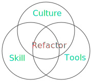

import Tabs from '@theme/Tabs';
import TabItem from '@theme/TabItem';


## 1.1 什麼是重構

* 重構的定義: 「改變程式碼而不改變其功能」
    * 重構不應該改變本來程式碼的功能
    * 本書會將重點放在「好閱讀」「易於維護」上
    * 即，經由重構產生出更好的程式碼「品質」
        * 通用性高，可重複使用
        * 寫的更少，檔案更小
        * 執行的更快
        * 容易閱讀、維護

* 重構的要件：文化 + 技能 + 工具

    

    * 文化Clucture：鼓勵重構的文化跟工作流程
    * 技能Skill：能判斷出哪些程式碼是不好的
    * 工具Tools：需要工具來確保重構是安全的

:::info Discussion
下面的例子，Refactor改善了程式碼品質的什麼？
:::

<Tabs>
<TabItem value="Before Refactor" default>

```typescript
return pow(base, exp/2) * pow(base, exp/2)
```
</TabItem>
<TabItem value="After Refactor">

```typescript
const result = pow(base, exp/2)
return result * result;
```
</TabItem>
</Tabs>


## 1.1.1 為什麼要重構

* Why to refactor
* 三個主要原因
    1. 讓程式碼市更容易閱讀，程式設計師的時間很寶貴，節省時間
    2. 讓程式碼易於維護
    3. 讓程式碼更有趣、讓人更愉悅(??!!)

## 1.2 要重構什麼？

* What to refactor
* 是一個要學習的技能：能知道哪些程式是不好的而且需要重構
* 看到程式碼的「壞味道」時，就該進行重構
    * 什麼是壞味道？抽象、且難以入門
    * 需要很多時間累積，才能對「異味」有所感覺
    * 本書會提出判斷「異味」的規則
        * 規則不是完美的，遵循規則仍可能將程式碼寫爛

### 「壞味道」的範例

* 異味的判斷範例：一個function只應該做一件事
* 但是很難釐清「一件事」代表的是什麼

:::info Discussion
下面的程式做了幾件事？
:::

```typescript
function calc(base, exp) {
    const result = pow(base, exp/2)
    return result * result;
}
```

* SOLID的SRP：
    * 一個組件只應對單一的對象負責
    * 一個組件被修改的原因只能有一個

### 「重構規則」的範例

* 規則：一個function永遠不該超過五行程式碼
    * 一眼就能看出function是否符合規則，違背了就是有怪味道
    * 本書的書名

:::caution
提醒：符合規則，不代表得到的程式碼一定比較好。規則只是一個重構的著手依據
:::

## 1.3 什麼時候要重構？ 

> 「重構就像洗澡」- Kent Beck

* When to refactor
* 「定期」或是「納入日常工作中」
* 軟體開發的六個步驟
    ```mermaid
    stateDiagram
    Explore --> Specify: 收斂需求，撰寫測試
    Specify --> Implement: 實作程式碼
    Implement --> Test: 確認實作有符合需求
    Test --> Refactor: 確保程式碼能讓下一個人使用
    Refactor --> Deliver: 部署
    Deliver --> Explore: 探索需求
    ```
* 重構時，依照書中寫的規則檢查程式碼
    * 若違反規則，對其進行處理
    * 修正編譯錯誤、測試錯誤
* 面對遺留系統
    * 先讓程式碼易於理解和修改，將來的變動或功能新增都會變容易 - Kent Beck
    * 「小問題解決完就不會有大問題」

<details>
  <summary>
        <icon icon="fa fa-exclamation-circle" size="lg" /> Disucssion
        <br/>
        什麼時候不該重構？
  </summary>

* 只會執行一次就刪掉的code
* 準備退役的code
* 有嚴格執行效能要求的code (執行效能比可讀性重要的code)

</details>

## 1.4 安全地重構

* How to refactor
* 優先使用工具來確保重構是安全的
    * 各種Linter
    * 大型IDE，有協助重構的功能
    * 編譯器
* 其次才依賴自動化測試 - 這是另一本書才能討論的內容


## 1.6 用來重構的範例：2D的拼圖遊戲

1. 安裝NodeJS
    * MacOS: `brew install node`
    * Windows: `choco install nodejs.install`
2. Clone sample code: `git clone git@github.com:thedrlambda/five-lines.git`
3. `npm init`
4. `npm install typescript`
5. `tsc -w` 或 `./node_modules/.bin/tsc -w`
6. 用瀏覽器打開`index.html`

## 小結

<details>
<summary>
1. 重構需要結合哪三個要素來進行？
</summary>

* 「技能」What，要重構什麼
* 「文化」When，什麼時候要重構
* 「工具」How，怎麼重構

</details>

<details>
<summary>
2. 何謂程式碼的「壞味道」？
</summary>

用來判斷一段程式碼是否應被重構的依據，是一個比較模糊的觀念
</details>
