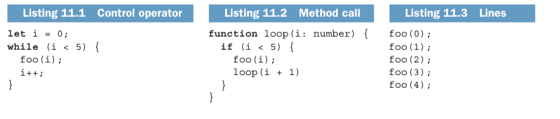
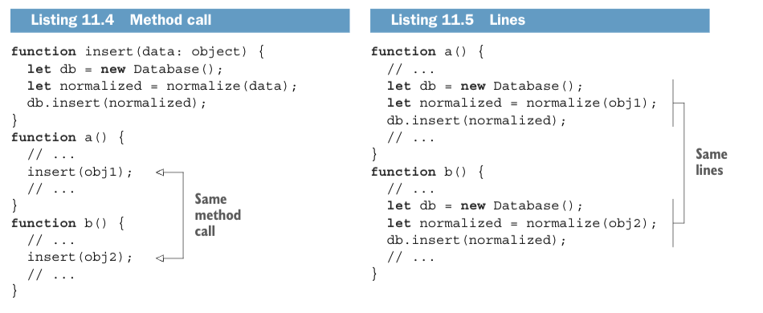
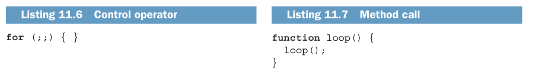
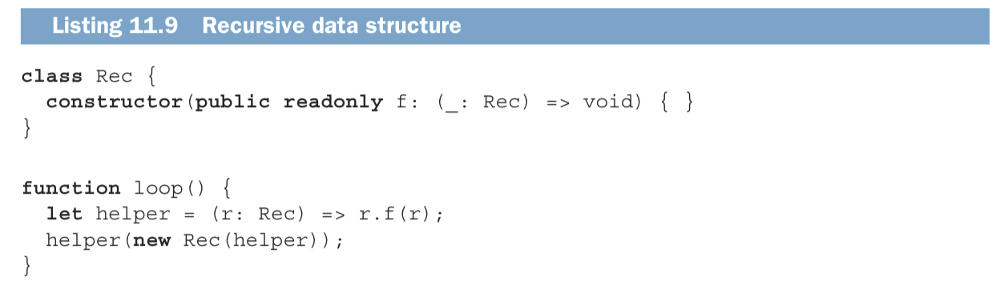
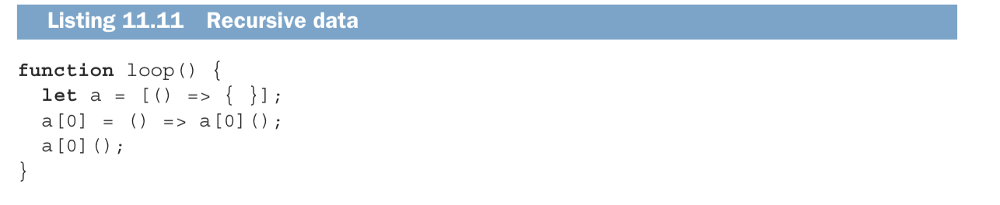

import Tabs from '@theme/Tabs';
import TabItem from '@theme/TabItem';

## 11.1 根據範圍 & 來源對結構做分類
|       |  Inter-team  | Intra-team    |
|-------|  -------  |-------  |
| In code | External API | Data and functions, most refactoring |
| In people | Organizational chart, processes | Behavior, domain experts  |

- **Macro-architecture：** 與「團隊之間」有關，定義軟體平台。
    - **組織流程和層級：** 團隊運作方式和溝通方式。
- **Micro-architecture：** 與「團隊內部」有關，重構模式屬於這類。
    - **領域專家：** 專家熟悉領域中的模式。
- **康威定律：** 組織結構往往限制了外部API的外觀
- **使用者行為：** 程式碼結構的更改有時需要改變使用者行為。

## 11.2 讓程式碼反應行為的方式
重構不會改變行為，把結構從一種方法轉移到另外一種方法。

- **控制流程：** 使用條件語句（if/else）、循環（for、while）等
- **資料結構：** 使用陣列、物件等資料結構
- **資料本身：** 使用特定的數值或格式來引導行為

### 控制流程
透過「控制運算子」、「方法呼叫」或簡單的「程式行」在程式碼中表達。

同一個迴圈使用三種最常見的控制流程


遇到重複的程式碼，「方法呼叫」或「程式行」表達


用「控制運算子」、「方法呼叫」做無窮迴圈


:::info fizzBuzz
選擇兩個數字，玩家輪流按順序說出數字。
如果序列中的下一個數字 可以被你的第一個數字整除，孩子會說「Fizz」；
如果它能被你的第二個數字整除，他們會說「Buzz」；
如果它能被你的兩個數字整除， 他們會說「FizzBu​​zz」。
遊戲一直持續到有人犯錯為止。
:::

使用控制流程來實作 fizzBuzz
```typescript
function fizzBuzz(n: number) {
    for (let i = 0; i < n; i++) {
        if (i % 3 === 0 && i % 5 === 0) {
            console.log("FizzBuzz");
        } else if (i % 5 === 0) {
            console.log("Buzz");
        } else if (i % 3 === 0) {
            console.log("Fizz");
        } else {
            console.log(i);
        }
    }
}
```

### 資料結構
在資料結構中表達行為。

遞迴資料結構


使用資料結構來實作 fizzBuzz
```typescript
// Encoding the Fizz behavior
interface FizzAction {
    num(n: number): void;
    buzz(): void;
}
class SayFizz implements FizzAction {
    num(n: number) { console.log("Fizz"); }
    buzz() { console.log("FizzBuzz");
        console.log("FizzBuzz");
    }
}
class FizzNumber implements FizzAction {
    num(n: number){ console.log(n); }
    buzz() { console.log("Buzz"); }
}

// Encoding the Buzz behavior
interface BuzzAction {
    num(n: number, act: FizzAction): void;
}
class SayBuzz implements BuzzAction {
    num(n: number, act: FizzAction) {
        act.buzz();
    }
}
class BuzzNumber implements BuzzAction {
    num(n: number, act: FizzAction) {
        act.num(n);
    }
}

// Encoding %3
interface FizzNum {
    next(): FizzNum;
    action(): FizzAction;
}
class FizzNum1 implements FizzNum {
    next() { return new FizzNum2(); }
    action() { return new FizzNumber(); }
}
class FizzNum2 implements FizzNum {
    next() { return new Fizz(); }
    action() { return new FizzNumber(); }
}
class Fizz implements FizzNum {
    next() { return new FizzNum1(); }
    action() { return new SayFizz(); }
}

// Encoding %5
interface BuzzNum {
    next(): BuzzNum;
    action(): BuzzAction;
}
class BuzzNum1 implements BuzzNum {
    next() { return new BuzzNum2(); }
    action() { return new BuzzNumber(); }
}
class BuzzNum2 implements BuzzNum {
    next() { return new BuzzNum3(); }
    action() { return new BuzzNumber(); }
}
class BuzzNum3 implements BuzzNum {
    next() { return new BuzzNum4(); }
    action() { return new BuzzNumber(); }
}
class BuzzNum4 implements BuzzNum {
    next() { return new Buzz(); }
    action() { return new BuzzNumber(); }
}
class Buzz implements BuzzNum {
    next() { return new BuzzNum1(); }
    action() { return new SayBuzz(); }
}

function fizzBuzz(n: number) {
    let f = new Fizz();
    let b = new Buzz();
    for (let i = 0; i < n; i++) {
        b.action().num(i, f.action());
        f = f.next();
        b = b.next();
    }
}
```

### 資料本身
資料中重複出現的結構。

遞迴資料。 將一個函數放入記憶體中，函數會尋找參照（reference）並呼叫它。


```typescript
interface FizzAction {
    num(n: number): void;
    buzz(): void;
}
class SayFizz implements FizzAction {
    num(n: number) { console.log("Fizz"); }
    buzz() { console.log("FizzBuzz"); }
}
class FizzNumber implements FizzAction {
    num(n: number) { console.log(n); }
    buzz() { console.log("Buzz"); }
}
interface BuzzAction {
    num(n: number, act: FizzAction): void;
}
class SayBuzz implements BuzzAction {
    num(n: number, act: FizzAction) {
        act.buzz();
    }
}
class BuzzNumber implements BuzzAction {
    num(n: number, act: FizzAction) {
        act.num(n);
    }
}

// Encoding %3
const FIZZ = [
    new SayFizz(),
    new FizzNumber(),
    new FizzNumber()
];

// Encoding %5
const BUZZ = [
    new SayBuzz(),
    new BuzzNumber(),
    new BuzzNumber(),
    new BuzzNumber(),
    new BuzzNumber(),
];

function fizzBuzz(n: number) {
    for (let i = 0; i < n; i++) {
        BUZZ[i % BUZZ.length].num(i, FIZZ[i % FIZZ.length]);
    }
}
```


## 11.3 新增程式碼來揭露結構
- 根據需要才進行重構
- 處理不確定性
    - 不熟悉底層結構時：先確保正確性。
- 避免增加脆弱性
    - 避免非局部的不變性
    - 如果推遲重構，應將未重構的程式碼進行封裝，以免影響其他部分
- 實現新功能時的考量
    - 使用 enums 和 loops 比 class 更合適

## 11.4 觀察而非預測，使用實證技術
- 不仰賴猜測(憑感覺？)來處理程式碼，透過實證的方式來處理。
- 多觀察程式碼的變化趨向，遠離自作聰明的陷阱e.g. 過度設計(Overengineering)

改進應該基於實際的需求和過去的變更經驗：
- 如果程式碼不需要改變，那就保持不動。
- 如果程式碼變動是不可預測，只有在必要時進行重構，以避免脆弱性。
- 如果程式碼的變化有一定的模式，則重構以適應這些已經發生的變化類型。

## 11.5 不須理解程式碼就能取得安全性
按照既存程式碼的結構，在不需完全理解細節的情形下做重構。

透過多樣的手段取得安全性，減少重構過程中可能引發的錯誤。
- 透過測試取得安全性
- 透過掌握取得安全性
- 透過工具輔助取得安全性
- 透過正式驗證取得安全性
- 透過容錯取得安全性

## 11.6 識別未使用的結構
在程式碼尋找可利用的結構位置，並使用他們來進行重構。

### 透過提取&封裝來運用留白
利用空白行來識別和實做提取方法([EXTRACT METHOD](https://noobtechnote.github.io/docs/sg/five-lines-of-code/ch3#321-refactoring-pattern-extract-method))
<Tabs>
<TabItem value="Before" default>

```typescript
function subMin(arr: number[]) {
    let min = Number.POSITIVE_INFINITY;
    for (let x = 0; x < arr.length; x++) {
        min = Math.min(min, arr[x]);
    }

    for (let x = 0; x < arr.length; x++) {
        arr[x] -= min;
    }
}
```
</TabItem>
<TabItem value="After">

```typescript
function subMin(arr: number[]) {
    let min = findMin(arr);
    subtractFromEach(min, arr);
}
function findMin(arr: number[]) {
    let min = Number.POSITIVE_INFINITY;
    for (let x = 0; x < arr.length; x++) {
        min = Math.min(min, arr[x]);
    }
    return min;
}
function subtractFromEach(min: number, arr: number[]){
    for (let x = 0; x < arr.length; x++) {
        arr[x] -= min;
    }
}
```
</TabItem>

</Tabs>

通過封裝資料（Encapsulate Data）的重構模式
<Tabs>
<TabItem value="Before" default>

```typescript
class Particle {
    private x: number;
    private y: number;

    private color: number;
    // ...
}
```
</TabItem>
<TabItem value="After">

```typescript
class Vector2D {
    private x: number;
    private y: number;
    // ...
}

class Particle {
    private position: Vector2D;
    private color: number;
    // ...
}
```
</TabItem>
</Tabs>


### 利用重複進行統一
遇到陳述句(statement)相同的情況。

先用提取方法(EXTRACT METHOD)進行重構

<Tabs>
<TabItem value="Before" default>

```typescript
class XMLFormatter {
    format(vals: string[]) {
        let result = "";
        for (let i = 0; i < vals.length; i++) {
            result += `<Value>${vals[i]}</Value>`; // duplicated statement
        }
        return result;
    }
}
class JSONFormatter {
    format(vals: string[]) {
        let result = "";
        for (let i = 0; i < vals.length; i++) {
            if (i > 0) result += ",";
            result += `{ value: "${vals[i]}" }`; // duplicated statement
        }
        return result;
    }
}
```
</TabItem>
<TabItem value="After">

```typescript
class XMLFormatter {
    format(vals: string[]) {
        let result = "";
        for (let i = 0; i < vals.length; i++) {
            result += this.formatSingle(vals[i]); // EXTRACT METHOD
        }
        return result;
    }
    formatSingle(val: string) {
        return `<Value>${val}</Value>`;
    }
}
class JSONFormatter {
    format(vals: string[]) {
        let result = "";
        for (let i = 0; i < vals.length; i++) {
            if (i > 0) result += ",";
            result += this.formatSingle(vals[i]); // EXTRACT METHOD
        }
        return result;
    }
    formatSingle(val: string) {
        return `{ value: "${val}" }`;
    }
}
```
</TabItem>
</Tabs>

提取方法分散在不同類別，透過封裝資料（Encapsulate Data）的重構模式將他們集中。

<Tabs>
<TabItem value="Before" default>

```typescript
class XMLFormatter {
    formatSingle(val: string) {
        return `<Value>${val}</Value>`;
    }
    // ...
}
class JSONFormatter {
    formatSingle(val: string) {
        return `{ value: "${val}" }`;
    }
    // ...
}
```
</TabItem>
<TabItem value="After">

```typescript
class XMLFormatter {
    formatSingle(val: string) {
        return new XMLFormatSingle().format(val); // Encapsulate Data
    }
    // ...
}
class JSONFormatter {
    formatSingle(val: string) {
        return new JSONFormatSingle().format(val); // Encapsulate Data
    }
    // ...
}

class XMLFormatSingle {
    format(val: string) {
        return `<Value>${val}</Value>`;
    }
}
class JSONFormatSingle {
    format(val: string) {
        return `{ value: "${val}" }`;
    }
}
```
</TabItem>
</Tabs>

封裝的類別相似，且有重複的類別時，使用[統合相似類別(Unify Similar Classes)](https://noobtechnote.github.io/docs/sg/five-lines-of-code/ch5#511-%E9%87%8D%E6%A7%8B%E6%A8%A1%E5%BC%8F-unify-similar-classes)

<Tabs>
<TabItem value="Before" default>

```typescript
class XMLFormatSingle {
    format(val: string) {
        return `<Value>${val}</Value>`;
    }
}
class JSONFormatSingle {
    format(val: string) {
        return `{ value: "${val}" }`;
    }
}
```
</TabItem>
<TabItem value="After">

```typescript
class XMLFormatter {
    formatSingle(val: string) {
        return new FormatSingle("<Value>","</Value>").format(val); // Unified class
    }
    // ...
}
class JSONFormatter {
    formatSingle(val: string) {
        return new FormatSingle("{ value: '","' }").format(val); // Unified class
    }
    // ...
}

class FormatSingle {
    constructor(
        private before: string,
        private after: string
    ) { }
    format(val: string) {
        return `${before}${val}${after}`;
    }
}
```
</TabItem>
</Tabs>

相似流程的陳述句，使用[引入策略模式(INTRODUCE STRATEGY PATTERN)](https://noobtechnote.github.io/docs/sg/five-lines-of-code/ch5#%E7%AD%96%E7%95%A5%E6%A8%A1%E5%BC%8Fstrategy-pattern)

<Tabs>
<TabItem value="Before" default>

```typescript
class XMLFormatter {
    format(vals: string[]) {
        let result = "";
        for (let i = 0; i < vals.length; i++) {
            result += new FormatSingle("<Value>","</Value>").format(vals[i]);
        }
        return result;
    }
}
class JSONFormatter {
    format(vals: string[]) {
        let result = "";
        for (let i = 0; i < vals.length; i++) {
            if (i > 0) result += ",";
            result += new FormatSingle("{ value: '","' }").format(vals[i]);
        }
        return result;
    }
}
```
</TabItem>
<TabItem value="After">

```typescript
class XMLFormatter {
    format(vals: string[]) {
    return new Formatter(
        new FormatSingle("<Value>","</Value>"),
        new None()).format(vals);
    }
}
class JSONFormatter {
    format(vals: string[]) {
    return new Formatter(
        new FormatSingle("{ value: '","' }"),
        new Comma()).format(vals);
    }
}

class Formatter {
    constructor(
        private single: FormatSingle,
        private sep: Separator // Strategy pattern
    ) { }
    format(vals: string[]) {
        let result = "";
        for (let i = 0; i < vals.length; i++) {
            result = this.sep.put(i, result);
            result += this.single.format(vals[i]);
        }
        return result;
    }
}

interface Separator {
    put(i: number, str: string): string;
}
class Comma implements Separator {
    put(i: number, result: string) {
    if (i > 0) result += ",";
        return result;
    }
}
class None implements Separator {
    put(i: number, result: string) {
        return result;
    }
}
```
</TabItem>
</Tabs>


### 透過封裝利用通用的字首字尾
呼應 6.2 的規則： [NEVER HAVE COMMON AFFIXES ](https://noobtechnote.github.io/docs/sg/five-lines-of-code/ch6#622-%E6%87%89%E7%94%A8never-have-common-affixes)

程式碼不應出現帶有共同的字首字尾的方法 or 變數。

<Tabs>
<TabItem value="Before" default>

```typescript
interface Protocol { ... }
class StringProtocol implements Protocol { ... }
class JSONProtocol implements Protocol { ... }
class ProtobufProtocol implements Protocol { ... }
/// ...
let p = new StringProtocol();
/// ...
```
</TabItem>
<TabItem value="After">

```typescript
// Encapsulate the three classes and interface in namespace
namespace protocol {
    export interface Protocol { ... }
    export class String implements Protocol { ... }
    export class JSON implements Protocol { ... }
    export class Protobuf implements Protocol { ... }
}
/// ...
let p = new protocol.String();
/// ...
```
</TabItem>
</Tabs>

### 透過動態分派來利用執行期的型別

<Tabs>
<TabItem value="Before" default>

```typescript
function foo(obj: any) {
    if (obj instanceof A) {
        obj.methodA();
    } else if (obj instanceof B) {
        obj.methodB();
    }
}
class A {
    methodA() { ... }
}
class B {
    methodB() { ... }
}
```
</TabItem>
<TabItem value="After">

```typescript
function foo(obj: Foo) {
    obj.foo();
}
class A implements Foo {
    foo() {
        this.methodA();
    }
    methodA() { ... }
}
class B implements Foo {
    foo() {
        this.methodB();
    }
    methodB() { ... }
}
interface Foo {
    foo(): void;
}
```
</TabItem>
</Tabs>

## 總結
- 程式碼反映了參與開發的人員、流程的行為。
- 重構管理各種方法中的重複，或把結構從一種方式移動到另外一種。
- 尋找尚未被利用的結構，透過留白、重複、共同的字首字尾或是執行期的型別檢查來發現。