Code can easily get messy and confusing,  
even when following the Don’t Repeat Yourself (DRY) and Keep It Simple, Stupid (KISS) guidelines.  
Some strong contributors to this messiness are as follows:  

- Methods are doing <mark>multiple different things</mark>.
- We use <mark>low-level primitive operations</mark> (array accesses, arithmetic operations,etc.).
- We <mark>lack human-readable text</mark>, like comments and good method and variable naming.

Unfortunately, knowing these issues is not enough to determine exactly what is wrong,  
let alone how to deal with it.  
In this chapter, we describe a concrete way to:

- Identifying overly long methods with FIVE LINES
- Working with code without looking at the specifics
- Breaking up long methods with EXTRACT METHOD
- Balancing abstraction levels with EITHER CALL OR PASS
- Isolating if statements with if ONLY AT THE START

## 3.1. Establishing our first rule: Why five lines?

### 3.1.1 Rule: FIVE LINES

```
no method should have more than five lines.
```

In this book, FIVE LINES is the ultimate goal,  
because adhering to this rule is a huge improvement all on its own.

#### What

- A method should not contain more than five lines, discount whitespace and braces: { and }.
  + We count four lines: one for each if (including else) and one for each semicolon.
  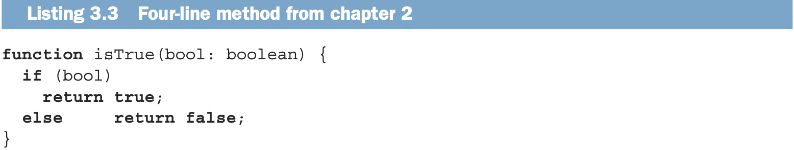
- 20 lines function --> 10 lines function1 + 10 lines function2
  + 10 lines function1 --> 5 lines function1.1 + 5 lines function1.2
  + 10 lines function2 --> 5 lines function2.1 + 5 lines function2.2
- Once we are comfortable with this rule, we can start <mark>varying the number of lines to fit specific examples</mark>. This is fine; but in practice, the number of lines often ends up being around five.

#### Why
- __Having long methods is a smell in itself.__
  + long methods are difficult to work with.
  + Left unchecked, <mark>methods tend to grow over time</mark> as we add more and more functionality to them.  
  This makes them increasingly difficult to understand. Imposing a size limit on our methods prevents us from sliding into this bad territory.
- __this five lines limit also prevents us from breaking <mark>"Methods should do one thing" smell</mark>__
- __method’s name is an opportunity to <mark>communicate the intent of the code</mark>__
  + that four methods, each with 5 lines of code, can be much more quickly and easily understood than one method with 20 lines.  
  This is because each method’s name is an opportunity to communicate the intent of the code.
  + Essentially, method naming is equivalent to putting a comment at least every 5 lines.
  + Plus, if small methods are properly named, finding a good name for a big function is easier, too.

#### Reference
- read more about the smell “Methods should do one thing” in Robert C. Martin’s book Clean Code (Pearson, 2008)  
- read more about the “Long methods” smell in Martin Fowler’s book Refactoring (Addison-Wesley Professional, 1999).

## 3.2. Introducing a refactoring pattern to break up functions


### looking at the “shape” of the code.
- The danger is getting bogged down trying to understand every single line—that would take a lot of time and be unproductive
- Our first stab at understanding the code should always be to consider the function name.
- identify groups of lines related to the same thing.
  + To make these groups clear, we add blank lines where we think the group should be.
  + Sometimes we add comments to help us remember what the grouping is related to.
    * In general, we strive to avoid comments, as they tend to go out of date, or they are used like deodorant on bad code;
    * but in this case, the comments are temporary, as we’ll see in a moment.
  + Often, the original programmers had groupings in mind and inserted blank lines. Sometimes they included comments.
- Without digesting the entire function, we cut it up and process each piece while it is small and easy to understand.


### focus on the structure.  

Even without being able to see any specifics, we notice the two groupings,  
each starting with a comment: // Draw map and // Draw player.

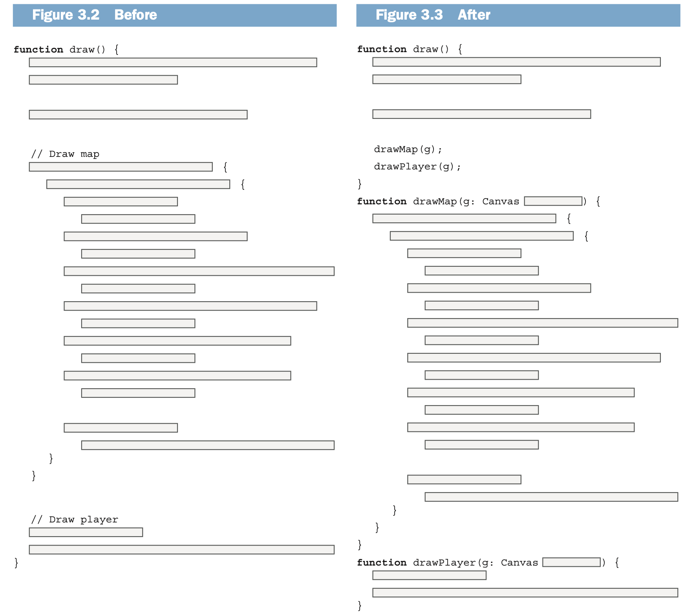

We can take advantage of those comments by doing the following:

1. Create a new (empty) method, drawMap.
2. Where the comment is, put a call to drawMap.
3. Select all the lines in the group we identified, and then cut them and paste
them as the body of drawMap.
4. Repeating the same process for drawPlayer.

take a look at how that works with actual code. <mark>still without looking at what any individual line does</mark>.
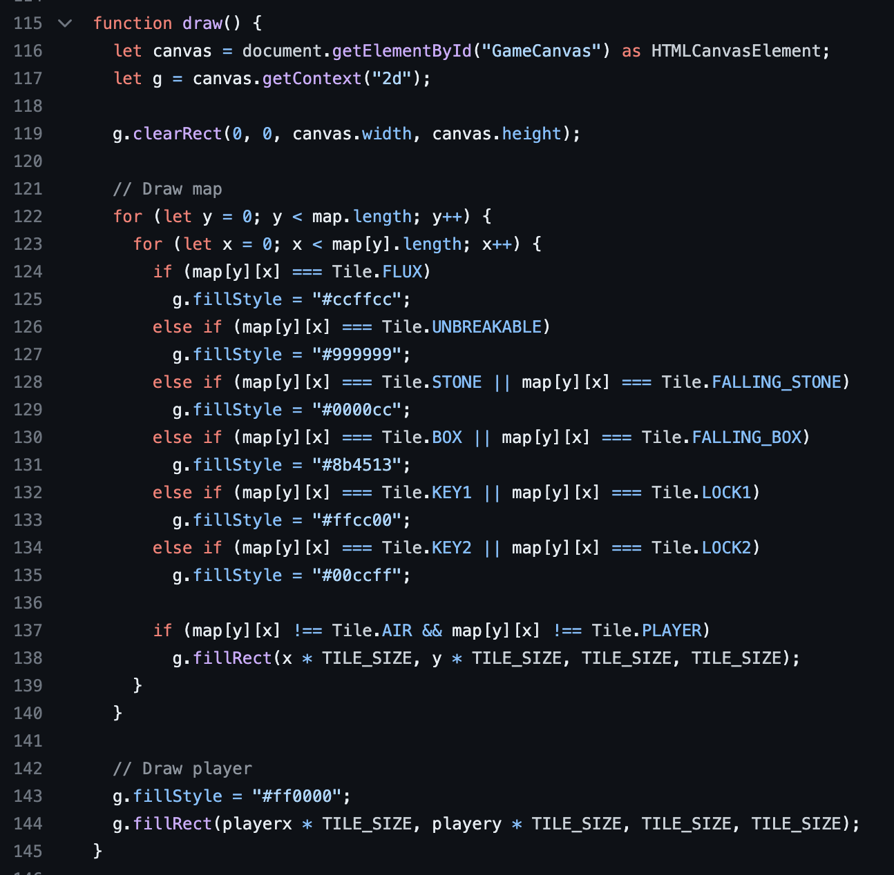

### compile
- we get quite a few errors. This is because the variable g is no longer in scope.  
We can fix this by first hovering our cursor over g in the original draw method.  
This lets us know its type, which we use to introduce a parameter g: CanvasRenderingContext2D in drawMap.
- Notice that there is still no need to examine what the code is doing any deeper than the method names.
- repeat the same process end up with exactly as we expected.

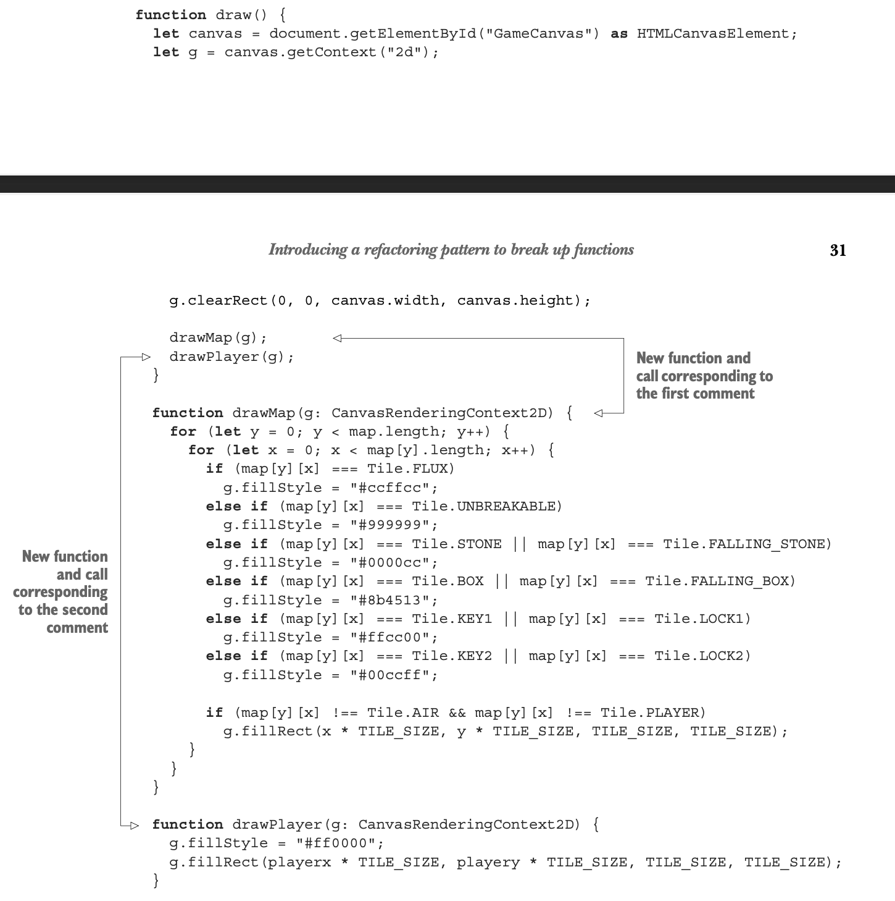

- The process we just went through is a standard pattern-a refactoring pattern—that we call <mark>EXTRACT METHOD</mark>.
- Because we are only moving lines around, <mark>the risk of introducing errors is minimal</mark>,  
  especially since the compiler told us when we forgot parameters.
- We use the comments as the method names; therefore, the functions’ names and the comments convey the same information.  
  Thus we <mark>eliminate the comments</mark>. We also eliminate the now-obsolete blank lines that we used to group the lines.

### 3.2.1 Refactoring pattern: EXTRACT METHOD

- EXTRACT METHOD takes part of one method and extracts it into its own method.  
- This can be done mechanically, and indeed, many modern IDEs have this refactoring pattern built right in.
- there is also a safe way to do it by hand.

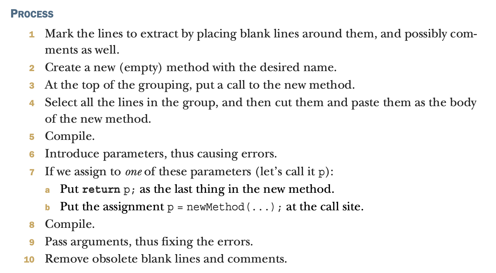

:::info
Pro tip  
As returning in only some branches of an if can prevent us from extracting a method,  
I recommend starting from the bottom of the method and working upward.  
This has the effect of pushing the return upward, so we eventually return in all branches.
:::

#### Example
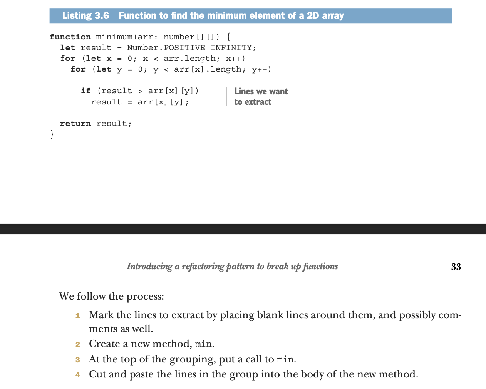
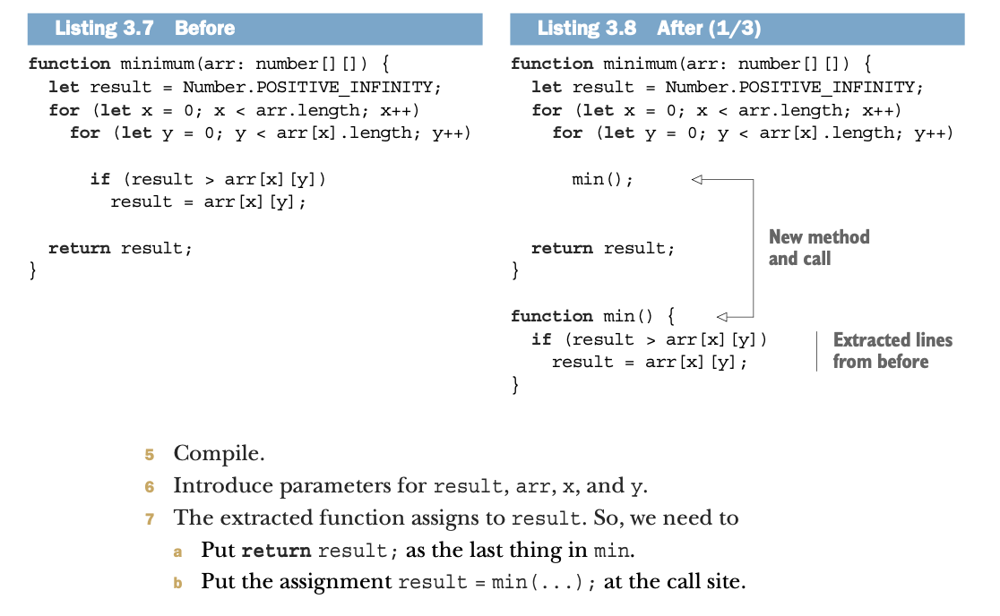
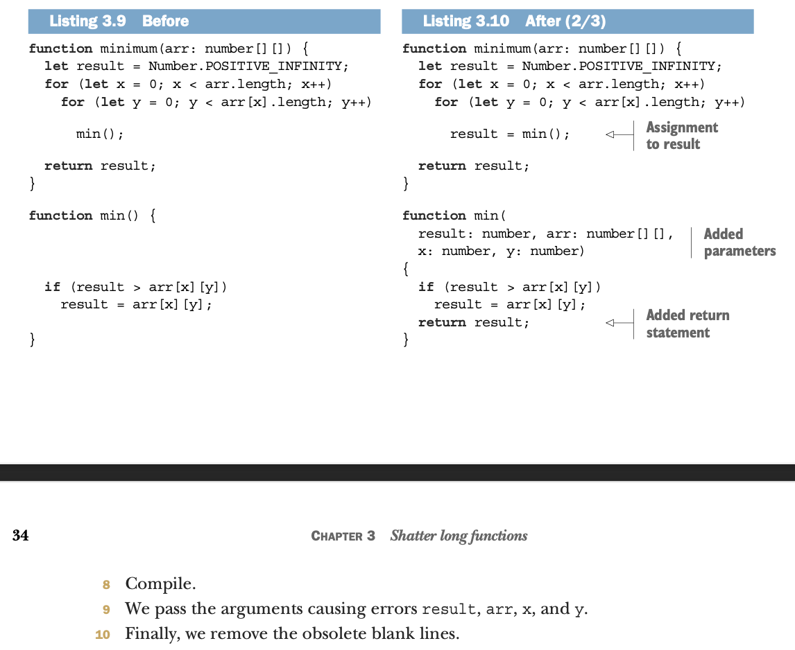
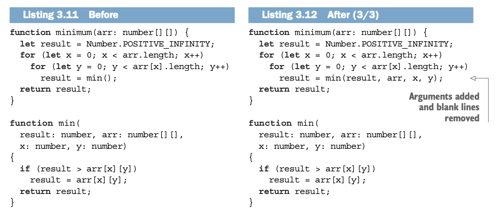


- You may be thinking that it would be better to use the built-in Math.min or arr[x][y] as an argument instead of all three separately. If you can get there safely, that may be a better approach for you. But the important lesson to take from this example is that the transformation, although slightly cumbersome, is safe. <mark>We can easily get into trouble trying to be clever</mark>, which often isn’t worth it.
- We would rather produce unusual-looking code safely than pretty code with less confidence. (If we were feeling confident as a result of something else, like lots of automated testing, we could take more risks; but this isn’t the case here.)

## 3.3 Breaking up functions to balancing abstraction

_Once we start introducing more methods and passing things around as parameters,  
we can end up with **uneven responsibilities**._

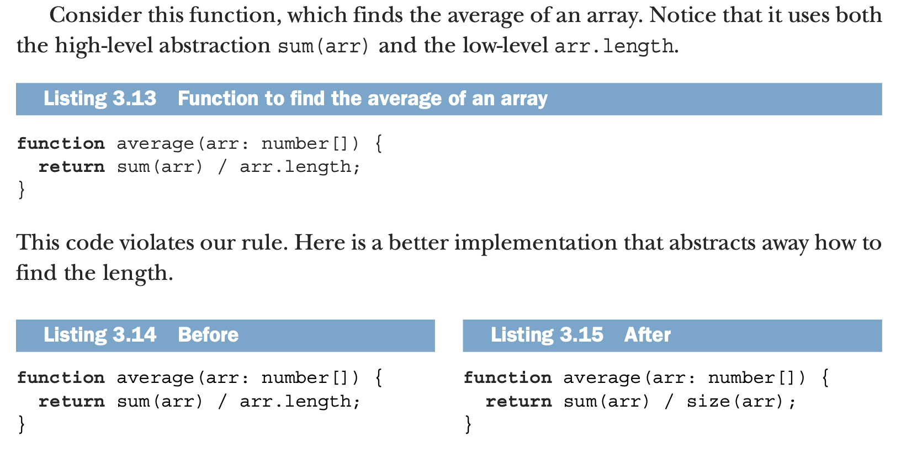

This code would be difficult to read because  
we would need to <mark>switch between low-level operations and high-level method names</mark>.

```
It is much easier to stay at one level of abstraction.
```

### 3.3.1 Rule: EITHER CALL OR PASS

```
The content of a function should be on the same level of abstraction
```

- This statement is so powerful that it is a smell in its own right.
- read more about the smell “The content of a function should be on the same level of abstraction” in Robert C. Martin’s book Clean Code.

### 3.3.2 Applying the rule

Again without looking at the specifics, if we examine our draw method as it currently looks

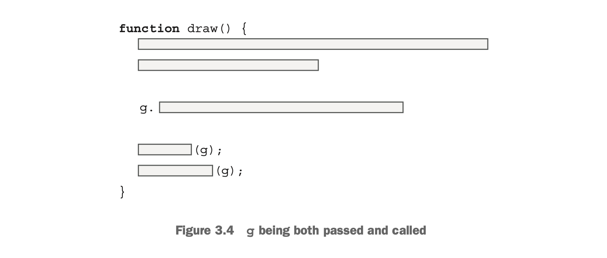

what do we extract? Here we need to look a bit at the specifics.

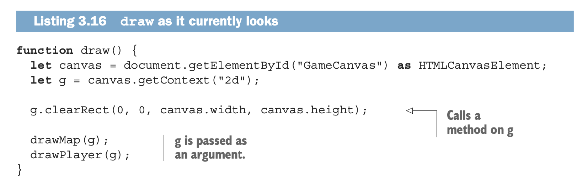

only extract the line with g.clearRect will end up violating the rule again,  
passing canvas as an argument and also calling canvas.getContext.

Instead, we decide to extract the first three lines together.  

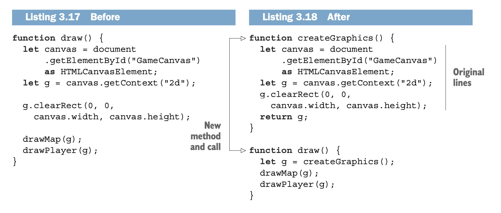

Every time we perform EXTRACT METHOD,  
it’s a great opportunity to make the code more readable by introducing a good method name.  

For the first time, we need to consider what the code is doing, because we have no comments to follow.  
Luckily, we have already significantly reduced the number of lines we need to consider: only three.

Let’s discuss what a good name actually is.

## 3.4 Properties of a good function name

a few properties that a good name should have:

- It should be honest. It should describe the function’s intention.
- It should be complete. It should capture everything the function does.
- It should be understandable for someone working in the domain.  
easier to talk about the code with teammates and customers.

```
understandable complete intention
```

### Applying the rule
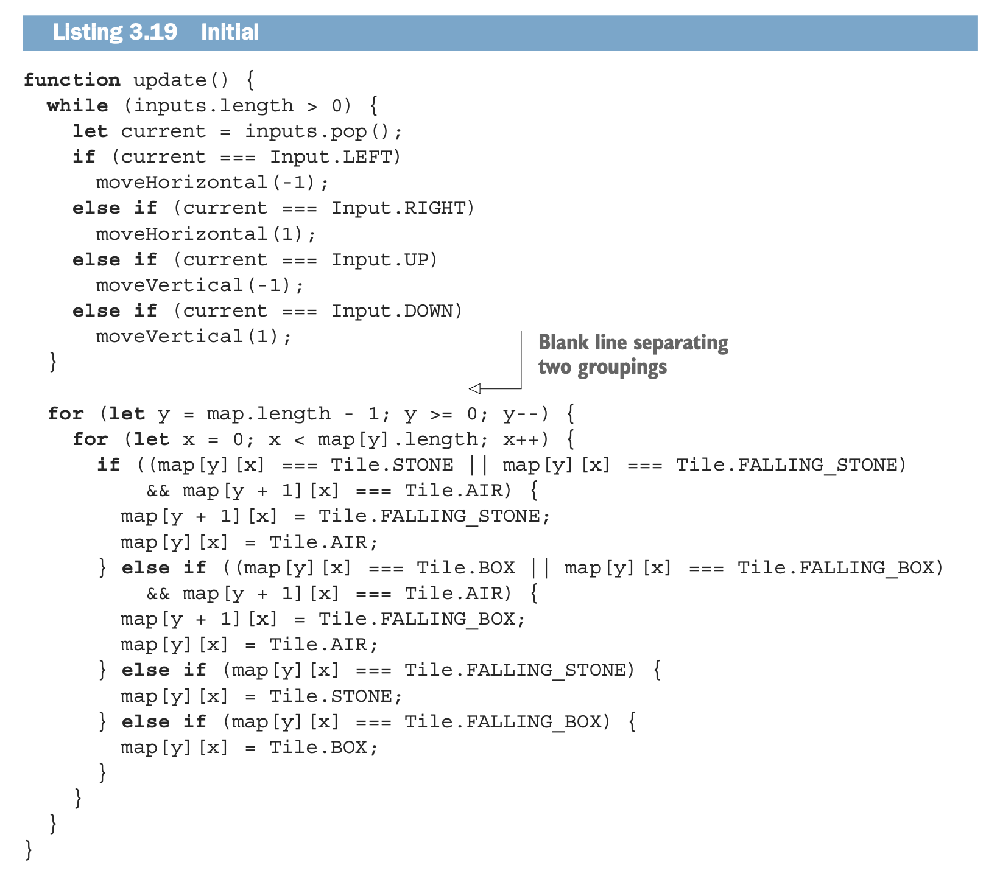

1. We can naturally split this code into two smaller functions.  
1. What should we call them? Both groups are still pretty complex, so we want to postpone understanding them further.  
1. We notice superficially that in the first group, the predominant word is input, and in the second, the predominant word is map.  
1. We know we are splitting a function called update, so as a first draft,  
we can combine these words to get the function names updateInputs and updateMap.  
1. updateMap is fine; however, we probably do not “update” the inputs.  
So, we decide to use another naming trick and use handle, instead: handleInputs.
1. When choosing names like this, always come back later,  
when the functions are smaller, to assess whether you can improve the names.

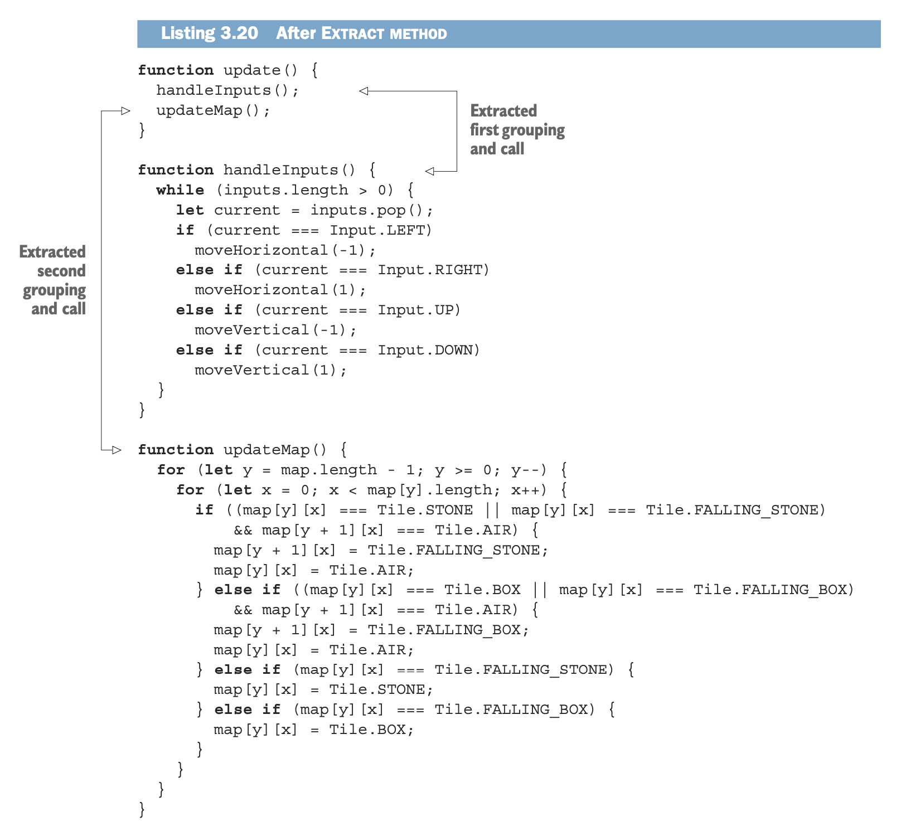

## 3.5 Breaking up functions that are doing too much

### 3.5.1 Rule: IF ONLY AT THE START

```
if you have an if, it should be the first thing in the function.
```
```
It should also be the only thing, in the sense that we should not do anything after it.
```

#### Why?
- Every time we <mark>check something, it is a responsibility</mark>, and it should be handled by one function.  
  Therefore we have this rule.

:::info
從 testability 的角度來看，也蠻合理的，UT這樣才好寫
:::

#### How?
- we do not need to extract its body, and we also should not separate it from its else.  
  + Both the body and the else are part of the code structure,  
    and we rely on this structure to guide our efforts so we do not have to understand the code.
  + Behavior and structure are closely tied,  
    and as we are refactoring, we are not supposed to change the behavior  
    so <mark>we shouldn’t change the structure</mark>, either.
- A chain of else ifs represents an atomic unit that we cannot split up.  
  This means <mark>the fewest lines we can achieve</mark> with EXTRACT METHOD in the context of an if with else ifs  
  <mark>is to extract exactly only that if along with its else ifs</mark>.
- read more about the smell “Methods should do one thing” in Robert C. Martin’s book Clean Code.

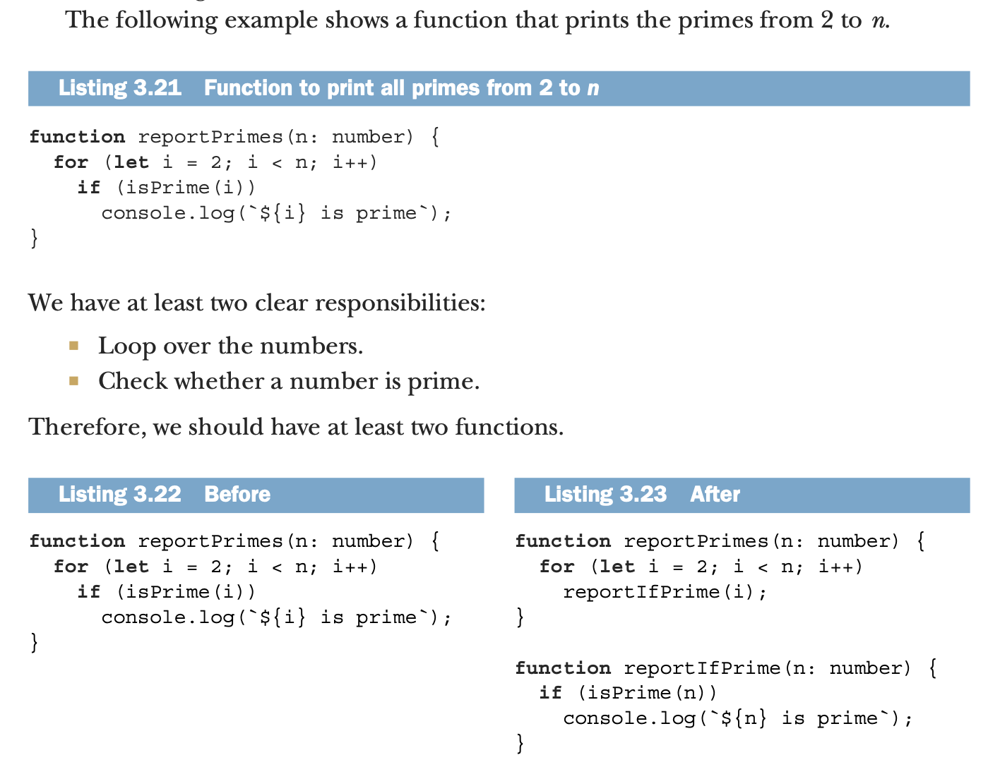

### 3.5.2 Applying the rule

It’s easy to spot violations of this rule without looking at the specifics of the code.

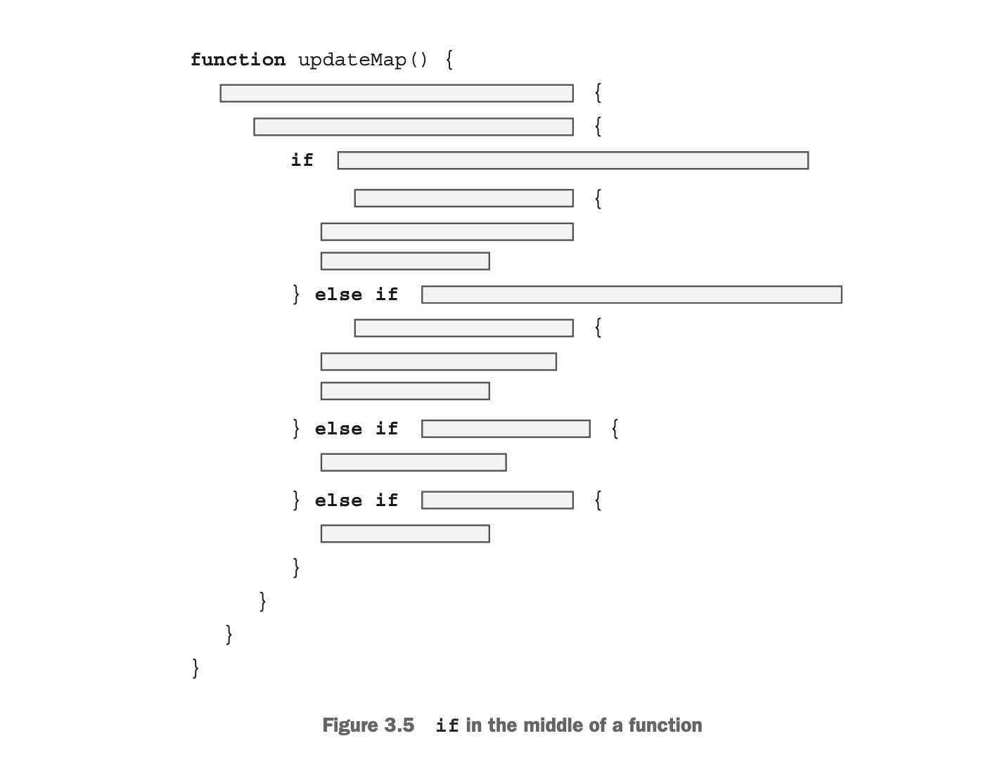

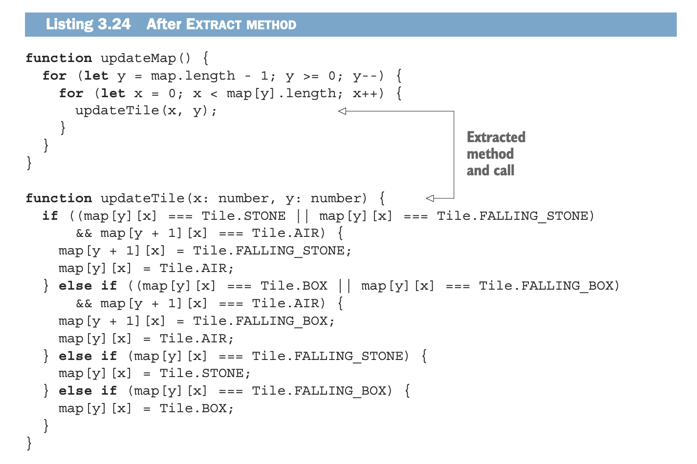

There are two predominant words in this group of lines: map and tile.  
We already have updateMap, so we call the new function updateTile.

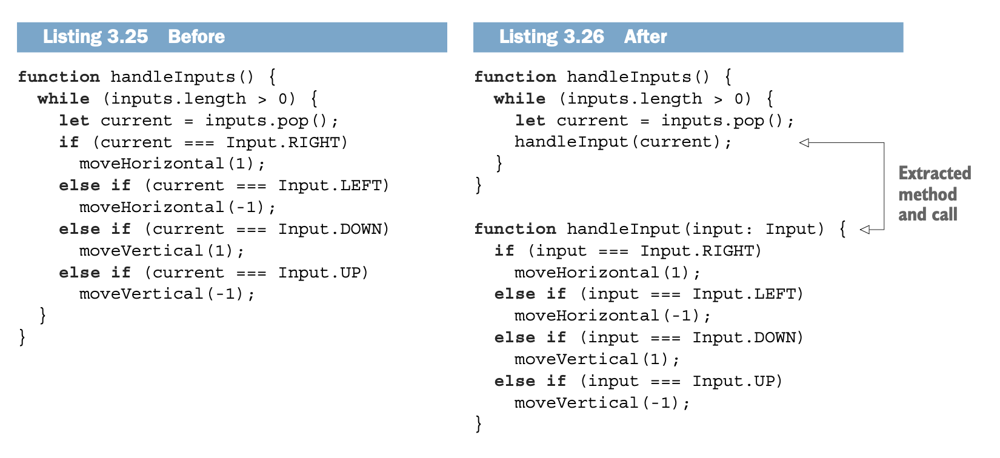

- readability advantage of EXTRACT METHOD:  
  it lets us <mark>give parameters new names</mark> that are more informative in their new context.  
  current is a fine name for a variable in a loop, but in the new handleInput function, input is a much better name.
- handleInput is already compact, and it is hard to see how we can make it compliant with the five-line rule.  
  However, as we will see <mark>in the next chapter, there is an elegant solution</mark>.


## Summary

- Bad Smells
  + Long methods.
  + Methods are doing multiple different things.
  + Methods lack human-readable text, like comments and good method and variable naming.
- Rules
  + FIVE LINES rule : prevent long methods, reduce the chance of methods doing more than one thing.
  + EITHER CALL OR PASS rule : prevent methods mixing multiple levels of abstraction to loose focus.
  + if ONLY AT THE START rule : prevent methods doing more than one thing.
- Benefits of EXTRACT METHOD
  + eliminate comments by making them method names.
  + rename parameters to further improve readability.
- Method naming
  + honest
  + complete
  + understandable
