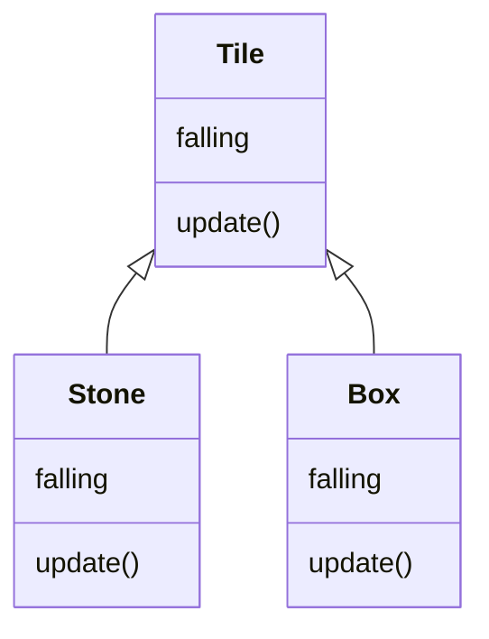
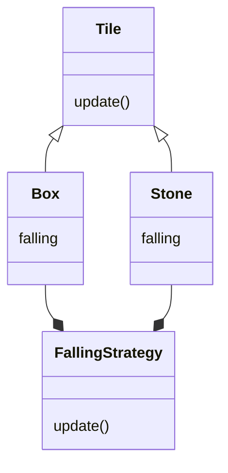
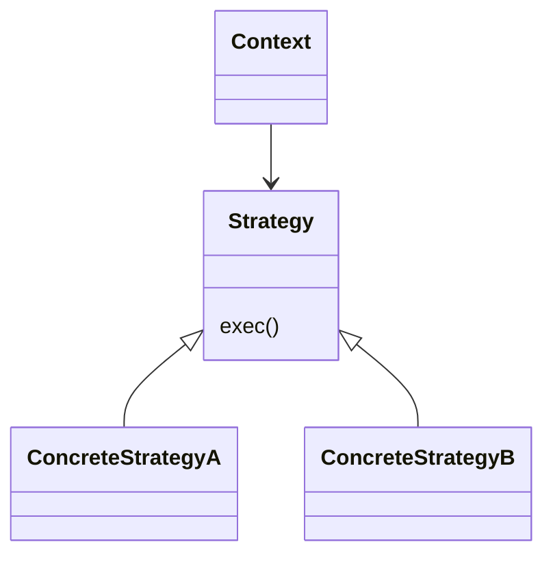
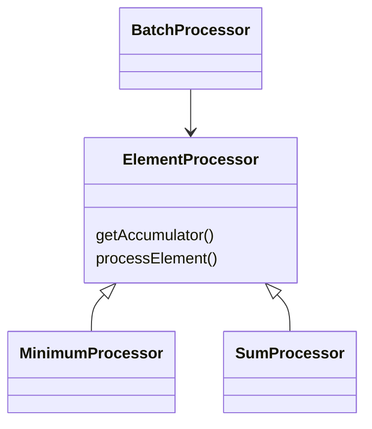

import Tabs from "@theme/Tabs";
import TabItem from "@theme/TabItem";

## 5.1 Unifying Similar classes

接續上一章，updateTile依然違反了許多規則，最顯著的就是"不要讓IF跟ELSE一起用"規則
引入isStony, isBoxy，可被理解為，像石頭一樣做動，像箱子一樣做動


<Row>
<Col col={2}>

```typescript title="Before"
function updateTile(x: number, y: number) {
  if ((map[y][x].isStone() || map[y][x].isFallingStone())
    && map[y + 1][x].isAir()) {
    map[y + 1][x] = new FallingStone();
    map[y][x] = new Air();
  } else if ((map[y][x].isBox() || map[y][x].isFallingBox())
    && map[y + 1][x].isAir()) {
    map[y + 1][x] = new FallingBox();
    map[y][x] = new Air();
  } else if (map[y][x].isFallingStone()) {
    map[y][x] = new Stone();
  } else if (map[y][x].isFallingBox()) {
    map[y][x] = new Box();
  }
}
```

</Col>
<Col col={2}>

```typescript title="After"
function updateTile(x: number, y: number) {
  if (map[y][x].isStony()
    && map[y + 1][x].isAir()) {
    map[y + 1][x] = new FallingStone();
    map[y][x] = new Air();
  } else if (map[y][x].isBoxy()
    && map[y + 1][x].isAir()) {
    map[y + 1][x] = new FallingBox();
    map[y][x] = new Air();
  } else if (map[y][x].isFallingStone()) {
    map[y][x] = new Stone();
  } else if (map[y][x].isFallingBox()) {
    map[y][x] = new Box();
  }
}
interface Tile {
  // ...
  isStony(): boolean;
  isBoxy(): boolean;
}
class Air implements Tile {
  // ...
  isStony() { return false; }
  isBoxy() { return false; }
}
```

</Col>
</Row>

回傳一個常數的method我們叫constant method(常數方法)

我們可以合併兩個class是因為這兩個class共享了回傳不同常數的常數方法

Steps:
1. 讓兩個class除了常數方法以外都相等

2. 合併class
(書上說很像分數加法，要先把分母變一樣再加起來)

先比較兩顆石頭類

<Row>
<Col col={2}>

```typescript title="Stone"

class Stone implements Tile {
  isAir() { return false; }
  isFallingStone() { return false; }
  isFallingBox() { return false; }
  isLock1() { return false; }
  isLock2() { return false; }
  draw(g: CanvasRenderingContext2D,
    x: number, y: number) {
    // ...
  }
  moveVertical(dy: number) { }
  isStony() { return true; }
  isBoxy() { return false; }
  moveHorizontal(dx: number) {
    // ...
  }
}
```

</Col>

<Col col={2}>

```typescript title="FallingStone"
class FallingStone implements Tile {
  isAir() { return false; }
  isFallingStone() { return true; }
  isFallingBox() { return false; }
  isLock1() { return false; }
  isLock2() { return false; }
  draw(g: CanvasRenderingContext2D,
    x: number, y: number) {
    // ...
  }
  moveVertical(dy: number) { }
  isStony() { return true; }
  isBoxy() { return false; }
  moveHorizontal(dx: number) {
  }
}
```

</Col>

</Row>

<Tabs>
<TabItem value="把moveHorizontal一樣" default>

```typescript
class Stone implements Tile {
  // ...
  moveHorizontal(dx: number) {
    if (map[playery][playerx + dx + dx].isAir()
      && !map[playery + 1][playerx + dx].isAir()) {
      map[playery][playerx + dx + dx] = this;
      moveToTile(playerx + dx, playery);
    }
  }
}
class FallingStone implements Tile {
  // ...
  moveHorizontal(dx: number) {
  }
}
```

</TabItem>
<TabItem value="用if(true){}包起來">

```typescript
class Stone implements Tile {
  // ...
  moveHorizontal(dx: number) {
    if (true) {
      if (map[playery][playerx + dx + dx].isAir()
        && !map[playery + 1][playerx + dx].isAir()) {
        map[playery][playerx + dx + dx] = this;
        moveToTile(playerx + dx, playery);
      }
    }
  }
}
class FallingStone implements Tile {
  // ...
  moveHorizontal(dx: number) {
    if (true) { }
  }
}
```
</TabItem>
<TabItem value="個別加上condition">

```typescript

class Stone implements Tile {
  // ...
  moveHorizontal(dx: number) {
    if (this.isFallingStone() === false) {
      if (map[playery][playerx + dx + dx].isAir()
        && !map[playery + 1][playerx + dx].isAir()) {
        map[playery][playerx + dx + dx] = this;
        moveToTile(playerx + dx, playery);
      }
    }
  }
}
class FallingStone implements Tile {
  // ...
  moveHorizontal(dx: number) {
    if (this.isFallingStone() === true) { }
  }
}
```
</TabItem>
<TabItem value="把各自缺的部份，補到對方去，這樣除了constant method之外都一樣了">

```typescript
class Stone implements Tile {
  // ...
  moveHorizontal(dx: number) {
    if (this.isFallingStone() === false) {
      if (map[playery][playerx + dx + dx].isAir()
        && !map[playery + 1][playerx + dx].isAir()) {
        map[playery][playerx + dx + dx] = this;
        moveToTile(playerx + dx, playery);
      }
    }
    else if (this.isFallingStone() === true) {
    }
  }
}
class FallingStone implements Tile {
  // ...
  moveHorizontal(dx: number) {
    if (this.isFallingStone() === false) {
      if (map[playery][playerx + dx + dx].isAir()
        && !map[playery + 1][playerx + dx].isAir()) {
        map[playery][playerx + dx + dx] = this;
        moveToTile(playerx + dx, playery);
      }
    }
    else if (this.isFallingStone() === true) {
    }
  }
}
```
</TabItem>
</Tabs>


<Tabs>

<TabItem value="接下來引入falling field" default>

```typescript
class Stone implements Tile {
  // ...
  isFallingStone() { return false; }
}
class FallingStone implements Tile {
  // ...
  isFallingStone() { return true; }
}
```

</TabItem>

<TabItem value="在constructor給falling賦值">

```typescript
class Stone implements Tile {
  private falling: boolean;
  constructor() {
    this.falling = false;
  }
  // ...
  isFallingStone() { return false; }
}
class FallingStone implements Tile {
  private falling: boolean;
  constructor() {
    this.falling = true;
  }
  // ...
  isFallingStone()
```

</TabItem>

<TabItem value="修改isFallingStone">

```typescript
class Stone implements Tile {
  // ...
  isFallingStone() { return false; }
}
class FallingStone implements Tile {
  // ...
  isFallingStone() { return true; }
}
```

</TabItem>

<TabItem value="改成回傳falling field">

```typescript
class Stone implements Tile {
  // ...
  isFallingStone() { return this.falling; }
}
class FallingStone implements Tile {
  // ...
  isFallingStone() { return this.falling; }
}
```

</TabItem>

<TabItem value="在constructor吃入參數">

```typescript
class Stone implements Tile {
  private falling: boolean;
  constructor(falling: boolean) {
    this.falling = falling;
  }
  // ...
}
```

</TabItem>

</Tabs>


<Tabs>
<TabItem value="接下來compiler會報錯" default>

```typescript
/// ...
new Stone();
/// ...

/// ...
new FallingStone(true);
/// ...

```

</TabItem>

<TabItem value="修好他" default>

```typescript
/// ...
new Stone(false);
/// ...

/// ...
new Stone(true);
/// ...

```

</TabItem>


</Tabs>

<Tabs>
<TabItem value="Before">

```typescript
function updateTile(x: number, y: number) {
  if (map[y][x].isStony()
    && map[y + 1][x].isAir()) {
    map[y + 1][x] = new FallingStone();
    map[y][x] = new Air();
  } else if (map[y][x].isBoxy()
    && map[y + 1][x].isAir()) {
    map[y + 1][x] = new FallingBox();
    map[y][x] = new Air();
  } else if (map[y][x].isFallingStone()) {
    map[y][x] = new Stone();
  } else if (map[y][x].isFallingBox()) {
    map[y][x] = new Box();
  }
}
class Stone implements Tile {
  // ...
  isFallingStone() { return false; }
  moveHorizontal(dx: number) {
    if (map[playery][playerx + dx + dx].isAir()
      && !map[playery + 1][playerx + dx].isAir()) {
      map[playery][playerx + dx + dx] = this;
      moveToTile(playerx + dx, playery);
    }
  }
}
class FallingStone implements Tile {
  // ...
  isFallingStone() { return true; }
  moveHorizontal(dx: number) { }
}
```

</TabItem>

<TabItem value="After">

```typescript
function updateTile(x: number, y: number) {
  if (map[y][x].isStony()
    && map[y + 1][x].isAir()) {
    map[y + 1][x] = new Stone(true);
    map[y][x] = new Air();
  } else if (map[y][x].isBoxy()
    && map[y + 1][x].isAir()) {
    map[y + 1][x] = new FallingBox();
    map[y][x] = new Air();
  } else if (map[y][x].isFallingStone()) {
    map[y][x] = new Stone(false);
  } else if (map[y][x].isFallingBox()) {
    map[y][x] = new Box();
  }
}
class Stone implements Tile {
  constructor(private falling: boolean) { }
  // ...
  isFallingStone() { return this.falling; }
  moveHorizontal(dx: number) {
    if (this.isFallingStone() === false) {
      if (map[playery][playerx + dx + dx].isAir()
        && !map[playery + 1][playerx + dx].isAir()) {
        map[playery][playerx + dx + dx] = this;
        moveToTile(playerx + dx, playery);
      }
    } else if (this.isFallingStone() === true) {
    }
  }
}
```

</TabItem>

</Tabs>

:::info
In TypeScript …
Constructors behave a little differently than in most languages. First, we can have only one
constructor, and it is always called constructor.
Second, putting public or private in front of a parameter to the constructor automatically
makes an instance variable and assigns it the value of the argument. So the following are
equivalent.

```typescript
class Stone implements Tile {
  private falling: boolean;
  constructor(falling: boolean) {
    this.falling = falling;
  }
}
```

```typescript
class Stone implements Tile {
constructor(
private falling: boolean) { }
}
```

:::

回頭看一下發現moveHorizontal有if搭配else，是不是又想起哪幾招...

當把falling變成type code，就可以使出連續技 -> into enum type -> Replace type code with classes -> push code into classes


<Tabs>
<TabItem value="Before">

```typescript
/// ...
new Stone(true);
/// ...
new Stone(false);
/// ...
class Stone implements Tile {
  constructor(private falling: boolean) { }
  // ...
  isFallingStone() {
    return this.falling;
  }
}
```

</TabItem>

<TabItem value="轉成enum">

```typescript
enum FallingState {
  FALLING, RESTING
}
/// ...
new Stone(FallingState.FALLING);
/// ...
new Stone(FallingState.RESTING);
/// ...
class Stone implements Tile {
  constructor(private falling: FallingState) { }
  // ...
  isFallingStone() {
    return this.falling
      === FallingState.FALLING;
  }
}
```

</TabItem>

<TabItem value="Replace Type Code with Classes">

```typescript
interface FallingState {
  isFalling(): boolean;
  isResting(): boolean;
}
class Falling implements FallingState {
  isFalling() { return true; }
  isResting() { return false; }
}
class Resting implements FallingState {
  isFalling() { return false; }
  isResting() { return true; }
}
new Stone(new Falling());
new Stone(new Resting());
class Stone implements Tile {
  constructor(private falling:
    FallingState) { }
  // ...
  isFallingStone() {
    return this.falling.isFalling();
  }
}
```

</TabItem>

<TabItem value="發起push code into classes招數">

```typescript

interface FallingState {
  // ...
  moveHorizontal(
    tile: Tile, dx: number): void;
}
class Falling implements FallingState {
  // ...
  moveHorizontal(tile: Tile, dx: number) {
  }
```

</TabItem>

<TabItem value="把funciton通通塞進class，然後調整condition">

```typescript
class Resting implements FallingState {
  // ...
  moveHorizontal(tile: Tile, dx: number) {
    if (map[playery][playerx + dx + dx].isAir()
      && !map[playery + 1][playerx + dx].isAir()) {
      map[playery][playerx + dx + dx] = tile;
      moveToTile(playerx + dx, playery);
    }
  }
}
class Stone implements Tile {
  // ...
  moveHorizontal(dx: number) {
    this.falling.moveHorizontal(this, dx);
  }
}
```

</TabItem>
</Tabs>

### 5.1.1 重構模式: Unify Similar Classes
描述：

當有兩個或多個class，只差在constant method，可以服用此藥方去整合他們

Unifying classes is great because having fewer classes usually
means we uncover more structure.

程序

1. The first phase is to make all the non-basis methods equal. For each of these
methods, perform these steps:

  a. In the body of each version of the method, add an enclosing if (true) { }
around the existing code.

  b. Replace true with an expression calling all the basis methods and comparing
their result to their constant values.

  c. Copy the body of each version, and paste it with an else into all the other
versions.
2. Now that only the basis methods are different, the second phase begins by
introducing a field for each method in the basis and assigning its constant in
the constructor.
3. Change the methods to return the new fields instead of the constants.
4. Compile to ensure that we have not broken anything yet.
5. For each class, one field at a time:

a Copy the default value of the field, and then make the default value a
parameter.

b Go through the compiler errors, and insert the default value as an argument.

6 After all the classes are identical, delete all but one of the unified classes, and
fix all the compile errors by switching to the remaining class.


<hr/>

## 5.4 跨類別統合程式碼

### Step1. 將行為放進Class

<Row>
<Col col={2}>

```typescript title="updateTile (Before)"
// 在更新磚塊的動作中，如果磚塊可以掉落做「掉落」

function updateTile(x: number, y: number) {
  if (map[y][x].canFall()
    && map[y + 1][x].isAir()) {
    map[y][x].drop();
    map[y + 1][x] = map[y][x];
    map[y][x] = new Air();
  } else if (map[y][x].isFalling()) {
    map[y][x].rest();
  }
}
```

</Col>

<Col col={2}>

```typescript title="updateTile (After)"
// 在磚塊的「更新」動作中，如果能掉落執行「掉落」

function updateTile(x: number, y: number) {
  map[y][x].update(x, y)
}

interface Tile {
  update(x: number, y: number): void;
}

class Air implements Tile {
  update(x: number, y: number): {
    // 空氣磚不需要對「掉落」有反應
  };
}

class Stone implements Tile {
  update(x: number, y: number): {
    if (map[y+1][x].isAir()) {
      // 掉落中
      this.falling = new Falling();
      map[y+1][x] = this;
      map[y][x] = new Air();
    } else if (this.falling.isFalling()) {
      // 到底了
      this.falling = new Resting();
    }
  };
}
```

</Col>
</Row>

:::info
從本來在「環境」判斷所來「何人」對其進行對應動作；改成在「角色」裡，判斷所處環境決定其行為
:::

* Stone和Air都implement自Tile interface
  * 即：Stone和Air都是一種Tile



### Step2. 抽取「策略」

<Row>
<Col col={2}>

#### Problems：

* isOOO幾乎被移除了
* Stone和Box有完全相同的程式碼: falling
* 有可能有新的Tile需要implement

</Col>
<Col col={2}>

#### Solution:

* 將falling視為一種「策略」

</Col>
</Row>

<Row>
<Col col={2}>

```typescript title="Before"
class Stone implements Tile {
  update(x: number, y: number) {
    if (map[y+1][x].isAir()) {
     this.falling = new Failing()
     map[y+1][x] = this
     map[y][x] = new Air()
    } else if (this.falling.isFalling()) {
     this.falling = new Resting()
    }
  }
}


class Box implements Tile {
  update(x: number, y: number) {
    if (map[y+1][x].isAir()) {
     this.falling = new Failing()
     map[y+1][x] = this
     map[y][x] = new Air()
    } else if (this.falling.isFalling()) {
     this.falling = new Resting()
    }
  }
}
```

</Col>
<Col col={2}>

```typescript title="After"
class FallingStrategy {
  update(tile, x: number, y: number) {
    if (map[y+1][x].isAir()) {
     this.falling = new Failing();
     map[y+1][x] = tile;
     map[y][x] = new Air();
    } else if (this.falling.isFalling()) {
     this.falling = new Resting()
    }
  }
}

class Stone implements Tile {
  constructor(strategy: FallingStrategy)
  update(x: number, y: number) {
    this.strategy.update(this, x, y)
  }
}
class Box implements Tile {
  constructor(strategy: FallingStrategy)
  update(x: number, y: number) {
    this.strategy.update(this, x, y)
  }
}
```

</Col>
</Row>




### Step3. 僅在開頭使用if

<Row>
<Col col={2}>

```typescript title="[Simplify] Before"
class FallingStrategy {
  update(x: number, y: number) {
    if (map[y+1][x].isAir()) {
     this.falling = new Failing()
     map[y+1][x] = this
     map[y][x] = new Air()
    } else if (this.falling.isFalling()) {
     this.falling = new Resting()
    }
  }
}

```

</Col>
<Col col={2}>

```typescript title="[Simplify] After"
class FallingStrategy {
  private drop(tile, x, y) {
    map[y+1][x] = tile;
    map[y][x] = new Air()
  }
  update(tile: Tile, x: number, y: number) {
    this.falling = (map[y+1][x].isAir())
      ? new Falling()
      : new Resting();
    this.drop(tile, x, y)
  }
}
```

</Col>
</Row>

:::info
以上這三個步驟，稱為「引入策略模式」
:::

### 策略模式Strategy Pattern

<Row>
<Col col={2}>

* 很多模式都是策略模式的變形
  * 若Strategy有attribute (variable而不是function)<br/>會被稱為狀態模式State Pattern
* 變異(Variance)是策略模式的目的
* 使用策略模式的情境
  1. 希望在程式碼中引入「變異」
  2. 希望在各個class間統合行為

</Col>
<Col col={2}>



</Col>
</Row>

### 規則：「不要讓介面只有一個實作」

* 只有一個實作的介面並不會增加可讀性
* 「介面」代表的是有變化；如果沒有變化，抽取介面會徒增心智的負擔

:::tip
抽象化增加了真正的複雜性，但減少了感知的複雜性

Abstraction trades an increase in real complexity for a decrease in perceived complexity
:::

### 規則：「從實作提取介面」

* 將「抽取介面」延遲到真正需要的時候才進行
  * 例如，想引入變異(Variance)的時候

<Row>
<Col col={2}>

```typescript title="Before"
class ArraySum {
  private processor: SumProcessor;
  constructor(accumulator: number) {
    processor = new SumProcessor(accumulator)
  }
  process(arr: number[]) {
    for (let i=0; i< arr.length; i++) {
      this.processor.processElement(arr[i])
    }
    return this.processor.getAccumulator();
  }
}
class SumPorcessor {
  constructor(private accumulator: number) {}
  getAccumulator() {
    return this.accumulator;
  }
  processElement(e: number) {
    this.accumulator += e;
  }
}
```

</Col>
<Col col={2}>

```typescript title="After"
class BatchProcessor {
  constructor(private processor: ElementProcessor) {}
  process(arr: number[]) {
    for (let i=0; i<arr.length; i++) {
      this.processor.processElement(arr[i]);
    }
    return this.processor.getAccumulator();
  }
}

interface ElementProcessor {
  getAccumulator(): number;
  processElement(e: number): void;
}
class MinimumProcessor implements ElementProcessor {
  getAccumulator() { return this.accumulator; }
  processElement(e: number) {
    // The variance
    if (this.accumulator > e) {
      this.accumulator = e;
    }
  }
}
class SumProcessor implements ElementProcessor {
  getAccumulator() { return this.accumulator; }
  processElement(e: number) {
    // The variance
    this.accumulator += e;
  }
}
```



</Col>
</Row>


## 5.5 統合相同的函式

<Row>
<Col col={2}>

```typescript title="Before"
function removeLock1() {
  for (let y = 0; y < map.length; y++) {
    for (let x = 0; x < map[y].length; x++) {
      if (map[y][x].isLock1()) { // 只有這裡有差
        map[y][x] = new Air();
      }
    }
  }
}
function removeLock2() {
  for (let y = 0; y < map.length; y++) {
    for (let x = 0; x < map[y].length; x++) {
      if (map[y][x].isLock2()) { // 只有這裡有差
        map[y][x] = new Air();
      }
    }
  }
}
```

</Col>
<Col col={2}>

```typescript title="After"
function remove(shouldRemove: RemoveStrategy) {
  for (let y = 0; y < map.length; y++) {
    for (let x = 0; x < map[y].length; x++) {
      if (shouldRemove.check(map[y][x])) {
        map[y][x] = new Air();
      }
    }
  }
}
```

</Col>
</Row>

## 5.6 統合相似的程式碼

(TODO)